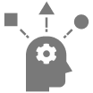

	

		

			
				For Better Future
			
			
				POWER MDD
			
			
				가장 강력한
				
				로우코드
				
				개발 툴
			
		

		

			
		

		

	

	

		

			
			
				LOW CODE
			
			
				POWERMDD는 로우코드 기반으로 소스를 자동 생성합니다. POWERMDD를 통해 자동으로 생성된 소스를 만나보세요.
			
		

		

			
			
				MODEL DRIVEN DEVELOPMENT
			
			
				POWER MDD는 모델 중심 개발(Model Driven Development)을 지향합니다. POWER MDD로 발전된 개발방식을 적용해 보세요.
			
		

		

			
			
				ALL IN ONE
			
			
				설계부터 개발까지! POWER MDD 하나면 모두 가능합니다. POWER MDD로 최고의 생산성을 경험해 보세요.
			
		

	

<!-- Made By : 

---

Partner Company : 

 -->

