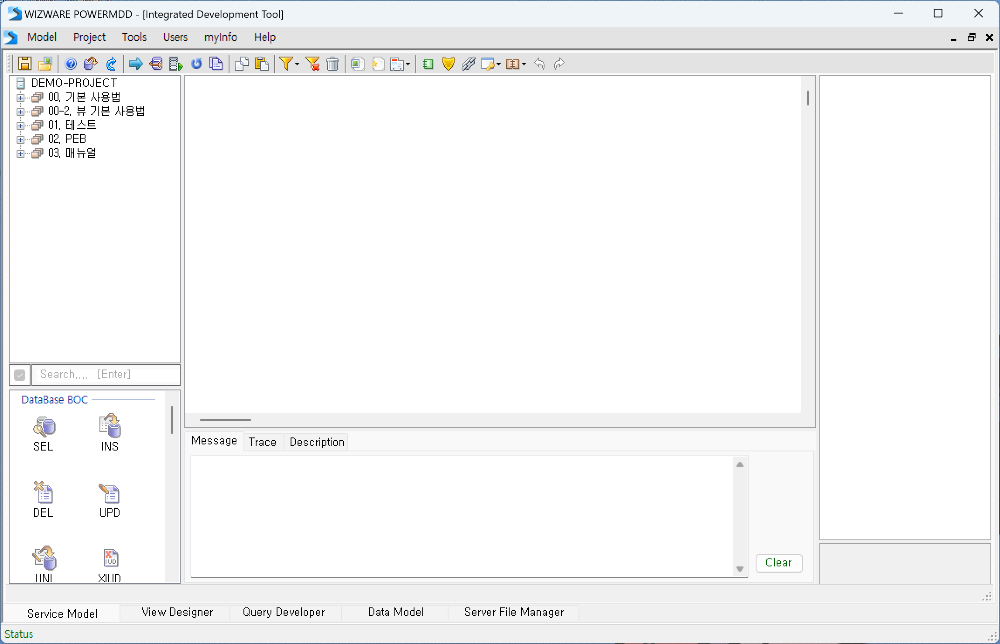
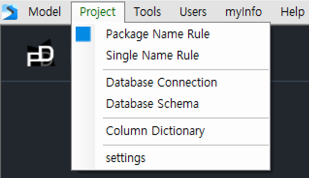
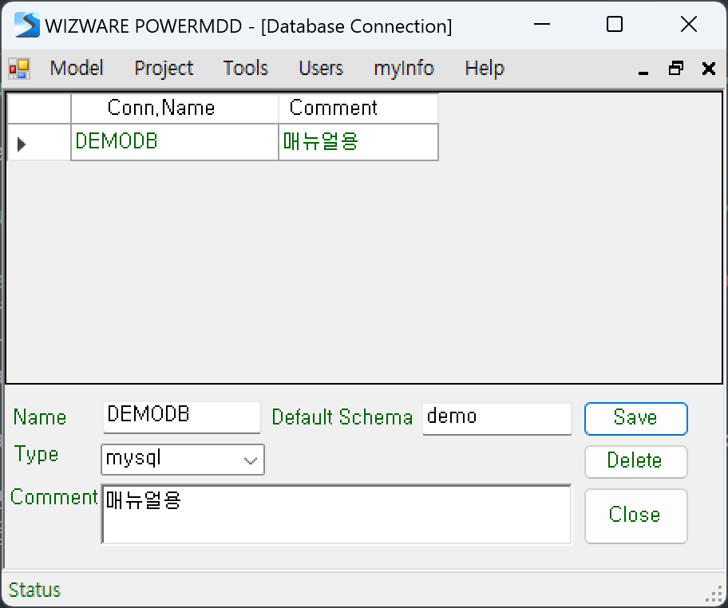
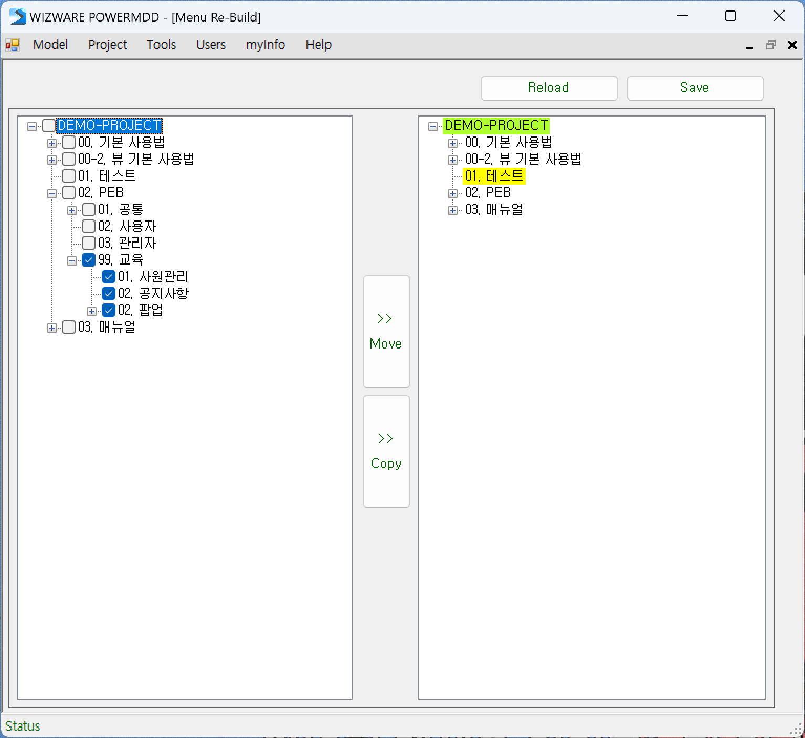
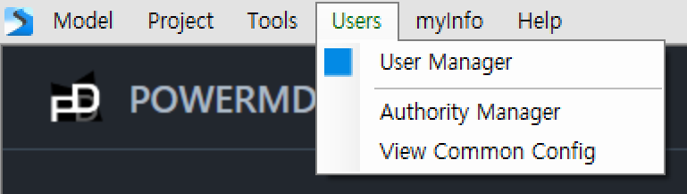
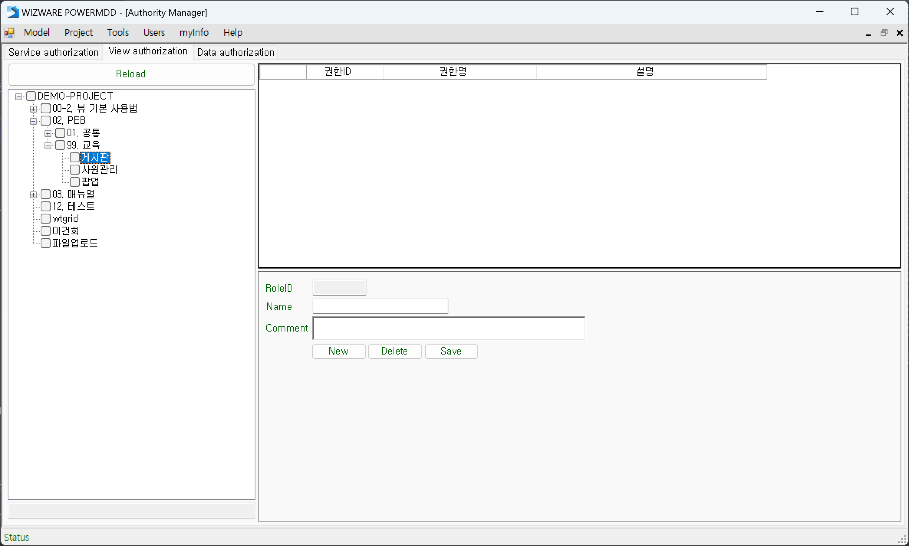
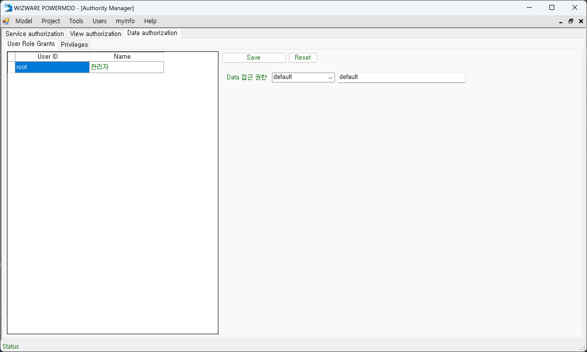
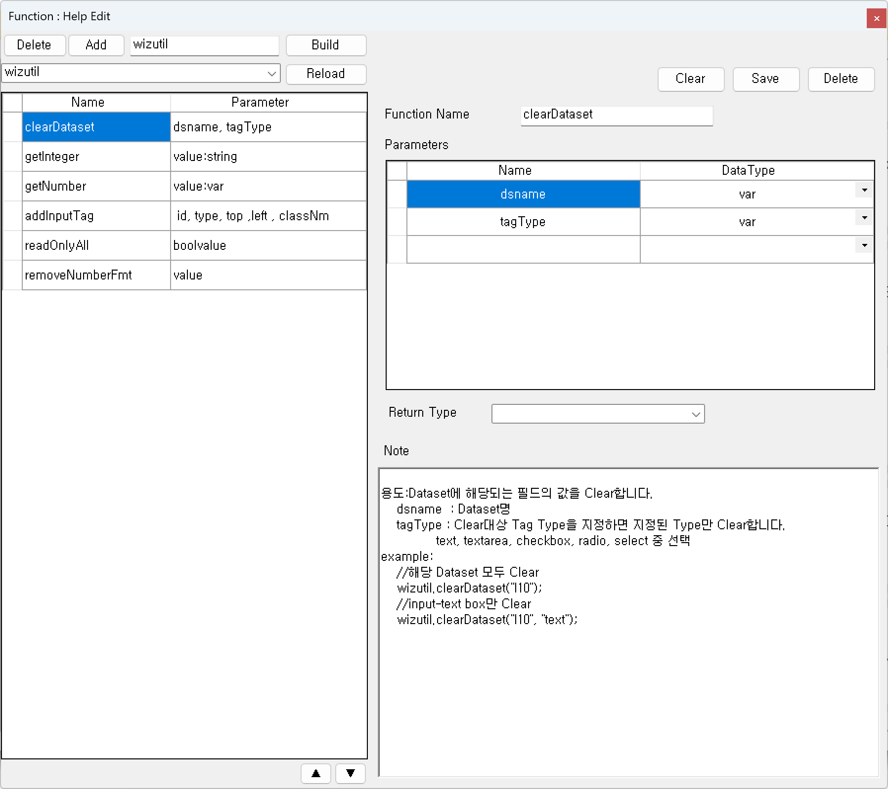

# 메뉴 구조

POWER MDD의 메뉴는 다음 6가지 구조로 구성됩니다.

::: tip 메뉴 구조
- Model
- Naming Rule
- Tools
- Users
- MyInfo
- Help
:::

## 1. Model

모델링을 시작하기 위한 화면을 실행하거나, POWER MDD를 종료하는 메뉴입니다.

::: tip Model 구조
- Open
- Tool Exit
:::

- #### Open

개발화면을 시작합니다.

- #### Tool Exit
POWER MDD를 종료합니다.

## 2. Naming Rule

Package나 Class, Database 등 Name 규칙을 설정하는 메뉴입니다.

::: tip Naming Rule 구조
- Package Name Rule
- Single Name Rule
- Database Connection
- Database Schema
- Column Dictionary
:::

- #### Package Name Rule

Package Name Rule은 Java의 Package Name 규칙을 등록하는 역할을 합니다.

- #### Single Name Rule

Single Name Rule은 Java의 Class Name Rule와 Method Name Rule을 지정할 수 있습니다.
지정 방법은 접두어와 접미어를 정의하여 해당 규칙이 허용되는 명칭만 사용 가능합니다.

- #### Database Connection

Database Connection는 업무에서 사용될 Database의 Name을 등록, 관리합니다.  

일반적으로 해당 정보는 POWER MDD-BMS 관리자가 등록해주어야 합니다.
실질적으로 사용할 데이터베이스의 연결정보는 BMS Config의 Database Resource에 등록이 되어 있는 Name 정보를 사용해야 합니다.

POWER MDD-DX에서 서버가 정의 되어 있는 Database Resource 중 해당 프로젝트에서 사용될 Name 정보만 등록하면 됩니다. 등록된 이름은 Query Developer와 Service Model 그리고 Data Model 중 기본 데이터베이스가 아닌 별도의 데이터베이스 지정이 필요할 때 사용됩니다.

- #### Database Schema

Database Schema에서는 Service Model의 BOC(Business Operation Component)에서 데이터베이스 조작 시 사용되는 스키마 정보를 설정합니다.
사용자 편의성을 높여주고 사용자로부터 오입력 및 잘못된 값의 할당을 줄여주는 기능입니다.

- #### Column Dictionary

Column Dictionary에서는 모델에서 가장 많이 사용될 Data Dictionary를 Database Table로부터 추출하여 사용자가 쉽게 등록할 수 있도록 도와주는 유틸리티 기능을 제공합니다.
최초 데이터 설계가 종료되고 데이터베이스의 물리 테이블이 생성된 후 해당 기능을 사용할 수 있습니다. 
:::warning
단, 물리 테이블 생성 시에 반드시 테이블의 Column Comment가 반드시 등록되어 있어야 합니다.
:::

## 3. Tools

메뉴 빌드 및 복사 변경, 구성 변경 등 여러 tool을 제공하는 메뉴입니다.

::: tip Tools 구조
- Build
- Menu Rebuild
- ReadOnly Setting
:::

- #### Build

Build는 소스 빌드 시 여러 개의 서비스를 동시에 빌드를 처리해주는 기능입니다. 

- #### Menu Rebuild

Menu Rebuild는 메뉴 구성을 변경 또는 재구성 시 사용하는 기능으로 메뉴의 복사 및 메뉴의 이동을 처리할 수 있습니다.

- #### ReadOnly Setting

ReadOnly Setting은 Service Model 또는 View Designer에서 완료 또는 변경 처리를 막고자 할 때 사용되는 기능입니다.

## 4. Users

해당 프로젝트의 사용자 관리, 사용자 권한 등을 관리하고, View Designer에서 사용할 공통 Resource를 관리하는 메뉴입니다.

::: tip Users 구조
- User Manager
- Authority Manager
- View Common Config
:::

- #### User Manager

User Manager는 해당 프로젝트의 사용자의 기본 정보 및 권한 ID를 할당해주는 기능을 제공합니다. 사용자 관리기능을 사용하기 위해서는 관리자 권한이 있어야 가능합니다.

- #### Authority Manager

Authority Manager는 해당 프로젝트에 대해 각 Category별로 접근 권한을 생성하고 해당 권한을 사용자에게 할당하여 사용자의 권한을 정의하는 기능을 제공합니다.

::: tip Authority Manager 탭 구조
- Service Authorization
- View Authorization
- Data Authorization
:::

- #### View Common Config

View Common Config는 View Designer에서 사용하는 공통 Resource를 정의하여 사용할 수 있도록 지원해주는 기능을 제공합니다.
공통 Script, 공통으로 사용하는 Style을 등록하여 사용할 수 있도록 지원해줍니다.

::: tip View Common Config 탭 구조
- Common File
    - JS Files
    - CSS Files
- CSS Define
- Control-CSS
:::

## 5. MyInfo

현재 로그인 정보를 관리하는 메뉴입니다.

::: tip myInfo 구조
- Password
:::

- #### Password

Password는 현재 로그인 한 유저의 비밀번호를 변경하는 기능입니다.

## 6. Help

POWER MDD 제품 정보 및 매뉴얼과 언어설정을 관리하는 메뉴입니다.

::: tip Help 구조
- about POWER MDD
- Function
- Manual
- Multilingual
:::

- #### about POWER MDD

제품의 기본 정보와 접속 정보를 확인할 수 있습니다.

- #### Function

View Designer에서 주로 사용하는 Function들을 등록할 수 있습니다.

- #### Manual

제품의 기본 매뉴얼 페이지 창이 나옵니다.

- #### Multilingual

제품의 다국어 처리를 위한 Language Code Table 관리입니다. Language 기능의 Admin 기능을 True로 줄 때 메뉴가 활성 됩니다. 제공되는 국가별로 지원하는 언어의 종류는 차이가 있을 수 있습니다. Code 종류는 6가지로 분류되어 있습니다.