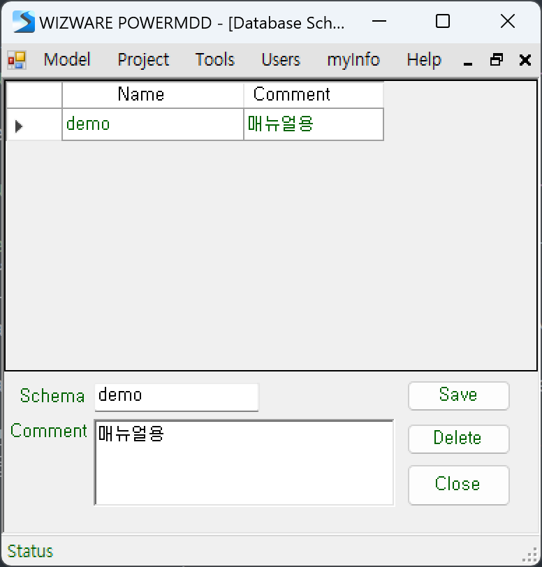
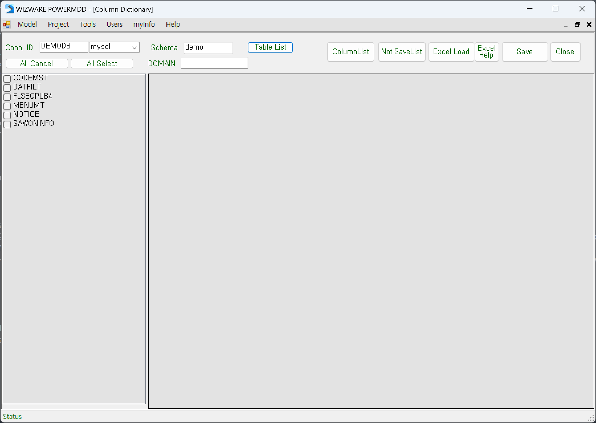
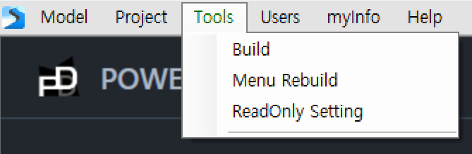
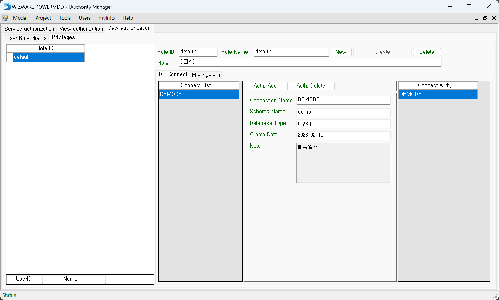
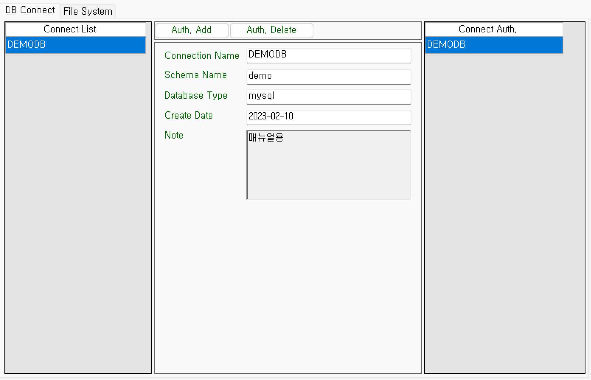
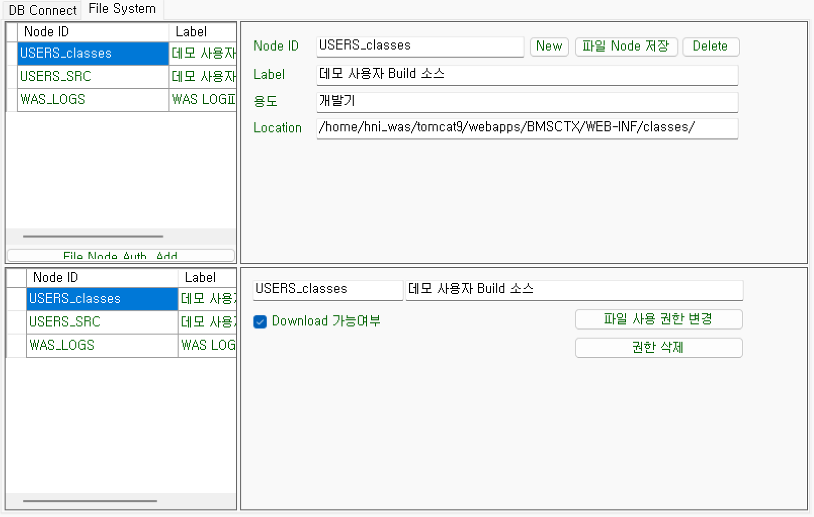
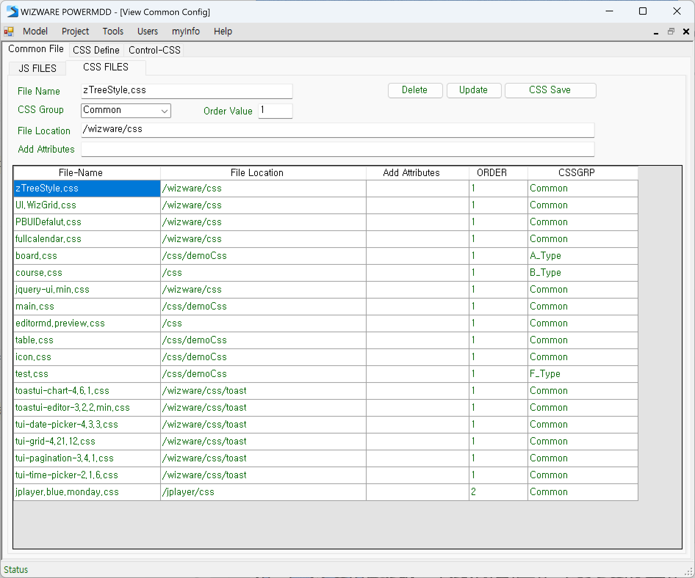
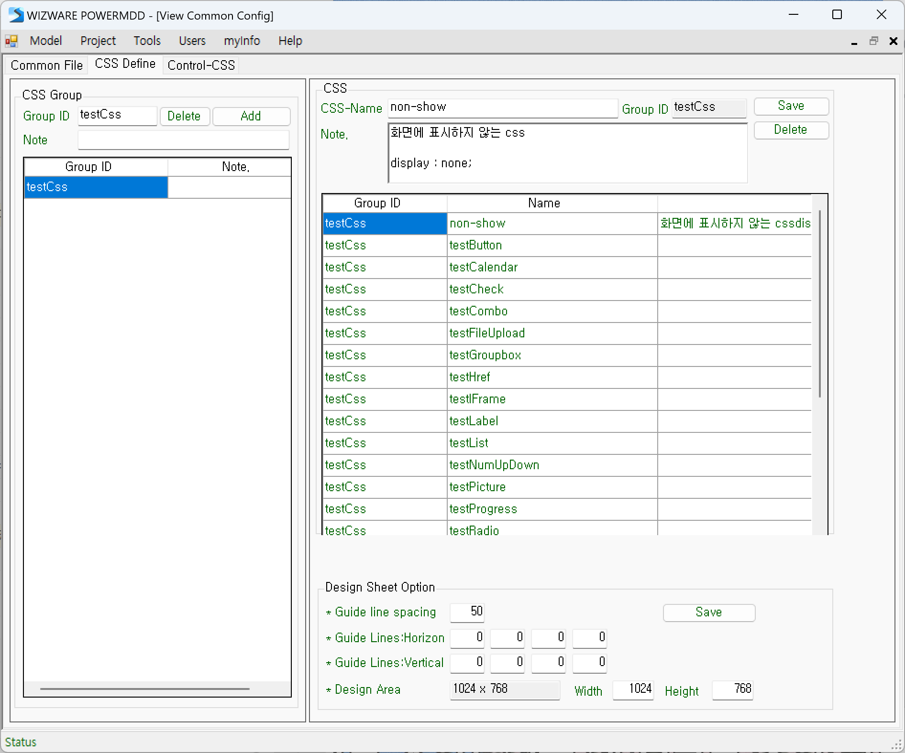
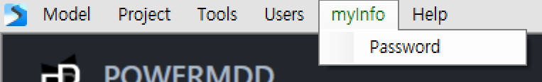

# 메뉴 구조

POWERMDD의 메뉴는 다음 6가지 구조로 구성됩니다.  

## 1. Model
모델링을 시작하기 위한 화면을 실행하거나, POWERMDD를 종료하는 메뉴입니다.  

<b class="font20"> 1) Open </b>  
개발화면을 시작합니다.  

<b class="font20"> 2) Tool Exit </b>  
POWERMDD를 종료합니다.  

## 2. Naming Rule
Package나 Class, Database 등 Name 규칙을 설정하는 메뉴입니다.  

<b class="font20"> 1) Package Name Rule </b>  
Java의 Package Name 규칙을 등록하는 역할을 합니다.  

<!-- Remark -->
::: tip <Badge type="tip" text="Remark" vertical="middle" /> <b> Name Rule 규칙 </b>
- Package Name Rule 분류 구분자 “.”을 기준으로 “*”를 사용하여 범위를 지정합니다.
- “*” 분류부터 사용자 Name 지정이 가능합니다. 
 Ex) Name1.Name2.*을 등록하는 경우 “Name1.Name2.” 으로 시작되는 Package 등록이 허용됩 
&emsp;&ensp;니다.   
 Ex) NameA.NameB.NameC을 등록하는 경우 “NameA.NameB.NameC” Package만 허용이 됩니 
&emsp;&ensp;다.   
- “*” 없이 모든 Package를 등록하게 되면 정해진 Package 이외는 사용 불가능합니다.
- 주의사항 : 잘못하면 오류메시지가 뜹니다.
:::

<b class="font20"> 2) Single Name Rule </b>  
Java의 Class Name Rule와 Method Name Rule을 지정할 수 있습니다.
지정 방법은 접두어와 접미어를 정의하여 해당 규칙이 허용되는 명칭만 사용 가능합니다.

<!-- Remark -->
::: tip <Badge type="tip" text="Remark" vertical="middle" /> <b> Name Rule 규칙 </b>
해당 접두어, 접미어를 모두 허용 시 “*” 를 지정하면 됩니다.
:::

<b class="font20"> 3) Database Connection </b>  
업무에서 사용될 Database의 Name을 등록, 관리합니다.  

일반적으로 해당 정보는 POWERMDD.BMS 관리자가 등록해주어야 합니다.
실질적으로 사용할 데이터베이스의 연결정보는 BMS Config의 Database Resource에 등록이 되어 있는 Name 정보를 사용해야 합니다.

POWERMDD.DX에서 서버가 정의 되어 있는 Database Resource 중 해당 프로젝트에서 사용될 Name 정보만 등록하면 됩니다. 등록된 이름은 Query Developer와 Service Model 그리고 Data Model 중 기본 데이터베이스가 아닌 별도의 데이터베이스 지정이 필요할 때 사용됩니다.

<b class="font20"> 4) Database Schema </b>  
Service Model의 BOC(Business Operation Component)에서 데이터베이스 조작 시 사용되는 스키마 정보를 설정합니다.  
사용자 편의성을 높여주고 사용자로부터 오입력 및 잘못된 값의 할당을 줄여주는 기능입니다.  

<b class="font20"> 5) Column Dictionary </b>  
모델에서 가장 많이 사용될 Data Dictionary를 Database Table로부터 추출하여 사용자가 쉽게 등록할 수 있도록 도와주는 유틸리티 기능을 제공합니다.  
최초 데이터 설계가 종료되고 데이터베이스의 물리 테이블이 생성된 후 해당 기능을 사용할 수 있습니다.  

<!-- Remark -->
::: tip <Badge type="tip" text="Remark" vertical="middle" />
물리 테이블 생성 시에 반드시 테이블의 Column Comment가 반드시 등록되어 있어야 합니다.  
등록하지 않는 Column들은 Model Designer 작업할 때 ‘미정의된 Column이 존재합니다’라는 메시지가 나옵니다.
:::

## 3. Tools
메뉴 빌드 및 복사 변경, 구성 변경 등 여러 tool을 제공하는 메뉴입니다.  

<b class="font20"> 1) Build </b>  
소스 빌드 시 여러 개의 서비스를 동시에 빌드를 처리해주는 기능입니다. 

<!-- Remark -->
::: tip <Badge type="tip" text="Remark" vertical="middle" />
- <b>주의할점</b>  
 Build List 할 때 빌드 서비스의 Count가 너무 많이 실행하면 서버에 부담을 줄 수가 있습니다.  
빌드는 실행 내용을 선택된 서비스 별로 소스 생성/ 컴파일/ 배치를 실행합니다.

- <b>Service Model 내에 있는 빌드 기능과의 차이점</b>  
Service Model 내에 있는 빌드 기능은 서비스 모델을 사용자가 모델링 테스트 등 다양한 기능을 실행하면서 단일 서비스만 빌드가 됩니다.  
또한 빌드하는 사용자 환경에 로컬 테스트 환경이 On이 되어 있을 시에는 해당 빌드로 생성되는 Resource를 Client로 전송 기능이 동시에 실행이 됩니다.  
즉, 로컬 테스트 On 상태일 때 build는 소스 생성, 컴파일, 서버 배치, build Resource Client 배치가 수행됨으로 사용자는 자신의 PC 환경으로 테스트가 가능하게 된다.  
그러나 해당 일괄 빌드 기능에서는 로컬 테스트 환경이 On 되어 있어도 빌드 시 build Resource Client 배치가 수행되지 않습니다.  
대량 서비스 빌드시에는 해당 Resource를 Client에 배치하지 않습니다. 
:::

<b class="font20"> 2) Menu Rebuild </b>  
메뉴 구성을 변경 또는 재구성 시 사용하는 기능으로 메뉴의 복사 및 메뉴의 이동을 처리할 수 있습니다.  

<!-- Remark -->
::: tip <Badge type="tip" text="Remark" vertical="middle" />
- 메뉴 복사 처리 시 반드시 고려해야 하는 것은 복사된 Menu는 모델 권한 처리에서 별도로 권한 등록을 해주어야 합니다. 권한 등록하지 않으면 복사된 메뉴는 Service Model의 업무 메뉴 목록에 나타나지 않습니다.

- <b>사용자 모델 권한 관리 등록 필요 </b>  
해당 Menu Rebuild시에는 반드시 사용자 권한 관리에서 권한 상태를 재구성하여야 합니다. 메뉴 구성은 사용자 권한 관리와 밀접한 관계를 가지고 있습니다.
:::

<b class="font20"> 3) ReadOnly Setting </b>  
Service Model 또는 View Designer에서 완료 또는 변경 처리를 막고자 할 때 사용되는 기능입니다.

## 4. Users
해당 프로젝트의 사용자 관리, 사용자 권한 등을 관리하고, View Designer에서 사용할 공통 Resource를 관리하는 메뉴입니다.  

<b class="font20"> 1) User Manager </b>  
해당 프로젝트의 사용자의 기본 정보 및 권한 ID를 할당해주는 기능을 제공합니다. 사용자 관리기능을 사용하기 위해서는 관리자 권한이 있어야 가능합니다.  

<b class="font20"> 2) Authority Manager </b>  
해당 프로젝트에 대한 각 Category별로 접근 권한을 생성하여 해당 권한을 사용자에게 할당함으로 사용자의 권한을 정의할 수 있다.  
<b class="font18"> (1) Service Manager </b>  
Service Model에서 사용될 권한을 생성 및 변경 관리합니다.  

<b class="font18"> (2) View Manager </b>  
View Designer에서 사용될 권한을 생성 및 변경 관리합니다.  

<b class="font18"> (3) Data Manager </b>  
Data 관련한 권한 처리기능입니다. 해당 기능은 데이터베이스의 종류에 따라 지원 여부 확인이 필요합니다. 
<b class="font18"> ① User Role Grants </b>  
사용자별 Data에 접근 권한을 할당합니다.  

<b class="font18"> ② Privileges </b>  
Data에 접근 권한 Role ID를 생성 및 관리합니다. 정의 권한 영역으로 Database Connection, File System접근에 대한 권한을 정의합니다.  
 
<b class="fontB">[ DB Connect ]</b>  
데이터베이스에 연결이 가능한 권한을 설정합니다. Role-ID의 권한을 가진 사용자가 접근이 가능한 데이터베이스 권한을 등록합니다.  
Connect List는 해당 Project에 등록되어 있는 Connect List이며 Connect. Auth는 접근이 가능한 DB List입니다.  
 

<b class="fontB">[ File System ]</b>  
Server File Manager에서 사용될 File System의 Node 정의 및 정의된 Node 정보를 권한에 할당해주는 기능을 제공합니다.  
 

<b class="font20"> 3) View Common Config </b>  
View Common Config는 View Designer에서 사용하는 공통 Resource를 정의하여 사용할 수 있도록 지원해주는 기능을 제공합니다.  
공통 Script, 공통으로 사용하는 Style을 등록하여 사용할 수 있도록 지원해줍니다.   
<b class="font18"> (1) Common File </b>  
UI(View)에서 사용될 공통 Javascript 파일 또는 CSS 파일을 등록합니다.  
<b class="font18"> ① JS Files </b>  

<b class="font18"> ② CSS Files </b>  
 

<b class="font18"> (2) CSS Define </b>  
View 파일에서 사용할 Class와 그 그룹을 지정하며, 화면작업 창의 옵션을 정의할 수 있습니다.  
 

<b class="font18"> (3) Control-CSS </b>  
View Designer에서 사용하는 UI(Element)에 대한 Default Style 또는 CSS를 정의하여 사용합니다.  
 

## 5. MyInfo
현재 로그인 정보를 관리하는 메뉴입니다.  

<b class="font20"> 1) Password </b>  
Password는 현재 로그인 한 유저의 비밀번호를 변경하는 기능입니다.

## 6. Help
POWERMDD 제품 정보 및 언어설정을 관리하는 메뉴입니다.  

<b class="font20"> 1) about POWERMDD </b>  
제품의 기본 정보와 접속 정보를 확인할 수 있습니다.  

<b class="font20"> 2) Function </b>  
View Designer에서 주로 사용하는 Function들을 등록할 수 있습니다.
 

<b class="font20"> 3) Manual </b>  
X  

<b class="font20"> 4) Multilingual </b>  
제품의 다국어 처리를 위한 Language Code Table 관리입니다. Language 기능의 Admin 기능을 True로 줄 때 메뉴가 활성 됩니다. 제공되는 국가별로 지원하는 언어의 종류는 차이가 있을 수 있습니다. Code 종류는 6가지로 분류되어 있습니다.  
 

