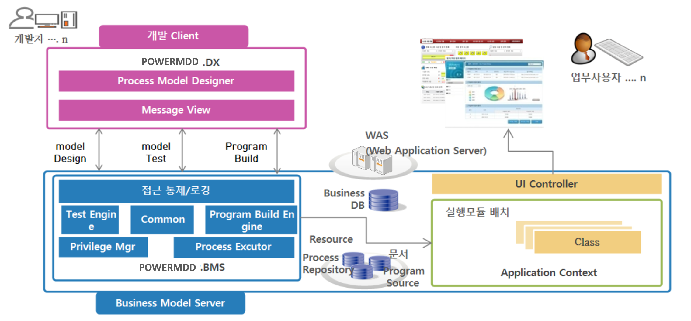

# 시스템 구조

POWER MDD의 시스템은 다음과 같은 구조로 구성됩니다.

::: tip 시스템 구성
POWER MDD는 Server Side Engine인 __POWER MDD-BMS__(Business Model Server)와   
사용자 PC에 설치되는 개발 Tool인 __POWER MDD-DX__(Design Tool)로 구성되어 있습니다. 
:::

## 1. POWER MDD-BMS 구성 및 기능

POWER MDD-BMS는 WAS에 탑재되는 Middleware 서버로 다수의 Client(POWER MDD-DX)로부터의 다양한 요청에 대하여 필요한 기능을 제공합니다.

- ##### 서비스 모델에 대한 실시간 테스트 및 결과 제공
- ##### 테스트가 완료된 모델에 대한 자바소스 자동 생성
- ##### 자바 소스 컴파일 및 Class의 WAS 자동 배포 기능
- ##### UI화면에 대한 JSP 자동 생성 및 실행
- ##### 개발 관련 작업 리소스에 대한 이력 관리
- ##### DX의 접근 통제 및 권한 관리

## 2. POWER MDD-DX 구성 및 기능

POWER MDD-DX는 사용자(개발자)가 업무 Application을 개발하기 위하여 사용하는 개발도구로, 서버상의 서비스를 개발하는 Service Model와 Client UI 화면을 개발하는 View Designer 등으로 구성되어 있습니다.

- ##### WAS에서 실행되는 서비스를 개발하는 Service Model

- ##### 웹 브라우저에서 실행되는 UI 화면을 개발하는 View Designer

- ##### DB 조작 및 쿼리 작성을 위한 Query Developer

- ##### 테이블간의 관계를 다이어그램으로 표현하여 DB의 구조를 한눈에 파악하는 Data Model

- ##### WAS 서버상의 관련된 파일을 처리하는 Server File Manager