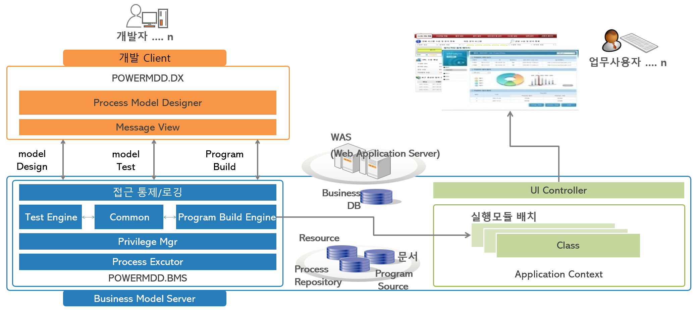

# 시스템 구조

::: tip <Badge type="tip" text="Remark" vertical="middle" /> <b> 시스템 구성 </b>
① <b>POWERMDD.BMS(Business Model Server) </b>  
  - Server Side Engine  
  - WAS에 탑재되는 Middleware 서버로 다수의 클라이언트(DX)로부터의 다양한 요청에 대하여 필요한 기능을 제공  

② <b>POWERMDD.DX(Design Executor) </b>  
  - 사용자 PC에 설치되는 개발 Tool  
  - 사용자(개발자)가 업무 애플리케이션을 개발하기 위하여 사용하는 개발도구   
:::

## 1. POWERMDD.BMS 구성 및 기능

: <u>POWERMDD.DX의 요청에 대한 다음과 같은 다양한 기능을 처리합니다.</u>

① 서비스 모델에 대한 실시간 테스트 및 결과 제공  
② 테스트가 완료된 모델에 대한 자바 소스 자동 생성  
③ 자바 소스 컴파일 및 Class의 WAS 자동 배포 기능  
④ UI 화면에 대한 JSP 자동 생성 및 실행 
⑤ 개발 관련 작업 Resource에 대한 이력 관리 
⑥ DX의 접근 통제 및 권한 관리

## 2. POWERMDD.DX 구성 및 기능

: <u>사용자(개발자)에게 애플리케이션 개발을 위한 아래의 다양한 도구를 제공합니다.</u>

① WAS에서 실행되는 서비스를 개발하는 <b> Service Model </b> 
② 웹 브라우저에서 실행되는 UI 화면을 개발하는 <b> View Designer </b>  
③ DB 조작 및 쿼리 작성을 위한 <b>Query Developer </b>  
④ 테이블간의 관계를 다이어그램으로 표현하여 DB의 구조를 한눈에 파악하는<b> Data Model </b> 
⑤ WAS 서버상의 관련된 파일을 처리하는 <b> Server File Manager </b>

