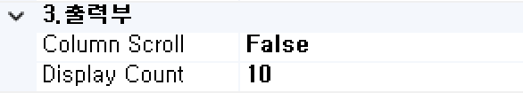

#  (ADD)  
지정된 조건에 따라 레코드 Add해두는 컴포넌트입니다.

<!-- Remark -->
::: tip <Badge type="tip" text="Remark" vertical="middle" /> 
Loop 내에서 발생하는 데이터 레코드를 보존해주는 기능입니다. 
반드시 MPD BOC, MIUD BOC의 Child 프로세스에서만 사용 가능합니다. 
MPD BOC, MIUD BOC 내 즉 Loop내에서 사용되는 BOC는 메인 Flow에서 Access할 수 없으나 예외적으로 ADD BOC를 이용하면 메인 Flow의 BOC에서 Access가 가능합니다.
:::
<!-- -->

## 1. ADD BOC 이미지
BOC 컴포넌트 목록에서 ADD BOC를 선택하여 Drag-Drop으로 화면작업 영역에 디자인합니다.  

 
   

데이터베이스의 데이터의 결과집합 중 출력할 컬럼 부를 표시합니다.

## 2. ADD BOC 속성
화면작업 영역에서 ADD BOC 선택 시 속성 영역에 설정이 가능한 항목에 값을 입력합니다. 

1)<b> 0. 기본항목(수정불가)</b>  
  

①<b> NEXTORD </b>  
하위 그룹의 다음 순서를 알립니다.

②<b> ORD </b>  
하위 그룹의 다음 순서를 알립니다.

③<b> PARENT SEQ </b>  
하위 그룹의 다음 순서를 알립니다.

④<b> 제어구분 </b>  
IUD의 insert, update, delete를 설정합니다.

2)<b> 1. 기초정보</b>  
  

①<b> OBJECT명 </b>  
해당 BOC가 실행된 후 해당 결과 SET을 저장할 Value Object의 명을 지정합니다. 해당 Object의 결과 Set은 그리드 형식의 Object로 구성됩니다.

②<b> 논리명칭 </b>  
BOC가 어떤 동작을 수행하는지를 간단한 명칭으로 기술합니다. 해당 명칭을 처리 흐름을 간략하게 표현할 수 있도록 기술합니다.

③<b> 논리설명 </b>  
논리명칭으로 표현하기 부족할 때 좀 더 상세히 내용을 기술합니다.

3)<b> 2. 입력부</b>  
  

①<b class="font18"> 1. 조건입력 </b>  
입력 OBJECT의 결과집합 중 데이터를 모아둘 조건을 입력합니다.

②<b class="font18"> 입력 OBJECT </b>  
저장 대상 데이터 Object 명을 선택합니다.

③<b class="font18"> 출력 항목 </b>  
기본은 전체항목이 되며 입력 OBJECT의 결과집합 중 출력할 컬럼을 지정합니다.

4)<b> 3. 출력부</b>  
  

①<b> Column Scroll </b>  
해당 BOC 목록이 많을 경우 "true"로 설정했을 때 Display Count에서 설정한 개수만큼 보여주고 나머지 목록은 ▲▼ 버튼으로 확인할 수 있습니다.

②<b> Display Count </b>  
해당 BOC 목록이 많을 때 목록에 보이는 개수를 설정합니다.

5)<b> 4. 메시지부</b>  
  

①<b> 결과메시지 </b>  
해당 처리 결과에 대한 메시지를 클라이언트. 즉, 호출자에게 보낼 필요가 있을 때 정의합니다. 

6)<b> 5. 선택항목</b>  
  

①<b class="font18"> Alias전송명 </b>  
전송하는 Object 명의 Alias를 생성합니다.

②<b> Log 수준 </b>  
Debug 테스트 시에 로그 메시지를 정의할 수 있습니다. 데이터베이스 관련된 BOC는 ReturnData와 QueryData를 사용합니다.
- <b class="colGray">00. ProcessHead</b> : Seq번호, 프로세스 타입을 표시합니다.
- <b class="colGray">01. InputData</b> : 입력 데이터를 표시합니다.
- <b class="colGray">02. ReturnData</b> : 결과 데이터를 표시합니다.
- <b class="colGray">03. Middle OutputData</b> : 중간 과정 결과 데이터를 표시합니다.
- <b class="colGray">04. TabPage</b> : 탭 페이지 결과를 표시합니다.
- <b class="colGray">05. Math-Trace</b> : Math의 계산식 결과를 표시합니다.
- <b class="colGray">06. Formula-Trace</b> : Formula의 계산식 결과를 표시합니다.
- <b class="colGray">07. QueryData</b> : 값이 포함된 쿼리를 표시합니다.
- <b class="colGray">08. SCLTrace</b> : SCLT BOC의 결과를 표시합니다.
- <b class="colGray">09. PEX부가 Objects</b> : PEX BOC의 부가적인 Object의 결과를 표시합니다.
- <b class="colGray">10. 미사용</b> : 조건 컬럼 부의 계산식 값을 표시합니다.

③<b> 실행 조건 </b>  
실행 조건에 값이 있는 경우 해당 실행 조건이 "True"가 아니면 실행이 되지 않습니다.

## 3. ADD BOC 사용 예시 
주로 MPD BOC의 Child 프로세스에서 생성된 데이터를 ADD BOC를 이용하여 저장하고 MPD BOC와 동일 레벨에 존재하는 메인 프로세스에서 참조하고자 할 경우 사용됩니다. 
DEPT_CD 컬럼 값이 없는 사용자만 ADD하여 별도로 UPD BOC에서 추가정보를 업데이트합니다. 

 &emsp;&emsp;&emsp;
 

