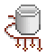
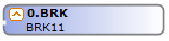
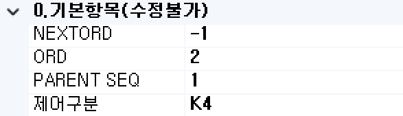
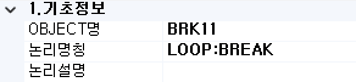
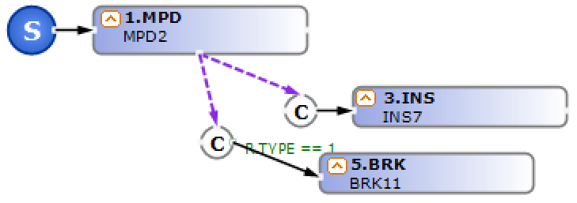

#  (BRK)  
MPD BOC 또는 MIUD BOC를 이용하여 Loop(while)문을 종료 처리하는 컴포넌트입니다.

<!-- Remark -->
::: tip <Badge type="tip" text="Remark" vertical="middle" /> 
해당 기능 사용시 자바 언어의 while문 내에 break가 추가됩니다. 
BRK BOC는 MPD BOC, MIUD BOC 내에서만 사용 가능합니다.
:::
<!-- -->

## 1. BRK BOC 이미지
BOC 컴포넌트 목록에서 BRK BOC를 선택하여 Drag-Drop으로 화면작업 영역에 디자인합니다.

 
   

## 2. BRK BOC 속성
화면작업 영역에서 BRK BOC 선택 시 속성 영역에 설정이 가능한 항목에 값을 입력합니다. 

1)<b> 0. 기본항목(수정불가)</b>  
  

①<b> NEXTORD </b>  
하위 그룹의 다음 순서를 알립니다.

②<b> ORD </b>  
하위 그룹의 다음 순서를 알립니다.

③<b> PARENT SEQ </b>  
하위 그룹의 다음 순서를 알립니다.

④<b> 제어구분 </b>  
IUD의 insert, update, delete를 설정합니다.

2)<b> 1. 기초정보</b>  
  

①<b> OBJECT명 </b>  
해당 BOC가 실행된 후 해당 결과 SET을 저장할 Value Object의 명을 지정합니다. 해당 Object의 결과 Set은 그리드 형식의 Object로 구성됩니다.

②<b> 논리명칭 </b>  
BOC가 어떤 동작을 수행하는지를 간단한 명칭으로 기술합니다. 해당 명칭을 처리 흐름을 간략하게 표현할 수 있도록 기술합니다.

③<b> 논리설명 </b>  
논리명칭으로 표현하기 부족할 때 좀 더 상세히 내용을 기술합니다.

3)<b> 3. 출력부</b>  
  

①<b> Column Scroll </b>  
해당 BOC 목록이 많을 경우 "true"로 설정했을 때 Display Count에서 설정한 개수만큼 보여주고 나머지 목록은 ▲▼ 버튼으로 확인할 수 있습니다.

②<b> Display Count </b>  
해당 BOC 목록이 많을 때 목록에 보이는 개수를 설정합니다.

## 3. BRK BOC 사용 예시 
1) Break 처리 예  
MPD의 입력 데이터셋의 Record Count만큼 Loop 처리시 특정 레코드의 "TYPE" 컬럼의 값이 1 이 아니면 MPD BOC의 Loop를 벗어나는 샘플입니다.

