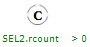
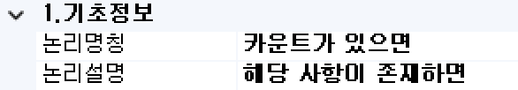
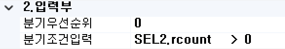
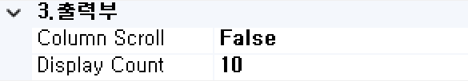
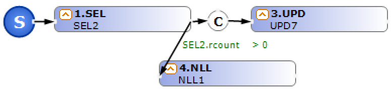

#  (CON)  
조건에 따른 분기 처리를 수행하는 기능인 컴포넌트입니다.

<!-- Remark -->
::: tip <Badge type="tip" text="Remark" vertical="middle" /> 
CON BOC는 앞에서 처리된 BOC의 결과값을 체크하여 조건에 따른 분기를 수행함으로써 프로세스의 흐름을 제어합니다.   
CON BOC 사용시 자바 소스 생성은 if(조건) 형식으로 구성됩니다.
:::
<!-- -->

## 1. CON BOC 이미지
BOC 컴포넌트 목록에서 CON BOC를 선택하여 Drag-Drop으로 화면작업 영역에 디자인합니다.  

 
   

C로 표시되는 부분에는 속성의 분기 조건 처리가 표시합니다.

## 2. CON BOC 속성
화면작업 영역에서 CON BOC 선택 시 속성 영역에 설정이 가능한 항목에 값을 입력합니다. 

1)<b> 1. 기초정보</b>  
  

①<b> 논리명칭 </b>  
BOC가 어떤 동작을 수행하는지를 간단한 명칭으로 기술합니다. 해당 명칭을 처리 흐름을 간략하게 표현할 수 있도록 기술합니다.

②<b> 논리설명 </b>  
논리명칭으로 표현하기 부족할 때 좀 더 상세히 내용을 기술합니다.

2)<b> 2. 입력부</b>  
  

①<b> 분기우선순위 </b>  
여러 개의 조건에서 체크할 때 각 조건 간의 계산 순서의 우선순위를 입력합니다.

②<b> 분기조건입력 </b>  
결과값이 True/False인 조건문을 입력한다. 해당 조건 값이 True이면 이후 Flow를 실행합니다.

3)<b> 3. 출력부</b>  
  

①<b> Column Scroll </b>  
해당 BOC 목록이 많을 경우 "true"로 설정했을 때 Display Count에서 설정한 개수만큼 보여주고 나머지 목록은 ▲▼ 버튼으로 확인할 수 있습니다.

②<b> Display Count </b>  
해당 BOC 목록이 많을 때 목록에 보이는 개수를 설정합니다.

## 3. CON BOC 사용 예시 
1) 분기처리 예  
CON BOC의 분기 조건이 없는 플로우는 자바에서는 else{ ... } 형식으로 구성됩니다. 

