#  (CVT)  
추가 및 변환 처리된 데이터를 데이터셋 Object로 생성하는 컴포넌트입니다.

<!-- Remark -->
::: tip <Badge type="tip" text="Remark" vertical="middle" /> 
CVT BOC는 입력 데이터셋 Object에 대한 데이터를 가공하여 출력되도록 사용합니다. 
이외에 추가적으로 입력 데이터셋 레코드에 대한 필터기능이 있습니다.
:::
<!-- -->

## 1. CVT BOC 이미지
BOC 컴포넌트 목록에서 CVT BOC를 선택하여 Drag-Drop으로 화면작업 영역에 디자인합니다.  

 
  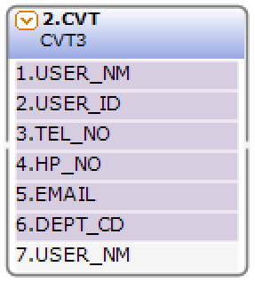 

데이터베이스의 데이터를 변환 처리한 컬럼에서 선택한 최종 결과집합인 컬럼 부를 표시합니다.
입력한 값에 추가 또는 값을 변경하는 컬럼 부를 표시합니다.

## 2. CVT BOC 속성
화면작업 영역에서 CVT BOC 선택 시 속성 영역에 설정이 가능한 항목에 값을 입력합니다. 

1)<b> 1. 기초정보</b>  
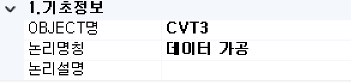  

①<b> OBJECT명 </b>  
해당 BOC가 실행된 후 해당 결과 SET을 저장할 Value Object의 명을 지정합니다. 해당 Object의 결과 Set은 그리드 형식의 Object로 구성됩니다.

②<b> 논리명칭 </b>  
BOC가 어떤 동작을 수행하는지를 간단한 명칭으로 기술합니다. 해당 명칭을 처리 흐름을 간략하게 표현할 수 있도록 기술합니다.

③<b> 논리설명 </b>  
논리명칭으로 표현하기 부족할 때 좀 더 상세히 내용을 기술합니다.

2)<b> 2. 입력부</b>  
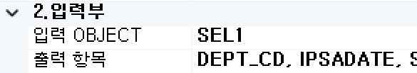  

①<b class="font18"> 입력 OBJECT </b>  
변환 대상 데이터 Object 명을 선택합니다.

②<b class="font18"> 전체항목 </b>  
입력 OBJECT와 변환 처리한 컬럼에서 선택한 최종 결과집합을 지정합니다. 
CVT BOC의 최종 결과로 생성될 컬럼들을 지정합니다.

3)<b> 3. 출력부</b>  
  

①<b> 2. Record-Count/Page </b>  
Pagination 시 페이지당 레코드 건수를 설정합니다.

②<b> Column Scroll </b>  
해당 BOC 목록이 많을 경우 "true"로 설정했을 때 Display Count에서 설정한 개수만큼 보여주고 나머지 목록은 ▲▼ 버튼으로 확인할 수 있습니다.

③<b> Display Count </b>  
해당 BOC 목록이 많을 때 목록에 보이는 개수를 설정합니다.

④<b class="font18"> 화면출력유형 </b>  
- <b class="colGray">None</b> : Default
- <b class="colGray">Dataset</b> : View Designer에서 그리드 컴포넌트에 조회 시 설정합니다.
- <b class="colGray">Recode</b> : JSP 출력방식일 때 단일 컴포넌트에 조회 시 설정합니다.
- <b class="colGray">Page</b> : JSP 출력방식일 때 페이징 시 설정합니다.
- <b class="colGray">ChartLabel</b> : View Designer에서 차트 컴포넌트에 범례를 설정합니다.
- <b class="colGray">ChartData</b> : View Designer에서 차트 컴포넌트에 데이터 조회 시 설정합니다.
- <b class="colGray">Schedule</b> : View Designer에서 스케줄 컴포넌트에 조회 시 설정합니다.  

4)<b> 4. 메시지부</b>  
  

①<b> 결과메시지 </b>  
해당 처리 결과에 대한 메시지를 클라이언트. 즉, 호출자에게 보낼 필요가 있을 때 정의합니다. 

5)<b> 5. 선택항목</b>  
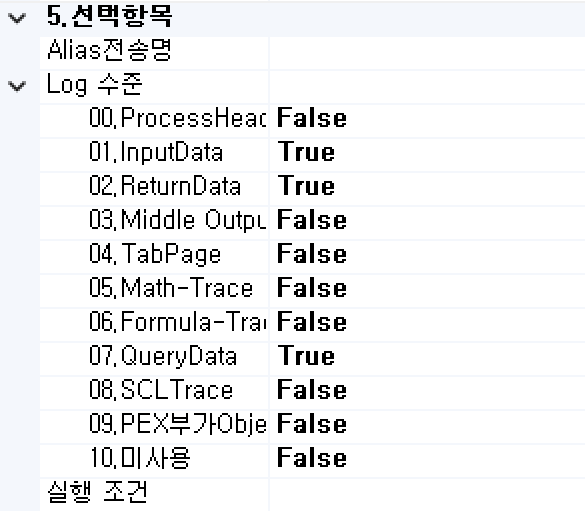  

①<b class="font18"> Alias전송명 </b>  
전송하는 Object 명의 Alias를 생성합니다.

②<b> Log 수준 </b>  
Debug 테스트 시에 로그 메시지를 정의할 수 있습니다. 데이터베이스 관련된 BOC는 ReturnData와 QueryData를 사용합니다.
- <b class="colGray">00. ProcessHead</b> : Seq번호, 프로세스 타입을 표시합니다.
- <b class="colGray">01. InputData</b> : 입력 데이터를 표시합니다.
- <b class="colGray">02. ReturnData</b> : 결과 데이터를 표시합니다.
- <b class="colGray">03. Middle OutputData</b> : 중간 과정 결과 데이터를 표시합니다.
- <b class="colGray">04. TabPage</b> : 탭 페이지 결과를 표시합니다.
- <b class="colGray">05. Math-Trace</b> : Math의 계산식 결과를 표시합니다.
- <b class="colGray">06. Formula-Trace</b> : Formula의 계산식 결과를 표시합니다.
- <b class="colGray">07. QueryData</b> : 값이 포함된 쿼리를 표시합니다.
- <b class="colGray">08. SCLTrace</b> : SCLT BOC의 결과를 표시합니다.
- <b class="colGray">09. PEX부가 Objects</b> : PEX BOC의 부가적인 Object의 결과를 표시합니다.
- <b class="colGray">10. 미사용</b> : 조건 컬럼 부의 계산식 값을 표시합니다.

③<b> 실행 조건 </b>  
실행 조건에 값이 있는 경우 해당 실행 조건이 "True"가 아니면 실행이 되지 않습니다.

6)<b> 6. 데이터(단일Option만사용)</b>  
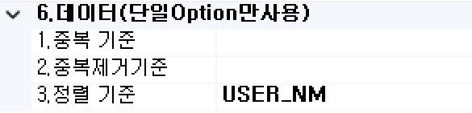  

①<b class="font18"> 1. 중복 기준 </b>  
결과 데이터셋 Object의 레코드 중 중복이 발생한 레코드만 남기고 나머지는 모두 필터하는 기능입니다. 
중복기준 컬럼을 기준으로 체크하여 중복이 발생한 레코드만 남기고 중복이 없는 레코드는 삭제합니다.

②<b class="font18"> 2. 중복제거기준 </b>  
중복기준과는 반대 개념으로 결과 데이터셋 Object의 레코드 중 중복이 발생한 레코드는 중복을 제거한 1개의 레코드만 남기고 나머지는 중복 발생 레코드는 제거하는 기능입니다. 기준 컬럼으로 체크하여 중복을 제거합니다.  
중복 발생한 레코드는 중복 확인 레코드만 남기고 나머지 레코드는 삭제됩니다.

③<b> 3. 정렬 기준 </b>  
결과 데이터셋 Object의 레코드를 오름차순으로 정렬합니다. 정렬 기준 컬럼으로 체크하여 오름차순으로 정렬합니다. 정렬에 사용하는 기준은 ASCII 코드 값을 기준으로 정렬합니다.

## 3. CVT BOC 사용 예시 
1) 데이터 가공 기본 예  
처음에 SEL BOC로 데이터베이스에 담긴 정보 그대로 SELECT가 되어 보여주지만 CVT BOC에서 “BIGO”의 컬럼을 추가한 후 입력부 계산식을 원하는 값을 넣으면 데이터가 가공되어 출력하게 됩니다. 

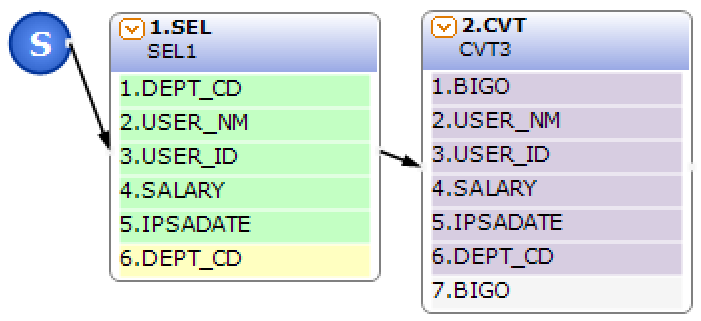 &emsp;&emsp;&emsp;
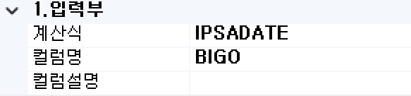 

[ 테스트 결과 메시지 ]

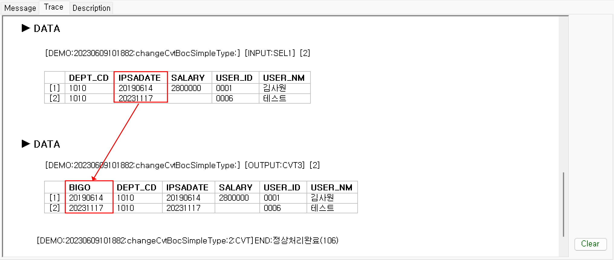

2) 데이터 필터 기능 중복기준 예  
중복기준 설정을 통한 중복이 발생한 데이터만 출력하게 됩니다. 

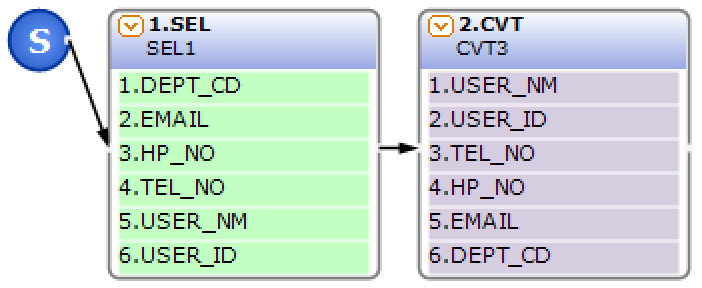 &emsp;&emsp;&emsp;
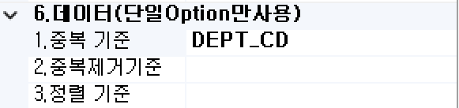 

[ 테스트 결과 메시지 ]

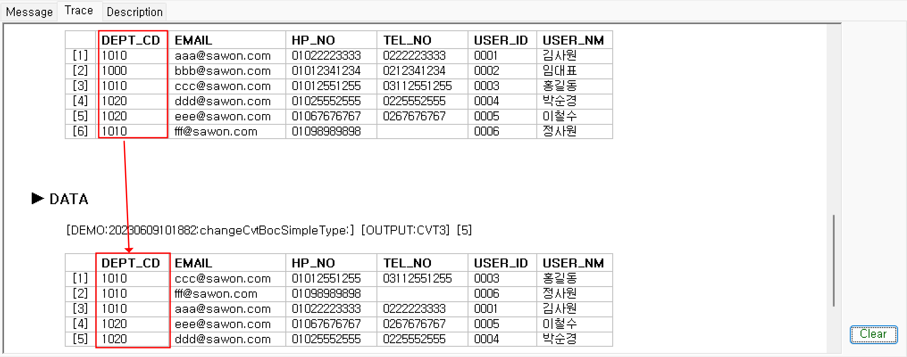

3) 데이터 필터 기능 중복제거기준 예  
중복 제거 기준 설정을 통한 중복이 발생한 레코드를 제거한 결과가 출력하게 됩니다. 

 &emsp;&emsp;&emsp;
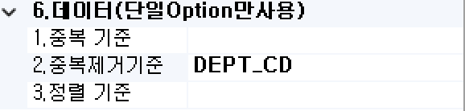 

[ 테스트 결과 메시지 ]

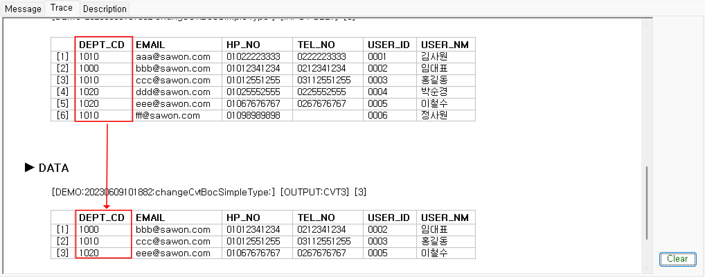

4) 데이터 필터 기능 정렬기준 예  
정렬 기준 설정을 통한 결과가 ASCII코드값 오름차순으로 정렬됩니다. 

 &emsp;&emsp;&emsp;
 

[ 테스트 결과 메시지 ]

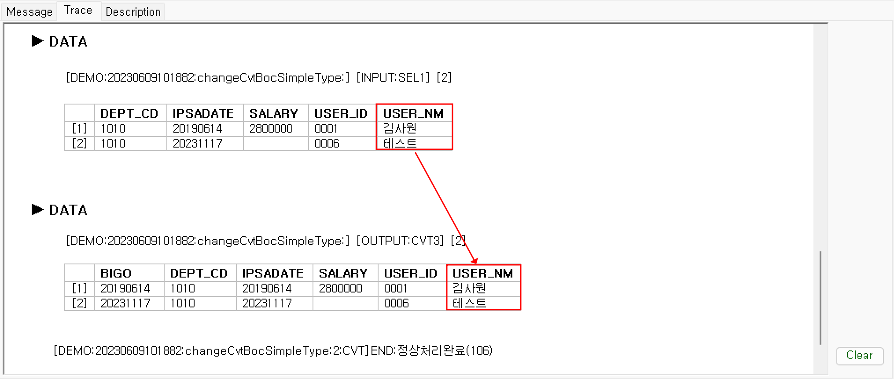

