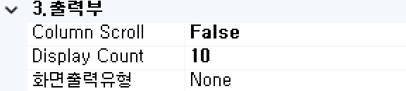
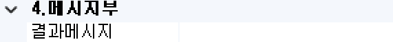
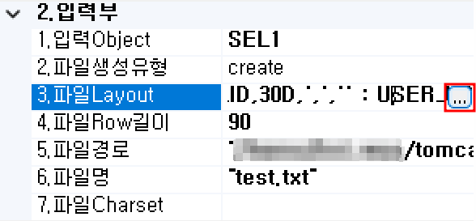

#  (FBD)  
특정 포맷으로 구성된 파일을 생성하는 컴포넌트입니다.

## 1. FBD BOC 이미지
BOC 컴포넌트 목록에서 FBD BOC를 선택하여 Drag-Drop으로 화면작업 영역에 디자인합니다.  

 
   

## 2. FBD BOC 속성
화면작업 영역에서 FBD BOC 선택 시 속성 영역에 설정이 가능한 항목에 값을 입력합니다. 

1)<b> 1. 기초정보</b>  
  

①<b> OBJECT명 </b>  
해당 BOC가 실행된 후 해당 결과 SET을 저장할 Value Object의 명을 지정합니다. 해당 Object의 결과 Set은 그리드 형식의 Object로 구성됩니다.

②<b> 논리명칭 </b>  
BOC가 어떤 동작을 수행하는지를 간단한 명칭으로 기술합니다. 해당 명칭을 처리 흐름을 간략하게 표현할 수 있도록 기술합니다.

③<b> 논리설명 </b>  
논리명칭으로 표현하기 부족할 때 좀 더 상세히 내용을 기술합니다.

2)<b> 2. 입력부</b>  
  

①<b class="font18"> 1. 입력Object </b>  
파일 생성 대상 데이터 Object 명을 선택합니다.

②<b class="font18"> 2. 파일생성유형 </b>  
파일의 구성 형태를 선택합니다.  
- <b class="colGray">Create</b>  
생성될 파일의 경로에 동일한 파일이 존재하면 Overwrite하여 재생성할 때 파일 생성 시 항상 신규 파일 형식으로 생성합니다. 
- <b class="colGray">appenddata </b> 
생성될 파일의 경로에 파일이 존재하지 않으면 신규 생성합니다. 
해당 위치에 동일 파일명이 존재하게 되면 해당 파일의 내용에 신규 데이터 Row를 Append 시킵니다. 
파일이 존재하여 appenddata시 마지막 Row 다음에 Row를 추가합니다. 
- <b class="colGray">appendseqname</b>  
생성될 파일의 경로에 동일명의 파일이 존재하지 않으면 신규 생성합니다. 
해당 위치에 동일 파일명이 존재하게 되면 파일명에서 확장자를 제거한 파일명에 “_” + 순번을 추가하여 신규 파일을 생성합니다. 
즉 동일한 파일 존재 시 중복을 피하여 파일을 생성합니다. 

③<b class="font18"> 3. 파일Layout </b>  
파일의 레이아웃 포맷을 설정합니다.
- <b class="colGray">Column</b>  
입력 데이터셋 Object에서 사용될 데이터 컬럼을 설정합니다. 또는 String 값을 입력하고 싶을 때에는 “문자열” 형식으로 입력하거나, Hex값을 입력하고 싶을 때에는 자바의 Hex 표현식으로 입력하여 사용할 수 있습니다. 
- <b class="colGray">Length </b> 
해당 컬럼의 데이터를 전송 레이아웃에 Charcter 길이만큼의 사이즈로 전송됩니다.  
즉 데이터의 길이가 5이고 길이가 10일 때 전송은 10만큼의 영역에 데이터가 표현되어 전송됩니다. 
- <b class="colGray">textAlign</b>  
컬럼의 데이터를 해당 길이만큼의 영역으로 전송 시 우측/좌측 정렬할지를 지정합니다. 
L : Left , R:Right, D: Delimiter 
- <b class="colGray">Delimiter</b>  
컬럼과 컬럼의 분리문자를 입력합니다. textAlign의 값을 "D" 값을 입력하면 Length 구성 형식은 무시되고 구분 형식을 분리 문자기준으로 처리합니다.
- <b class="colGray">SpaceChar </b> 
데이터 영역 길이가 10이고 실제 데이터의 길이가 10보다 작을 때 작은 길이만큼의 영역에 해당 문자 Char로 채우는 기능을 합니다. 예로 데이터 영역이 10이고 데이터의 길이가 7일 때 spaceChar "&#42;"로 설정되었다면 전송하는 데이터는 “1234567***” 형태로 전송합니다. 

④<b class="font18"> 4. 파일Row길이 </b>  
Length 설정에 따른 레이아웃 총길이입니다.

⑤<b class="font18"> 5. 파일경로 </b>  
생성할 파일의 위치를 설정합니다.

⑥<b class="font18"> 6. 파일명 </b>  
생성할 파일명을 설정합니다.

⑦<b class="font18"> 7. 파일Charset </b>  
파일의 Charset을 입력합니다.

3)<b> 3. 출력부</b>  
  

①<b> Column Scroll </b>  
해당 BOC 목록이 많을 경우 "true"로 설정했을 때 Display Count에서 설정한 개수만큼 보여주고 나머지 목록은 ▲▼ 버튼으로 확인할 수 있습니다.

②<b> Display Count </b>  
해당 BOC 목록이 많을 때 목록에 보이는 개수를 설정합니다.

③<b class="font18"> 화면출력유형 </b>  
- <b class="colGray">None</b> : Default
- <b class="colGray">Dataset</b> : View Designer에서 그리드 컴포넌트에 조회 시 설정합니다.
- <b class="colGray">Recode</b> : JSP 출력방식일 때 단일 컴포넌트에 조회 시 설정합니다.
- <b class="colGray">Page</b> : JSP 출력방식일 때 페이징 시 설정합니다.
- <b class="colGray">ChartLabel</b> : View Designer에서 차트 컴포넌트에 범례를 설정합니다.
- <b class="colGray">ChartData</b> : View Designer에서 차트 컴포넌트에 데이터 조회 시 설정합니다.
- <b class="colGray">Schedule</b> : View Designer에서 스케줄 컴포넌트에 조회 시 설정합니다.

4)<b> 4. 메시지부</b>  
  

①<b> 결과메시지 </b>  
해당 처리 결과에 대한 메시지를 클라이언트. 즉, 호출자에게 보낼 필요가 있을 때 정의합니다. 

5)<b> 5. 선택항목</b>  
  

①<b class="font18"> Alias전송명 </b>  
전송하는 Object 명의 Alias를 생성합니다.

②<b> Log 수준 </b>  
Debug 테스트 시에 로그 메시지를 정의할 수 있습니다. 데이터베이스 관련된 BOC는 ReturnData와 QueryData를 사용합니다.
- <b class="colGray">00. ProcessHead</b> : Seq번호, 프로세스 타입을 표시합니다.
- <b class="colGray">01. InputData</b> : 입력 데이터를 표시합니다.
- <b class="colGray">02. ReturnData</b> : 결과 데이터를 표시합니다.
- <b class="colGray">03. Middle OutputData</b> : 중간 과정 결과 데이터를 표시합니다.
- <b class="colGray">04. TabPage</b> : 탭 페이지 결과를 표시합니다.
- <b class="colGray">05. Math-Trace</b> : Math의 계산식 결과를 표시합니다.
- <b class="colGray">06. Formula-Trace</b> : Formula의 계산식 결과를 표시합니다.
- <b class="colGray">07. QueryData</b> : 값이 포함된 쿼리를 표시합니다.
- <b class="colGray">08. SCLTrace</b> : SCLT BOC의 결과를 표시합니다.
- <b class="colGray">09. PEX부가 Objects</b> : PEX BOC의 부가적인 Object의 결과를 표시합니다.
- <b class="colGray">10. 미사용</b> : 조건 컬럼 부의 계산식 값을 표시합니다.

③<b> 실행 조건 </b>  
실행 조건에 값이 있는 경우 해당 실행 조건이 "True"가 아니면 실행이 되지 않습니다.

## 3. FBD BOC 사용 예시 
1) 파일Layout 속성의 입력 예  
  

① FBD BOC 우측 속성에 파일Layout을 선택해서 나오는 ... 버튼을 클릭합니다.  
  

② 출력 컬럼 입력창에 등록할 컬럼의 레이아웃을 설정합니다.  
  

