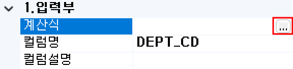

#  (GLV)  
단일 값을 해당 서비스 내에서 변수로 사용하는 컴포넌트입니다.

<!-- Remark -->
::: tip <Badge type="tip" text="Remark" vertical="middle" /> 
GLV BOC 이외의 BOC는 In-Out에 기초하여 데이터셋을 구성하나 GLV BOC는 단순히 서비스 내부에서 변수형식으로 선언하여 사용합니다.
:::
<!-- -->

## 1. GLV BOC 이미지
BOC 컴포넌트 목록에서 GLV BOC를 선택하여 Drag-Drop으로 화면작업 영역에 디자인합니다.  

 
   

이전에 생성한 컬럼의 값을 변경할 때 값을 세팅하면 기존의 컬럼의 값을 overwrite 처리합니다.

## 2. GLV BOC 속성
화면작업 영역에서 GLV BOC 선택 시 속성 영역에 설정이 가능한 항목에 값을 입력합니다. 

1)<b> 1. 기초정보</b>  
  

①<b> OBJECT명 </b>  
해당 BOC가 실행된 후 해당 결과 SET을 저장할 Value Object의 명을 지정합니다. 해당 Object의 결과 Set은 그리드 형식의 Object로 구성됩니다.

②<b> 논리명칭 </b>  
BOC가 어떤 동작을 수행하는지를 간단한 명칭으로 기술합니다. 해당 명칭을 처리 흐름을 간략하게 표현할 수 있도록 기술합니다.

③<b> 논리설명 </b>  
논리명칭으로 표현하기 부족할 때 좀 더 상세히 내용을 기술합니다.

2)<b> 3. 출력부</b>  
  

①<b> Column Scroll </b>  
해당 BOC 목록이 많을 경우 "true"로 설정했을 때 Display Count에서 설정한 개수만큼 보여주고 나머지 목록은 ▲▼ 버튼으로 확인할 수 있습니다.

②<b> Display Count </b>  
해당 BOC 목록이 많을 때 목록에 보이는 개수를 설정합니다.

## 3. GLV BOC 사용 예시

1) GLV BOC에 컬럼 정의 사용 예  
  

<!-- Remark -->
::: tip <Badge type="tip" text="Remark" vertical="middle" /> 
사용 방법은 해당 BOC에 오른쪽 마우스 버튼을 클릭하여 컬럼을 추가합니다.
:::
<!-- -->

① S-Column 추가  
단일 컬럼을 추가합니다. 추가된 컬럼명은 기본으로 “TEMP1”이 설정됩니다. “TEMP1” 컬럼을 선택해서 컬럼명을 수정하면 됩니다. 

  

② M-Column 추가  
1개 이상의 다중 컬럼들을 추가합니다. 컬럼을 등록할 때 키보드에 있는 Enter 키 또는 “,” 로 구분해서 입력합니다.  

 &emsp;&emsp;&emsp;
 

③ 추가한 컬럼을 선택합니다.  
  

④ 우측 속성에 계산식을 선택해서 나오는 ... 버튼을 클릭합니다.  
  

⑤ 수식 입력창에서 파라미터에 넣을 값이나 수식을 입력하여 저장합니다.  
  

2) GLV BOC 컬럼에 정의되어 있는 값 사용 예  
GLV BOC로 정의된 컬럼은 데이터셋 형식이 아닌 단일 값을 불러오거나 Set하는 방식의 Function을 사용합니다.

<b>사용 함수 명 규칙</b> 
“getgv” + datatype [string || int || long || number] + “(“ + name + “)” 형식

  

<!-- Remark -->
::: tip <Badge type="tip" text="Remark" vertical="middle" /> 
- <b>name</b> : GLV BOC로 생성한 컬럼명을 지정합니다.
- <b>datatype</b> : number는 double형 데이터타입으로 return합니다.
:::
<!-- -->

① SEL BOC 파라미터인 컬럼을 선택합니다.  
  

② 우측 속성에 계산식을 선택해서 나오는 ... 버튼을 클릭합니다.  
  

③ 수식 입력창에서 파라미터에 넣을 값이나 수식을 입력하여 저장합니다.  
  

<!-- Remark -->
::: tip <Badge type="tip" text="Remark" vertical="middle" /> 
- <b>getgvstring(“<b class="spanEx">name</b>”)</b> : return type String
- <b>getgvint(“<b class="spanEx">name</b>”)</b> : return type int
- <b>getgvlong(“<b class="spanEx">name</b>”)</b> : return type long
- <b>getgvnumber(“<b class="spanEx">name</b>”)</b> : return type double
:::
<!-- -->

