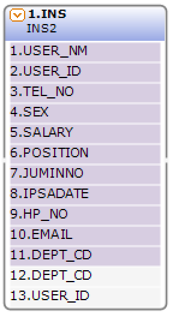
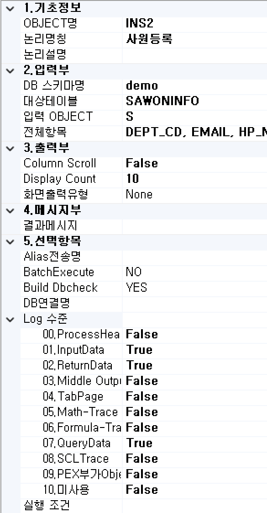

#  (INS)  
DB Table에 대한 Insert 처리를 수행하는 기능인 컴포넌트입니다.

<!-- Remark -->
::: tip <Badge type="tip" text="Remark" vertical="middle" /> 
INS-BOC는 쿼리를 자동 생성하며 자동 생성에 필요한 속성을 설정합니다.
:::
<!-- -->

## 1. BOC 이미지
BOC 컴포넌트 목록에서 INS BOC를 선택하여 Drag-Drop으로 화면작업 영역에 디자인합니다.  

 
   

데이터베이스의 데이터를 등록하는 컬럼 부를 표시합니다.
입력한 값에 추가 또는 값을 변경하는 컬럼 부를 표시합니다.

## 2. 속성
화면작업 창에서 INS BOC 선택 시 속성 창에 설정이 가능한 항목에 값을 입력합니다. 
  

1)<b class="font20"> 기초정보</b>  

①<b class="font18"> OBJECT명 </b>  
해당 BOC가 실행된 후 해당 결과 SET을 저장할 Value Object의 명을 지정합니다. 해당 Object의 결과 Set은 그리드 형식의 Object로 구성됩니다.

②<b class="font18"> 논리명칭 </b>  
BOC가 어떤 동작을 수행하는지를 간단한 명칭으로 기술합니다. 해당 명칭을 처리 흐름을 간략하게 표현할 수 있도록 기술합니다.

③<b class="font18"> 논리설명 </b>  
논리 명칭으로 표현하기 부족할 때 좀 더 상세히 내용을 기술합니다.

2)<b class="font20"> 입력부</b>  

①<b class="font18"> DB스키마명 </b>  
등록 대상인 데이터베이스 스키마를 입력합니다.

②<b class="font18"> 대상테이블 </b>  
등록 대상인 데이터베이스 테이블 정보를 입력합니다.

③<b class="font18"> 입력 OBJECT </b>  
등록할 입력 데이터 Object 명을 입력합니다.

④<b class="font18"> 전체항목 </b>  
등록 대상인 데이터베이스 컬럼 정보를 입력합니다.

3)<b class="font20"> 출력부</b>  

①<b class="font18"> Column Scroll </b>  
해당 BOC 목록이 많을 때 true로 설정했을 때 Display Count에서 설정한 개수만큼 보여주고 나머지 목록은 ▲▼ 버튼으로 확인할 수 있습니다.

②<b class="font18"> Display Count </b>  
해당 BOC 목록이 많을 때 목록에 보이는 개수를 설정합니다.

③<b class="font18"> 화면출력유형 </b>  
- <b>None :</b> Default
- <b>Dataset :</b> View Designer에서 그리드 컴포넌트에 조회 시 설정합니다.
- <b>Recode :</b> JSP 출력방식일 때 단일 컴포넌트에 조회 시 설정합니다.
- <b>Page :</b> JSP 출력방식일 때 페이징 시 설정합니다.
- <b>ChartLabel :</b> View Designer에서 차트 컴포넌트에 범례를 설정합니다.
- <b>ChartData :</b> View Designer에는 차트 컴포넌트에 데이터 조회 시 설정합니다.
- <b>Schedule :</b> View Designer에서 스케줄 컴포넌트에 조회 시 설정합니다.

4)<b class="font20"> 메시지부</b>  

①<b class="font18"> 결과메시지 </b>  
해당 처리 결과에 대한 메시지를 클라이언트. 즉, 호출자에게 보낼 필요가 있을 때 정의합니다. 

5)<b class="font20"> 선택항목</b>  

①<b class="font18"> Alias전송명 </b>  
전송하는 Object 명의 Alias를 생성합니다.

②<b class="font18"> BatchExecute </b>  
배치 실행 여부를 설정합니다.

③<b class="font18"> Build Dbcheck </b>  
빌드 시 데이터베이스의 테이블 컬럼 정보와 해당 설정 정보와 비교 체크를 실행합니다.

④<b class="font18"> DB연결명 </b>  
기본 접속 DB는 자동 설정됩니다. 추가로 다른 DB 연결 명을 사용하여 데이터 처리의 필요성이 생기면 해당 정보에 접속 명을 등록하여 사용합니다.

⑤<b class="font18"> Log 수준 </b>  
Debug-테스트 시에 로그 메시지를 정의할 수 있습니다. 데이터베이스 관련된 BOC는 ReturnData와 QueryData를 사용합니다.
- <b>ProcessHead :</b> Seq번호, 프로세스 타입을 표시합니다.
- <b>InputData :</b> 입력 데이터를 표시합니다.
- <b>ReturnData :</b> 결과 데이터를 표시합니다.
- <b>Middle OutputData :</b> 중간 과정 결과 데이터를 표시합니다.
- <b>TabPage :</b> 탭 페이지 결과를 표시합니다.
- <b>Math-Trace :</b> Math의 계산식과 결과를 표시합니다.
- <b>Formula-Trace :</b> Formula의 계산식과 결과를 표시합니다.
- <b>QueryData :</b> 값이 포함된 쿼리를 표시합니다.
- <b>SCLTrace :</b> SCLT BOC의 결과를 표시합니다.
- <b>PEX부가 Objects :</b> PEX BOC의 부가적인 Object의 결과를 표시합니다.
- <b>미사용 :</b> 조건 컬럼 부의 계산식 값을 표시합니다.

⑥<b class="font18"> 실행 조건 </b>  
실행 조건에 값이 있는 경우 해당 실행 조건이 True가 아니면 실행이 되지 않습니다.

