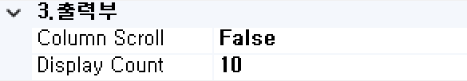

#  (MPD)  
입력 Object의 특정 컬럼 값에 따른 분기 처리를 수행하는 기능인 컴포넌트입니다.

<!-- Remark -->
::: tip <Badge type="tip" text="Remark" vertical="middle" /> 
MPD BOC는 분기조건을 자유롭게 지정할 수 있어 범용적인 패턴의 분기처리에 사용됩니다. 
MPD BOC의 분기처리는 Child BOC에 CON BOC 조건 분기처리를 추가하여 필요한 속성을 설정합니다.  
Loop내에서 Current Record Object는 “R” Object로 만들어집니다.
:::
<!-- -->

## 1. MPD BOC 이미지
BOC 컴포넌트 목록에서 MPD BOC를 선택하여 Drag-Drop으로 화면작업 영역에 디자인합니다.  
MPD BOC 아래에 CON BOC를 화면작업창에 디자인합니다.  

 
   

C로 표시되는 부분이 속성의 분기조건식에 조건의 값을 설정하여 분기 처리되는 CON BOC를 표시합니다.

## 2. MPD BOC 속성
화면작업 창에서 MPD BOC 선택 시 속성 창에 설정이 가능한 항목에 값을 입력합니다. 

1)<b> 1. 기초정보</b>  
  

①<b> OBJECT명 </b>  
해당 BOC가 실행된 후 해당 결과 SET을 저장할 Value Object의 명을 지정합니다. 해당 Object의 결과 Set은 그리드 형식의 Object로 구성됩니다.

②<b> 논리명칭 </b>  
BOC가 어떤 동작을 수행하는지를 간단한 명칭으로 기술합니다. 해당 명칭을 처리 흐름을 간략하게 표현할 수 있도록 기술합니다.

③<b> 논리설명 </b>  
논리명칭으로 표현하기 부족할 때 좀 더 상세히 내용을 기술합니다.

2)<b> 2. 입력부</b>  
  

①<b class="font18"> 입력 OBJECT </b>  
수정할 입력 데이터 Object 명을 입력합니다.

3)<b> 3. 출력부</b>  
  

①<b> Column Scroll </b>  
해당 BOC 목록이 많을 경우 "true"로 설정했을 때 Display Count에서 설정한 개수만큼 보여주고 나머지 목록은 ▲▼ 버튼으로 확인할 수 있습니다.

②<b> Display Count </b>  
해당 BOC 목록이 많을 때 목록에 보이는 개수를 설정합니다.

5)<b> 5. 선택항목</b>  
  

①<b class="font18"> DB연결명 </b>  
기본 접속 DB는 자동 설정됩니다. 추가로 다른 DB 연결 명을 사용하여 데이터 처리의 필요성이 생기면 해당 정보에 접속 명을 등록하여 사용합니다.

②<b> Log 수준 </b>  
Debug 테스트 시에 로그 메시지를 정의할 수 있습니다. 데이터베이스 관련된 BOC는 ReturnData와 QueryData를 사용합니다.
- <b class="colGray">00. ProcessHead</b> : Seq번호, 프로세스 타입을 표시합니다.
- <b class="colGray">01. InputData</b> : 입력 데이터를 표시합니다.
- <b class="colGray">02. ReturnData</b> : 결과 데이터를 표시합니다.
- <b class="colGray">03. Middle OutputData</b> : 중간 과정 결과 데이터를 표시합니다.
- <b class="colGray">04. TabPage</b> : 탭 페이지 결과를 표시합니다.
- <b class="colGray">05. Math-Trace</b> : Math의 계산식 결과를 표시합니다.
- <b class="colGray">06. Formula-Trace</b> : Formula의 계산식 결과를 표시합니다.
- <b class="colGray">07. QueryData</b> : 값이 포함된 쿼리를 표시합니다.
- <b class="colGray">08. SCLTrace</b> : SCLT BOC의 결과를 표시합니다.
- <b class="colGray">09. PEX부가 Objects</b> : PEX BOC의 부가적인 Object의 결과를 표시합니다.
- <b class="colGray">10. 미사용</b> : 조건 컬럼 부의 계산식 값을 표시합니다.

③<b> 실행 조건 </b>  
실행 조건에 값이 있는 경우 해당 실행 조건이 "True"가 아니면 실행이 되지 않습니다.

## 3. MPD BOC 사용 예시 
1) 분기처리 예  
MPD BOC의 분기처리 Child BOC에는 입력 Object인 "R" Object가 발생합니다. 
"R" Object는 Loop 처리 시 발생하는 Current Record Object입니다. 
아래 샘플에서 "INS7" Node의 입력 Object로 "R"이 설정되어 있습니다. 
Current Record가 수정 대상 레코드가 됩니다. 

 &emsp;&emsp;&emsp;
 

