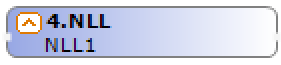
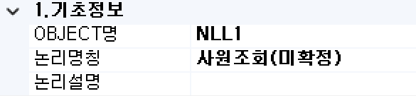

#  (NLL)  
“아무 일도 하지 않는 BOC”를 의미하며 프로세스 처리규칙 상 BOC간 연결이 불가한 경우 중간 버퍼 역할인 컴포넌트입니다.

<!-- Remark -->
::: tip <Badge type="tip" text="Remark" vertical="middle" /> 
모델링 초기 시점에 개략적인 논리모델만 작성하거나 불확실한 처리에 대한 임시적인 용도에도 사용합니다. 
또한, 처리기능 없이 메시지만 발생시키고 싶을 때 사용합니다.
:::
<!-- -->

## 1. NLL BOC 이미지
BOC 컴포넌트 목록에서 NLL BOC를 선택하여 Drag-Drop으로 화면작업 영역에 디자인합니다.  

 
   

## 2. NLL BOC 속성
화면작업 영역에서 NLL BOC 선택 시 속성 영역에 설정이 가능한 항목에 값을 입력합니다. 

1)<b> 1. 기초정보</b>  
  

①<b> OBJECT명 </b>  
해당 BOC가 실행된 후 해당 결과 SET을 저장할 Value Object의 명을 지정합니다. 해당 Object의 결과 Set은 그리드 형식의 Object로 구성됩니다.

②<b> 논리명칭 </b>  
BOC가 어떤 동작을 수행하는지를 간단한 명칭으로 기술합니다. 해당 명칭을 처리 흐름을 간략하게 표현할 수 있도록 기술합니다.

③<b> 논리설명 </b>  
논리명칭으로 표현하기 부족할 때 좀 더 상세히 내용을 기술합니다.

2)<b> 3. 출력부</b>  
  

①<b> Column Scroll </b>  
해당 BOC 목록이 많을 경우 "true"로 설정했을 때 Display Count에서 설정한 개수만큼 보여주고 나머지 목록은 ▲▼ 버튼으로 확인할 수 있습니다.

②<b> Display Count </b>  
해당 BOC 목록이 많을 때 목록에 보이는 개수를 설정합니다.

3)<b> 4. 메시지부</b>  
  

①<b> 결과메시지 </b>  
해당 처리 결과에 대한 메시지를 클라이언트. 즉, 호출자에게 보낼 필요가 있을 때 정의합니다. 

