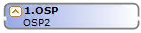
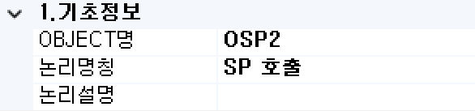
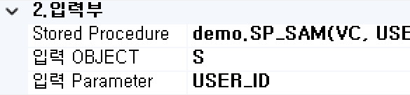
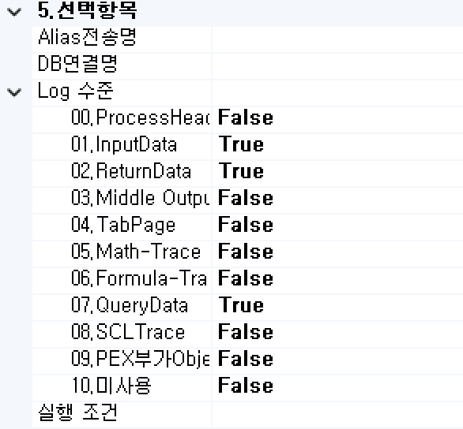
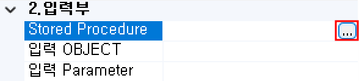
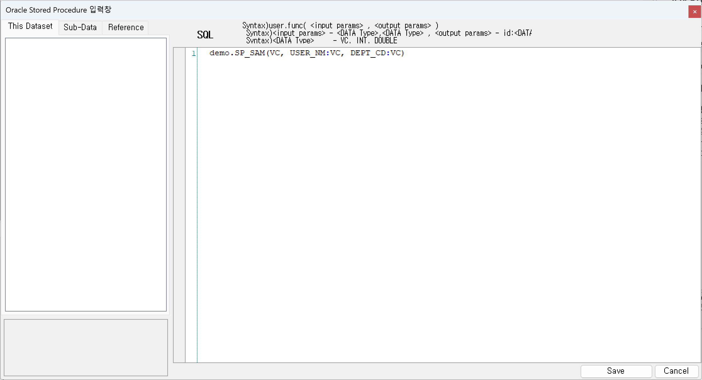

#  <span class="bocIcon">(OSP)</span> <br/>
데이터베이스 Stored Procedure를 호출하는 컴포넌트입니다.

<!-- Remark -->
::: tip <Badge type="tip" text="Remark" vertical="middle" /> 
호출되는 데이터베이스 Stored Procedure가 처리하고 Return하는 데이터셋은 단일 레코드셋만 허용합니다.<br/>
호출은 입력 데이터셋의 레코드 수만큼 해당 Stored Procedure를 호출합니다.
:::
<!-- -->

## 1. OSP BOC 이미지
BOC 컴포넌트 목록에서 OSP BOC를 선택하여 Drag-Drop으로 화면작업 영역에 디자인합니다. <br/>
<div class="boc"> 
   
</div>

## 2. OSP BOC 속성
화면작업 영역에서 OSP BOC 선택 시 속성 영역에 설정이 가능한 항목에 값을 입력합니다.<br/>

<span class="font20">1)<b> 1. 기초정보</b></span> <br/>
 <br/>

<span class="font18">①<b> OBJECT명 </b></span> <br/>
해당 BOC가 실행된 후 해당 결과 SET을 저장할 Value Object의 명을 지정합니다. 해당 Object의 결과 Set은 그리드 형식의 Object로 구성됩니다.

<span class="font18">②<b> 논리명칭 </b></span> <br/>
BOC가 어떤 동작을 수행하는지를 간단한 명칭으로 기술합니다. 해당 명칭을 처리 흐름을 간략하게 표현할 수 있도록 기술합니다.

<span class="font18">③<b> 논리설명 </b></span> <br/>
논리명칭으로 표현하기 부족할 때 좀 더 상세히 내용을 기술합니다.

<span class="font20">2)<b> 2. 입력부</b></span> <br/>
 <br/>

<span class="font18">①<b> Stored Procedure </b></span> <br/>
Stored Procedure를 입력합니다.<br/>
입력형식은 func명(&lt;입력 파라미터&gt;, &lt;출력 파라미터&gt;)으로 입력 파라미터는 입력하는 데이터 타입들로 구성되고, 출력 파라미터는 출력ID : 데이터 타입들로 구성됩니다.

<!-- Remark -->
::: tip <Badge type="tip" text="Remark" vertical="middle" /> 
함수명은 대소문자를 구분하므로 입력 시 주의해야합니다.
:::
<!-- -->

<span class="font18">②<b> 입력 OBJECT명 </b></span> <br/>
등록할 입력 데이터 Object명을 입력합니다.

<span class="font18">③<b> 입력 Parameter </b></span> <br/>
입력 Object 중 입력할 컬럼을 지정합니다. 컬럼 지정 시에는 Stored Procedure을 입력합니다. <br/>
파라미터의 개수와 데이터 타입에 맞는 입력 컬럼을 순서대로 지정해야 합니다

<span class="font20">3)<b> 3. 출력부</b></span> <br/>
 <br/>

<span class="font18">①<b> Column Scroll </b></span> <br/>
해당 BOC 목록이 많을 경우 "true"로 설정했을 때 Display Count에서 설정한 개수만큼 보여주고 나머지 목록은 <span class="btnR">▲▼</span> 버튼으로 확인할 수 있습니다.

<span class="font18">②<b> Display Count </b></span> <br/>
해당 BOC 목록이 많을 때 목록에 보이는 개수를 설정합니다.

<span class="font18">③</span><b class="font18"> 화면출력유형 </b> <br/>
- <b class="colGray">None</b> : Default
- <b class="colGray">Dataset</b> : View Designer에서 그리드 컴포넌트에 조회 시 설정합니다.
- <b class="colGray">Recode</b> : JSP 출력방식일 때 단일 컴포넌트에 조회 시 설정합니다.
- <b class="colGray">Page</b> : JSP 출력방식일 때 페이징 시 설정합니다.
- <b class="colGray">ChartLabel</b> : View Designer에서 차트 컴포넌트에 범례를 설정합니다.
- <b class="colGray">ChartData</b> : View Designer에서 차트 컴포넌트에 데이터 조회 시 설정합니다.
- <b class="colGray">Schedule</b> : View Designer에서 스케줄 컴포넌트에 조회 시 설정합니다.

<span class="font20">4)<b> 4. 메시지부</b></span> <br/>
 <br/>

<span class="font18">①<b> 결과메시지 </b></span> <br/>
해당 처리 결과에 대한 메시지를 클라이언트. 즉, 호출자에게 보낼 필요가 있을 때 정의합니다.<br/>

<span class="font20">4)<b> 5. 선택항목</b></span> <br/>
 <br/>

<span class="font18">①</span><b class="font18"> Alias전송명 </b> <br/>
전송하는 Object 명의 Alias를 생성합니다.

<span class="font18">②</span><b class="font18"> DB연결명 </b> <br/>
기본 접속 DB는 자동 설정됩니다. 추가로 다른 DB 연결 명을 사용하여 데이터 처리의 필요성이 생기면 해당 정보에 접속 명을 등록하여 사용합니다.

<span class="font18">③<b> Log 수준 </b></span> <br/>
Debug 테스트 시에 로그 메시지를 정의할 수 있습니다. 데이터베이스 관련된 BOC는 ReturnData와 QueryData를 사용합니다.
- <b class="colGray">00. ProcessHead</b> : Seq번호, 프로세스 타입을 표시합니다.
- <b class="colGray">01. InputData</b> : 입력 데이터를 표시합니다.
- <b class="colGray">02. ReturnData</b> : 결과 데이터를 표시합니다.
- <b class="colGray">03. Middle OutputData</b> : 중간 과정 결과 데이터를 표시합니다.
- <b class="colGray">04. TabPage</b> : 탭 페이지 결과를 표시합니다.
- <b class="colGray">05. Math-Trace</b> : Math의 계산식 결과를 표시합니다.
- <b class="colGray">06. Formula-Trace</b> : Formula의 계산식 결과를 표시합니다.
- <b class="colGray">07. QueryData</b> : 값이 포함된 쿼리를 표시합니다.
- <b class="colGray">08. SCLTrace</b> : SCLT BOC의 결과를 표시합니다.
- <b class="colGray">09. PEX부가 Objects</b> : PEX BOC의 부가적인 Object의 결과를 표시합니다.
- <b class="colGray">10. 미사용</b> : 조건 컬럼 부의 계산식 값을 표시합니다.

<span class="font18">④<b> 실행 조건 </b></span> <br/>
실행 조건에 값이 있는 경우 해당 실행 조건이 "True"가 아니면 실행이 되지 않습니다.

## 3. OSP BOC 사용 예시 
<span class="font20">1) Stored Procedure 입력 예</span> <br/>

<span class="font18">① 해당 Procedure을 생성합니다.</span> <br/>

```sql
/* <mysql Procedure 생성 예> */
CREATE PROCEDURE SP_SAM(
	 IN v_user_id varchar(30)
	,OUT v_user_nm varchar(30)
	,OUT v_dept_cd varchar(30)
)
BEGIN
	SELECT USER_NM, DEPT_CD INTO v_user_nm, v_dept_cd FROM SAWONINFO
	WHERE USER_ID = v_user_id;
```

<span class="font18">② 우측 속성에 계산식을 선택해서 나오는 <span class="spanBtn">...</span> 버튼을 클릭합니다.</span> <br/>
 <br/>

<span class="font18">③ Oracle Stored Procedure 입력창에 입력하여 저장합니다.</span> <br/>
 <br/>

<!-- Remark -->
::: tip <Badge type="tip" text="Remark" vertical="middle" /> 
- <b>DATA TYPE</b> <br/>
VC : varchar &emsp; INT : int &emsp; DOUBLE : double
- 프로시저 생성할 때 out이 없더라도 Null 값인 out을 하나 꼭 생성해야 합니다.
:::
<!-- -->

<style type='text/css'>
  .boc 
   { display: inline-flex; }
  .bocEX 
   { display: inline-block; padding: 4.5px; position: relative; width: 100%; color: darkslategray; }
  .bocG
   { background: rgb(195, 255, 195); }
  .bocY
   { background: rgb(255, 255, 193); }
  .bocB
   { background: #DFE6F7; }

  .bocG:after, .bocY:after, .bocP:after, .bocW:after, .bocY2:after, .bocB:after
   { content: ""; border-width: 13px 0 13px 10px; border-style: solid; position: absolute; left: 100%; top: 0;  }
  .bocG:after
   { border-color: transparent transparent transparent rgb(195, 255, 195); }
  .bocY:after
   { border-color: transparent transparent transparent rgb(255, 255, 193); }  
  .bocB:after
   { border-color: transparent transparent transparent #DFE6F7; }  
  .bocIcon
   { position: relative; top: -12px; }

  .spanBtn
   { border: 1px solid #bbb;border-radius: 4px;padding: 3px;background:white; color:dimgrey; }

  .btnR
   { color:#9C3B00; }
  .labelR
   { color:red; font-weight: bold; }
  .spanEx
   { color: #00a4ff; }

  .font20
   { font-size: 20px }
  .font18
   { font-size: 18px }
  .font13
   { font-size: 13px }

  .boxBorder
   { border: 1px solid #bbb;  }
  .boxDiv
   { background: #6a8bad3b;padding:10px;border-radius: 4px; }
</style>