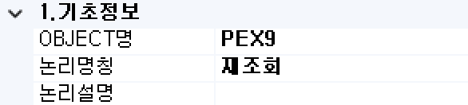

#  (PEX)  
시스템 내부의 다른 서비스 또는 외부 시스템의 인터페이스(API)를 호출하는 처리를 수행하는 기능인 컴포넌트입니다.

<!-- Remark -->
::: tip <Badge type="tip" text="Remark" vertical="middle" /> 
PEX BOC는 내부 호출의 경우 다른 메뉴에 속해 있는 서비스를 호출합니다. 
외부 호출의 경우 시스템 외부에 존재 또는 타 시스템과 연동하기 위한 API를 호출합니다.
:::
<!-- -->

## 1. PEX BOC 이미지
BOC 컴포넌트 목록에서 PEX BOC를 선택하여 Drag-Drop으로 화면작업 영역에 디자인합니다.  

 
   

다른 메뉴에 속해 있는 서비스에서 호출한 데이터 컬럼 부를 표시합니다.

## 2. PEX BOC 속성
화면작업 영역에서 PEX BOC 선택 시 속성 영역에 설정이 가능한 항목에 값을 입력합니다. 

1)<b> 1. 기초정보</b>  
  

①<b> OBJECT명 </b>  
해당 BOC가 실행된 후 해당 결과 SET을 저장할 Value Object의 명을 지정합니다. 해당 Object의 결과 Set은 그리드 형식의 Object로 구성됩니다.

②<b> 논리명칭 </b>  
BOC가 어떤 동작을 수행하는지를 간단한 명칭으로 기술합니다. 해당 명칭을 처리 흐름을 간략하게 표현할 수 있도록 기술합니다.

③<b> 논리설명 </b>  
논리명칭으로 표현하기 부족할 때 좀 더 상세히 내용을 기술합니다.

2)<b> 2. 입력부</b>  
  

①<b> CALL_TYPE </b>  
호출하는 프로세스와 동일한 시스템에 설정인 내부호출/외부호출을 선택합니다.

②<b> 대상 PACKAGE </b>  
호출되는 프로세스의 패키지명을 입력합니다.

③<b> 대상 CLASS </b>  
호출되는 프로세스의 클래스명을 입력합니다.

④<b> 대상 METHOD </b>  
호출되는 프로세스의 메소드 명으로 내부호출일 경우는 별도 팝업을 통해 전체 프로세스에서 선택 가능하고 외부 호출일 경우는 입력합니다.

⑤<b> INPUT[OBJ:Mapping] </b>  
호출하는 프로세스에서 호출되는 프로세스로 입력정보를 전달하는 매핑 구조입니다. 
OBJ는 호출하는 프로세스(자신)의 결과집합 명이고 Mapping은 호출되는 프로세스에서 입력으로 받을 START BOC의 데이터셋 명을 설정합니다.

⑥<b> OUT_OBJECT명 </b>  
호출되는 프로세스의 BOC 결과집합 중 호출하는 프로세스로 Return할 결과집합명입니다. 
Return되는 결과집합은 호출하는 당사자인 PEX BOC 자신의 Output으로 받아집니다.

⑦<b> OUT:COLUMN항목명 </b>  
OUT_OBJECT에서 컬럼을 호출 시 설정합니다

⑧<b> OUT_부가OBJECTS </b>  
호출되는 프로세스의 BOC 결과집합 중 호출하는 프로세스로 Return을 추가 결과집합명입니다. 
부가 Objects에 지정한 데이터셋 객체는 모델 디자인에서 표현은 되지 않습니다.  
Service Model의 BOC와 디자인에서 연결되는 데이터셋은 1개 즉 1:1 관계만 가능하나 내부적으로 데이터셋은 가지고 있습니다.

⑨<b> TRACE생성 </b>  
PEX BOC를 호출하는 서비스 Trace 데이터를 생성합니다

3)<b> 3. 출력부</b>  
  

①<b> 2. Record-Count/Page </b>  
Pagination 시 페이지당 레코드 건수를 설정합니다.

②<b> Column Scroll </b>  
해당 BOC 목록이 많을 경우 "true"로 설정했을 때 Display Count에서 설정한 개수만큼 보여주고 나머지 목록은 ▲▼ 버튼으로 확인할 수 있습니다.

③<b> Display Count </b>  
해당 BOC 목록이 많을 때 목록에 보이는 개수를 설정합니다.

④<b class="font18"> 화면출력유형 </b>  
- <b class="colGray">None</b> : Default
- <b class="colGray">Dataset</b> : View Designer에서 그리드 컴포넌트에 조회 시 설정합니다.
- <b class="colGray">Recode</b> : JSP 출력방식일 때 단일 컴포넌트에 조회 시 설정합니다.
- <b class="colGray">Page</b> : JSP 출력방식일 때 페이징 시 설정합니다.
- <b class="colGray">ChartLabel</b> : View Designer에서 차트 컴포넌트에 범례를 설정합니다.
- <b class="colGray">ChartData</b> : View Designer에서 차트 컴포넌트에 데이터 조회 시 설정합니다.
- <b class="colGray">Schedule</b> : View Designer에서 스케줄 컴포넌트에 조회 시 설정합니다.  

<b style="font-size: 20px">➂ 출력부</b> 
- <b style="font-size: 20px">Record-Count/Page </b> 
Pagination 시 페이지당 레코드 건수를 설정합니다.

- <b style="font-size: 20px">Column Scroll </b> 
해당 BOC 목록이 많을 때 true로 설정했을 때 Display Count에서 설정한 개수만큼 보여주고 나머지 목록은 ▲▼ 버튼으로 확인할 수 있습니다.

- <b style="font-size: 20px">Display Count </b> 
해당 BOC 목록이 많을 때 목록에 보이는 개수를 설정합니다.

- <b style="font-size: 20px">화면출력유형 </b> 
None: Default 
Dataset : View Designer에서 그리드 컴포넌트에 조회 시 설정합니다.  
Recode : JSP 출력방식일 때 단일 컴포넌트에 조회 시 설정합니다.  
Page : JSP 출력방식일 때 페이징 시 설정합니다. 
ChartLabel : View Designer에서 차트 컴포넌트에 범례를 설정합니다. 
ChartData : View Designer에는 차트 컴포넌트에 데이터 조회 시 설정합니다.  
Schedule : View Designer에서 스케줄 컴포넌트에 조회 시 설정합니다. 

4)<b> 4. 메시지부</b>  
  

①<b> 결과메시지 </b>  
해당 처리 결과에 대한 메시지를 클라이언트. 즉, 호출자에게 보낼 필요가 있을 때 정의합니다. 

5)<b> 5. 선택항목</b>  
  

①<b> Log 수준 </b>  
Debug 테스트 시에 로그 메시지를 정의할 수 있습니다. 데이터베이스 관련된 BOC는 ReturnData와 QueryData를 사용합니다.
- <b class="colGray">00. ProcessHead</b> : Seq번호, 프로세스 타입을 표시합니다.
- <b class="colGray">01. InputData</b> : 입력 데이터를 표시합니다.
- <b class="colGray">02. ReturnData</b> : 결과 데이터를 표시합니다.
- <b class="colGray">03. Middle OutputData</b> : 중간 과정 결과 데이터를 표시합니다.
- <b class="colGray">04. TabPage</b> : 탭 페이지 결과를 표시합니다.
- <b class="colGray">05. Math-Trace</b> : Math의 계산식 결과를 표시합니다.
- <b class="colGray">06. Formula-Trace</b> : Formula의 계산식 결과를 표시합니다.
- <b class="colGray">07. QueryData</b> : 값이 포함된 쿼리를 표시합니다.
- <b class="colGray">08. SCLTrace</b> : SCLT BOC의 결과를 표시합니다.
- <b class="colGray">09. PEX부가 Objects</b> : PEX BOC의 부가적인 Object의 결과를 표시합니다.
- <b class="colGray">10. 미사용</b> : 조건 컬럼 부의 계산식 값을 표시합니다.

②<b> 실행 조건 </b>  
실행 조건에 값이 있는 경우 해당 실행 조건이 "True"가 아니면 실행이 되지 않습니다.

## 3. PEX BOC 사용 예시 
1) 내부호출 사용 예  
MIUD BOC에서 IUDFALG에 따라 I ,U, D의 분기 조건에 맞는 BOC를 실행한 후 PEX BOC를 실행하게 됩니다.  
PEX BOC는 재조회를 하며 조회하는 서비스를 호출하게끔 설정되어 있습니다.
 

 &emsp;&emsp;&emsp;
 

<!-- Remark -->
::: tip <Badge type="tip" text="Remark" vertical="middle" /> 
PEX BOC를 이용하여 다른 서비스에서 만든 BOC을 호출하여 사용합니다.
:::
<!-- -->

