#  <span class="bocIcon">(SEL)</span> <br/>
DB 테이블에 대한 Select문을 처리하는 기능인 컴포넌트입니다. <br/>

<!-- Remark -->
::: tip <Badge type="tip" text="Remark" vertical="middle" /> 
SEL BOC는 Toad 등의 Query Tool에서 미리 작성된 SQL 쿼리를 복사해서 입력하는 방식으로 사용합니다.
:::
<!-- -->


## 1. SEL BOC 이미지
BOC 컴포넌트 목록에서 SEL BOC를 선택하여 Drag-Drop으로 화면작업 영역에 디자인합니다. <br/>
<div class="boc"> 
  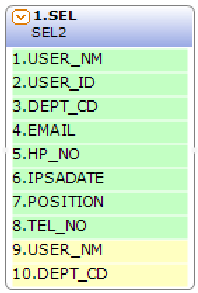 
<div style="margin-top: 103px; margin-left: 20px; font-size: 12px;">
<span class="bocEX bocG" style="margin-bottom: 56px;">데이터베이스의 데이터를 Select하는 컬럼 부를 표시합니다.</span>
<span class="bocEX bocY">데이터를 Select하기 위해서 필요로 하는 조건 컬럼 부를 표시합니다.</span></div>
</div>


## 2. SEL BOC 속성
화면작업 창에서 SEL BOC 선택 시 속성 창에 설정이 가능한 항목에 값을 입력합니다.<br/>

<span class="font20">1)<b> 1. 기초정보</b></span> <br/>
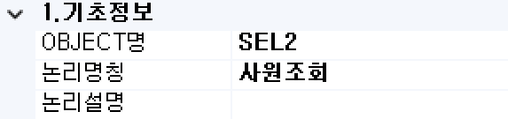 <br/>

<span class="font18">①<b> OBJECT명 </b></span> <br/>
해당 BOC가 실행된 후 해당 결과 SET을 저장할 Value Object의 명을 지정합니다. 해당 Object의 결과 Set은 그리드 형식의 Object로 구성됩니다.

<span class="font18">②<b> 논리명칭 </b></span> <br/>
BOC가 어떤 동작을 수행하는지를 간단한 명칭으로 기술합니다. 해당 명칭을 처리 흐름을 간략하게 표현할 수 있도록 기술합니다.

<span class="font18">③<b> 논리설명 </b></span> <br/>
논리명칭으로 표현하기 부족할 때 좀 더 상세히 내용을 기술합니다.

<span class="font20">2)<b> 2. 입력부</b></span> <br/>
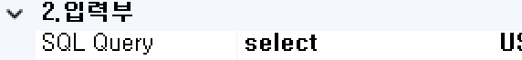 <br/>

<span class="font18">①<b> SQL Query </b></span> <br/>
DB 정보 조회를 위한 Select 문장을 설정합니다.<br/>
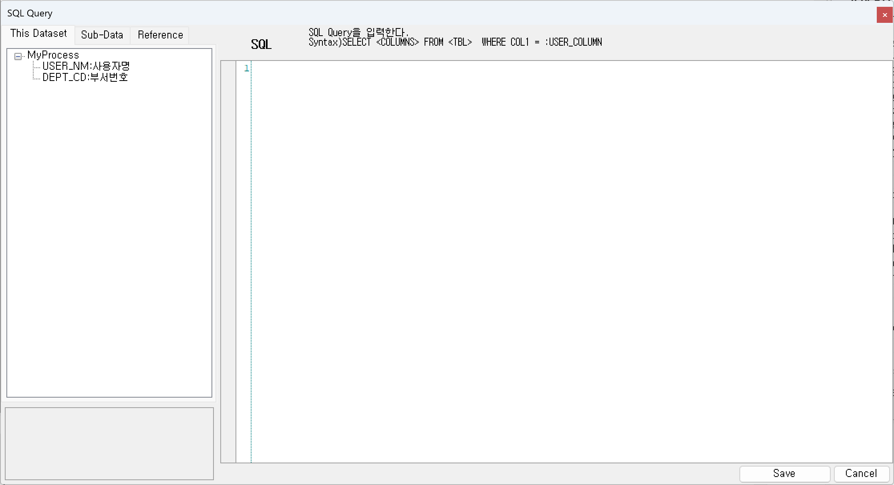 <br/>

<span class="font20">3)<b> 3. 출력부</b></span> <br/>
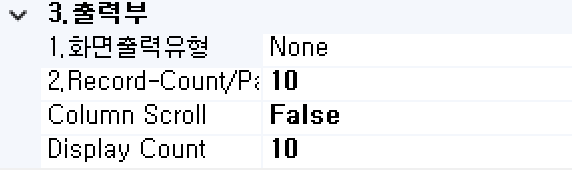 <br/>

<span class="font18">①<b> 1. 화면출력유형 </b></span> <br/>
- <b class="colGray">None</b> : Default
- <b class="colGray">Dataset</b> : View Designer에서 그리드 컴포넌트에 조회 시 설정합니다.
- <b class="colGray">Recode</b> : JSP 출력방식일 때 단일 컴포넌트에 조회 시 설정합니다.
- <b class="colGray">Page</b> : JSP 출력방식일 때 페이징 시 설정합니다.
- <b class="colGray">ChartLabel</b> : View Designer에서 차트 컴포넌트에 범례를 설정합니다.
- <b class="colGray">ChartData</b> : View Designer에서 차트 컴포넌트에 데이터 조회 시 설정합니다.
- <b class="colGray">Schedule</b> : View Designer에서 스케줄 컴포넌트에 조회 시 설정합니다.

<span class="font18">②<b> 2. Record-Count/Page </b></span> <br/>
Pagination 시 페이지당 레코드 건수를 설정합니다.

<span class="font18">③<b> Column Scroll </b></span> <br/>
해당 BOC 목록이 많을 경우 "true"로 설정했을 때 Display Count에서 설정한 개수만큼 보여주고 나머지 목록은 <span class="btnR">▲▼</span> 버튼으로 확인할 수 있습니다.

<span class="font18">④<b> Display Count </b></span> <br/>
해당 BOC 목록이 많을 때 목록에 보이는 개수를 설정합니다.

<span class="font20">4)<b> 메시지부</b></span> <br/>
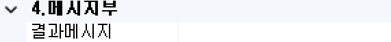 <br/>

<span class="font18">①<b> 결과메시지 </b></span> <br/>
해당 처리 결과에 대한 메시지를 클라이언트. 즉, 호출자에게 보낼 필요가 있을 때 정의합니다.<br/>

<span class="font20">5)<b> 선택항목</b></span> <br/>
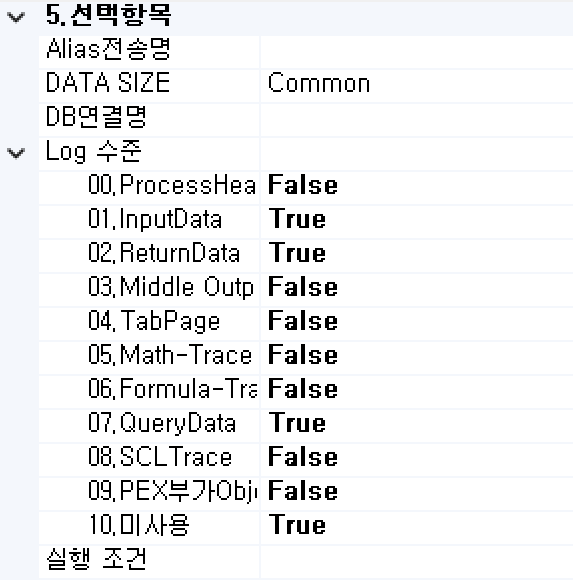 <br/>

<span class="font18">①<b> Alias전송명 </b></span> <br/>
전송하는 Object 명의 Alias를 생성합니다.

<span class="font18">②<b> DATA SIZE </b></span> <br/>
Common이 기본 설정이며, Batch 형태의 대용량 데이터 처리 시 Large로 설정합니다.

<span class="font18">③<b> DB연결명 </b></span> <br/>
기본 접속 DB는 자동 설정됩니다. 추가로 다른 DB 연결 명을 사용하여 데이터 처리의 필요성이 생기면 해당 정보에 접속 명을 등록하여 사용합니다.

<span class="font18">④<b> Log 수준 </b></span> <br/>
Debug 테스트 시에 로그 메시지를 정의할 수 있습니다. 데이터베이스 관련된 BOC는 ReturnData와 QueryData를 사용합니다.
- <b class="colGray">00. ProcessHead</b> : Seq번호, 프로세스 타입을 표시합니다.
- <b class="colGray">01. InputData</b> : 입력 데이터를 표시합니다.
- <b class="colGray">02. ReturnData</b> : 결과 데이터를 표시합니다.
- <b class="colGray">03. Middle OutputData</b> : 중간 과정 결과 데이터를 표시합니다.
- <b class="colGray">04. TabPage</b> : 탭 페이지 결과를 표시합니다.
- <b class="colGray">05. Math-Trace</b> : Math의 계산식 결과를 표시합니다.
- <b class="colGray">06. Formula-Trace</b> : Formula의 계산식 결과를 표시합니다.
- <b class="colGray">07. QueryData</b> : 값이 포함된 쿼리를 표시합니다.
- <b class="colGray">08. SCLTrace</b> : SCLT BOC의 결과를 표시합니다.
- <b class="colGray">09. PEX부가 Objects</b> : PEX BOC의 부가적인 Object의 결과를 표시합니다.
- <b class="colGray">10. 미사용</b> : 조건 컬럼 부의 계산식 값을 표시합니다.

<span class="font18">⑤<b> 실행 조건 </b></span> <br/>
실행 조건에 값이 있는 경우 해당 실행 조건이 "True"가 아니면 실행이 되지 않습니다.

## 3. SEL BOC 사용 예시 
<span class="font20">1) 파라미터 컬럼의 계산식 입력 예</span> <br/>
<div class="boxDiv">
SELECT COLUMN FROM TABLENAME WHERE COLUMN = <span class="labelR">:COLUMN</span> <br/>
[조건 파라미터 설정은 ":" 로 판단] <br />
</div> <br/>

<span class="font18">① 파라미터인 컬럼을 선택합니다.</span> <br/>
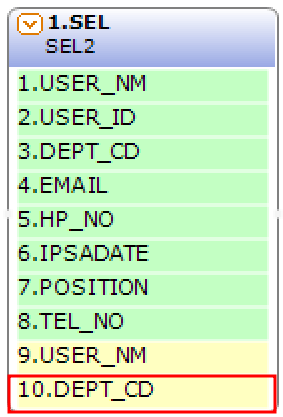 <br/>

<span class="font18">② 우측 속성에 계산식을 선택해서 나오는 <span class="spanBtn">...</span> 버튼을 클릭합니다.</span> <br/>
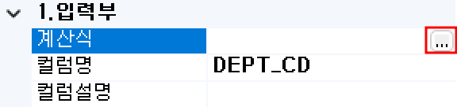 <br/>

<span class="font18">③ 수식 입력창에서 파라미터에 넣을 값이나 수식을 입력하여 저장합니다.</span> <br/>
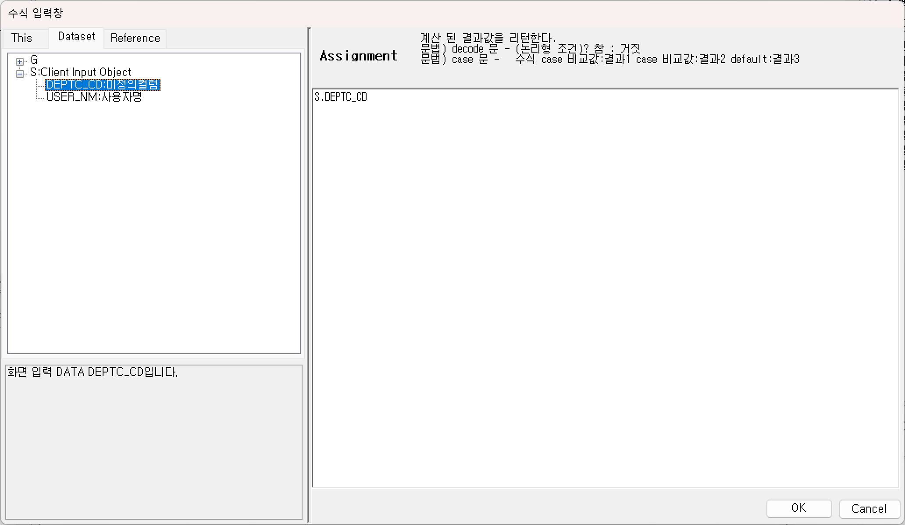 <br/>

<span class="font20">2) BLOB 컬럼의 입력 예</span> <br/>

<span class="font18">① BOC 마우스 오른쪽 클릭 후 BLOB-Column 추가를 선택합니다.</span> <br/>
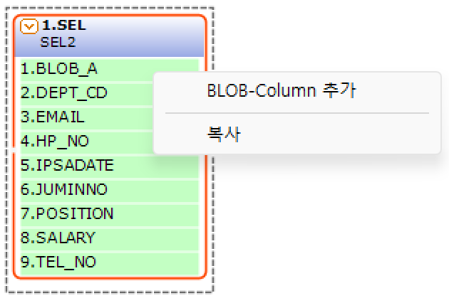 <br/>

<span class="font18">② BLOB 컬럼을 추가했을 때 기본 컬럼 ‘TEMP1’이 생성됩니다.</span> <br/>
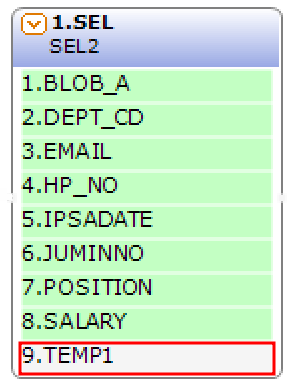 <br/>


<span class="font18">③ 컬럼명을 선택하여 나오는 <span class="spanBtn">...</span> 버튼을 클릭합니다.</span> <br/>
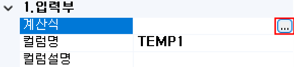 <br/>

<span class="font18">⑤ 수정할 컬럼명을 선택하여 더블클릭합니다.</span> <br/>
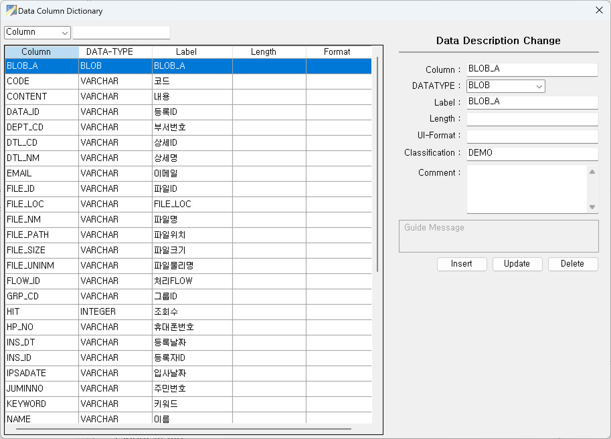 <br/>

<span class="font18">⑥ 해당 BLOB 컬럼의 파일 정보를 입력하여 파라미터 값을 세팅합니다.</span> <br/>
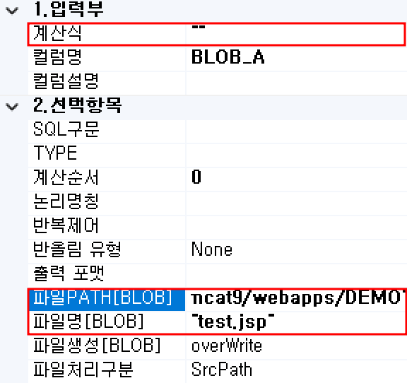 <br/>

<!-- Remark -->
::: tip <Badge type="tip" text="Remark" vertical="middle" /> 
계산식은 필수 입력 속성이므로 <span class="labelB">“”</span>를 설정합니다. BLOB 컬럼 추가 시 해당 컬럼은 파라미터 명에서 삭제됩니다. BLOB 데이터는 변숫값으로 비교가 불가능합니다.
:::
<!-- -->


<span class="font20">3) 동적 SQL 처리</span> <br/>
<div class="boxDiv">
동적 조건구문을 생성합니다. <br />
구문 : <span class="labelR">[</span> 동적처리 조건부 <span class="labelR">] {</span> 동적처리 대상 Sql-Syntax <span class="labelR">}</span>
</div> <br/>

- 조건 항목의 값이 “Null” 이거나 값의 길이가 “0”일 때 즉 empty일 때 동적처리 대상 Syntax를 SQL문에 반영하지 않습니다. <br/>
<div class="boxDiv">
구문: <span class="labelR">[</span> 항목명 <span class="labelR">] {</span> sql-syntax <span class="labelR">}</span>
</div> <br/>


<span class="spanEx">Ex) SELECT EMPLOYEE, NAME</span><br/>
<span class="spanEx">FROM TABLENAME</span><br/>
<span class="labelR">[</span><span class="spanEx"> ORD </span><span class="labelR">] {</span> <span class="spanEx">WHERE ORD = :ORD</span> <span class="labelR">}</span>

파라미터 설정 변수인 ORD 즉 “[“와 “]” 사이에 있는 ORD의 값이 “Null” 값이면 “{“ 와 “}” 사이의 구문을 삭제 처리합니다.
"Null"일 때 실행 쿼리는 “SELECT COLNM FROM TABLENAME”가 됩니다.

```xml
<!--<Ibatis 소스 생성 예>-->
<select parameterClass="java.util.HashMap" resultClass="java.util.HashMap" id="ServicelD02_SEL2">
  select
    EMPLOYEEID, NAME
  from EMPLOYEE
  <dynamic>
    <isNotEmpty property="ORD">where ORD = #ORD#</isNotEmpty>
  </dynamic>
</select>
```

- 조건 항목의 비교 연산식이 “False”일 때 동적처리 대상 Syntax를 SQL문에 반영하지 않습니다.<br/>
<div class="boxDiv">
구문: <span class="labelR">[ VAL,</span>항목명==Value<span class="labelR"> ] {</span> sql-syntax <span class="labelR">}</span>
</div> <br/>

동적 조건부에 “VAL” 키워드를 통하여 해당 조건식을 수행합니다. 조건부에는 반드시 비교연산자를 사용하여 결괏값이 Boolean 형식으로 return 되어야 합니다.

<span class="spanEx">Ex) 데이터셋으로 직접 비교 처리</span><br/>
<span class="spanEx">SELECT EMPLOYEE, NAME</span><br/>
<span class="spanEx">FROM TABLENAME</span><br/>
<span class="labelR">[ VAL,</span><span class="spanEx">S.ORD==1</span><span class="labelR"> ] {</span> <span class="spanEx">WHERE ORD = :ORD</span> <span class="labelR">}</span>

데이터셋 “S”의 ORD 변숫값이 1일 때 “{“ 와 “}” 사이의 구문을 유효 처리합니다. 연산자 태그 “VAL”을 사용하면 값을 비교 처리하고 해당 조건이 “True”일 때 유효 처리합니다.<br/> 
S.ORD의 값이 “1”이 아닐 때 또는 “Null”일 때 실행 쿼리는 “SELECT COLNM FROM TABLENAME”가 됩니다.


<style type='text/css'>
  .boc 
   { display: inline-flex; }
  .bocEX 
   { display: inline-block; padding: 4.5px; position: relative; width: 100%; color: darkslategray; }
  .bocG
   { background: rgb(195, 255, 195); }
  .bocY
   { background: rgb(255, 255, 193); }
  .bocG:after, .bocY:after
   { content: ""; border-width: 13px 0 13px 10px; border-style: solid; position: absolute; left: 100%; top: 0;  }
  .bocG:after
   { border-color: transparent transparent transparent rgb(195, 255, 195); }
  .bocY:after
   { border-color: transparent transparent transparent rgb(255, 255, 193); }
  .bocIcon
   { position: relative; top: -12px; }

  .spanBtn
   { border: 1px solid #bbb;border-radius: 4px;padding: 3px;background:white; color:dimgrey; }
  
  .btnR
   { color:#9C3B00; }
  .labelR
   { color:red; font-weight: bold; }
  .labelB
   { color:#00a4ff; font-weight: bold; }
  .spanEx
   { color: #00a4ff; }

  .font20
   { font-size: 20px }
  .font18
   { font-size: 18px }
  .font13
   { font-size: 13px }

  .boxBorder
   { border: 1px solid #bbb;  }
  .boxDiv
   { background: #6a8bad3b;padding:10px;border-radius: 4px; }

   .colGray
   { color: dimgrey; }
</style>