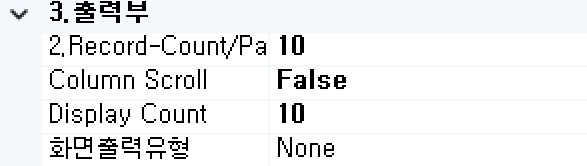
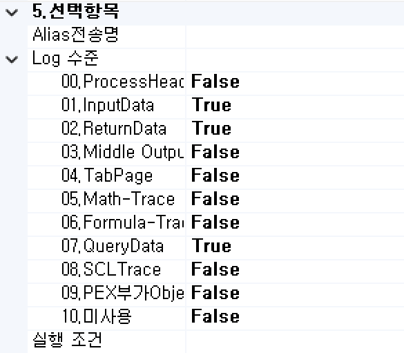

#  (SRD)  
데이터셋에서 레코드를 여러 개의 멀티 레코드로 분할하는 컴포넌트입니다.

<!-- Remark -->
::: tip <Badge type="tip" text="Remark" vertical="middle" /> 
대상 컬럼의 값을 분할 조건 컬럼으로 기준 값으로 분할합니다. 
나눈 나머지 발생 시 나머지 유효 여부를 지정합니다.
:::
<!-- -->

## 1. SRD BOC 이미지
BOC 컴포넌트 목록에서 SRD BOC를 선택하여 Drag-Drop으로 화면작업 영역에 디자인합니다.  

 
   

## 2. SRD BOC 속성
화면작업 영역에서 SRD BOC 선택 시 속성 영역에 설정이 가능한 항목에 값을 입력합니다. 

1)<b> 1. 기초정보</b>  
  

①<b> OBJECT명 </b>  
해당 BOC가 실행된 후 해당 결과 SET을 저장할 Value Object의 명을 지정합니다. 해당 Object의 결과 Set은 그리드 형식의 Object로 구성됩니다.

②<b> 논리명칭 </b>  
BOC가 어떤 동작을 수행하는지를 간단한 명칭으로 기술합니다. 해당 명칭을 처리 흐름을 간략하게 표현할 수 있도록 기술합니다.

③<b> 논리설명 </b>  
논리명칭으로 표현하기 부족할 때 좀 더 상세히 내용을 기술합니다.

2)<b> 2. 입력부</b>  
  

①<b class="font18"> 나머지유효 </b>  
나머지 발생시 나머지 레코드 생성 여부를 지정합니다.

②<b class="font18"> 분할대상COLUMN </b>  
분할 대상 컬럼을 지정합니다.

③<b class="font18"> 분할조건 </b>  
분할 처리할 기준이 되는 컬럼을 지정합니다.

④<b class="font18"> 순번COLUMN </b>  
분할 시 레코드 순번을 저장할 컬럼을 지정합니다.

⑤<b class="font18"> 입력 OBJECT </b>  
분리 대상 데이터 Object 명을 선택합니다.

3)<b> 3. 출력부</b>  
  

①<b> 2. Record-Count/Page </b>  
Pagination 시 페이지당 레코드 건수를 설정합니다.

②<b> Column Scroll </b>  
해당 BOC 목록이 많을 경우 "true"로 설정했을 때 Display Count에서 설정한 개수만큼 보여주고 나머지 목록은 ▲▼ 버튼으로 확인할 수 있습니다.

③<b> Display Count </b>  
해당 BOC 목록이 많을 때 목록에 보이는 개수를 설정합니다.

④<b class="font18"> 화면출력유형 </b>  
- <b class="colGray">None</b> : Default
- <b class="colGray">Dataset</b> : View Designer에서 그리드 컴포넌트에 조회 시 설정합니다.
- <b class="colGray">Recode</b> : JSP 출력방식일 때 단일 컴포넌트에 조회 시 설정합니다.
- <b class="colGray">Page</b> : JSP 출력방식일 때 페이징 시 설정합니다.
- <b class="colGray">ChartLabel</b> : View Designer에서 차트 컴포넌트에 범례를 설정합니다.
- <b class="colGray">ChartData</b> : View Designer에서 차트 컴포넌트에 데이터 조회 시 설정합니다.
- <b class="colGray">Schedule</b> : View Designer에서 스케줄 컴포넌트에 조회 시 설정합니다.  
Schedule : View Designer에서 스케줄 컴포넌트에 조회 시 설정합니다. 

4)<b> 5. 선택항목</b>  
  

①<b class="font18"> Alias전송명 </b>  
전송하는 Object 명의 Alias를 생성합니다.

②<b> Log 수준 </b>  
Debug 테스트 시에 로그 메시지를 정의할 수 있습니다. 데이터베이스 관련된 BOC는 ReturnData와 QueryData를 사용합니다.
- <b class="colGray">00. ProcessHead</b> : Seq번호, 프로세스 타입을 표시합니다.
- <b class="colGray">01. InputData</b> : 입력 데이터를 표시합니다.
- <b class="colGray">02. ReturnData</b> : 결과 데이터를 표시합니다.
- <b class="colGray">03. Middle OutputData</b> : 중간 과정 결과 데이터를 표시합니다.
- <b class="colGray">04. TabPage</b> : 탭 페이지 결과를 표시합니다.
- <b class="colGray">05. Math-Trace</b> : Math의 계산식 결과를 표시합니다.
- <b class="colGray">06. Formula-Trace</b> : Formula의 계산식 결과를 표시합니다.
- <b class="colGray">07. QueryData</b> : 값이 포함된 쿼리를 표시합니다.
- <b class="colGray">08. SCLTrace</b> : SCLT BOC의 결과를 표시합니다.
- <b class="colGray">09. PEX부가 Objects</b> : PEX BOC의 부가적인 Object의 결과를 표시합니다.
- <b class="colGray">10. 미사용</b> : 조건 컬럼 부의 계산식 값을 표시합니다.

③<b> 실행 조건 </b>  
실행 조건에 값이 있는 경우 해당 실행 조건이 "True"가 아니면 실행이 되지 않습니다.

## 3. SRD BOC 사용 예시 
“USE_STOCK” 컬럼의 값을 “CNT” 컬럼의 값으로 분할하여 레코드를 분할 처리합니다. 결과 데이터셋의 컬럼에서 “SEQ” 컬럼의 값은 분할 시 발생하는 순서 정보와 나머지 값을 확인할 수 있는 “0” 값으로 저장됩니다. 
SRD 형식의 BOC 사용 예는 월별 수금액을 여러 개월을 동시에 입금 시 월별로 분할 처리가 필요할 때 등에서 사용됩니다.

① Start BOC을 클릭하여 우측 속성 화면입력에 정보들을 입력합니다.  
  

② SRD BOC 우측 속성에 정보들을 입력합니다.  
 &emsp;&emsp;&emsp;
 

