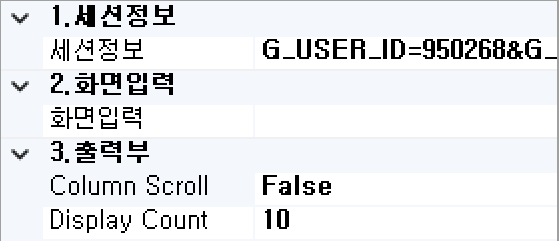

# Start BOC

 프로세스에 업무 조건을 정의하고 실행, 테스트 데이터를 입력할 수 있는 기능을 제공합니다

## 1. Start Boc

서비스가 만들어진 동시에 Start Boc도 같이 생성됩니다. 
Start BOC는 Start Business Operation Component로 모델링에 사용되는 비즈니스 업무 구성요소에 시작점을 의미합니다.

## 2. 속성
  

1)<b class="font20"> 1. 세션정보 </b>  

①<b class="font18"> 세션정보 </b>  
테스트 시 필요한 세션 정보를 입력합니다.

2)<b class="font20"> 2. 화면입력 </b>  

①<b class="font18"> 화면입력 </b>  
화면입력에서 ... 버튼을 클릭하여 In/Out Dataset Assignment 창에서 테스트 시 필요한 화면 입력정보를 입력합니다.  

3)<b class="font20"> 3. 출력부 </b>  

①<b class="font18"> Column Scroll </b>  
해당 BOC 목록이 많을 때 "true"로 설정했을 경우 Display Count에서 설정한 개수만큼 보여주고 나머지 목록은 ▲▼ 버튼으로 확인할 수 있습니다.

②<b class="font18"> Display Count</b>  
해당 BOC 목록이 많을 때 목록에 보이는 개수를 설정합니다.

## 3. In/Out Dataset Assignment 창

1) 초기 입력 값   

 (1) 컬럼 및 Recode 등록   
화면에서 입력 단위 컬럼 값을 Name 행 또는 입력 값을 R0 행에 더블클릭 후 입력할 수 있습니다.  
  

①<b class="font18"> 컬럼명 붙여넣기 </b>  
Query Developer 탭에 가서 DB를 접속하여 기본 Select문에 있는 컬럼을 복사하여 In/Out Dataset Assignment 창 컬럼 입력 부분에 마우스 오른쪽 버튼을 클릭하여 컬럼명 붙여넣기를 클릭하여 입력할 수 있습니다.

②<b class="font18"> RECORD 붙여넣기</b>  
다른 서비스에 Start BOC에 등록된 레코드 값을 Ctrl + C로 복사하여 In/Out Dataset Assignment 창 Record 입력 부분에 마우스 오른쪽 버튼을 클릭하여 RECODE 붙여넣기를 클릭하여 입력할 수 있습니다.

<!-- Remark -->
::: tip <Badge type="tip" text="Remark" vertical="middle" /> 
- <b>Column 등록 </b> 
소문자로 입력했을 경우 자동으로 대문자로 변환이 됩니다.

- <b>Recode 등록 </b> 
UI 화면에서 입력받은 컬럼값을 가정해서 테스트하기 위한 용도로 값을 입력합니다.

- 해당 View Designer에서 빌드한 UI 화면에 입력 받은 컬럼 값이 있다면 In/Out Dataset Assignment 창 하단에 From Client 버튼을 클릭하여 자동으로 UI 화면에 입력 받은 컬럼 값이 등록되고 에러가 있으면 From Client:Error 버튼을 클릭하면 에러 메시지도 확인할 수 있습니다.
:::
<!-- -->

 (2) Record 추가, 제거   

  

①<b class="font18"> Record Add</b> 
In/Out Dataset Assignment 창 상단에 Record Add 버튼을 클릭하여 Record를 추가할 수 있습니다.

<!-- Remark -->
::: tip <Badge type="tip" text="Remark" vertical="middle" /> 
각 컬럼 값이 여러 개일 때는 Record를 추가하여 테스트를 할 수 있습니다.
:::
<!-- -->

②<b class="font18"> Record Del</b> 
삭제할 Record를 클릭한 후 In/Out Dataset Assignment창 상단에 Record Del 버튼을 클릭하여 Record를 삭제할 수 있습니다.

 (3) 속성값 삭제   

 
 ▶ 
   

삭제할 해당 열을 선택한 후 Delete 키를 이용하여 해당 속성값을 삭제할 수 있습니다. 

2) Dataset 정의   
데이터 테이블 구조에 하나의 단위로 취급되는 여러 개의 컬럼으로 구성된 레코드의 집합을 의미합니다. (기본값은 S Dataset입니다.)  

 (1) <b>Dataset Add</b>   
  
dataset 입력 칸에 생성할 Dataset 명을 입력하고 Dataset Add 버튼을 클릭하면 기존에 선택된 Dataset이 복사되어서 Dataset이 생성됩니다.  

 (2) <b>Dataset Del</b>   
  
삭제할 Dataset을 선택하고 Dataset Del 버튼을 클릭하면 해당 Dataset이 삭제됩니다.

3) Case 관리   

 (1) <b>Case Add</b>   
① Case 등록 
  
선택된 Dataset이 입력 받을 때 컬럼 값을 입력하고 Case Name을 입력하여 Case Add 버튼을 클릭하면 Case를 등록할 수 있습니다.

② Case 추가 
  
Case를 추가하는 경우 컬럼 값을 다른 값으로 수정하고 Case Name을 변경하여 Case Add 버튼을 클릭하면 Case를 추가할 수 있습니다.

<!-- Remark -->
::: tip <Badge type="tip" text="Remark" vertical="middle" /> 
해당 Case를 선택할 때는 더블클릭하여 확인할 수 있습니다.
:::
<!-- -->

 (2) <b>Case Del</b>   
  
▼ 
  
삭제할 Case 명을 선택하고 Case Del 버튼을 클릭하면 해당 Case 명을 삭제할 수 있습니다.

<!-- Remark -->
::: tip <Badge type="tip" text="Remark" vertical="middle" /> 
 Case를 잘못 등록했을 경우 잘못 등록된 Case를 삭제하고 다시 등록해야합니다.
:::
<!-- -->

