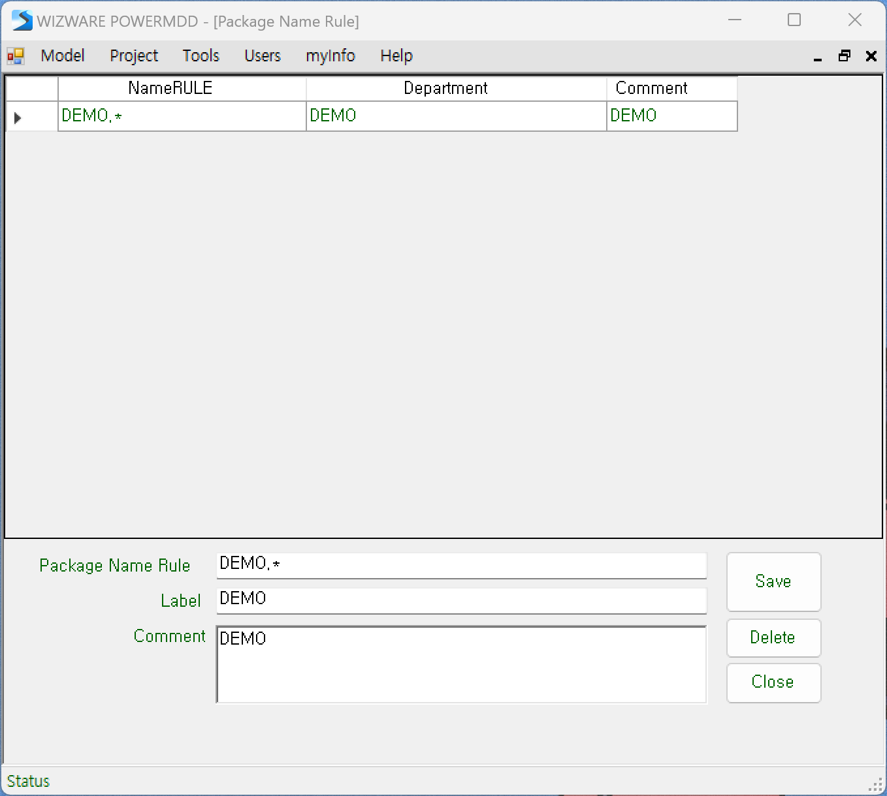

# Service Model 구성

## 1. 도구상자

save, build, test, source view, menu reload 등 POWER MDD에서 사용되는 각종 기능들을 제공합니다.
  

<b class="font20">1)  (Save) </b>  
업무서비스 Model 내용을 저장 처리합니다.

<b class="font20">2)  (ImageCapture) </b>  
Service Model 작업한 모델링을 bmp 파일 형식의 이미지로 Dump 하여 저장합니다.

<b class="font20">3)  (Logic / Physical) </b>  
논리 모델과 물리 모델을 토글 방식으로 확인할 수 있습니다. 논리 모델은 휴먼 Interface 중심으로 표현되며 물리모델은 Compute Interface 중심으로 표현됩니다.

<b class="font20">4)  (History) </b>  
서비스의 변경 및 Build 이력을 확인하고 과거 작업 상태로 모델링 작업화면을 Rollback 하여 확인할 수 있도록 지원합니다. 
<b class="font20"></b>  
- 최근 변경일자 기준으로 확인이 가능합니다. 빌드 수행 시에 빌드된 일자와 작업자 확인이 가능합니다.
- Select 버튼 클릭시 선택한 일자의 이력을 화면 작업 영역에 로딩합니다.

<b class="font20">5)  (Service Reload) </b>  
현재 저장이 되어 있는 서비스 모델을 다시 로딩 처리합니다.

<b class="font20">6)  (Test:NotCommit) </b>  
Model 테스트를 수행합니다. 수행 후에 해당 Model에서 처리한 Database Transaction을 rollback 처리하여 반복 테스트를 수행할 수 있도록 지원합니다. 테스트시에 출력되는 Trace Log의 내용은 해당 서비스별로 정의가 되어있는 로그 수준을 지정하여 확인할 수 있습니다.

<b class="font20">7)  (Test Execute) </b>  
Model 테스트를 수행합니다.  (Test:NotCommit)방법과 동일합니다. Database Transaction을 반영합니다.

<!-- Remark -->
::: tip <Badge type="tip" text="Remark" vertical="middle" /> 
 버튼과  버튼의 차이점 
 : 테스트 Debugging으로 해당 서비스를 실행하지만 데이터에는 반영하지 않습니다. 
 : 테스트 Debugging으로 해당 서비스를 실행하고 결과를 데이터베이스에 반영합니다.
:::
<!-- -->

<b class="font20">8)  (Class Execute) </b>  
Mode 클래스를 수행합니다. 수행 후에 해당 Model에서 처리한 Database Transaction을 반영합니다.

<b class="font20">9)  (build) </b>  
Service Model에서 작업한 모델링으로 자바 소스를 생성하고 해당 자바 소스를 컴파일 수행합니다.  
  

<b class="font20">10)  (Source View) </b>  
빌드한 소스의 내용을 확인할 수 있습니다. 관련 자바 파일을 확인할 수 있는 Viewer을 제공합니다. 소스는 Spring 관련 자바 소스와 Ibatis/Mybatis 형식의 의 소스 생성 형식에서 지정합니다.  

<b class="font20">11)  (Source Copy) </b>  
모델 작업 중 유사한 모델 서비스를 복사, 편집 사용하고자 할 때 이용하면 편리하게 사용할 수 있는 기능입니다. 현재 모델 서비스의 정보를 복사합니다.

<b class="font20">12)  (Service Paste) </b>  
복사한 서비스를 현재 오픈이 되어 있는 서비스에 붙여넣기 합니다.

<b class="font20">13)  (Menu Search) </b>  
Service Model에 사용된 여러 가지 정보를 기준으로 검색할 수 있는 기능을 제공합니다.  
<b class="font18">(1) IUD BOC</b>  
모델에서 사용하는 Database BOC 중 쿼리를 직접 입력하지 않고 DML을 생성해주는 BOC을 대상으로 검색 기능을 제공합니다.  
<b class="font20"> </b>

<b class="font18">(2) Query BOC</b>  
모델에서 사용하는 Database BOC 중 Query를 직접 입력하여 사용하는 BOC을 대상으로 검색 기능을 제공합니다.  

<b class="font18">(3) PEX BOC</b>  
모델에서 사용하는 Interface BOC 중 PEX를 대상으로 검색 기능을 제공합니다. PEX는 공통기능을 호출하여 사용함으로 공통기능의 변화에 따른 영향을 확인하고자 할 때 사용하면 편리합니다.  

<b class="font18">(4) Class Search</b>  
모델에서 사용하는 Class 정보를 대상으로 검색 기능을 제공합니다.  

<b class="font18">(5) Menu Event</b>  
모델에서 사용하는 Menu ID와 Service ID 정보를 대상으로 검색 기능을 제공합니다.  

<b class="font18">(6) Exception</b>  
검색한 날짜로 모델에서 작업한 서비스에서 오류 났던 메시지를 확인할 수 있습니다.  

<b class="font20">14.  (Menu Reload)</b>  
(Menu Search) 기능 또는  (recycle) 기능을 사용한 후 화면 메뉴 구조 영역을 reload하고자 할 때 사용합니다.

<b class="font20">15)  (recycle) </b>  
휴지통 기능으로 영구삭제 처리하지 않은 서비스는 화면 메뉴 구조 영역의 휴지통 메뉴에서 서비스 복원이 가능합니다.

<b class="font20">16)  (Table Dictionary) </b>  
Data Column Dictionary를 Database Table로부터 추출하여 일괄 저장할 수 있는 기능을 제공합니다. 해당 기능은 oracle, postgresql Database 이외일 때에는 지원 가능 여부 확인 필요합니다.  

<b class="font20">17)  (Column Dictionary) </b>  
Column Dictionary 관리화면으로 검색, 신규생성, 수정, 삭제 기능을 제공합니다.  

<b class="font20">18)  (Name Rule) </b>  
Package나 Class, Database 등의 Name 규칙을 설정합니다. 

<b class="font18">(1) Package Name Rule</b>  
Java Package Name 규칙을 등록합니다.  

<!-- Remark -->
::: tip <Badge type="tip" text="Remark" vertical="middle" /> <b> Name Rule 규칙 </b>
- Package Name Rule 분류 구분자 “.”을 기준으로 “*”를 사용하여 범위를 지정합니다.
- “*” 분류부터 사용자 Name 지정이 가능합니다. 
 Ex) Name1.Name2.*을 등록하는 경우 “Name1.Name2.” 으로 시작되는 Package 등록이 허용됩 
&emsp;&ensp;니다.   
 Ex) NameA.NameB.NameC을 등록하는 경우 “NameA.NameB.NameC” Package만 허용이 됩니 
&emsp;&ensp;다.   
- “*” 없이 모든 Package를 등록하게 되면 정해진 Package 이외는 사용 불가능합니다.
- 주의사항 : 잘못하면 오류메시지가 뜹니다.
:::

<b class="font18">(2) Single Name Rule</b>  
Java Class Name Rule와 Method Name Rule을 지정할 수 있습니다.  
지정 방법은 접두어와 접미어를 정의하여 해당 규칙이 허용되는 명칭만 사용 가능합니다.
 
<!-- Remark -->
::: tip <Badge type="tip" text="Remark" vertical="middle" /> <b> Name Rule 규칙 </b>
해당 접두어, 접미어를 모두 허용 시 “*” 를 지정하면 됩니다.
:::
<!-- -->

<b class="font18">(3) DataBase Connection Name</b>  
해당 업무에서 사용될 Database Connection Name을 등록 관리합니다. 
일반적으로 해당 정보는 POWER MDD.BMS 관리자가 등록해주어야 합니다.
실질적으로 사용할 데이터베이스의 연결정보는 BMS Config의 Database Resource에 등록이 되어 있는 Name 정보를 사용해야 합니다.
DX에서 서버가 정의 되어 있는 Database Resource 중 해당 프로젝트에서 사용될 Name 정보만 등록하면 됩니다. 등록된 이름은 Query Developer와 Service Model 그리고 Data Model 중 기본 데이터베이스가 아닌 별도의 데이터베이스 지정이 필요할 때 사용됩니다.  
 

<b class="font18">(4) DataBase Schema Name</b>  
해당 명칭은 Service Model의 BOC(Business Operation Component) 중에서 데이터베이스 조작 언어 중 스키마 정보를 설정하는 속성에 표현됩니다.  
사용자 편의성을 높여주고 사용자로부터 오입력 및 잘못된 값의 할당을 줄여주는 기능입니다. 
 

<b class="font20">19)  (Source Clear)</b>  
Application 생성(개발) 중 불필요한 서비스 또는 가비지 발생시 해당 Java 파일 관련 소스를 삭제 기능을 제공합니다. 삭제된 관련 소스는 Model에서 Build를 재실행하면 됩니다.

<b class="font20">20)  (FTP Server)</b>  
X

<b class="font20">21)  (User Manager)</b>  
해당 프로젝트의 사용자의 기본 정보 및 권한 ID를 할당해주는 기능을 제공합니다. 사용자 관리기능을 사용하기 위해서는 관리자 권한이 있어야 가능합니다.  
처음 사용 시에는 root 사용자를 이용하여 사용자를 생성하면 됩니다. 초기 로딩시 기존에 등록이 되어 있는 사용자 목록입니다. 등록할 때는 먼저 Clear 버튼을 클릭 후 정보를 입력할 수 있습니다. 

<!-- Remark -->
::: tip <Badge type="tip" text="Remark" vertical="middle" /> <b> 사용자 모델 권한 관리 등록 필요</b>  
사용자의 모델 접근 권한은 Normal 권한과 Common 권한을 결합한 권한이 설정됩니다. 사용자의 모델 접근 권한은 2개의 권한을 사용하여 할당이 가능합니다.
:::
<!-- -->

<b class="font20">22)  (User Function)</b>  
해당 프로젝트의 사용자의 기본 정보 및 권한 ID를 할당해주는 기능을 제공합니다. 사용자 관리기능을 사용하기 위해서는 관리자 권한이 있어야 가능합니다.  
처음 사용 시에는 root 사용자를 이용하여 사용자를 생성하면 됩니다. 초기 로딩시 기존에 등록이 되어 있는 사용자 목록입니다. 등록할 때는 먼저 Clear 버튼을 클릭 후 정보를 입력할 수 있습니다. 
  

<b class="font20">23)  (Manager Tool)</b>  
해당 프로젝트의 사용자의 기본 정보 및 권한 ID를 할당해주는 기능을 제공합니다. 사용자 관리기능을 사용하기 위해서는 관리자 권한이 있어야 가능합니다.  

<b class="font18">(1) Service-Table Manager</b>  
해당 메뉴들을 선택하고 IUD-Table List 버튼을 클릭했을 때 해당 메뉴에서 사용하는 테이블을 확인할 수 있고 해당 테이블을 선택하면 해당 테이블을 사용하고 있는 화면들을 우측 메뉴에 확인할 수 있습니다.  
  

<b class="font18">(2) Build</b>  
소스 빌드 시 여러 개의 서비스를 동시에 빌드를 처리해주는 기능입니다.  
좌측의 업무 모델 메뉴에서 빌드하고자 하는 메뉴 및 서비스를 우선 체크 표시합니다.        
Build List할 때 빌드 서비스의 Count가 너무 많이 실행하면 서버에 부담을 줄 수가 있습니다.  
빌드는 실행 내용을 선택된 서비스 별로 소스 생성/컴파일/배치를 실행합니다. 
  
<!-- Remark -->
::: tip <Badge type="tip" text="Remark" vertical="middle" /> <b>Service Model 내에 있는 빌드 기능과의 차이점</b>  
Service Model 내에 있는 빌드 기능은 서비스 모델을 사용자가 모델링 테스트 등 다양한 기능을 실행하면서 단일 서비스만 빌드가 됩니다. 
또한 빌드하는 사용자 환경에 로컬 테스트 환경이 On이 되어 있을 시에는 해당 빌드로 생성되는 Resource를 Client로 전송 기능이 동시에 실행이 됩니다. 
즉, 로컬 테스트 On 상태일 때 build는 소스생성, 컴파일, 서버배치, build Resource Clinet 배치가 수행됨으로 사용자는 자신의 PC 환경으로 테스트가 가능하게 됩니다. 
그러나 해당 일괄 빌드 기능에서는 로컬 테스트 환경이 On 되어 있어도 빌드 시 build Resource Client 배치가 수행되지 않습니다.대량 서비스 빌드시에는 해당 Resource를 Client에 배치하지 않습니다.
:::
<!-- -->

<b class="font18">(3) Menu ReBuild</b>  
메뉴 구성을 변경 또는 재구성 시 사용하는 기능으로 메뉴의 복사 및 메뉴의 이동을 처리할 수 있습니다.  
메뉴 복사 처리 시 반드시 고려해야 하는 것은 복사된 Menu는 모델 권한 처리에서 별도로 권한 등록을 해
주어야 합니다. 권한 등록하지 않으면 복사된 메뉴는 Service Model의 업무 메뉴 목록에 나타나지 않습니다.
사용법은 이동 또는 복사하고자 하는 업무 메뉴 좌측 목록에서 선택하고 이동 또는 복사하고자 하는 위치를
우측 목록에서 선택하고 해당 버튼을 선택하면 재구성 업무 메뉴 목록을 볼 수 있게 됩니다. 이후 저장 처리
를 하면 됩니다. 
우측 목록의 TreeNode중 Background Color가 노란색인 경우는 이동 또는 복사를 할 수 없습니다.  
해당 메뉴는 종단 처리 된 Menu로 하부 구조에 Menu는 올 수 없기 때문입니다. 즉, 해당 메뉴의 Child Node
는 메뉴에 올 수 없고 서비스만 등록할 수 있습니다.  
  
<!-- Remark -->
::: tip <Badge type="tip" text="Remark" vertical="middle" /> <b>사용자 모델 권한 관리 등록 필요</b>  
해당 Menu Rebuild시에는 반드시 사용자 권한 관리에서 권한 상태를 재구성하여야 합니다.  
메뉴 구성은 사용자 권한 관리와 밀접한 관계를 가지고 있습니다.  
:::
<!-- -->

<b class="font20">24)  (Expand/Collapse)</b>  
Display 기능에 대한 편의 기능을 제공합니다. 해당 기능은 토글 방식으로 지원합니다.  
- <b>Service BOC</b>  
BOC 내의 Column을 펼치기/닫기 기능을 제공합니다.

<b class="font20">25)  (undo)</b>  
서비스를 작업합니다가 이전 상태로 돌리는 기능을 제공합니다.  

<b class="font20">26)  (redo)</b>  
서비스를 최근 상태로 돌리는 기능을 제공합니다.  

## 2. 화면 메뉴 구조 영역 및 속성 영역
화면 메뉴 구조 영역은 업무 구조를 Tree View 형식으로 표현한 메뉴로 모델링의 대상이 되는 서비스의 메뉴 카테고리 영역입니다. 등록형식은 업무 메뉴와 메뉴를 구성하는 서비스로 분류됩니다. 

<b class="font20">1) 메뉴 추가/삭제</b>  
  
<b class="font18"> (1) 메뉴 추가</b>  
추가 하고자 하는 업무 Node를 선택한 후 오른쪽 마우스를 클릭하면 Context Menu가 활성 됩니다.
활성 된 메뉴에서 메뉴 추가 선택하면 됩니다.
<!-- Remark -->
::: tip <Badge type="tip" text="Remark" vertical="middle" /> 
메뉴 안에 메뉴를 추가하는 것은 가능하지만 서비스가 있는 경우에는 메뉴 추가가 안 됩니다.
:::
<!-- -->

<b class="font18">(2) 서비스 추가</b>  
추가하고자 하는 업무 Node를 선택한 후 마우스 오른쪽 버튼을 클릭하면 Context Menu가 활성 됩니다.  
활성 된 Menu에서 서비스 추가 선택하면 됩니다.
<!-- Remark -->
::: tip <Badge type="tip" text="Remark" vertical="middle" /> 
메뉴 안에 메뉴가 있는 경우에는 서비스 추가가 안 됩니다.
:::
<!-- -->

<b class="font18">(3) 삭제</b>  
삭제하고자 하는 업무 Node를 선택한 후 삭제하면 됩니다.
<!-- Remark -->
::: tip <Badge type="tip" text="Remark" vertical="middle" /> 
삭제 처리 시 삭제된 서비스 모델은  &nbsp; (Recycle)로 이동됩니다. 사용자 실수로 서비스 삭제 시에는 휴지통으로 이동한 후 해당 서비스를 복원 처리하면 됩니다.
:::
<!-- -->

<b class="font18">(4) 공통메뉴 추가</b>  
메뉴 추가 방식과 동일하며, 공통메뉴로 추가 시 Node의 아이콘으로 분류 표현됩니다.

<b class="font20">2) 메뉴 속성 설정</b>  
  

<b class="font18">(1) MENU정보</b>  
<b style="font-size: 18px"> ① MENU ID </b> 
해당 메뉴의 고유 번호입니다.

<b class="font18">(2) 기초정보</b>  
<b style="font-size: 18px"> ① LABEL</b>  
해당 메뉴의 이름을 입력합니다.

<b style="font-size: 18px"> ② ReadOnly</b>  
Tool Box > Users > User Manager의 ReadOnly 여부에 따라 서비스 모델 접근이 됩니다.

<b style="font-size: 18px"> ③ 작업완료설정</b>  
작업 완료 상태에서는 서비스 수정이 불가 처리됩니다. 해당 기능은 권한이 할당된 사용자만 변경이 가능합니다.

<b class="font18">(3) CLASS정보</b>  
<!-- Remark -->
::: tip <Badge type="tip" text="Remark" vertical="middle" /> 
CLASS 정보들을 미리 입력하는 경우 해당 메뉴 안에 서비스를 추가할 때마다 서비스 속성 창에 CLASS 정보들이 자동으로 입력됩니다.
:::
<!-- -->
<b style="font-size: 18px"> ① PACKAGE명</b>  
SYSID는 별도로 해당 프로젝트명을 설정할 경우 SYSID 태그 안에 해당 프로젝트명을 넣어 설정하고 그 이외에는 DEFAULT로 설정됩니다. 

<b style="font-size: 18px"> ② CLASS명</b>  
메소드를 분류할 수 있도록 클래스를 입력합니다.
<!-- Remark -->
::: tip <Badge type="tip" text="Remark" vertical="middle" /> 
해당 정보는 해당 Node의 Child Node가 서비스일 때 유효하며, 프레임워크 특성상 메뉴별 클래스 명은 중복되면 안 됩니다.
:::
<!-- -->

<b class="font18">(4) JSP정보</b>  
<b style="font-size: 18px"> ① JSP 경로</b>  
Return Type이 Jsp인 서비스를 소유한 Class일 때 선택적으로 사용합니다. 
<!-- Remark -->
::: tip <Badge type="tip" text="Remark" vertical="middle" /> 
해당 정보는 해당 Node의 Child Node가 서비스일 때 유효합니다.
:::
<!-- -->

<b class="font18">(5) 내용설명</b>  
<b style="font-size: 18px"> ① 첨부파일</b>  
해당 메뉴에 설계서, 의뢰서, 확인요청 등 파일들을 업로드 및 다운로드 기능입니다.
  

<b class="font20">3) 서비스 추가/삭제</b>  
<b class="font18"> (1) 메뉴에서 마우스 오른쪽 버튼을 클릭했을 때</b>  
  
<b class="font18"> ① 서비스 추가</b>  
추가하고자 하는 업무 Node를 선택한 후 마우스 오른쪽 버튼을 클릭하면 Context Menu가 활성 됩니다. 
활성 된 Menu에서 서비스 추가 선택하면 됩니다.
<!-- Remark -->
::: tip <Badge type="tip" text="Remark" vertical="middle" /> 
메뉴 안에 메뉴가 있는 경우에는 서비스 불가합니다.
:::
<!-- -->
<b class="font18"> ② 삭제</b>  
삭제하고자 하는 업무 Node를 선택한 후 삭제하면 됩니다.
 <!-- Remark -->
::: tip <Badge type="tip" text="Remark" vertical="middle" /> 
삭제 처리 시 삭제된 서비스 모델은 (recycle)로 이동됩니다. 사용자 실수로 서비스 삭제 시에는 휴지통으로 이동한 후 해당 서비스를 복원 처리하면 됩니다.
:::
<!-- -->

<b class="font180">(2) 서비스에서 마우스 오른쪽 버튼을 클릭했을 때</b>  
  
<b class="font18"> ① 삭제</b>  
삭제하고자 하는 업무 서비스를 선택한 후 오른쪽 마우스를 클릭하면 Context Menu가 활성 됩니다. 
활성 된 메뉴에서 삭제를 선택하면 됩니다.
<!-- Remark -->
::: tip <Badge type="tip" text="Remark" vertical="middle" /> 
삭제 처리 시 삭제된 서비스 모델은 (recycle)로 이동됩니다. 사용자 실수로 서비스 삭제 시에는 휴지통으로 이동한 후 해당 서비스를 복원 처리하면 됩니다.
:::
<!-- -->
<b class="font18"> ② 영구삭제</b>  
삭제 버튼과 똑같이 삭제하고자 하는 업무 서비스를 선택한 후 오른쪽 마우스를 클릭하면 Context Menu가 활성 됩니다. 활성 된 메뉴에서 영구삭제를 선택하면 됩니다. 
<!-- Remark -->
::: tip <Badge type="tip" text="Remark" vertical="middle" /> 
영구삭제 시에는 (Recycle)에서 복원이 불가능합니다.
:::
<!-- -->
<b style="font-size: 18px"> ③ Pex복사</b>  
PEX복사 기능은 Interface BOC에 있는 PEX BOC를 간편하게 사용할 수 있도록 지원하는 기능입니다. 다른 업무 서비스에서 해당 서비스를 호출하여 해당 서비스의 결과를 활용하고 싶을 때 사용하는 기능입니다. 복사 처리시 해당 서비스를 호출하기 위해 필요로 하는 정보를 복사합니다. 
복사된 서비스 정보를 이용하여 사용하고자 하는 서비스에서 PEX 붙여넣기 하면 됩니다.

<b class="font20">4) 서비스 속성 설정</b>  
  

<b class="font18">(1) MENU정보</b>  
<b class="font18"> ① MENU ID</b>  
메뉴의 고유 번호입니다.

<b class="font18">(2) 기초정보</b>  
<b class="font18"> ① LABEL</b>  
해당 서비스의 이름을 입력합니다.

<b style="font-size: 18px"> ② 서비스 ID</b>  
메뉴 안에 있는 서비스의 고유 번호입니다.
<!-- Remark -->
::: tip <Badge type="tip" text="Remark" vertical="middle" /> 
CLASS정보 안에 METHOD명을 입력시 서비스 ID는 입력한 METHOD명으로 자동 입력됩니다.
:::
<!-- -->
<b style="font-size: 18px"> ③ ALIAS</b>  
서비스 ID명 이외 업무 전체적으로 중복이 발생하지 않는 별칭을 할당 하여 사용할 수 있습니다.  
해당 ID는 Spring에서 Annotation 호출 명에 중복 방지를 위해서 사용할 수 있습니다.

<b style="font-size: 18px"> ④ ReadOnly</b>  
Tool Box > Users > User Manager의 ReadOnly 여부에 따라 서비스 모델 접근이 됩니다.

<b style="font-size: 18px"> ⑤ SaveLock</b>  
마지막으로 작업한 개발자가 Lock을 YES로 했을 경우 다른 개발자는 Lock 걸려있는데 해당 서비스를 수정하지 못합니다. 
<!-- Remark -->
::: tip <Badge type="tip" text="Remark" vertical="middle" /> 
YES로 설정한 개발자가 NO로 변경하지 않아도 Lock은 최대 하루가 지나는 경우 자동으로 NO로 변경이 됩니다.
:::
<!-- -->

<b class="font18">(3) CLASS정보</b>  
<!-- Remark -->
::: tip <Badge type="tip" text="Remark" vertical="middle" /> 
메뉴에서 CLASS 정보들을 미리 입력하는 경우 추가된 서비스 속성 창에 CLASS 정보들이 자동으로 입력됩니다.
:::
<!-- -->
<b class="font18"> ① PACKAGE명</b>  
SYSID는 별도로 해당 프로젝트명을 설정할 경우 SYSID 태그 안에 해당 프로젝트명을 넣어 설정하고 그 이외에는 DEFAULT로 설정됩니다.

<b class="font18"> ② CLASS명</b>  
메소드를 분류할 수 있도록 클래스를 입력합니다.
<!-- Remark -->
::: tip <Badge type="tip" text="Remark" vertical="middle" /> 
해당 정보는 해당 Node의 Child Node가 서비스일 때 유효하며, 프레임워크 특성상 메뉴별 클래스 명은 중복되면 안 됩니다.
:::
<!-- -->

<b class="font18">(4) JSP정보</b>  
해당 서비스의 출력유형이 JSP일 때 설정이 되어 있는 JSP 파일로 처리 결과를 Forwarding합니다. 
<b class="font18"> ① JSP 경로</b>  
Return Type이 JSP인 서비스를 소유한 클래스일 때 선택적으로 사용합니다. 단, 해당 정보는 해당 Node의 Child Node가 서비스일 때 유효합니다.

<b class="font18"> ② JSP 파일명</b>  
Return Type이 JSP일 때 해당 JSP의 파일명을 입력합니다.

<b class="font18">(5) 처리유형</b>  
해당 서비스의 출력유형이 JSP일 때 설정이 되어 있는 JSP 파일로 처리 결과를 Forwarding합니다.  
<b class="font18"> ① APPL 유형</b>  
Default 값은 Online입니다. 
Spring + ( Ibatis, Mybatis) 형식에서는 적용되지 않습니다. WizframeWork 사용 시 해당 기능이 유효합니다.

<b class="font18"> ② 출력 유형</b>  
Online 화면일 때 서비스 처리 후 결과를 Forward 하는 방식을 정의합니다. JSP 화면을 Forward하고자 할 때에는 JSP를 선택해주고, Ajax를 통하여 Data만 Client로 전송할 때에 XML로 정의하면 됩니다. XML로 처리시에는 Client와 통신하기 위한 Data Layout Interface를 적용하여야 합니다.  
해당 요소에서는 XML, Json,formated String 등 다양하게 적용할 수 있습니다.

<b class="font18">(6) 최종작업정보</b>  
서비스 Model을 변경한 최종 작업일/작업자 정보를 확인할 수 있습니다. 
<b class="font18"> ① 작업일</b>  
최근에 해당 서비스를 작업한 날짜 정보를 확인할 수 있습니다.

<b class="font18"> ② 작업자ID</b>  
최근에 해당 서비스를 작업한 개발자 ID 정보를 확인할 수 있습니다.

<b class="font18">(7) Test정보</b>  
<b class="font18"> ① TestDB</b>  
개발시 개발 DB와 운영 DB가 다를 경우 운영 DB를 등록하여 테스트를 할 수 있습니다.

