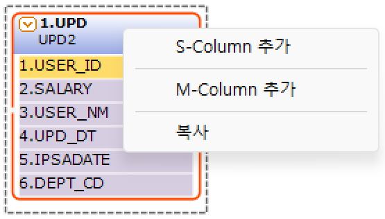
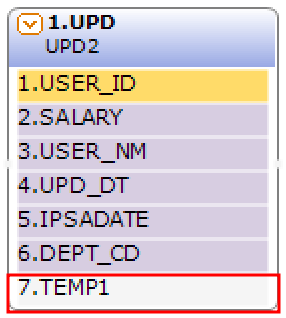
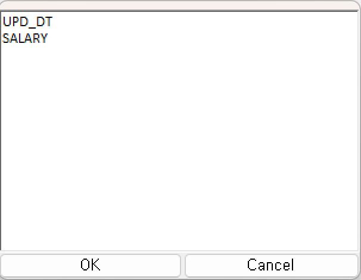
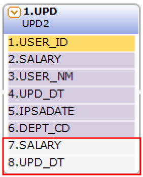

#  (UPD)  
DB 테이블에 대한 Update 처리를 수행하는 기능인 컴포넌트입니다.

<!-- Remark -->
::: tip <Badge type="tip" text="Remark" vertical="middle" /> 
UPD BOC는 쿼리를 자동 생성하며 자동 생성에 필요한 속성을 설정합니다.
:::
<!-- -->

## 1. UPD BOC 이미지
BOC 컴포넌트 목록에서 UPD BOC를 선택하여 Drag-Drop으로 화면작업 영역에 디자인합니다.  

 
   

데이터베이스의 데이터를 수정하기 위한 조건 컬럼 부를 표시합니다. Where 절의 조건으로 사용됩니다.
데이터베이스의 데이터를 수정하는 컬럼 부를 표시합니다.
입력한 값에 추가 또는 값을 변경하는 컬럼 부를 표시합니다.

## 2. UPD BOC 속성
화면작업 영역에서 UPD BOC 선택 시 속성 영역에 설정이 가능한 항목에 값을 입력합니다. 

1)<b> 1. 기초정보</b>  
  

①<b> OBJECT명 </b>  
해당 BOC가 실행된 후 해당 결과 SET을 저장할 Value Object의 명을 지정합니다. 해당 Object의 결과 Set은 그리드 형식의 Object로 구성됩니다.

②<b> 논리명칭 </b>  
BOC가 어떤 동작을 수행하는지를 간단한 명칭으로 기술합니다. 해당 명칭을 처리 흐름을 간략하게 표현할 수 있도록 기술합니다.

③<b> 논리설명 </b>  
논리명칭으로 표현하기 부족할 때 좀 더 상세히 내용을 기술합니다.

2)<b> 2. 입력부</b>  
  

①<b class="font18"> DB스키마명 </b>  
수정 대상인 데이터베이스 스키마를 입력합니다.

②<b class="font18"> 대상테이블 </b>  
수정 대상인 데이터베이스 테이블 정보를 입력합니다.

③<b class="font18"> 입력 OBJECT </b>  
수정할 입력 데이터 Object 명을 입력합니다.

④<b class="font18"> 전체항목 </b>  
수정 대상인 데이터베이스 컬럼 정보를 입력합니다.

⑤<b class="font18"> 조건항목 </b>  
수정 처리를 위해서 필요한 조건 컬럼 정보를 설정합니다.

3)<b> 3. 출력부</b>  
  

①<b> Column Scroll </b>  
해당 BOC 목록이 많을 경우 "true"로 설정했을 때 Display Count에서 설정한 개수만큼 보여주고 나머지 목록은 ▲▼ 버튼으로 확인할 수 있습니다.

②<b> Display Count </b>  
해당 BOC 목록이 많을 때 목록에 보이는 개수를 설정합니다.

③<b class="font18"> 화면출력유형 </b>  
- <b class="colGray">None</b> : Default
- <b class="colGray">Dataset</b> : View Designer에서 그리드 컴포넌트에 조회 시 설정합니다.
- <b class="colGray">Recode</b> : JSP 출력방식일 때 단일 컴포넌트에 조회 시 설정합니다.
- <b class="colGray">Page</b> : JSP 출력방식일 때 페이징 시 설정합니다.
- <b class="colGray">ChartLabel</b> : View Designer에서 차트 컴포넌트에 범례를 설정합니다.
- <b class="colGray">ChartData</b> : View Designer에서 차트 컴포넌트에 데이터 조회 시 설정합니다.
- <b class="colGray">Schedule</b> : View Designer에서 스케줄 컴포넌트에 조회 시 설정합니다.  

4)<b> 4. 메시지부</b>  
  

①<b> 결과메시지 </b>  
해당 처리 결과에 대한 메시지를 클라이언트. 즉, 호출자에게 보낼 필요가 있을 때 정의합니다. 

5)<b> 5. 선택항목</b>  
  

①<b class="font18"> Alias전송명 </b>  
전송하는 Object 명의 Alias를 생성합니다.

②<b class="font18"> BatchExecute </b>  
Batch 실행 여부를 설정합니다.

③<b class="font18"> Build Dbcheck </b>  
빌드 시 데이터베이스의 테이블 컬럼 정보와 해당 설정 정보와 비교 체크를 실행합니다.

④<b class="font18"> DB연결명 </b>  
기본 접속 DB는 자동 설정됩니다. 추가로 다른 DB 연결 명을 사용하여 데이터 처리의 필요성이 생기면 해당 정보에 접속 명을 등록하여 사용합니다.

⑤<b> Log 수준 </b>  
Debug 테스트 시에 로그 메시지를 정의할 수 있습니다. 데이터베이스 관련된 BOC는 ReturnData와 QueryData를 사용합니다.
- <b class="colGray">00. ProcessHead</b> : Seq번호, 프로세스 타입을 표시합니다.
- <b class="colGray">01. InputData</b> : 입력 데이터를 표시합니다.
- <b class="colGray">02. ReturnData</b> : 결과 데이터를 표시합니다.
- <b class="colGray">03. Middle OutputData</b> : 중간 과정 결과 데이터를 표시합니다.
- <b class="colGray">04. TabPage</b> : 탭 페이지 결과를 표시합니다.
- <b class="colGray">05. Math-Trace</b> : Math의 계산식 결과를 표시합니다.
- <b class="colGray">06. Formula-Trace</b> : Formula의 계산식 결과를 표시합니다.
- <b class="colGray">07. QueryData</b> : 값이 포함된 쿼리를 표시합니다.
- <b class="colGray">08. SCLTrace</b> : SCLT BOC의 결과를 표시합니다.
- <b class="colGray">09. PEX부가 Objects</b> : PEX BOC의 부가적인 Object의 결과를 표시합니다.
- <b class="colGray">10. 미사용</b> : 조건 컬럼 부의 계산식 값을 표시합니다.

⑥<b> 실행 조건 </b>  
실행 조건에 값이 있는 경우 해당 실행 조건이 "True"가 아니면 실행이 되지 않습니다.

## 3. UPD BOC 사용 예시 
1) 전체항목과 조건항목 속성의 입력 예  

① 우측 속성에 전체항목 또는 조건항목을 선택해서 나오는 ... 버튼을 클릭합니다.  
  

② 출력 컬럼 입력창 또는 입력 컬럼 입력창에 등록할 컬럼을 더블클릭하여 설정합니다.  
  

<!-- Remark -->
::: tip <Badge type="tip" text="Remark" vertical="middle" /> 
This탭 > INOBJECT에는 입력 OBJECT의 컬럼을 보여줍니다. INOBJECT를 더블클릭하면 입력 OBJECT에 컬럼을 모두 선택할 수 있습니다.
:::
<!-- -->

2) 데이터 변경 또는 신규 컬럼 사용 예  
  

<!-- Remark -->
::: tip <Badge type="tip" text="Remark" vertical="middle" /> 
입력 Object의 데이터에 변경 또는 입력 Object에는 존재하지 않는 신규 컬럼 발생 시 사용합니다. 사용 방법은 해당 BOC에 오른쪽 마우스 버튼을 클릭하여 컬럼을 추가합니다.
:::
<!-- -->

① S-Column 추가  
단일 컬럼을 추가합니다. 추가된 컬럼명은 기본으로 “TEMP1”이 설정됩니다. “TEMP1” 컬럼을 선택해서 컬럼명을 수정하면 됩니다. 

  

② M-Column 추가  
1개 이상의 다중 컬럼들을 추가합니다. 컬럼을 등록할 때 키보드에 있는 Enter 키 또는 “,” 로 구분해서 입력합니다.  

 &emsp;&emsp;&emsp;
 

3) Update Query 컬럼의 계산식 입력 예  

① 데이터 입력 및 변경할 컬럼을 선택합니다.  
  

② 우측 속성에 계산식을 선택해서 나오는 ... 버튼을 클릭합니다.  
  

③ 수식 입력창에서 파라미터에 넣을 값이나 수식을 입력하여 저장합니다.  
  

4) UPD 파라미터 컬럼의 SQL구문 입력  

① 파라미터인 컬럼을 클릭합니다.  
  

② 우측 속성에 SQL구문을 선택해서 나오는 ... 버튼을 클릭합니다.  
  

<!-- Remark -->
::: tip <Badge type="tip" text="Remark" vertical="middle" /> 
계산식은 필수 입력 속성이므로 “”를 설정합니다.
:::
<!-- -->

③ SQL구문 창에 해당 구문을 입력하여 저장합니다.  
  

