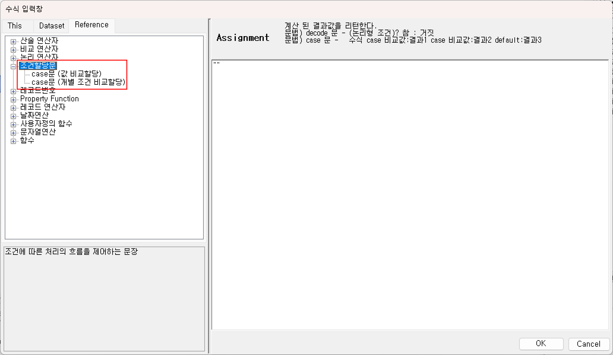
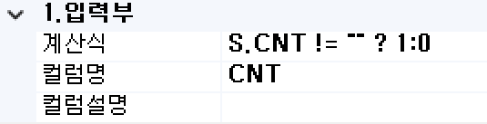
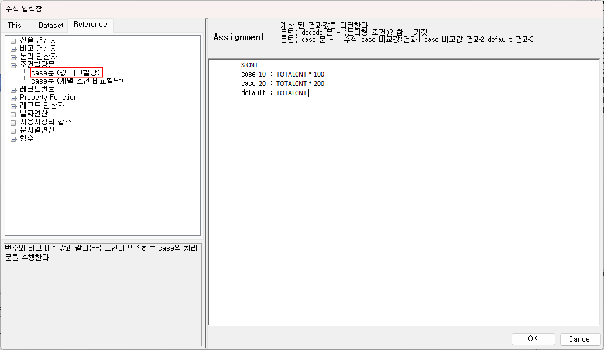
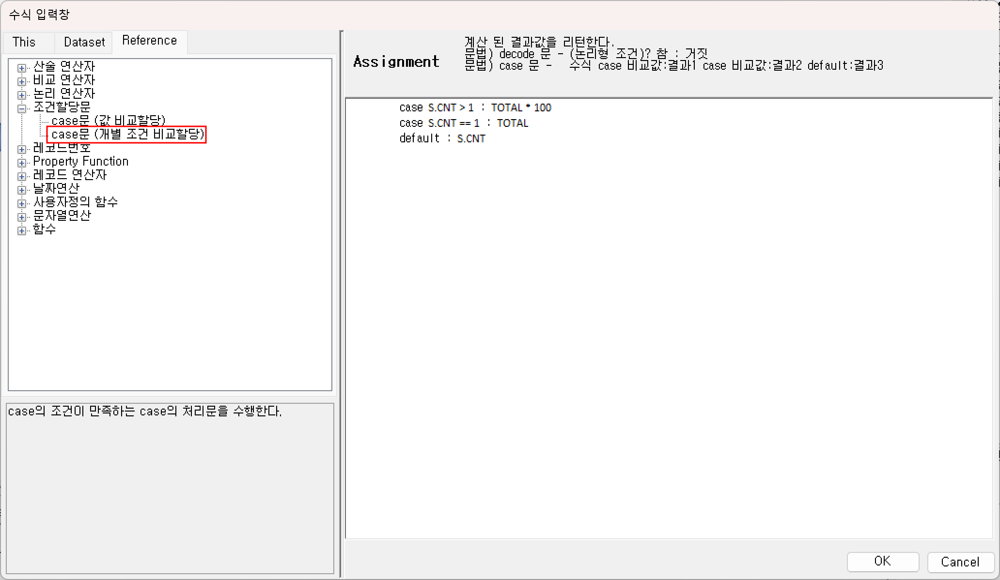

# 조건할당문

조건에 따른 처리의 흐름을 제어하는 기능을 제공합니다.
  

## 1. decode문
일반 애플리케이션의 "if.. else"와 비슷한 구조를 가지고 있으나 간단한 조건 처리시 간결하고 쉽게 사용할 수 있습니다. 해당 조건 구분의 결과가 Boolean형으로 True이면 True 구문이 실행되고 False이면 False 구문이 실행됩니다.

1) 구문형식  

조건 구문 ? True 구문 : False 구문

  

Ex) 해당 “CNT” 컬럼 계산식에 조건할당문을 활용한 값을 넣습니다.  
  

## 2. case문 
case문의 표현식은 "if.. else if.. else" 구조와 유사하며 결과 값을 추출하기 위하여 여러 가지 조건 처리가 필요할 때 사용합니다. 구문은 2가지 형식을 제공합니다.

1) <b>값 비교할당</b>  

비교변수 
case 비교값1 : 비교값1의 처리문장 
case 비교값2 : 비교값2의 처리문장 

  

변수의 값과 값을 비교하여 해당 값과 일치하면 일치되는 처리구문을 실행하여 할당합니다. 
비교변수와 case문의 비교값을 비교하여 값이 일치하면 해당 case문의 처리구문의 실행결과를 해당 계산식의 결과값이 됩니다.

Ex) 해당 “CNT” 컬럼 계산식에 조건할당문을 활용한 값을 넣습니다.  
  

2) <b>개별 조건 비교할당</b>  

case 비교조건1 : 비교조건1의 처리문장 
case 비교조건2 : 비교조건2의 처리문장 
default : 일치하는 비교조건이 없을 경우 처리문장 

  

처리는 정의되어 있는 비교구문을 순차적으로 계산하여 해당 결과가 True이면 해당 처리 구문을 생성하고 종료합니다. 앞의 비교구문에 True 요건이 없을 때에는 default 처리 구문이 최종결과 값으로 할당됩니다.

Ex) 해당 “CNT” 컬럼 계산식에 조건할당문을 활용한 값을 넣습니다.  
  

  