# 내장 함수

POWERMDD에서 연산처리 시 사용할 수 있는 Function에 대한 설명입니다.

## 1. Internal Function
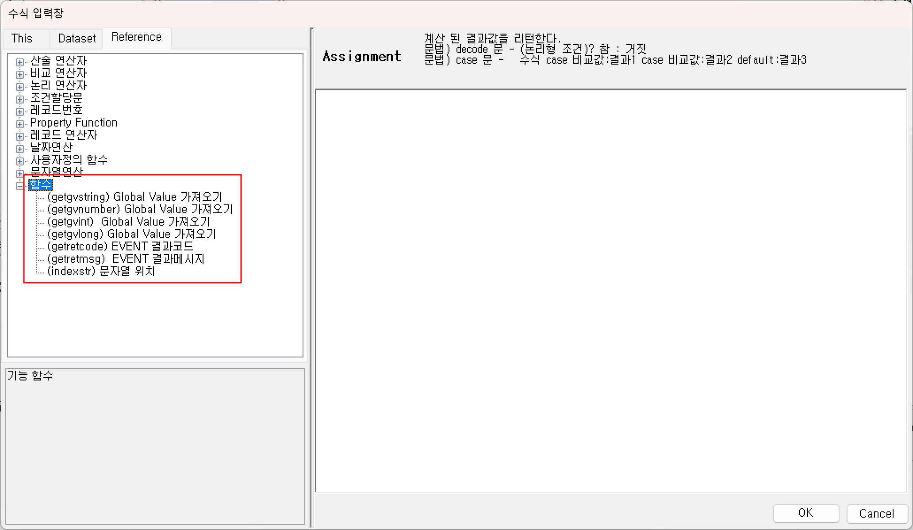  

1) GLV BOC를 이용한 Variable 값을 가져오는 Function입니다.  
값을 세팅하는 방법은 GLV BOC 사용법을 참고하면 됩니다.

①<b> (getgvstring) GLV Value 가져오기 </b>  
GLV BOC로 세팅된 값을 String 타입의 값으로 가져옵니다.

getgvstring(COLUMN)

  

<!-- Remark -->
::: tip <Badge type="tip" text="Remark" vertical="middle" /> 
return type : String 
parameter : String
:::
<!-- -->

Ex) 사용 예 
 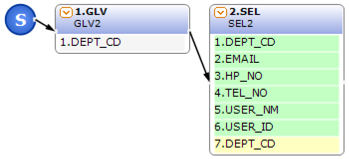  

- SEL2 계산식  
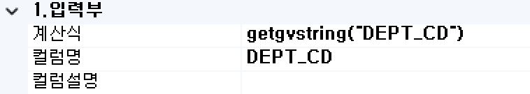  

②<b> (getgvnumber) GLV Value 가져오기 </b>  
GLV BOC로 세팅된 값을 double 타입의 값으로 가져옵니다.

getgvnumber(COLUMN)

  

<!-- Remark -->
::: tip <Badge type="tip" text="Remark" vertical="middle" /> 
return type : double 
parameter : String
:::
<!-- -->

Ex) 사용 예 
   

- SEL2 계산식  
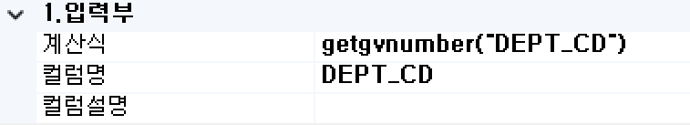  

③<b> (getgvint) GLV Value 가져오기 </b>  
GLV BOC로 세팅된 값을 int 타입의 값으로 가져옵니다.

getgvint(COLUMN)

  

<!-- Remark -->
::: tip <Badge type="tip" text="Remark" vertical="middle" /> 
return type : int 
parameter : String
:::
<!-- -->

Ex) 사용 예 
   

- SEL2 계산식  
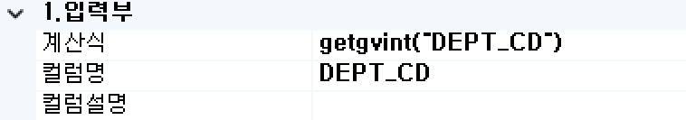  

④<b> (getgvlong) GLV Value 가져오기 </b>  
GLV BOC로 세팅된 값을 long 타입의 값으로 가져옵니다.

getgvlong(COLUMN)

  

<!-- Remark -->
::: tip <Badge type="tip" text="Remark" vertical="middle" /> 
return type : long 
parameter : String
:::
<!-- -->

Ex) 사용 예 
   

- SEL2 계산식  
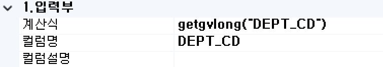  

2) 결과 코드 및 결과 메시지를 값으로 가져오는 Function입니다.  
서비스 업무 처리 시에 처리한 BOC의 루트를 확인하여 처리하고 싶을 때 사용합니다. 특정 결과 처리를 위하여 복잡한 이전 처리의 상황을 확인하고 싶을 때 각 BOC별로 처리 메시지에 상태 값을 설정하고 이후 최종 결과 처리부에서 상태 값을 비교 확인하여 처리합니다.

①<b> (getretcode) EVENT 결과코드 </b>  
최종 처리 결과 코드를 가져오는 function입니다.

getretcode()

  

<!-- Remark -->
::: tip <Badge type="tip" text="Remark" vertical="middle" /> 
return type : int 
parameter : void
:::
<!-- -->

Ex) 사용 예 
  

- SEL2 계산식  
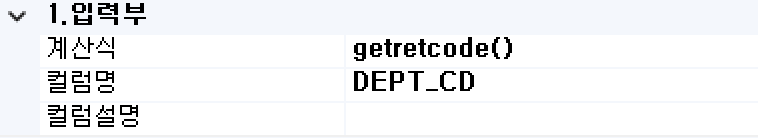  

- 테스트 결과 메시지  
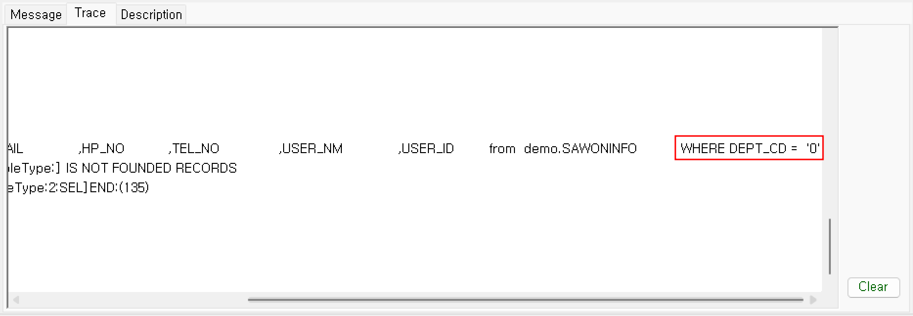  

GLV BOC에서 에러가 발생하지 않았기 때문에 getretcode()가 0으로 들어온 것을 확인할 수 있습니다.

②<b> (getretmsg) EVENT 결과메시지 </b>  
업무 처리 시 사용되는 BOC에서 생성된 결과 메시지를 가져오는 function입니다.

getretmsg()

  

<!-- Remark -->
::: tip <Badge type="tip" text="Remark" vertical="middle" /> 
return type : String 
parameter : void
:::
<!-- -->

Ex) 사용 예 
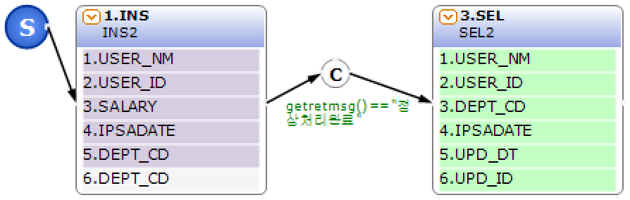  

- 계산식  
[ INS ] 
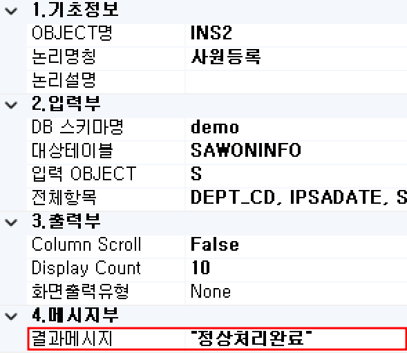  

[ CON ] 
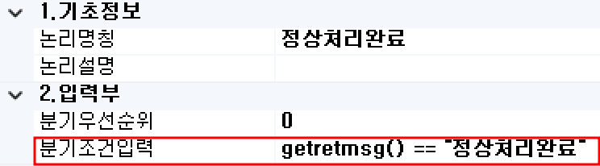  

- 테스트 결과 메시지  
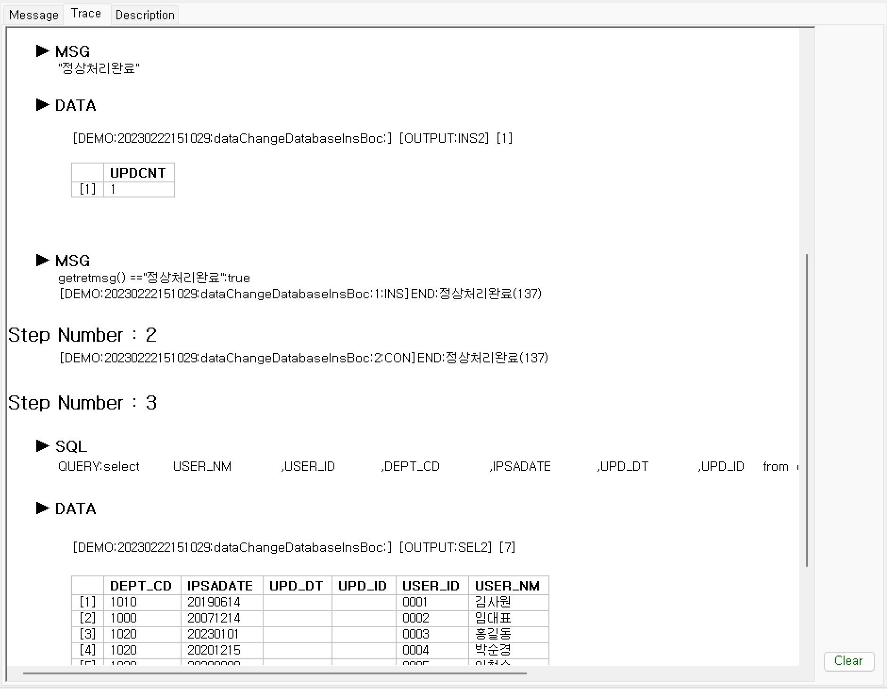  

최종 결과 처리 전 상당히 복잡한 Flow의 처리가 있을 때 처리 루트의 정보를 결과 메시지를 이용하여 취득할 수 있는 예입니다.

3) String 처리 Function, Property Function의 char를 사용하면 좀 더 편리하게 사용할 수 있습니다.  
①<b> (indexstr) 문자열 위치 </b>  
입력되는 컬럼의 값에 비교문자열의 index를 검색합니다. 만일 해당 비교문자열이 존재하지 않으면 NotFound-Return-Value의 값을 Return 합니다.

indexstr(COLUMN, 비교문자열, NotFound-Return-Value)

  

<!-- Remark -->
::: tip <Badge type="tip" text="Remark" vertical="middle" /> 
return type : String, String, int 
parameter : int
:::
<!-- -->

Ex) 사용 예 
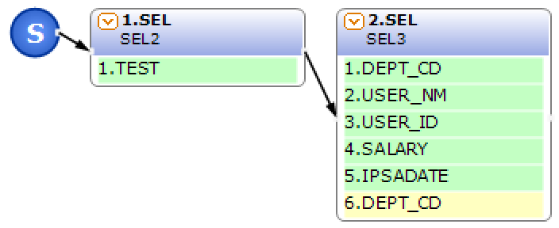  

- 계산식  
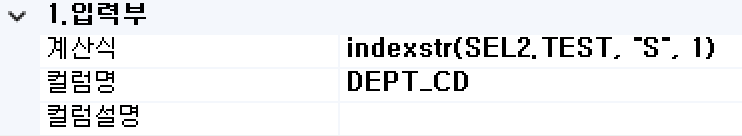  

- 테스트 결과 메시지  
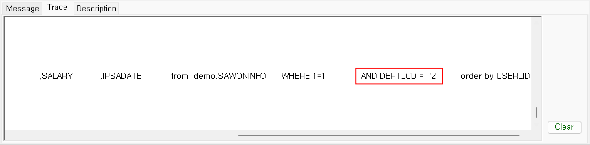  

"TEST"의 "S"는 2번째 글자이기 때문에 indexstr의 값이 2로 설정되어 DEPT_CD 컬럼 값 안에 들어간 것을 확인할 수 있습니다.

## 2. Property Function
데이터셋 또는 컬럼에 연결되어 사용되는 Property Function에 대한 설명입니다. 
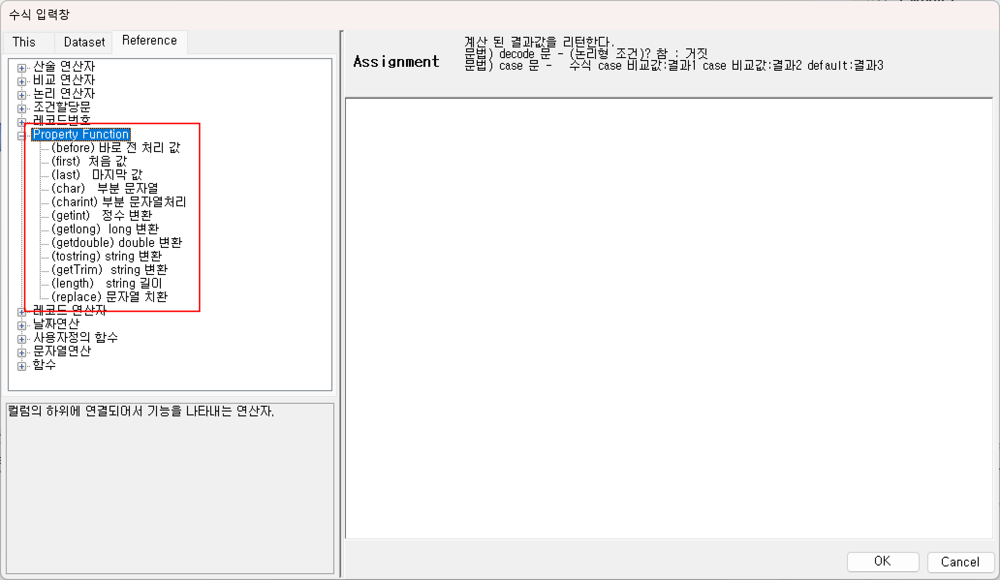  

1) 컬럼에 연결되어 있는 Property Function입니다.  

- COLUMN + “.” + function 
- DATASET + “.” + COLUMN + “.” + function

  

①<b> (char) 부분 문자열 </b>  
[ 구문 형식1 ] 
해당 Current 레코드 컬럼의 값에서 해당 범위 안에 String 값을 가져옵니다.

char(startIndex, endIndex)

  

<!-- Remark -->
::: tip <Badge type="tip" text="Remark" vertical="middle" /> 
return type : String 
parameter : String
:::
<!-- -->

Ex) 컬럼의 값이 “123”일 때 Column.char(0,1)의 결과 값은 “1”이 됩니다. 
  

- 계산식  
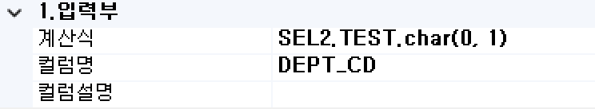  

[ 구문 형식2 ] 
해당 Current 레코드 컬럼의 값에서 시작부터 해당 문자열의 시작 index 범위에 있는 String 값을 가져옵니다.

char(비교문자열)

  

<!-- Remark -->
::: tip <Badge type="tip" text="Remark" vertical="middle" /> 
return type : String 
parameter : String
:::
<!-- -->

Ex) 컬럼의 값이 “123”일 때 Column.char(2)의 결과 값은 “3”이 됩니다. 
  

- 계산식  
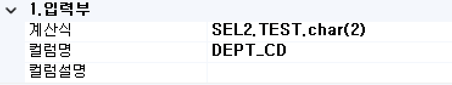  

[ 구문 형식3 ] 
해당 Current 레코드 컬럼의 값에서 검색된 비교문자열의 순번 index부터 해당 컬럼 값의 종료까지의 String 값을 가져옵니다.

char(비교문자열)

  

<!-- Remark -->
::: tip <Badge type="tip" text="Remark" vertical="middle" /> 
return type : String 
parameter : int, String
:::
<!-- -->

Ex) 컬럼의 값이 “1234”일 때 Column.char(1, “2”) 의 결과 값은 “34”가 됩니다.  
&emsp;&ensp;컬럼의 값이 “1234” 일 때 Column.char(1, “1”)의 결과 값은 “234”가 됩니다. 

  

- 계산식  
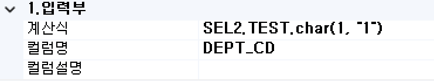  

[ 구문 형식4 ] 
해당 Current 레코드 컬럼의 값에서 검색된 start 비교문자열과 end 비교문자열 사이의 String 값을 가져옵니다.

char(start 비교문자열, end 비교문자열)

  

<!-- Remark -->
::: tip <Badge type="tip" text="Remark" vertical="middle" /> 
return type : String 
parameter : String, String
:::
<!-- -->

Ex) 컬럼의 값이 “1234”일 때 Column.char(“1”, “4”)의 결과 값은 “23”이 됩니다. 

  

- 계산식  
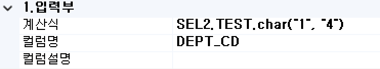  

[ 구문 형식5 ] 
시작 문자열 발생순서부터 종료 문자열 발생순서 사이 값을 가져옵니다.

char(검색된 순서, 비교문자열, 검색된 순서, 비교문자열)

  

<!-- Remark -->
::: tip <Badge type="tip" text="Remark" vertical="middle" /> 
return type : String 
parameter : int, String, int, String
:::
<!-- -->

Ex) 컬럼의 값이 “1234”일때 Column.char(1, “1” ,1, “4”)의 결과 값은 “23”이 됩니다. 

  

- 계산식  
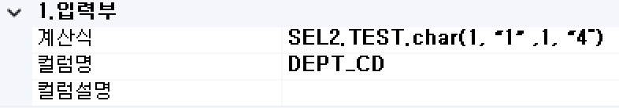  

②<b> (charint) 부분 문자열처리 </b>  

③<b> (getint) 정수 변환 </b>  

④<b> (getlong) long 변환 </b>  

⑤<b> ((getdouble) double 변환 </b>  

⑥<b> (toString) string 변환 </b>  

⑦<b> (getTrim) string 변환 </b>  

⑧<b> (length) string 길이 </b>  

⑨<b> (replace) 문자열 치환 </b>  

<b style="font-size: 20px">➁ (charint) 부분 문자열처리 </b> 

구문 1 : charint(startIndex)

해당 Current Record Column의 값에서 startindex의 string index부터 문자열 종료까지의 값을 int Type으로 가져옵니다.
                
return type : int  
parameter : int

구문 2 : charint(startIndex, endIndex)

해당 Current Record Column의 값에서 startindex에서 endindex 범위에 있는 값을 을 int Type으로 가져옵니다.
                
return type : int, int  
parameter : int

<b style="font-size: 20px">➂ (getint) 정수 변환 </b> 

구문 : getint()

해당 Current Record Column의 값을 int Type으로 return합니다.
                
return type : int  
parameter : void

<b style="font-size: 20px">➃ (getlong) long 변환 </b> 

구문 : getlong()

Current Record Column의 값을 long Type으로 return합니다.
                
return type : long  
parameter : void

<b style="font-size: 20px">➄ (getdouble) double 변환 </b> 

구문 : getdouble(roundOption, DecimalFormatString)

Current Record Column의 값을 double Type으로 return합니다.
                
return type : double  
parameter : String, String  
roundOption : “up” 또는 “dn”  
up : 소수점 반올림 처리 합니다.  
dn : 소수점 절삭처리 합니다.  
DecimalFormatString : ‘#’ 를 이용하여 format을 지정합니다.
            

   Ex) Column.getdouble (“dn”, “###.##”) : Column 값이 123.456 이면 return 값은 123.45 
      Column.getdouble (“up”, “###.##”) : Column 값이 123.456 이면 return 값은 123.46

<b style="font-size: 20px">➅ (toString) string 변환 </b> 

구문 : COLUMN_ID.toString

Current Record Column의 값을 string Type으로 return합니다.
                
return type : String  
parameter : void

<b style="font-size: 20px">➆ (getTrim) string 변환 </b> 

구문 : COLUMN_ID.getTrim

Current Record Column의 값을 string Type으로 return하면서 공백을 제거합니다.
                
return type : String  
parameter : void

<b style="font-size: 20px">➇ (length) string 길이 </b> 

구문 : length()

Current Record Column 값의 Character 길이를 return합니다.
                
return type : int  
parameter : void

   Ex) Column의 값이 “akasaka” 일 때 Column. length() 의 결과 값은 7이 됩니다.

<b style="font-size: 20px">➈ (replace) 문자열 치환 </b> 

구문 : replace(OldString, NewString)

해당 Current Record Column의 String 문자열에서 OldString을 NewString으로 변환합니다.
                
return type : String  
parameter : String, String

  