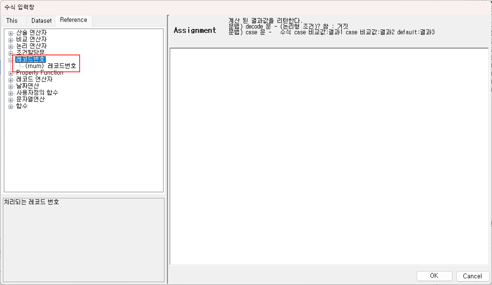
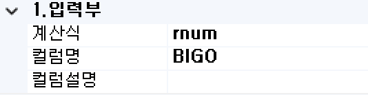
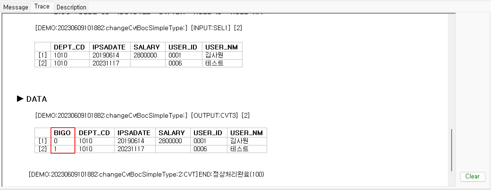

# 레코드번호

  

## 1. rnum문
데이터셋 Object 레코드들의 Current 레코드의 순서 index인 Row Number를 가져옵니다. MPD BOC에서 사용시 child 분기조건 값으로 rnum 사용시 MPD BOC의 입력 데이터셋 Object의 Current Row Index 값이 전달됩니다.

1) 구문형식  

rnum

  

Ex) 단순 "BIGO" 컬럼의 값 처리  
  

- SQL 구문  
  

- 테스트 결과 메시지  
  

  
