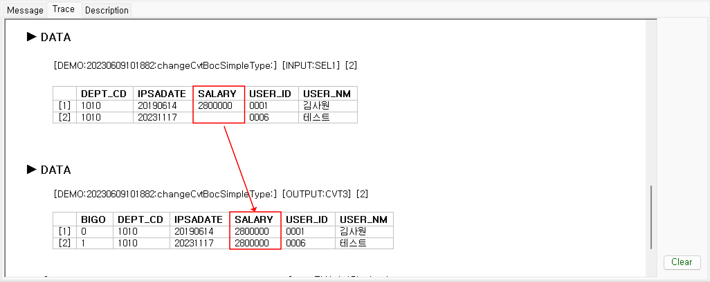

# 레코드 연산자 

  

## 1. (before) 바로 전 값
POWERMDD는 데이터셋 Object 즉 다수(0~n건)의 Input 레코드들을 Loop를 통하여 처리합니다. before 연산은 현재 처리되고 있는 Current 레코드의 이전 레코드의 값을 참조하고 싶을 때 사용힙니다. 일반적으로 누적 값을 계산하고 싶을 때에 종종 사용됩니다. before 사용시 첫 번째 레코드의 이전 레코드의 값은 empty 또는 0 값이 할당됩니다.

1) 구문 형식1  

식 before

  

계산식에 할당하는 컬럼의 이전 레코드의 값이 됩니다.

Ex) “SALARY"라는 컬럼의 값을 할당을 위하여 계산식에 before를 사용하게 되면 "SALARY" 컬럼의 이전 레코드의 "SALARY" 컬럼 값을 참조합니다.
  
   

- SQL 구문  
  

- 테스트 결과 메시지  
  

2) 구문 형식2  

COLUMN_ID.before

  

명시적으로 지정한 컬럼의 이전 레코드에 있는 값을 참조합니다.

Ex) "BIGO" 컬럼의 계산식을 보게 되면 “before + SALARY.before”가 사용됩니다. "before”는 "BIGO" 컬럼의 이전 레코드 값이 되고, “SALARY.before”는 SALARY의 이전 레코드의 값이 됩니다.
  
   

- SQL 구문  
  

- 테스트 결과 메시지  
  

## 2. (first) 처음 값
데이터셋 Object 레코드들 중 첫 번째 레코드의 값을 참조할 때 사용합니다.

DataSet.COLUMN.first

  

Ex) SEL2의 “USER_ID” 컬럼의 값들 중 첫 번째 값을 찾아 조회합니다.
  
   

- SQL 구문  
  

- 테스트 결과 메시지  
[ SEL2 ] 
  

[ SEL3 ] 
  

## 3. (last) 마지막 값
데이터셋 Object 레코드들 중 마지막 레코드의 값을 참조할 때 사용합니다.

DataSet.COLUMN.last

  

Ex) SEL2의 “USER_ID” 컬럼의 값들 중 첫 번째 값을 찾아 조회합니다.
  
   

- SQL 구문  
  

- 테스트 결과 메시지  
[ SEL2 ] 
  

[ SEL3 ] 
  

## 4. (rcount) 레코드건수
데이터셋 Object 레코드들 중 Current 레코드의 건수를 가져옵니다.

OBJECT명.rcount

  

Ex) SEL1의 레코드의 건수를 구하여 CVT BOC에서 “BIGO” 컬럼 값을 참조합니다.
  
   

- SQL 구문  
  

- 테스트 결과 메시지  
  

## 5. (~) 현재 레코드의 컬럼
POWERMDD는 데이터셋 내에서 레코드 단위로 데이터를 처리합니다. 레코드는 여러 컬럼의 값으로 구성되어 있는 집합입니다. 다수의 레코드를 Loop로 레코드를 재구성 처리할 때 입력되는 Current 레코드와 신규로 재구성되어 만들어지는 레코드가 발생하게 됩니다. 즉 신규로 재구성되는 레코드 내 컬럼들을 생성할 때 컬럼의 생성 순서가 발생합니다. 여기서 "~"를 지정한 컬럼은 신규로 재구성되는 레코드의 컬럼을 참조하게 됩니다.

~COLUMN

  

Ex) 단순 "SALARY" 컬럼의 값 처리와 "~SALARY"의 값을 비교
  
   

- SQL 구문  
[ BIGO ] 
  

[ BIGO2 ] 
  

[ SALARY ] 
  

- 테스트 결과 메시지  
  

“BIGO” 컬럼 값은 변경한 “SALARY” 컬럼 값을 참조해서 할당한 것을 볼 수 있습니다.

<!-- Remark -->
::: tip <Badge type="tip" text="Remark" vertical="middle" /> 
"~"을 사용할 경우, 출력항목 목록 부분은 재구성되는 컬럼과 계산식을 입력할 목록을 다음 목록으로 지정하고 계산식을 입력할 컬럼 계산순서 또한 다음 순서로 지정하지 않으면 테스트 또는 빌드 시 오류 생길 수 있습니다.
:::
<!-- -->

  