# 연산자 설정

값의 계산 또는 판단하기 위한 연산 처리로 산술연산, 비교연산, 논리연산, 날짜연산 기능을 제공합니다.
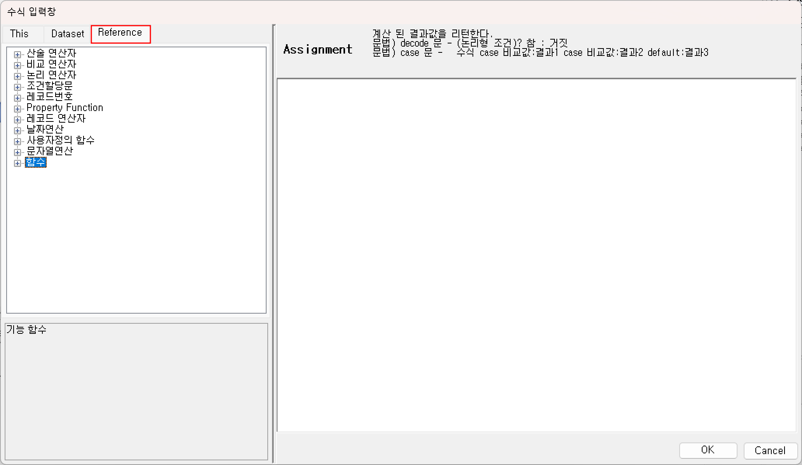  

## 1. 산술연산
1) <b>(+) 더하기</b>  
사용이 가능한 지원하는 데이터형 : 수치, String, 날짜(8자리)에 일수 더하기 
Ex) 해당 “CNT” 컬럼 계산식에 산술연산식을 활용한 값을 넣는다.  
  

2) <b>(-) 빼기</b>  
사용이 가능한 지원하는 데이터형 : 수치, 날짜(8자리)에 일수 빼기, 날짜(8자리)와 날짜(8자리) 차이 일수 
Ex) 해당 “CNT” 컬럼 계산식에 산술연산식을 활용한 값을 넣는다.  
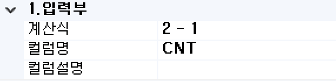  

3) <b>(/) 나누기</b>  
사용이 가능한 지원하는 데이터형 : 수치 
Ex) 해당 “CNT” 컬럼 계산식에 산술연산식을 활용한 값을 넣는다.  
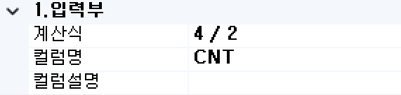  

4) <b>(*) 곱하기</b>  
사용이 가능한 지원하는 데이터형 : 수치 
Ex) 해당 “CNT” 컬럼 계산식에 산술연산식을 활용한 값을 넣는다.  
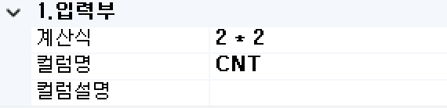  

5) <b>(%) 나머지</b>  
사용이 가능한 지원하는 데이터형 : 수치 
Ex) 해당 “CNT” 컬럼 계산식에 산술연산식을 활용한 값을 넣는다.  
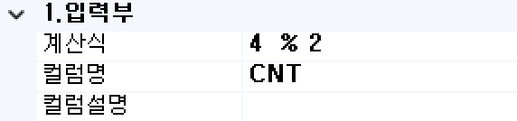  

## 2. 비교연산
1) <b>(>) 크다</b>  
사용이 가능한 지원하는 데이터형 : 수치, String 
Ex) 해당 “CNT” 컬럼 계산식에 비교연산식을 활용한 값을 넣는다.  
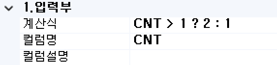  

2) <b>(<) 작다</b>  
사용이 가능한 지원하는 데이터형 : 수치, String 
Ex) 해당 “CNT” 컬럼 계산식에 비교연산식을 활용한 값을 넣는다.  
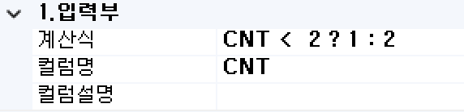  

3) <b>(==) 같다</b>  
사용이 가능한 지원하는 데이터형 : 수치 
Ex) 해당 “CNT” 컬럼 계산식에 비교연산식을 활용한 값을 넣는다.  
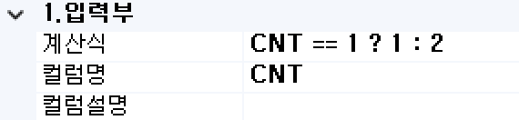  

4) <b>(>=) 크거나 같다</b>  
사용이 가능한 지원하는 데이터형 : 수치 
Ex) 해당 “CNT” 컬럼 계산식에 비교연산식을 활용한 값을 넣는다.  
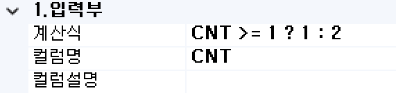  

5) <b>(<=) 작거나 같다</b>  
사용이 가능한 지원하는 데이터형 : 수치 
Ex) 해당 “CNT” 컬럼 계산식에 비교연산식을 활용한 값을 넣는다.  
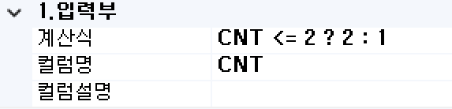  

6) <b>(!=) 같지 않다</b>  
사용이 가능한 지원하는 데이터형 : 수치 
Ex) 해당 “CNT” 컬럼 계산식에 비교연산식을 활용한 값을 넣는다.  
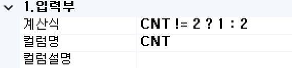  

## 3. 논리연산
1) <b>(&&) 그리고</b>  
사용이 가능한 지원하는 데이터형 : 비교연산자 및 결과값이 Boolean형 
Ex) 해당 “CNT” 컬럼 계산식에 논리연산식을 활용한 값을 넣는다.  
  

2) <b>(||) 또는</b>  
사용이 가능한 지원하는 데이터형 : 비교연산자 및 결과값이 Boolean형 
Ex) 해당 “CNT” 컬럼 계산식에 논리연산식을 활용한 값을 넣는다.  
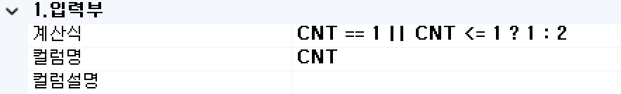  

## 4. 날짜연산
날짜연산은 일자연산기능을 제공하고 있습니다. 일자연산은 대부분 데이터베이스 시스템의 일자를 사용하기 때문에 애플리케이션 서버에서 사용하는 일자기능은 제한적인 기능만 제공하고 있습니다.  
아래 지원하는 기능 외의 다른 형식 필요 시에는 User Function 기능을 사용해야 한다.

1) 사용하는 일자 포맷  

8자리 일자 : YYYYMMDD

  

2) 일수 구분 포맷  

구분자(D:일수, M:월수, Y:년수) + #(날짜형) + 수치값 

  

Ex) 해당 “UPD_DT” 컬럼 계산식에 날짜연산을 활용한 값을 넣는다.  
- 일수(D#) 2023년 1월 1일에 1일을 더하기  
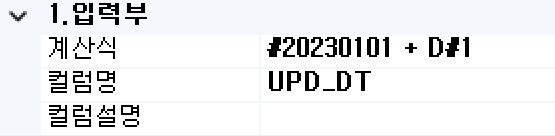  

- 월수(M#) 2023년 1월 1일에 1달을 더하기  
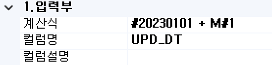  

- 년수(Y#) 2023년 1월 1일에 1년을 더하기  
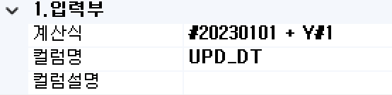  

## 5. 문자열연산
Database BOC중 DML을 처리하는 BOC에서만 사용됩니다. SQL 구문 내에 파라미터를 할당하고자 할 때 사용합니다. DML처리 하는 BOC에 컬럼 추가 시 파라미터의 값으로 SQL 구문을 처리하고자 할 때 사용합니다.

1) 사용하는 일자 포맷  

“&” + COLUMN + “;”

  

<!-- Remark -->
::: tip <Badge type="tip" text="Remark" vertical="middle" /> 
“&” 파라미터 명 시작 지시자  
“;” 파라미터 명 종료 지시자
:::
<!-- -->

Ex) 단순 IPSADATE의 값 처리  
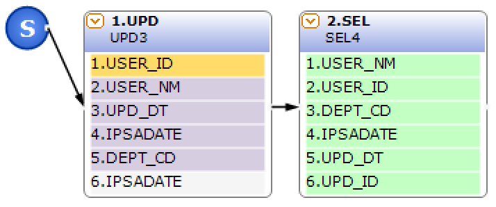  

- SQL 구문  
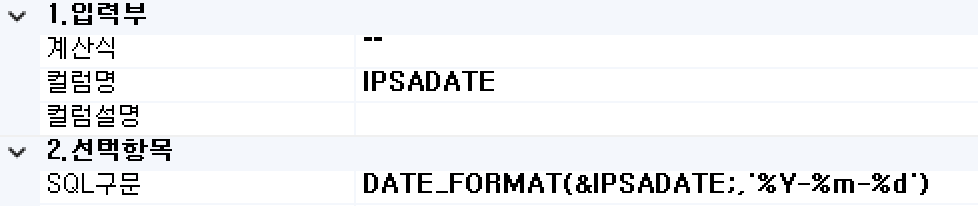  

- 테스트 결과 메시지  
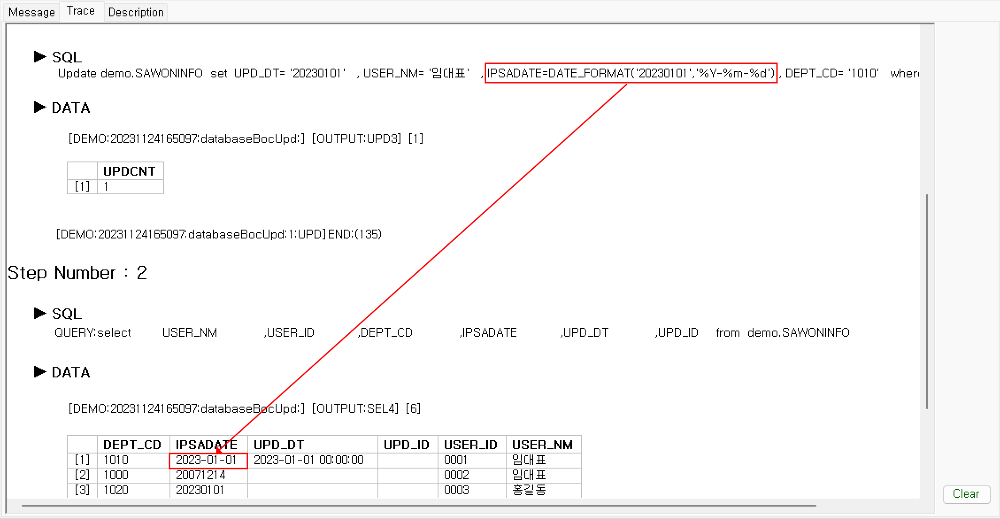  

  