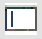
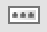

# 기본 컴포넌트

## 1. &nbsp; (Label)  
텍스트 라벨을 표시하는 컴포넌트입니다.

## 2. &nbsp; (TextBox)  
텍스트 입력을 처리하는 컴포넌트입니다.

## 3. &nbsp; (Secret)  
비밀번호 입력을 처리하는 컴포넌트입니다.

## 4. &nbsp; (button)  
버튼 처리를 수행하는 컴포넌트입니다.

## 5. &nbsp; (Calendar)  
날짜 입력을 처리하는 컴포넌트입니다.

## 6. &nbsp; (CheckBox)  
체크박스 기능을 처리하는 컴포넌트입니다.

## 7. &nbsp; (Radio)  
라디오 버튼 기능을 처리하는 컴포넌트입니다.

## 8. &nbsp; (TextArea)  
많은 양의 텍스트 입력을 처리하는 컴포넌트입니다.

## 9. &nbsp; (NumUpDown)  
수치에 대한 증감 처리를 수행하는 컴포넌트입니다.

## 10. &nbsp; (PictureBox)  
그림 이미지를 표시하는 컴포넌트입니다.

## 11. &nbsp; (FileButton)  
파일 업로드 기능을 처리하는 컴포넌트입니다.

## 12. &nbsp; (href)  
Link 기능을 처리하는 컴포넌트입니다.

