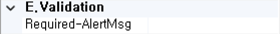

#  (Calendar)
날짜 입력을 처리하는 컴포넌트입니다.

<b style="font-size: 20px"> 1) 컴포넌트 이미지 </b>  
도구상자에서 Calendar 컴포넌트를 선택하여 화면작업 영역에 디자인합니다.  
  

<b style="font-size: 20px"> 2) 컴포넌트 속성 </b>  
화면작업 창에서 Calendar 컴포넌트 선택 시 속성 창에 설정이 가능한 항목에 값을 입력합니다.  
<b style="font-size: 18px"> (1) A.Data </b>  
  
<b style="font-size: 18px"> ① Bind:Column </b>  
UI 화면작업 창의 Dataset 탭에서 등록한 Dataset Column을 할당하는 부분입니다.  
 

<b style="font-size: 18px"> ② Dataset </b>  
할당된 Dataset 명 표시합니다.  
<!-- Remark -->
::: tip <Badge type="tip" text="Remark" vertical="middle" /> 
Dataset Bind 했을 경우 Dataset_Column으로 해당 컴포넌트 ID가 자동으로 변환됩니다.  
Ex) Dataset : S01     Column : CALENDAR  ⇒ 컴포넌트 ID : S01_CALENDAR 
:::
<!-- -->

<b style="font-size: 18px"> (1) B.CommonElement </b>  
  
<b style="font-size: 18px"> ① Disabled </b>  
값이 True이면 수정 불가능(서버 전송 불가능) False 경우 해당 속성 사용하지 않습니다. 

<b style="font-size: 18px"> ② ID </b>  
해당 컴포넌트의 ID를 설정합니다.  

<b style="font-size: 18px"> ③ Length </b>  
해당 컴포넌트의 길이를 설정합니다.
<!-- Remark -->
::: tip <Badge type="tip" text="Remark" vertical="middle" /> 
빌드를 했을 때 소스 상으로 size로 설정이 되어있지만 style 부분에 width도 같이 설정되어있어서 Length를 확인하려면 해당 컴포넌트 우측 속성에 styleOff을 true로 설정하면 해당 Length만큼 길이를 보여줍니다.
:::
<!-- -->

<b style="font-size: 18px"> ④ MaxLength </b>  
해당 컴포넌트의 최대 길이 제한을 설정합니다.  
Ex) 최대 길이가 12인 경우 12자리까지 입력이 가능합니다. 
<!-- Remark -->
::: tip <Badge type="tip" text="Remark" vertical="middle" /> 
달력 버튼을 클릭 후 날짜를 지정했을 때는 최대 길이 제한 없이 나오지만 우측 속성에 ReadOnly를 False으로 설정하고 달력을 직접 입력했을 경우 컴포넌트 최대 길이가 적용이 됩니다.
:::
<!-- -->
<b style="font-size: 18px"> ⑤ NavIndex </b>  
Index 값을 지정 후 Tab 키를 누르면 오름차순으로 이동하게 됩니다.

<b style="font-size: 18px"> ⑥ ReadOnly </b>  
값이 True이면 포커스는 잡히지만 수정은 불가능합니다. 
<!-- Remark -->
::: tip <Badge type="tip" text="Remark" vertical="middle" /> 
해당 컴포넌트에 직접 값을 입력할 때는 수정이 불가능하지만 버튼 클릭 후 값을 생성했을 때는 값을 수정이 가능합니다.
:::
<!-- -->
<b style="font-size: 18px"> ⑦ Text-Align </b>  
입력한 텍스트 정렬을 설정합니다.  

<b style="font-size: 18px"> ⑧ Value </b>  
해당 컴포넌트의 들어가는 값을 설정합니다. 

<b style="font-size: 18px"> ⑨ Visible </b>  
해당 컴포넌트를 화면에 보여줄지에 대한 여부를 설정합니다. 
<!-- Remark -->
::: tip <Badge type="tip" text="Remark" vertical="middle" /> 
달력 버튼을 히든 처리하려면 우측 속성에 ButtonShow 속성을 False로 지정해야합니다.
:::
<!-- -->
<b style="font-size: 18px"> (2) C.ControlElement </b>  
   
<b style="font-size: 18px"> ① ButtonShow </b>  
해당 컴포넌트 버튼을 나오게 할지 설정합니다. 

<b style="font-size: 18px"> ② ButtonText </b>  
해당 컴포넌트 버튼의 텍스트 명을 설정합니다.  

<b style="font-size: 18px"> ③ ChangeMonth </b>  
월을 변경 가능에 대한 여부를 설정합니다. 

<b style="font-size: 18px"> ④ ChangeYear </b>  
연도를 변경 가능에 대한 여부를 설정합니다. 

<b style="font-size: 18px"> ⑤ CloseText </b>  
닫기 버튼의 텍스트 명을 설정합니다. 

<b style="font-size: 18px"> ⑥ CurrentText </b>  
현재 날짜 버튼 텍스트 명을 설정합니다. 

<b style="font-size: 18px"> ⑦ Date-Format </b>  
Date 데이터 포맷을 설정합니다.  

<b style="font-size: 18px"> ⑧ ImageButtonPath </b>  
해당 컴포넌트 버튼의 이미지 경로를 설정합니다. Ex) /img/test/calendar2.png  

<b style="font-size: 18px"> ⑨ Lang_Type </b>  
영어 또는 한국어 달력을 설정합니다. 

<b style="font-size: 18px"> ⑩ ShowButtonPanel </b>  
달력 하단 today, close 버튼 유무를 설정합니다.  

<b style="font-size: 18px"> ⑪ YearMaxRange </b>  
연도 최대 범위를 설정합니다. 

<b style="font-size: 18px"> ⑫ YearMinRange </b>  
연도 최소 범위를 설정합니다. 

<b style="font-size: 18px"> ⑬ YMD_Format </b>  
날짜 포맷을 설정합니다.  

<b style="font-size: 18px"> (3) E.Validation </b>  
   
<b style="font-size: 18px"> ① Required-AlertMsg </b>  
해당 컴포넌트의 값을 입력하지 않았을 때 발생 되는 메시지 내용을 설정합니다. (submit(debug, requiredmsg)할 때 requiredmsg를 true로 설정합니다.)

<b style="font-size: 20px"> 3) 컴포넌트 이벤트 </b>  
   
<b style="font-size: 18px"> (1) 1.MouseEvent </b>  
<b style="font-size: 18px"> ① OnClick </b>  
마우스를 클릭할 때 발생하는 이벤트입니다.  
<b style="font-size: 18px"> ② OnMosueDown </b>  
마우스 버튼을 누를 때 발생하는 이벤트입니다.  
<b style="font-size: 18px"> ③ OnMosueMove </b>  
마우스를 움직일 때 발생하는 이벤트입니다.  
<b style="font-size: 18px"> ④ OnMosueOut </b>  
마우스가 요소를 벗어날 때 발생하는 이벤트입니다.  
<b style="font-size: 18px"> ⑤ OnMosueOver </b>  
마우스가 요소 안에 들어올 때 발생하는 이벤트입니다.  
<b style="font-size: 18px"> ⑥ OnMosueUp </b>  
마우스 버튼을 뗄 때 발생하는 이벤트입니다.  

<b style="font-size: 18px"> (2) 2.KeyEvent </b>  
<b style="font-size: 18px"> ① OnBlur </b>  
포커스를 잃었을 때 발생하는 이벤트입니다.  
<b style="font-size: 18px"> ② OnChange  </b>  
입력필드의 값이 바뀐 후 포커스를 잃었을 때 발생하는 이벤트입니다.  
<b style="font-size: 18px"> ③ OnFocus </b>  
포커스가 잡혔을 때 발생하는 이벤트입니다.  
<b style="font-size: 18px"> ④ OnKeyDown </b>  
키를 눌렀을 때 발생하는 이벤트입니다.  
<b style="font-size: 18px"> ⑤ OnKeypress </b>  
키를 누르고 있는 중 발생하는 이벤트입니다.  
<b style="font-size: 18px"> ⑥ OnKeyUp </b>  
키를 눌렀다가 뗄 때 발생하는 이벤트입니다.  
<b style="font-size: 18px"> ⑦ OnSelect </b>  
마우스로 입력된 텍스트를 드래그했을 때 발생하는 이벤트입니다.  
