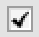
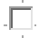
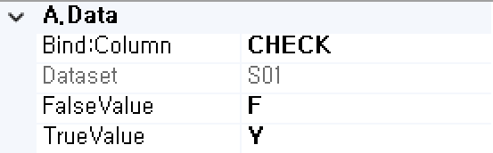
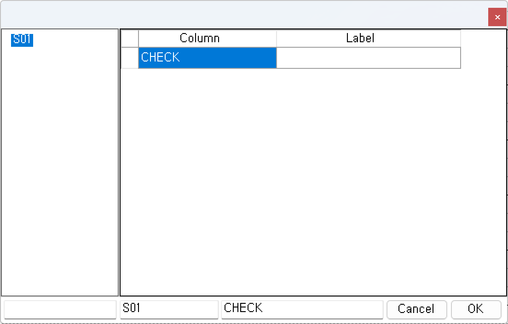
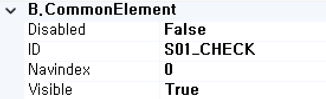
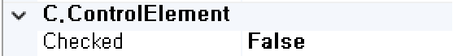
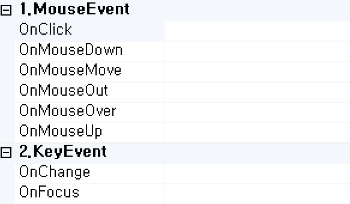

#  (CheckBox)
체크박스 기능을 처리하는 컴포넌트입니다.

<b style="font-size: 20px"> 1) 컴포넌트 이미지 </b>  
도구상자에서 CheckBox 컴포넌트를 선택하여 화면작업 영역에 디자인합니다.  
  

<b style="font-size: 20px"> 2) 컴포넌트 속성 </b>  
화면작업 창에서 CheckBox 컴포넌트 선택 시 속성 창에 설정이 가능한 항목에 값을 입력합니다.  
<b style="font-size: 18px"> (1) A.Data </b>  
  
<b style="font-size: 18px"> ① Bind:Column </b>  
UI 화면작업 창의 Dataset 탭에서 등록한 Dataset Column을 할당하는 부분입니다.  
 

<b style="font-size: 18px"> ② Dataset </b>  
할당된 Dataset 명 표시합니다.  

<b style="font-size: 18px"> ③ FalseValue </b>  
해당 컴포넌트를 체크하지 않았을 때의 값을 설정합니다. 

<b style="font-size: 18px"> ④ TrueValue </b>  
해당 컴포넌트를 체크했을 때의 값을 설정합니다. 
<!-- Remark -->
<<<<<<< HEAD
::: details <Badge type="tip" text="Remark" vertical="middle" /> 
=======
::: tip <Badge type="tip" text="Remark" vertical="middle" /> 
>>>>>>> c7bdfee358fbef77e02c35739c51a0da2dd6c2aa
Dataset Bind 했을 경우 Dataset_Column으로 해당 컴포넌트 ID가 자동으로 변환됩니다.  
Ex) Dataset : S01     Column : CHECK  ⇒ 컴포넌트 ID : S01_CHECK 
:::
<!-- -->

<b style="font-size: 18px"> (1) B.CommonElement </b>  
  
<b style="font-size: 18px"> ① Disabled </b>  
값이 True이면 수정 불가능(서버 전송 불가능) False 경우 해당 속성 사용하지 않습니다. 

<b style="font-size: 18px"> ② ID </b>  
해당 컴포넌트의 ID를 설정합니다.  

<b style="font-size: 18px"> ③ NavIndex </b>  
Index 값을 지정 후 Tab 키를 누르면 오름차순으로 이동하게 됩니다.

<b style="font-size: 18px"> ④ Visible </b>  
해당 컴포넌트를 화면에 보여줄지에 대한 여부를 설정합니다. 

<b style="font-size: 18px"> (2) C.ControlElement </b>  
   
<b style="font-size: 18px"> ① Checked </b>  
 해당 컴포넌트의 초기값을 체크 상태 여부를 설정합니다. 

<b style="font-size: 20px"> 3) 컴포넌트 이벤트 </b>  
   
<b style="font-size: 18px"> (1) 1.MouseEvent </b>  
<b style="font-size: 18px"> ① OnClick </b>  
마우스를 클릭할 때 발생하는 이벤트입니다.  
<b style="font-size: 18px"> ② OnMosueMove </b>  
마우스를 움직일 때 발생하는 이벤트입니다.  
<b style="font-size: 18px"> ③ OnMosueOut </b>  
마우스가 요소를 벗어날 때 발생하는 이벤트입니다.  
<b style="font-size: 18px"> ④ OnMosueOver </b>  
마우스가 요소 안에 들어올 때 발생하는 이벤트입니다.  
<b style="font-size: 18px"> ⑤ OnMosueUp </b>  
마우스 버튼을 뗄 때 발생하는 이벤트입니다.

<b style="font-size: 18px"> (2) 2.KeyEvent </b>  
<b style="font-size: 18px"> ① OnChange </b>  
체크했을 때 발생하는 이벤트입니다.  
<b style="font-size: 18px"> ② OnFocus </b>  
포커스가 잡혔을 때 발생하는 이벤트입니다.  
