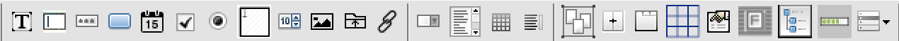
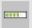

# 컴포넌트
 

## 1. 기본 컴포넌트
<b class="font20"> 1\) &nbsp; (Label) </b>  
텍스트 라벨을 표시하는 컴포넌트입니다.

<b class="font20"> 2\) &nbsp; (TextBox) </b>  
텍스트 입력을 처리하는 컴포넌트입니다.

<b class="font20"> 3\) &nbsp; (Secret) </b>  
비밀번호 입력을 처리하는 컴포넌트입니다.

<b class="font20"> 4\) &nbsp; (button) </b>  
버튼 처리를 수행하는 컴포넌트입니다.

<b class="font20"> 5\) &nbsp; (Calendar) </b>  
날짜 입력을 처리하는 컴포넌트입니다.

<b class="font20"> 6\) &nbsp; (CheckBox) </b>  
체크박스 기능을 처리하는 컴포넌트입니다.

<b class="font20"> 7\) &nbsp; (Radio) </b>  
라디오 버튼 기능을 처리하는 컴포넌트입니다.

<b class="font20"> 8\) &nbsp; (TextArea) </b>  
많은 양의 텍스트 입력을 처리하는 컴포넌트입니다.

<b class="font20"> 9\) &nbsp; (NumUpDown) </b>  
수치에 대한 증감 처리를 수행하는 컴포넌트입니다.

<b class="font20"> 10\) &nbsp; (PictureBox) </b>  
그림 이미지를 표시하는 컴포넌트입니다.

<b class="font20"> 11\) &nbsp; (FileButton) </b>  
파일 업로드 기능을 처리하는 컴포넌트입니다.

<b class="font20"> 12\) &nbsp; (href) </b>  
Link 기능을 처리하는 컴포넌트입니다.

## 2. 리스트 컴포넌트
<b class="font20"> 1\) &nbsp; (ComboBox) </b>  
콤보박스 기능을 처리하는 컴포넌트입니다. 

<b class="font20"> 2\) &nbsp; (ListBox) </b>  
리스트박스 기능을 처리하는 컴포넌트입니다.

<b class="font20"> 3\) &nbsp; (grid) </b>  
테이블 형태의 데이터 처리를 수행하는 컴포넌트입니다.

<b class="font20"> 4\) &nbsp; (DataList) </b>  
검색창의 자동완성 기능을 처리하는 컴포넌트입니다.  
(검색용 텍스트 박스의 list 속성에 설정됩니다.)

## 3. 그룹 컴포넌트
<b class="font20"> 1\) &nbsp; (groupbox) </b>  
여러 개의 Control을 그룹으로 묶어서 표시하는 컴포넌트입니다.

<b class="font20"> 2\) &nbsp; (SplitGroupBox) </b>  
컨테이너의 영역을 그룹으로 묶어서 표시하는 컴포넌트입니다.

<b class="font20"> 3\) &nbsp; (Tab) </b>  
탭 기능을 처리하는 컴포넌트입니다.

<b class="font20"> 4\) &nbsp; (TableLayout) </b>  
테이블 형태로 Layout을 표시하는 컴포넌트입니다.

<b class="font20"> 5\) &nbsp; (user/svg Control) </b>  
사용자 정의 기능을 처리하는 컴포넌트입니다.

<b class="font20"> 6\) &nbsp; (IFrame) </b>  
IFrame 기능을 처리하는 컴포넌트입니다.

<b class="font20"> 7\) &nbsp; (TreeView) </b>  
계층 구조를 가지는 데이터를 Tree 형태로 표시하는 컴포넌트입니다.

<b class="font20"> 8\) &nbsp; (Progress) </b>  
진행 정도 나타내는 바 형태로 표시하는 컴포넌트입니다.

<b class="font20"> 9\) &nbsp; (Component) </b>  

## 4. 기타 컴포넌트
<b style="font-size: 18px"> 1\) &nbsp; (schedule) </b>  
&nbsp; 달력 기반의 스케쥴 관리기능을 처리하는 컴포넌트입니다.  
<b style="font-size: 18px"> 2\) &nbsp; (HtmlEdit) </b>  
&nbsp; 웹기반의 Html에디터 기능을 처리하는 컴포넌트입니다.  
<b style="font-size: 18px"> 3\) &nbsp; (Chart) </b>  
&nbsp; 다양한 Chart 기능을 처리하는 컴포넌트입니다.  
<b style="font-size: 18px"> 4\) &nbsp; (Dyn-Accordion) </b>  
&nbsp; 계층 구조를 가지는 데이터를 동적으로 표시하는 컴포넌트입니다.  

