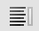
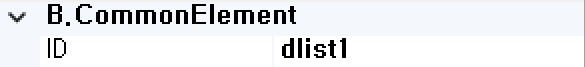
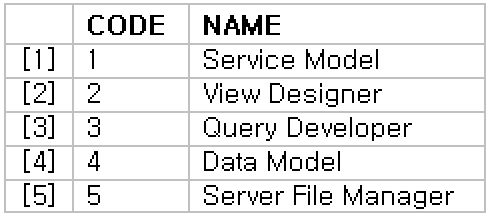

#  (DataList)
검색창의 자동완성 기능을 처리하는 컴포넌트입니다. (검색용 텍스트 박스의 list 속성에 설정됩니다.) 

<b style="font-size: 20px"> 1) 컴포넌트 이미지 </b>  
도구상자에서 DataList 컴포넌트를 선택하여 화면작업 영역에 디자인합니다.  
  

<b style="font-size: 20px"> 2) 컴포넌트 속성 </b>  
화면작업 창에서 DataList 컴포넌트 선택 시 속성 창에 설정이 가능한 항목에 값을 입력합니다.  
<b style="font-size: 18px"> (1) A.Data </b>  
 

<b style="font-size: 18px"> ① Item:Dataset </b>  
해당 컴포넌트의 리스트 목록 부분 Dataset을 할당합니다.  

<b style="font-size: 18px"> ② Item:Label </b>  
해당 컴포넌트의 리스트 목록 부분의 Label을 할당합니다.  
 

<b style="font-size: 18px"> (2) B.CommonElement </b>  
  
<b style="font-size: 18px"> ① ID </b>  
해당 컴포넌트의 ID를 설정합니다.  

<b style="font-size: 18px"> 3) DataList 사용 예 </b>  
 ① TextBox 컴포넌트와 DataList 컴포넌트를 화면에 디자인합니다.   
  

 ② 서브미션을 추가하거나 ‘sbmInit’을 DataList와 매핑시킵니다.   
 
 ▶ 
  
 ▶ 
   

 ③ DataList 컴포넌트 우측 속성에 Dataset을 매핑시킵니다.   
  

 ④ TextBox 컴포넌트 우측 속성 DataList에 DataList 컴포넌트의 ID를 입력합니다.   
DataList 컴포넌트 &emsp; &emsp;&emsp; &emsp;&emsp; &emsp; &emsp; &emsp; &emsp; &emsp; &emsp;&ensp;TextBox 컴포넌트 
 &emsp; &emsp;   

 ⑤ 다음과 같이 텍스트박스의 자동 완성 기능을 확인할 수 있으며, 작업한 DataList는 화면에 보이지 않습니다.   
  

<b style="font-size: 18px"> 4) 컴포넌트 이벤트 </b>  
   
<b style="font-size: 18px"> (1) 1.MouseEvent </b>  
<b style="font-size: 18px"> ① OnClick </b>  
마우스를 클릭할 때 발생하는 이벤트입니다.  
<b style="font-size: 18px"> ② OnMosueDown </b>  
마우스 버튼을 누를 때 발생하는 이벤트입니다.  
<b style="font-size: 18px"> ③ OnMosueMove </b>  
마우스를 움직일 때 발생하는 이벤트입니다.  
<b style="font-size: 18px"> ④ OnMosueOut </b>  
마우스가 요소를 벗어날 때 발생하는 이벤트입니다.  
<b style="font-size: 18px"> ⑤ OnMosueOver </b>  
마우스가 요소 안에 들어올 때 발생하는 이벤트입니다.  
<b style="font-size: 18px"> ⑥ OnMosueUp </b>  
마우스 버튼을 뗄 때 발생하는 이벤트입니다.  

<b style="font-size: 18px"> (2) 2.KeyEvent </b>  
<b style="font-size: 18px"> ① OnBlur </b>  
포커스를 잃었을 때 발생하는 이벤트입니다.  
<b style="font-size: 18px"> ② OnChange  </b>  
입력필드의 값이 바뀐 후 포커스를 잃었을 때 발생하는 이벤트입니다.  
<b style="font-size: 18px"> ③ OnFocus </b>  
포커스가 잡혔을 때 발생하는 이벤트입니다.  
<b style="font-size: 18px"> ④ OnKeyDown </b>  
키를 눌렀을 때 발생하는 이벤트입니다.  
<b style="font-size: 18px"> ⑤ OnKeypress </b>  
키를 누르고 있는 중 발생하는 이벤트입니다.  
<b style="font-size: 18px"> ⑥ OnKeyUp </b>  
키를 눌렀다가 뗄 때 발생하는 이벤트입니다.  
<b style="font-size: 18px"> ⑦ OnSelect </b>  
마우스로 입력된 텍스트를 드래그했을 때 발생하는 이벤트입니다.  