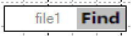
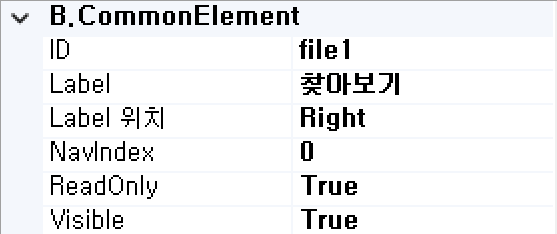
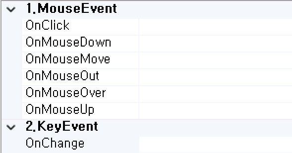

#  (FileButton)
파일 업로드 기능을 처리하는 컴포넌트입니다.

<b style="font-size: 20px"> 1) 컴포넌트 이미지 </b> <br/>
도구상자에서 FileButton 컴포넌트를 선택하여 화면작업 영역에 디자인합니다. <br/>
 <br/>

<b style="font-size: 20px"> 2) 컴포넌트 속성 </b> <br/>
화면작업 창에서 FileButton 컴포넌트 선택 시 속성 창에 설정이 가능한 항목에 값을 입력합니다. <br/>
<b style="font-size: 18px"> (1) B.CommonElement </b> <br/>
 <br/>
<b style="font-size: 18px"> ① ID </b> <br/>
해당 컴포넌트의 ID를 설정합니다.  

<b style="font-size: 18px"> ② Label </b> <br/>
해당 컴포넌트의 ID를 설정합니다.  

<b style="font-size: 18px"> ③ Label 위치 </b> <br/>
해당 컴포넌트 버튼의 위치를 설정합니다. 

<b style="font-size: 18px"> ④ NavIndex </b> <br/>
Index 값을 지정 후 Tab 키를 누르면 오름차순으로 이동하게 됩니다. 

<b style="font-size: 18px"> ⑤ ReadOnly </b> <br/>
값이 True이면 포커스는 잡히지만 수정은 불가능합니다. 

<b style="font-size: 18px"> ⑥ Visible </b> <br/>
해당 컴포넌트를 화면에 보여줄지에 대한 여부를 설정합니다. 

<b style="font-size: 18px"> (2) E.Validation </b> <br/>
 <br/> 
<b style="font-size: 18px"> ① Required-AlertMsg </b> <br/>
해당 컴포넌트의 값을 입력하지 않았을 때 발생 되는 메시지 내용을 설정합니다. (submit(debug, requiredmsg)할 때 requiredmsg를 true로 설정합니다.)

<b style="font-size: 20px"> 3) 컴포넌트 이벤트 </b> <br/>
 <br/> 
<b style="font-size: 18px"> (1) 1.MouseEvent </b> <br/>
<b style="font-size: 18px"> ① OnClick </b> <br/>
마우스를 클릭할 때 발생하는 이벤트입니다. <br/>
<b style="font-size: 18px"> ② OnMosueMove </b> <br/>
마우스를 움직일 때 발생하는 이벤트입니다. <br/>
<b style="font-size: 18px"> ③ OnMosueOut </b> <br/>
마우스가 요소를 벗어날 때 발생하는 이벤트입니다. <br/>
<b style="font-size: 18px"> ④ OnMosueOver </b> <br/>
마우스가 요소 안에 들어올 때 발생하는 이벤트입니다. <br/>
<b style="font-size: 18px"> ⑤ OnMosueUp </b> <br/>
마우스 버튼을 뗄 때 발생하는 이벤트입니다.

<b style="font-size: 18px"> (2) 2.KeyEvent </b> <br/>
<b style="font-size: 18px"> ① OnChange </b> <br/>
체크했을 때 발생하는 이벤트입니다. <br/>

<b style="font-size: 20px"> 4) 파일 업로드 Script 예 </b> <br/>
```js
// 파일버튼 클릭했을 때
  function file01_OnChange(myObj)
  {
	if(myObj.value == "") return; // 파일업로드 안했을 경우
	var theUrl = Contextpath + "/FileUpload.fup"; // 호출URL
	var fileId = myObj.id; // 파일ID
	var callbackFn = "callbackfunc"; //콜백함수
	var extArray = ["hwp", "pdf", "doc", "docx", "ppt", "pptx", "xls", "xlsx", "txt"]; // 파일확장자체크
	
	// wizutil.FileUploadAjax(theUrl, fileId, callbackFn, extArray); // 파일확장자 체크할 경우
	wizutil.FileUploadAjax(theUrl, fileId, callbackFn);
  }

  // 파일업로드 콜백함수
  function callbackfunc(filename, path, unifile, filesize, code, msg)
  {
	//********* 다중파일
	var insertRow = grid1.insertRow('last');
	
	// 첨부파일리스트
	grid1.setCellValue(insertRow, "FILE_UNINM", unifile, false); // 파일물리명
	grid1.setCellValue(insertRow, "FILE_SIZE", filesize, false); // 파일크기
	grid1.setCellValue(insertRow, "FILE_PATH", path, false); // 파일위치
	grid1.setCellValue(insertRow, "FILE_NM", filename, false); // 파일명
	
	//********* 단일파일
	$('S01_FILE_UNINM').val(unifile); // 파일물리명
	$('S01_FILE_SIZE').val(filesize); // 파일크기
	$('S01_FILE_PATH').val(path); // 파일위치
	$('S01_FILE_NM').val(filename); // 파일명
  }
```