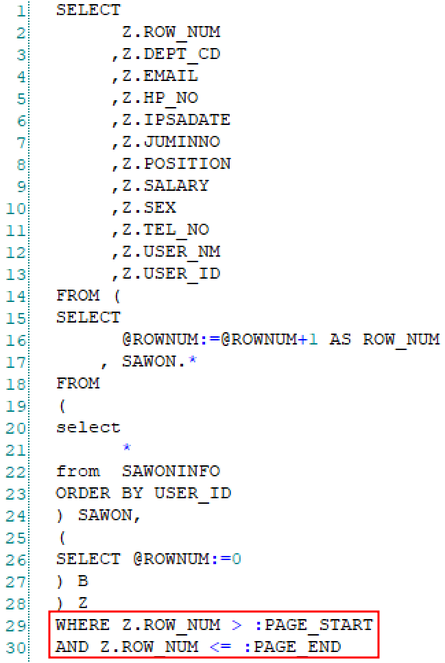
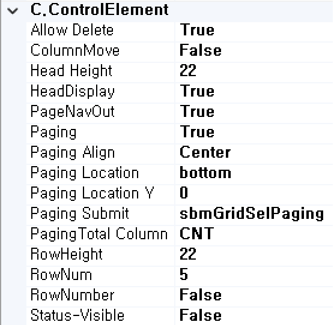

#  (Grid)
테이블 형태의 데이터 처리를 수행하는 컴포넌트입니다.  
그리드는 header, body로 나눠져 있으며 그리드에 입력되는 다양한 유형의 컴포넌트를 사용할 수 있습니다.  

<b style="font-size: 20px"> 1) 컴포넌트 이미지 </b>  
도구상자에서 Grid 컴포넌트를 선택하여 화면작업 영역에 디자인합니다.  
  

<b style="font-size: 20px"> 2) 컴포넌트 속성 </b>  
화면작업 창에서 Grid 컴포넌트 선택 시 속성 창에 설정이 가능한 항목에 값을 입력합니다.  
<b style="font-size: 18px"> (1) A.Data </b>  
 

<b style="font-size: 18px"> ① Dataset </b>  
할당된 Dataset 명 표시합니다.  
 

<b style="font-size: 18px"> (2) B.CommonElement </b>  
  
<b style="font-size: 18px"> ① Disabled </b>  
값이 True이면 수정 불가능(서버 전송 불가능) False 경우 해당 속성 사용하지 않습니다. 

<b style="font-size: 18px"> ② ID </b>  
해당 컴포넌트의 ID를 설정합니다.  

<b style="font-size: 18px"> ③ ReadOnly </b>  
값이 True이면 포커스는 잡히지만 수정은 불가능합니다. 
<!-- Remark -->
::: tip <Badge type="tip" text="Remark" vertical="middle" /> 
ReadOnly가 True일 경우 삭제 컬럼인 체크박스가 사라집니다.
:::
<!-- -->
<b style="font-size: 18px"> ④ Visible </b>  
해당 컴포넌트를 화면에 보여줄지에 대한 여부를 설정합니다.

<b style="font-size: 18px"> (3) C.ControlElement </b>  
   
<b style="font-size: 18px"> ① Allow Delete </b>  
해당 컴포넌트의 삭제 컬럼인 체크박스를 화면에 보여줄지에 대한 여부를 설정합니다. 

<b style="font-size: 18px"> ② ColumnMove </b>  
해당 컴포넌트의 컬럼 이동 처리를 설정합니다.  

<b style="font-size: 18px"> ③ Head Height </b>  
해당 컴포넌트의 Head 부분의 높이를 지정합니다. 

<b style="font-size: 18px"> ④ HeadDisplay </b>  
해당 컴포넌트의 Head 부분 여부를 설정니다. 
<!-- Remark -->
::: tip <Badge type="tip" text="Remark" vertical="middle" /> <b> 페이지 생성 예 </b>
<b>1. Service Model</b>  
1\) 조회 서비스 생성  
① ROW 총개수를 조회할 SEL BOC 생성합니다.  
 

② 초기 1 페이지에 조회할 SEL BOC 생성합니다.  
 

2\) 페이징 서비스 생성  
① 페이징 처리할 SEL BOC 생성합니다.  
 

② 파라미터 값인 컬럼을 클릭하여 계산식 입력합니다.  

* 시작 페이지 계산식: (SUBMIT.PAGEINDEX -1) * 한 페이지에 표시되는 Row 개수 
* 종료 페이지 계산식: SUBMIT.PAGEINDEX * 한 페이지에 표시되는 Row 개수 

 &emsp;  

<b>2. View Designer</b>  
1\) 조회 서브미션 생성  
서브미션을 생성하여 Service Model에서 작업한 서비스를 호출하여 Dataset과 매핑합니다.  

* UI-Control  
- Grid ID : ROW 총개수를 조회한 OBJECT 명 
- Grid ID_pagingCount : 초기 1 페이지에 조회한 OBJECT 명

  

 
 ▶ 
   

2) 페이징 서브미션 생성  
서브미션을 생성하여 Service Model에서 작업한 서비스를 호출하여 Dataset과 매핑합니다.  

* UI-Control  
- Grid ID : 페이징 처리한 OBJECT 명 

  

 
 ▶ 
   

3) 그리드 페이징 처리  
 
 ▶ 
   
:::
<!-- -->
<b style="font-size: 18px"> ⑤ PageNavOut </b>  
True일 경우 페이지가 해당 컴포넌트 밖으로 표시됩니다. 

<b style="font-size: 18px"> ⑥ Paging </b>  
해당 컴포넌트의 페이징 처리 여부를 설정합니다. 
<!-- Remark -->
::: tip <Badge type="tip" text="Remark" vertical="middle" /> 
Paging Submit 또는 Paging Total Column 값이 없을 경우 값을 입력하라는 알림 창이 나옵니다.
:::
<!-- -->

<b style="font-size: 18px"> ⑦ Paging Align </b>  
해당 컴포넌트의 페이징 위치를 left, right, cent 중 하나를 설정합니다.  

<b style="font-size: 18px"> ⑧ Paging Location </b>  
해당 컴포넌트의 페이징 위치를 top, bottom 중 하나를 설정합니다. 

<b style="font-size: 18px"> ⑨ Paging Location Y </b>  
해당 컴포넌트의 페이징 위치를 지정합니다. 

<b style="font-size: 18px"> ⑩ Paging Submit </b>  
해당 컴포넌트의 페이징에 대한 서브미션 명을 설정합니다.  

<b style="font-size: 18px"> ⑪ Paging Total Column </b>  
해당 컴포넌트의 페이징의 총 개수에 대한 컬럼을 설정합니다.  

<b style="font-size: 18px"> ⑫ RowHeight </b>  
해당 컴포넌트의 Row 높이를 설정합니다.  

<b style="font-size: 18px"> ⑬ RowNum </b>  
해당 컴포넌트의 보여지는 Row 개수를 설정합니다.  

<b style="font-size: 18px"> ⑭ RowNumber </b>  
해당 컴포넌트의 각 Row에 대한 순번을 보여줄지 설정합니다.  

<b style="font-size: 18px"> ⑮ Status-Visible </b>  
해당 컴포넌트의 각 Row에 대한 상태를 보여줄지 설정합니다.  
<!-- Remark -->
::: tip <Badge type="tip" text="Remark" vertical="middle" /> 
Row를 추가했을 경우 추가된 Row 상태값은 ‘I’, 해당 Row를 수정했을 경우 ‘U’, 체크박스를 체크했을 경우 ‘D’ 상태값이 나타납니다. 주로 Service Model에서 MIUD BOC를 사용할 때 같이 사용됩니다.
:::
<!-- -->

<b style="font-size: 18px"> (4) D.Design </b>  
   
<b style="font-size: 18px"> ① Cell Style </b>  
특정 조건에 해당되는 Cell Style을 변경합니다. 
   

<b style="font-size: 18px"> ② CSSType </b>  
해당 타입에 맞는 CSS로 적용이 됩니다.
<!-- Remark -->
::: tip <Badge type="tip" text="Remark" vertical="middle" /> 
CSS 파일은 UI.WizGrid.css 파일이며 tr 태그 class 부분에 wizgrow_해당 CSS 타입으로 class 명이 추가됩니다.
:::
<!-- -->
<b style="font-size: 18px"> ③ Dyna-RowStyle </b>  
특정 조건에 해당되는 동적 Row Style을 변경합니다.  
   

<b style="font-size: 18px"> ④ Large </b>  
해당 컴포넌트의 대용량 처리의 여부를 설정합니다.  

<b style="font-size: 18px"> ⑤ Large Size </b>  
해당 컴포넌트의 대용량 처리를 1,000건 단위로 스크롤 처리합니다. 

<b style="font-size: 18px"> ⑥ Layer(1~2)-Tag </b>  
해당 컴포넌트의 부모 태그를 설정합니다. 
<!-- Remark -->
::: tip <Badge type="tip" text="Remark" vertical="middle" /> 
해당 컴포넌트의 부모 태그를 설정하기 위해서는 Layer(1~2)-Class에서 Class 명을 입력해야 해당 부모 태그가 생성됩니다.
:::
<!-- -->

<b style="font-size: 18px"> ⑦ Lock </b>  
해당 컴포넌트에 Lock을 설정하여 마우스로 해당 컴포넌트가 움직이지 못하게 고정합니다.  

<b style="font-size: 18px"> ⑧ Margin </b>  
해당 컴포넌트의 바깥쪽 공간 여백을 설정합니다. 

<b style="font-size: 18px"> ⑨ Position </b>  
해당 컴포넌트의 위치를 설정합니다.  
- Static : 위치를 임의로 설정해 줄 수 없기 때문에 차례대로 왼쪽에서 오른쪽, 위에서 아래로 쌓입니다.
- absolute : static 속성을 가지고 있지 않은 부모를 기준으로 움직입니다.
- relative : top, right, bottom, left 속성을 사용해 위치 조절이 가능합니다.
- Fixed : 스크롤과 상관없이 항상 특정 위치에 고정합니다.
- inherit : 부모 컴포넌트의 속성값을 상속받습니다.
<!-- Remark -->
::: tip <Badge type="tip" text="Remark" vertical="middle" /> 
Position이 none일 경우 default 값이 absolute로 처리됩니다.
:::
<!-- -->

<b style="font-size: 18px"> ⑩ WidthRate </b>  
해당 컴포넌트의 컬럼 넓이를 전체 비율로 설정합니다.  
<!-- Remark -->
::: tip <Badge type="tip" text="Remark" vertical="middle" />  <b> 디자인 스타일 우선순위 </b>
1순위 Style> 2순위 class> 3순위 속성
:::
<!-- -->

<b style="font-size: 20px"> 3) 컴포넌트 이벤트 </b>  
  
<b style="font-size: 18px"> (1) 1.Event </b>  
<b style="font-size: 18px"> ① OnCellSelect  </b>  
Cell을 선택 시 발생하는 이벤트입니다.  
<b style="font-size: 18px"> ② OnColumnSort  </b>  
Sort 처리된 Column Head를 클릭 시 발생하는 이벤트입니다.  
<b style="font-size: 18px"> ③ OndblClickRow  </b>  
Row를 더블 클릭 시 발생하는 이벤트입니다.  
<b style="font-size: 18px"> ④ OnEditCell  </b>  
Cell 값을 변경 시 발생하는 이벤트입니다.  
<b style="font-size: 18px"> ⑤ OnEnterRow  </b>  
다음 Row로 이동 시 발생하는 이벤트입니다.  
<b style="font-size: 18px"> ⑥ OnInitGrid  </b>  
Grid가 초기화 시 발생하는 이벤트입니다.  
<b style="font-size: 18px"> ⑦ OnInsertRow  </b>  
Row가 추가될 시 발생하는 이벤트입니다.  
<b style="font-size: 18px"> ⑧ Point-Lengtht </b>  
Grid 로드가 완료 시 발생하는 이벤트입니다.  
<b style="font-size: 18px"> ⑨ OnScrollBottom  </b>  
최하단 스크롤 이동 시 발생하는 이벤트입니다. 
<!-- Remark -->
::: tip <Badge type="tip" text="Remark" vertical="middle" />  <b> Event API </b>
- rowIndex : 해당 이벤트가 발생된 rowIndex 값입니다.
- Colname : 해당 이벤트가 발생된 컬럼 명입니다.
- cellcontent : 해당 이벤트가 발생된 Cell 값입니다.
- e : 해당 이벤트가 발생된 이벤트 정보입니다.
- value : 해당 이벤트가 발생될 때 변경한 값입니다.
:::
<!-- -->
<b style="font-size: 20px"> 4) 컴포넌트 Column 영역 속성 </b>  
화면작업 창에서 Grid 컴포넌트에서 Column를 선택 시 속성 창에 설정이 가능한 항목에 값을 입력합니다.  
  

<b style="font-size: 18px"> (1) C.ControlElement </b>  
 

<b style="font-size: 18px"> ① CheckBox </b>  
True 주게 되면 Column에 CheckBox 활성화됩니다. 

<b style="font-size: 18px"> ② CheckBox-Onchange </b>  
CheckBox-Onchange을 더블클릭하면 Script tab으로 이동하여 함수가 생성됩니다.  

<b style="font-size: 18px"> ③ FIXED </b>  
True 주게 되면 Column 번호에 * 활성화된다. * 표시된 기준으로 좌측 컬럼 틀고정 처리됩니다. 
<!-- Remark -->
::: tip <Badge type="tip" text="Remark" vertical="middle" />
틀고정 그리드는 ReadOnly 그리드에서만 가능 Readonly를 풀게 되면 틀고정 그리드 기능 상실됩니다.
:::
<!-- -->

<b style="font-size: 18px"> ④ Hidden </b>  
True 주게 되면 Column 번호에 (hidden) 활성화되고 실제 화면에서 해당 Column이 보이지 않게 됩니다. 

<b style="font-size: 18px"> ⑤ Resize </b>  
True 주게 되면 Column 폭 사이즈를 변경할 수 있습니다. 

<b style="font-size: 18px"> ⑥ Sort </b>  
True 주게 되면 해당 Head에서 라벨 명을 클릭 시 Column 데이터가 오름차순과 내림차순으로 정렬이 됩니다. 
<!-- Remark -->
::: tip <Badge type="tip" text="Remark" vertical="middle" />  
페이징 처리 시 Sort 가 안됩니다.
:::
<!-- -->
<b style="font-size: 18px"> ⑦ Sort-Type </b>  
Column 데이터의 정렬 유형을 설정합니다.  

<b style="font-size: 20px"> 5) 컴포넌트 Head 영역 속성 </b>  
화면작업 창에서 Grid 컴포넌트에서 Head를 선택 시 속성 창에 설정이 가능한 항목에 값을 입력합니다.  
  

<b style="font-size: 18px"> (1) C.ControlElement </b>  
 

<b style="font-size: 18px"> ① ID </b>  
해당 컴포넌트의 ID를 설정합니다. 

<b style="font-size: 18px"> ② Label </b>  
해당 컬럼에 보여주는 텍스트를 입력합니다.  

<b style="font-size: 18px"> ③ Text-Align </b>  
입력한 텍스트 정렬을 설정합니다. 

<b style="font-size: 20px"> 6) 컴포넌트 Body 영역 속성 </b>  
화면작업 창에서 Grid 컴포넌트에서 Head를 선택 시 속성 창에 설정이 가능한 항목에 값을 입력합니다.  
  
<b style="font-size: 18px"> (1) A.Data </b>  
 

<b style="font-size: 18px"> ① Column </b>  
UI 화면작업 창의 Dataset 탭에서 등록한 Dataset Column을 할당하는 부분입니다.  
 

<b style="font-size: 18px"> ② Dataset </b>  
할당된 Dataset 명 표시합니다.  

<b style="color: rgb(106, 139, 173); font-size:18px">[ Edit-Type : inputBox ]</b>  
<b style="font-size: 18px"> (2) B.CommonElement </b>  
  
<b style="font-size: 18px"> ① CSS-Element </b>  
해당 Edit-Type에서 Class 명을 입력합니다. 

<b style="font-size: 18px"> ② CSS-TD </b>  
해당 컴포넌트의 ID를 설정합니다.  

<b style="font-size: 18px"> ③ CSS-View-Div </b>  
해당 셀 부분의 td 태그 안에 있는 div를 생성해서 Class 명을 입력합니다. 

<b style="font-size: 18px"> ④ Editable </b>  
True 주게 되면 해당 셀에서 편집할 수 있는 에디터가 생성됩니다. 
<!-- Remark -->
::: tip <Badge type="tip" text="Remark" vertical="middle" />  
ReadOnly 상태일 경우 에디터가 생성이 되어있기는 하지만 편집은 불가능합니다.
:::
<!-- -->

<b style="font-size: 18px"> ⑤ Edit-Type </b>  
해당 셀의 Edit-Type을 설정합니다. 

<b style="font-size: 18px"> ⑥ ID </b>  
해당 Body의 ID를 설정합니다. 

<b style="font-size: 18px"> ⑦ ReadOnly </b>  
해당 셀의 수정 가능 유무에 대해 설정합니다.  

<b style="font-size: 18px"> ⑧ RowMerge </b>  
해당 셀의 값들이 동일하면 머지 처리가 됩니다. 
<!-- Remark -->
::: tip <Badge type="tip" text="Remark" vertical="middle" />  
RowMerge를 true로 할 경우 ReadOnly도 true로 변경이 됩니다.
:::
<!-- -->
<b style="font-size: 18px"> ⑨ TextAlign </b>  
해당 셀 값의 정렬을 설정합니다.  

<b style="font-size: 18px"> (3) E.Validation </b>  
  
<b style="font-size: 18px"> ① Calc. order </b>  
상호 연관된 필드값 계산 순서를 설정합니다. 

<b style="font-size: 18px"> ② DataFomat </b>  
해당 셀 값의 포맷을 설정합니다.  

<b style="font-size: 18px"> ③ Expr </b>  
에디터 버튼을 클릭하여 Formaul 창에 계산할 Column Dataset을 지정한다. Operators 탭에 있는 사용 가능한 연산자를 선택한다. 문자는 ''안에 입력합니다.  
 

<b style="font-size: 18px"> ④ FormatType </b>  
해당 셀 값의 포맷 타입을 설정한다. 문자일 경우 text, 숫자일 경우 nember, 날짜인 경우는 date를 선택합니다. 

<b style="font-size: 18px"> ⑤ Maxlength </b>  
해당 셀 값의 입력에 대한 최대 길이 제한을 설정합니다. 

<b style="font-size: 18px"> ⑥ Round </b>  
Round가 True일 경우 해당 셀의 값이 반올림이 되고 False일 경우 해당 셀의 값이 절사됩니다. 
<!-- Remark -->
::: tip <Badge type="tip" text="Remark" vertical="middle" />  
숫자를 반올림 또는 절사할 경우 FomatType을 number로 설정해야합니다.
:::
<!-- -->
<b style="font-size: 18px"> ⑦ Size </b>  
해당 셀 요소에 size가 설정됩니다.  

<b style="color: rgb(106, 139, 173); font-size:18px">[ Edit-Type : Button ]</b>  
<b style="font-size: 18px"> (2) B.CommonElement </b>  
  
<b style="font-size: 18px"> ① CSS-Element </b>  
해당 Edit-Type에서 Class 명을 입력합니다. 
<!-- Remark -->
::: tip <Badge type="tip" text="Remark" vertical="middle" />  
CSS-Element는 이미지, 버튼은 해당 태그에 Class 명이 생성되지만 그 이외에 Edit-Type은 해당 셀의 값을 클릭했을 때 Input 태그가 생성되면서 생성된 Input 태그에 Class 명이 생성됩니다.
:::
<!-- -->
<b style="font-size: 18px"> ② CSS-TD </b>  
해당 셀 부분의 td 태그의 Class 명을 입력합니다.  

<b style="font-size: 18px"> ③ Edit-Type </b>  
해당 셀의 Edit-Type을 설정합니다.  

<b style="font-size: 18px"> ④ ID </b>  
해당 Body의 ID를 설정합니다.  

<b style="font-size: 18px"> (3) C.ControlElement </b>  
  
<b style="font-size: 18px"> ① cellonclick </b>  
cellonclick을 더블클릭하면 Script tab으로 이동하여 함수가 생성됩니다.   

<b style="font-size: 18px"> ② imageFile </b>  
해당 셀 버튼의 이미지 경로를 설정합니다. Ex) /img/test/testBtn.png    

<b style="font-size: 18px"> ③ imageStyle </b>  
해당 셀의 Edit-Type을 설정합니다. Ex) width: 70px; ...   

<b style="color: rgb(106, 139, 173); font-size:18px">[ Edit-Type : checkbox ]</b>  
  

<b style="font-size: 18px"> ③ FalseValue </b>  
해당 셀 체크박스를 체크하지 않았을 때의 값을 설정합니다. 

<b style="font-size: 18px"> ④ TrueValue </b>  
해당 셀 체크박스를 체크했을 때의 값을 설정합니다. 

<b style="font-size: 18px"> (2) B.CommonElement </b>  
  
<b style="font-size: 18px"> ① CSS-Element </b>  
해당 Edit-Type에서 Class 명을 입력합니다. 
<!-- Remark -->
::: tip <Badge type="tip" text="Remark" vertical="middle" />  
CSS-Element는 이미지, 버튼은 해당 태그에 Class 명이 생성되지만 그 이외에 Edit-Type은 해당 셀의 값을 클릭했을 때 Input 태그가 생성되면서 생성된 Input 태그에 Class 명이 생성됩니다.
:::
<!-- -->

<b style="font-size: 18px"> ② CSS-TD </b>  
해당 컴포넌트의 ID를 설정합니다.  

<b style="font-size: 18px"> ③ Edit-Type </b>  
해당 셀의 Edit-Type을 설정합니다. 

<b style="font-size: 18px"> ④ ID </b>  
해당 Body의 ID를 설정합니다. 

<b style="font-size: 18px"> ⑤ TextAlign </b>  
해당 셀 값의 정렬을 설정합니다. 

<b style="color: rgb(106, 139, 173); font-size:18px">[ Edit-Type : calendar ]</b>  
<b style="font-size: 18px"> (2) B.CommonElement </b>  
  
<b style="font-size: 18px"> ① CSS-Element </b>  
해당 Edit-Type에서 Class 명을 입력합니다. 
<!-- Remark -->
::: tip <Badge type="tip" text="Remark" vertical="middle" />  
CSS-Element는 이미지, 버튼은 해당 태그에 Class 명이 생성되지만 그 이외에 Edit-Type은 해당 셀의 값을 클릭했을 때 Input 태그가 생성되면서 생성된 Input 태그에 Class 명이 생성됩니다.
:::
<!-- -->

<b style="font-size: 18px"> ② CSS-TD </b>  
해당 셀 부분의 td 태그의 Class 명을 입력합니다.  

<b style="font-size: 18px"> ③ Edit-Type </b>  
해당 셀의 Edit-Type을 설정합니다. 

<b style="font-size: 18px"> ④ ID </b>  
해당 Body의 ID를 설정합니다. 

<b style="font-size: 18px"> ⑤ TextAlign </b>  
해당 셀 값의 정렬을 설정합니다. 

<b style="font-size: 18px"> (3) C.ControlElement </b>  
  
<b style="font-size: 18px"> ① Calendar-Format </b>  
해당 셀의 Date 포맷을 설정합니다. 

<b style="font-size: 18px"> ② ChangeMonth </b>  
해당 셀의 캘린더에서 월 변경 여부를 설정합니다.  

<b style="font-size: 18px"> ③ ChangeYear </b>  
해당 셀의 캘린더에서 연도 변경 여부를 설정합니다. 

<b style="font-size: 18px"> ④ CloseText </b>  
해당 셀 캘린더의 닫기 버튼 텍스트 명을 설정합니다. 

<b style="font-size: 18px"> ⑤ CurrentText </b>  
해당 셀 캘린더의 현재 날짜 버튼 텍스트 명을 설정합니다. 

<b style="font-size: 18px"> ⑥ imageStyle </b>  
해당 셀 캘린더 버튼의 스타일을 설정합니다. Ex) content: url(/DEMO/img/test/calendar.png);... 

<b style="font-size: 18px"> ⑦ Lang_Type </b>  
해당 셀 캘린더를 영어 또는 한국어 달력을 설정합니다.  

<b style="font-size: 18px"> ⑧ MaxDate </b>  
현재 날짜 중심으로 달력에 최대값을 정해서 최소값 이전 날짜는 disable 처리합니다. 
<!-- Remark -->
::: tip <Badge type="tip" text="Remark" vertical="middle" />  
현재 날짜 중심으로 숫자 앞에 +,-를 통해 일단위로 설정할 수 있으며, 날짜, 연도, 월로 최대값을 설정하는 경우 날짜는 ‘D’, 연도는 ‘Y’, 월은 ‘M’으로 숫자 뒤에 붙여서 입력합니다.
:::
<!-- -->
<b style="font-size: 18px"> ⑨ MinDate </b>  
현재 날짜 중심으로 달력에 최소값을 정해서 최소값 이전 날짜는 disable 처리합니다. 
<!-- Remark -->
::: tip <Badge type="tip" text="Remark" vertical="middle" />  
현재 날짜 중심으로 숫자 앞에 +,-를 통해 일단위로 설정할 수 있으며, 날짜, 연도, 월로 최소값을 설정하는 경우 날짜는 ‘D’, 연도는 ‘Y’, 월은 ‘M’으로 숫자 뒤에 붙여서 입력합니다.
:::
<!-- -->
<b style="font-size: 18px"> ⑩ YMD_Format </b>  
해당 캘린더 화면에 표시할 날짜 형식을 설정합니다.  

<b style="font-size: 18px"> (4) E.Validation </b>  
  
<b style="font-size: 18px"> ① dateonclick </b>  
dateonclick을 더블클릭하면 Script tab으로 이동하여 함수가 생성됩니다. 

<b style="font-size: 18px"> ② Expr </b>  
에디터 버튼을 클릭하여 Formaul 창에 계산할 Column Dataset을 지정한다. Operators 탭에 있는 사용 가능한 연산자를 선택한다. 문자는 ''안에 입력합니다.  
 

<b style="color: rgb(106, 139, 173); font-size:18px">[ Edit-Type : TextArea ]</b>  
<b style="font-size: 18px"> (2) B.CommonElement </b>  
  
<b style="font-size: 18px"> ① CSS-Element </b>  
해당 Edit-Type에서 Class 명을 입력합니다. 
<!-- Remark -->
::: tip <Badge type="tip" text="Remark" vertical="middle" />  
CSS-Element는 이미지, 버튼은 해당 태그에 Class 명이 생성되지만 그 이외에 Edit-Type은 해당 셀의 값을 클릭했을 때 Input 태그가 생성되면서 생성된 Input 태그에 Class 명이 생성됩니다.
:::
<!-- -->

<b style="font-size: 18px"> ② CSS-TD </b>  
해당 셀 부분의 td 태그의 Class 명을 입력합니다.  

<b style="font-size: 18px"> ③ CSS-View-Div </b>  
해당 셀 부분의 td 태그 안에 있는 div를 생성해서 Class 명을 입력합니다. 

<b style="font-size: 18px"> ④ Editable </b>  
True 주게 되면 해당 셀에서 편집할 수 있는 에디터가 생성됩니다. 
<!-- Remark -->
::: tip <Badge type="tip" text="Remark" vertical="middle" />  
ReadOnly 상태일 경우 에디터가 생성이 되어있기는 하지만 편집은 불가능합니다.
:::
<!-- -->

<b style="font-size: 18px"> ⑤ Edit-Type </b>  
해당 셀의 Edit-Type을 설정합니다. 

<b style="font-size: 18px"> ⑥ ID </b>  
해당 Body의 ID를 설정합니다. 

<b style="font-size: 18px"> ⑦ ReadOnly </b>  
해당 셀의 수정 가능 유무에 대해 설정합니다.  

<b style="font-size: 18px"> ⑧ RowMerge </b>  
해당 셀의 값들이 동일하면 머지 처리가 됩니다. 
<!-- Remark -->
::: tip <Badge type="tip" text="Remark" vertical="middle" />  
RowMerge를 true로 할 경우 ReadOnly도 true로 변경이 됩니다.
:::
<!-- -->
<b style="font-size: 18px"> ⑨ TextAlign </b>  
해당 셀 값의 정렬을 설정합니다. 

<b style="font-size: 18px"> (3) C.ControlElement </b>  
  
<b style="font-size: 18px"> ① TextArea-rows </b>  
해당 컬럼의 행 길이를 설정합니다. 

<b style="font-size: 18px"> (4) E.Validation </b>  
  
<b style="font-size: 18px"> ① Expr </b>  
에디터 버튼을 클릭하여 Formaul 창에 계산할 Column Dataset을 지정한다. Operators 탭에 있는 사용 가능한 연산자를 선택한다. 문자는 ''안에 입력합니다.  

<b style="font-size: 18px"> ② Maxlength </b>  
해당 셀 값의 입력에 대한 최대 길이 제한을 설정합니다.  

<b style="color: rgb(106, 139, 173); font-size:18px">[ Edit-Type : ComboBox ]</b>  
  
<b style="font-size: 18px"> ① Item:Dataset </b>  
해당 컴포넌트의 리스트 목록 부분 Dataset을 할당합니다. 

<b style="font-size: 18px"> ② Item:Label </b>  
해당 컴포넌트의 리스트 목록 부분의 Label을 할당합니다.  

<b style="font-size: 18px"> ③ Item:Value </b>  
해당 컴포넌트의 리스트 목록 부분의 실제 값을 할당합니다. 
<!-- Remark -->
::: tip <Badge type="tip" text="Remark" vertical="middle" />  
- 그리드 안에 Dataset Bind 할 경우 UI_Control을  gridId_Column으로 지정합니다.  
Ex) gridId : grid2     Column : SEX  ⇒ UI_Control : grid2_SEX  
 
-  콤보박스 Dataset  
 
S02 Dataset  
&emsp;&emsp;  
&emsp;&emsp; COMBO : 콤보박스 리스트에서 선택된 값 => 남자일 경우 1, 여자일 경우 2  
S01 Dataset  
&emsp;&emsp;  
&emsp;&emsp; CODE : 콤보박스 리스트에서 보여지는 값이 아닌 실제 값 = > 1, 2  
&emsp;&emsp; NAME : 콤보박스 리스트에서 보여지는 값 => 남자, 여자  
:::
<!-- -->
<b style="font-size: 18px"> (2) B.CommonElement </b>  
  
<b style="font-size: 18px"> ① CSS-Element </b>  
해당 Edit-Type에서 Class 명을 입력합니다. 
<!-- Remark -->
::: tip <Badge type="tip" text="Remark" vertical="middle" />  
CSS-Element는 이미지, 버튼은 해당 태그에 Class 명이 생성되지만 그 이외에 Edit-Type은 해당 셀의 값을 클릭했을 때 Input 태그가 생성되면서 생성된 Input 태그에 Class 명이 생성됩니다.
:::
<!-- -->

<b style="font-size: 18px"> ② CSS-TD </b>  
해당 셀 부분의 td 태그의 Class 명을 입력합니다.  

<b style="font-size: 18px"> ③ Editable </b>  
True 주게 되면 해당 셀에서 편집할 수 있는 에디터가 생성됩니다. 
<!-- Remark -->
::: tip <Badge type="tip" text="Remark" vertical="middle" />  
ReadOnly 상태일 경우 에디터가 생성이 되어있기는 하지만 편집은 불가능합니다.
:::
<!-- -->

<b style="font-size: 18px"> ④ Edit-Type </b>  
해당 셀의 Edit-Type을 설정합니다. 

<b style="font-size: 18px"> ⑤ ID </b>  
해당 Body의 ID를 설정합니다.

<b style="font-size: 18px"> ⑥ ReadOnly </b>  
해당 셀의 수정 가능 유무에 대해 설정합니다.  

<b style="font-size: 18px"> ⑦ RowMerge </b>  
해당 셀의 값들이 동일하면 머지 처리가 됩니다. 
<!-- Remark -->
::: tip <Badge type="tip" text="Remark" vertical="middle" />  
RowMerge를 true로 할 경우 ReadOnly도 true로 변경이 됩니다.
:::
<!-- -->

<b style="font-size: 18px"> ⑧ TextAlign </b>  
해당 셀 값의 정렬을 설정합니다. 

<b style="color: rgb(106, 139, 173); font-size:18px">[ Edit-Type : image ]</b>  
<!-- Remark -->
::: tip <Badge type="tip" text="Remark" vertical="middle" />  
해당 셀의 값에 등록된 해당 이미지를 보여줍니다. 
 
:::
<!-- -->

<b style="font-size: 18px"> (2) B.CommonElement </b>  
  
<b style="font-size: 18px"> ① CSS-Element </b>  
해당 Edit-Type에서 Class 명을 입력합니다. 
<!-- Remark -->
::: tip <Badge type="tip" text="Remark" vertical="middle" />  
CSS-Element는 이미지, 버튼은 해당 태그에 Class 명이 생성되지만 그 이외에 Edit-Type은 해당 셀의 값을 클릭했을 때 Input 태그가 생성되면서 생성된 Input 태그에 Class 명이 생성됩니다.
:::
<!-- -->

<b style="font-size: 18px"> ② CSS-TD </b>  
해당 셀 부분의 td 태그의 Class 명을 입력합니다.  

<b style="font-size: 18px"> ③ Edit-Type </b>  
해당 셀의 Edit-Type을 설정합니다. 

<b style="font-size: 18px"> ④ ID </b>  
해당 Body의 ID를 설정합니다.

<b style="font-size: 18px"> ⑤ TextAlign </b>  
해당 셀 값의 정렬을 설정합니다. 

<b style="font-size: 18px"> (3) C.ControlElement </b>  
  
<b style="font-size: 18px"> ① imageStyle </b>  
해당 셀 캘린더 버튼의 스타일을 설정합니다. Ex) width: 25px;... 

<b style="color: rgb(106, 139, 173); font-size:18px">[ Edit-Type : PopUp ]</b>  
<b style="font-size: 18px"> (2) B.CommonElement </b>  
  
<b style="font-size: 18px"> ① CSS-Element </b>  
해당 Edit-Type에서 Class 명을 입력합니다. 
<!-- Remark -->
::: tip <Badge type="tip" text="Remark" vertical="middle" />  
CSS-Element는 이미지, 버튼은 해당 태그에 Class 명이 생성되지만 그 이외에 Edit-Type은 해당 셀의 값을 클릭했을 때 Input 태그가 생성되면서 생성된 Input 태그에 Class 명이 생성됩니다.
:::
<!-- -->

<b style="font-size: 18px"> ② CSS-TD </b>  
해당 셀 부분의 td 태그의 Class 명을 입력합니다.  

<b style="font-size: 18px"> ③ Edit-Type </b>  
해당 셀의 Edit-Type을 설정합니다. 

<b style="font-size: 18px"> ④ ID </b>  
해당 Body의 ID를 설정합니다.

<b style="font-size: 18px"> ⑤ TextAlign </b>  
해당 셀 값의 정렬을 설정합니다. 

<b style="font-size: 18px"> (3) C.ControlElement </b>  
  
<b style="font-size: 18px"> ① imageStyle </b>  
cellonclick을 더블클릭하면 Script tab으로 이동하여 함수가 생성됩니다.
<!-- Remark -->
::: tip <Badge type="tip" text="Remark" vertical="middle" /> <b> 팝업 처리 예 </b>
<b>1. 팝업 화면 생성</b>  
1\) 팝업 JSP 생성  
① View Designer 탭에서 팝업 화면을 디자인합니다.  
 

② 해당 View 화면 jsp명 지정하고 저장합니다.  
 

③ 빌드 후 화면을 확인합니다.  
 

2\) 팝업 Loadpage 서비스 생성  
① 처리할 BOC가 없을 경우 NLL BOC을 생성합니다.  
 

② 해당 서비스에 방금 생성한 JSP 연결 후 빌드합니다.  

<b>2. 서브미션 생성 (해당 서비스를 연결할 때 JSP명 확인)</b>  
1\) 팝업창 서브미션 생성  
① ‘sbmInit‘ 서브미션에 팝업 Loadpage 서비스를 연결합니다.  
 

2\) 페이징 서브미션 생성  
① 서브미션을 생성하여 팝업 Loadpage 서비스를 연결합니다.  
 

② cellonclick 함수 안에 script을 입력합니다.  

var 팝업변수 = wizutil.openLayerPopup(높이,넓이); 
서브미션명.formsubmit(debug,팝업변수,requiredmsg); 

  
 

③ 빌드 후 화면 확인 
 
 ▶ 
   

3. 부모창 ➔ 팝업창 값 넘기기  
1) 부모창  
① 값 넘길 Dataset을 추가해서 Stript 탭에서 히든 컨트롤을 생성합니다.  
 
 ▶ 
   

② 팝업창 클릭했을 때 값을 생성한 컨트롤에 넣습니다.  

그리드에 있는 셀 값을 가져온다. 
그리드ID.getCellValue(row번호,"컬럼",debug); 

  
 

③ 서브미션에서 Dataset을 수정합니다. 
   

2\) 팝업창  
① Dataset을 추가해서 Stript 탭에서 히든 컨트롤 생성 후 Value 값을 입력합니다.  

&lt;%=dboj.getDataset(“ 서비스 Dataset 명”).get(“컬럼,”)%>

   
 ▶ 
   

② 라벨 컴포넌트에 표시할 경우 Script 탭에서 $(document).ready 함수 영역에 입력합니다.  
 

③ 빌드 후 화면 확인 
 
 ▶ 
   

4. 부모창 ➔ 팝업창 값 넘기기  
1) 부모창  
① 팝업창에서 값 받기 위해 함수을 생성합니다.  

2\) 팝업창  
① 그리드 클릭 이벤트 함수을 생성합니다.  
  

② 빌드 후 화면을 확인합니다.  
 
 ▶ 
  
 ▶ 
   
:::
<!-- -->

<b style="font-size: 18px"> (7) 그리드 Head 영역 Context Menu </b>  
 Grid Head 영역에서 마우스 오른쪽 클릭하면 7개의 Context Menu가 보입니다.  
  
<b style="font-size: 18px"> ① Add Column </b>  
해당 메뉴를 클릭하거나 단축키 Ctrl + 1을 입력하면 우측에 컬럼이 추가됩니다. 

<b style="font-size: 18px"> ② Delete Column </b>  
삭제할 컬럼을 선택 후 해당 메뉴를 클릭하거나 단축키 Ctrl + 2를 입력하면 선택된 컬럼이 삭제됩니다.  

<b style="font-size: 18px"> ③ Arrange Column </b>  
컬럼 순서를 정렬하는 팝업창이 나오며 UP, Down 버튼을 눌러 컬럼 순서를 정하고 Arrange 버튼을 누르면 정렬한 순서로 컬럼 위치가 반영합니다. 

<b style="font-size: 18px"> ④ Add Head Row </b>  
해당 메뉴를 클릭하면 Head Row가 추가됩니다. (Head Row는 4개 이상 추가가 불가능합니다.)

<b style="font-size: 18px"> ⑤ Head Merge </b>  
Head 영역에 병합될 셀을 드래그로 선택하고 해당 메뉴를 클릭하면 병합됩니다.  
(Grid Body EditType : 캘린더, 팝업 경우 병합이 불가능합니다.)

<b style="font-size: 18px"> ⑥ Head Retrun </b>  
Head Merge 적용된 Cell 선택을 하고 해당 메뉴를 클릭하면 병합이 해지됩니다. 

<b style="font-size: 18px"> ⑦ Delete Row </b>  
삭제할 Head Row를 선택하고 해당 메뉴를 클릭하면 해당 Row가 삭제됩니다.  