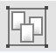
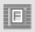
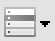

# 그룹 컴포넌트

<b class="font20"> 1. &nbsp; (groupbox) </b>  
여러 개의 Control을 그룹으로 묶어서 표시하는 컴포넌트입니다.

<b class="font20"> 2. &nbsp; (SplitGroupBox) </b>  
컨테이너의 영역을 그룹으로 묶어서 표시하는 컴포넌트입니다.

<b class="font20"> 3. &nbsp; (Tab) </b>  
탭 기능을 처리하는 컴포넌트입니다.

<b class="font20"> 4. &nbsp; (TableLayout) </b>  
테이블 형태로 Layout을 표시하는 컴포넌트입니다.

<b class="font20"> 5. &nbsp; (user/svg Control) </b>  
사용자 정의 기능을 처리하는 컴포넌트입니다.

<b class="font20"> 6. &nbsp; (IFrame) </b>  
IFrame 기능을 처리하는 컴포넌트입니다.

<b class="font20"> 7. &nbsp; (TreeView) </b>  
계층 구조를 가지는 데이터를 Tree 형태로 표시하는 컴포넌트입니다.

<b class="font20"> 8. &nbsp; (Progress) </b>  
진행 정도 나타내는 바 형태로 표시하는 컴포넌트입니다.

<b class="font20"> 9. &nbsp; (Component) </b>  

