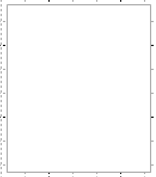
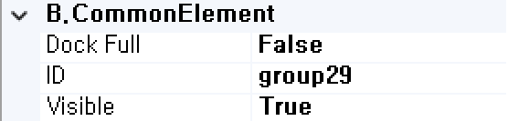
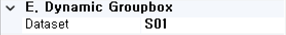
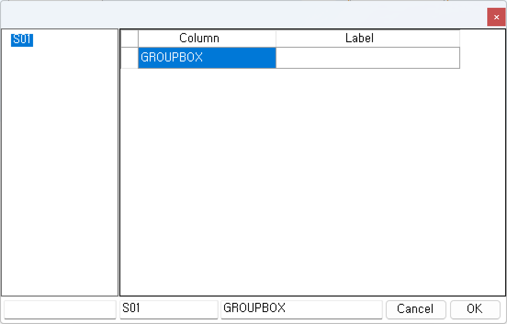

#  (GroupBox)
여러 개의 Control을 그룹으로 묶어서 표시하는 컴포넌트입니다. 

<b style="font-size: 20px"> 1) 컴포넌트 이미지 </b>  
도구상자에서 GroupBox 컴포넌트를 선택하여 화면작업 영역에 디자인합니다.  
  

<b style="font-size: 20px"> 2) 컴포넌트 속성 </b>  
화면작업 창에서 GroupBox 컴포넌트 선택 시 속성 창에 설정이 가능한 항목에 값을 입력합니다.  
<b style="font-size: 18px"> (1) B.CommonElement </b>  
  
<b style="font-size: 18px"> ① DockFull </b>  
Full로 설정했을 경우 해당 컴포넌트 부모 컴포넌트 크기의 맞춰서 설정됩니다. 

<b style="font-size: 18px"> ② ID </b>  
해당 컴포넌트의 ID를 설정합니다.  

<b style="font-size: 18px"> ③ Visible </b>  
해당 컴포넌트를 화면에 보여줄지에 대한 여부를 설정합니다. 

<b style="font-size: 18px"> (2) E.Dynamic Groupbox </b>  
  
<b style="font-size: 18px"> ① Dataset </b>  
할당된 Dataset 명을 표시합니다.  
  