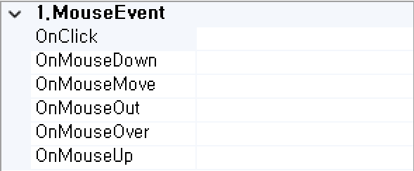

#  (href)
Link 기능을 처리하는 컴포넌트입니다.

<b style="font-size: 20px"> 1) 컴포넌트 이미지 </b>  
도구상자에서 href 컴포넌트를 선택하여 화면작업 영역에 디자인합니다.  
  

<b style="font-size: 20px"> 2) 컴포넌트 속성 </b>  
화면작업 창에서 href 컴포넌트 선택 시 속성 창에 설정이 가능한 항목에 값을 입력합니다.  
<b style="font-size: 18px"> (1) B.CommonElement </b>  
  
<b style="font-size: 18px"> ① ID </b>  
해당 컴포넌트의 ID를 설정합니다.  

<b style="font-size: 18px"> ② Label </b>  
해당 컴포넌트의 ID를 설정합니다.  

<b style="font-size: 18px"> ③ Visible </b>  
해당 컴포넌트를 화면에 보여줄지에 대한 여부를 설정합니다. 

<b style="font-size: 18px"> (2) C.ControlElement </b>  
  
<b style="font-size: 18px"> ① Target </b>  
해당 컴포넌트의 링크 방식을 설정합니다.  
- _self : 현재 창에서 이동한다.
- _blank : 새로운 창으로 이동한다.
- new : 새로운 창으로 이동한다.
- _parent : 부모 페이지로 이동한다.

<!-- Remark -->
::: tip <Badge type="tip" text="Remark" vertical="middle" /> 
URL 정보가 없기 때문에 Target을 지정하더라도 화면상으로 확인이 불가능합니다. URL 정보를 지정해야 Build 후 해당 화면에 Target이 적용이 되었는지 확인할 수 있습니다.
:::
<!-- -->
<b style="font-size: 18px"> ② URL </b>  
해당 컴포넌트의 연결 주소를 설정합니다. 
<!-- Remark -->
::: tip <Badge type="tip" text="Remark" vertical="middle" /> 
Target 지정 없이 URL만 입력했다면 default로 해당 컴포넌트를 클릭했을 때 현재 창에서 이동이 됩니다.
:::
<!-- --> 

<b style="font-size: 20px"> 3) 컴포넌트 이벤트 </b>  
   
<b style="font-size: 18px"> (1) 1.MouseEvent </b>  
<b style="font-size: 18px"> ① OnClick </b>  
마우스를 클릭할 때 발생하는 이벤트입니다.  
<b style="font-size: 18px"> ② OnMosueDown </b>  
마우스 버튼을 누를 때 발생하는 이벤트입니다.  
<b style="font-size: 18px"> ③ OnMosueMove </b>  
마우스를 움직일 때 발생하는 이벤트입니다.  
<b style="font-size: 18px"> ④ OnMosueOut </b>  
마우스가 요소를 벗어날 때 발생하는 이벤트입니다.  
<b style="font-size: 18px"> ⑤ OnMosueOver </b>  
마우스가 요소 안에 들어올 때 발생하는 이벤트입니다.  
<b style="font-size: 18px"> ⑥ OnMosueUp </b>  
마우스 버튼을 뗄 때 발생하는 이벤트입니다.  