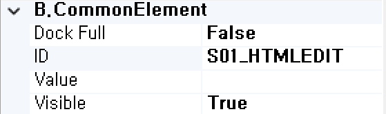

#  (HtmlEdit)
웹기반의 Html에디터 기능을 처리하는 컴포넌트입니다. 

<b class="font20"> 1) 컴포넌트 이미지 </b>  
도구상자에서 HtmlEdit 컴포넌트를 선택하여 화면작업 영역에 디자인합니다.  
  

<b class="font20"> 2) 컴포넌트 속성 </b>  
화면작업 창에서 HtmlEdit 컴포넌트 선택 시 속성 창에 설정이 가능한 항목에 값을 입력합니다.  
<b class="font18"> (1) A.Data </b>  
  
<b class="font18"> ① Bind:Column </b>  
UI 화면작업 창의 Dataset 탭에서 등록한 Dataset Column을 할당하는 부분입니다.  
 

<b class="font18"> ② Dataset </b>  
할당된 Dataset 명 표시합니다.  
<!-- Remark -->
::: tip <Badge type="tip" text="Remark" vertical="middle" /> 
Dataset Bind 했을 경우 Dataset_Column으로 해당 컴포넌트 ID가 자동으로 변환됩니다.  
Ex) Dataset : S01     Column : HTMLEDIT  ⇒ 컴포넌트 ID : S01_HTMLEDIT 
:::
<!-- -->

<b class="font18"> (2) B.CommonElement </b>  
  
<b style="font-size: 18px"> ① Disabled </b>  
값이 True이면 수정 불가능(서버 전송 불가능) False 경우 해당 속성 사용하지 않습니다. 

<b style="font-size: 18px"> ② ID </b>  
해당 컴포넌트의 ID를 설정합니다.  

<b style="font-size: 18px"> ③ Value </b>  
해당 컴포넌트의 들어가는 값을 설정합니다. 

<b style="font-size: 18px"> ④ Visible </b>  
해당 컴포넌트를 화면에 보여줄지에 대한 여부를 설정합니다. 

