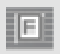
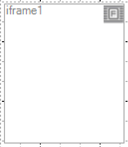
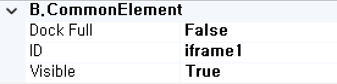
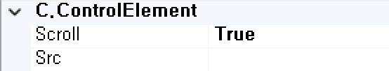

#  (iFrame)
사용자 정의 기능을 처리하는 컴포넌트입니다. 

<b style="font-size: 20px"> 1) 컴포넌트 이미지 </b>  
도구상자에서 iFrame 컴포넌트를 선택하여 화면작업 영역에 디자인합니다.  
  

<b style="font-size: 20px"> 2) 컴포넌트 속성 </b>  
화면작업 창에서 iFrame 컴포넌트 선택 시 속성 창에 설정이 가능한 항목에 값을 입력합니다.  
<b class="font18"> (1) B.CommonElement </b>  
  
<b class="font18"> ① DockFull </b>  
Full로 설정했을 경우 해당 컴포넌트 부모 컴포넌트 크기의 맞춰서 설정됩니다. 

<b class="font18"> ② ID </b>  
해당 컴포넌트의 ID를 설정합니다.  

<b class="font18"> ③ Visible </b>  
해당 컴포넌트를 화면에 보여줄지에 대한 여부를 설정합니다.  

<b class="font18"> (2) C.ControlElement </b>  
  
<b class="font18"> ① Scroll </b>  
스크롤 생성 여부를 설정합니다.  

<b style="font-size: 18px"> ② Src </b>  
Iframe 연결 주소를 설정합니다.  Ex) https://www.google.com/webhp?igu=1

