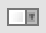
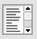

# 리스트 컴포넌트

## 1. &nbsp; (ComboBox)   
콤보박스 기능을 처리하는 컴포넌트입니다. 

## 2. &nbsp; (ListBox)   
리스트박스 기능을 처리하는 컴포넌트입니다.

## 3. &nbsp; (grid)   
테이블 형태의 데이터 처리를 수행하는 컴포넌트입니다.

## 4. &nbsp; (DataList)   
검색창의 자동완성 기능을 처리하는 컴포넌트입니다. (검색용 텍스트 박스의 list 속성에 설정됩니다.)

