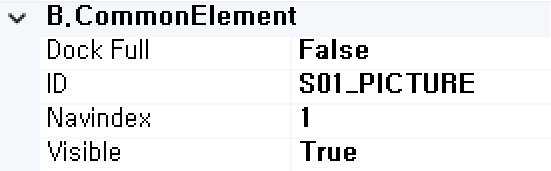

#  (PictureBox)
그림 이미지를 표시하는 컴포넌트입니다.

<b style="font-size: 20px"> 1) 컴포넌트 이미지 </b>  
도구상자에서 PictureBox 컴포넌트를 선택하여 화면작업 영역에 디자인합니다.  
  

<b style="font-size: 20px"> 2) 컴포넌트 속성 </b>  
화면작업 창에서 PictureBox 컴포넌트 선택 시 속성 창에 설정이 가능한 항목에 값을 입력합니다.  
<b style="font-size: 18px"> (1) A.Data </b>  
  
<b style="font-size: 18px"> ① Bind:Column </b>  
UI 화면작업 창의 Dataset 탭에서 등록한 Dataset Column을 할당하는 부분입니다.  
 

<b style="font-size: 18px"> ② Dataset </b>  
할당된 Dataset 명 표시합니다.  
<!-- Remark -->
::: tip <Badge type="tip" text="Remark" vertical="middle" /> 
Dataset Bind 했을 경우 Dataset_Column으로 해당 컴포넌트 ID가 자동으로 변환됩니다.  
Ex) Dataset : S01     Column : PictureBox  ⇒ 컴포넌트 ID : S01_PictureBox 
:::
<!-- -->

<b style="font-size: 18px"> (2) B.CommonElement </b>  
  
<b style="font-size: 18px"> ① Disabled </b>  
값이 True이면 수정 불가능(서버 전송 불가능) False 경우 해당 속성 사용하지 않습니다. 

<b style="font-size: 18px"> ② ID </b>  
해당 컴포넌트의 ID를 설정합니다.  

<b style="font-size: 18px"> ③ NavIndex </b>  
Index 값을 지정 후 Tab 키를 누르면 오름차순으로 이동하게 됩니다. 

<b style="font-size: 18px"> ④ Visible </b>  
해당 컴포넌트를 화면에 보여줄지에 대한 여부를 설정합니다. 

<b style="font-size: 18px"> (3) C.ControlElement </b>  
   
<b style="font-size: 18px"> ① Alt </b>  
해당 컴포넌트에 대한 설명을 입력합니다. 

<b style="font-size: 18px"> ② Cursor </b>  
해당 컴포넌트 위에 마우스 올렸을 때 모양을 설정합니다.  

<b style="font-size: 18px"> ③ imageFile </b>  
해당 컴포넌트의 이미지 파일 경로를 설정합니다. 

<b style="font-size: 18px"> ④ Usemap </b>  
#을 포함한 맵 id값을 설정 후 &nbsp; (user/svg Control) 컴포넌트를 생성하여 우측 속성 UserTag를 입력합니다. 
<!-- Remark -->
::: tip <Badge type="tip" text="Remark" vertical="middle" /> 
- <b> map 태그 </b>  
name : img 태그의 usemap 속성의 맵 id값과 동일하게 지정해야합니다.

- <b> area 태그 </b>  
target : 해당 영역 클릭시 url 열릴 위치를 지정합니다. (href 링크가 지정되어 있어야 합니다.)  
alt : 해당 영역의 설명을 입력합니다.   
href : 링크의 대한 경로를 입력합니다.  
coords : 해당 영역에 대한 좌표를 설정합니다.  
&emsp;&emsp;&emsp;&ensp;   
shape : 해당 영역에 대한 도형 유형을 입력합니다.
:::
<!-- -->

<b style="font-size: 20px"> 3) 컴포넌트 이벤트 </b>  
   
<b style="font-size: 18px"> (1) 1.MouseEvent </b>  
<b style="font-size: 18px"> ① OnClick </b>  
마우스를 클릭할 때 발생하는 이벤트입니다.  
<b style="font-size: 18px"> ② OnMosueDown </b>  
마우스 버튼을 누를 때 발생하는 이벤트입니다.  
<b style="font-size: 18px"> ③ OnMosueMove </b>  
마우스를 움직일 때 발생하는 이벤트입니다.  
<b style="font-size: 18px"> ④ OnMosueOut </b>  
마우스가 요소를 벗어날 때 발생하는 이벤트입니다.  
<b style="font-size: 18px"> ⑤ OnMosueOver </b>  
마우스가 요소 안에 들어올 때 발생하는 이벤트입니다.  
<b style="font-size: 18px"> ⑥ OnMosueUp </b>  
마우스 버튼을 뗄 때 발생하는 이벤트입니다.  
