# 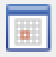 (Schedule)
달력 기반의 스케줄 관리기능을 처리하는 컴포넌트입니다. 

<b class="font20"> 1) 컴포넌트 이미지 </b>  
도구상자에서 Schedule 컴포넌트를 선택하여 화면작업 영역에 디자인합니다.  
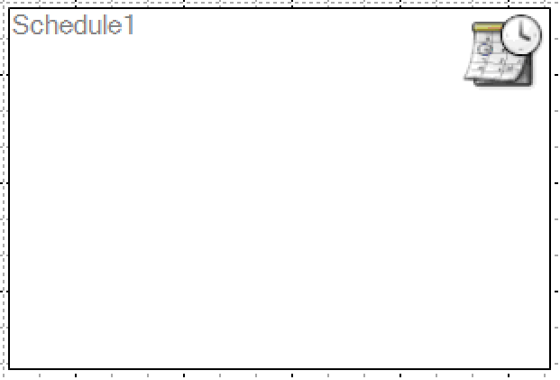  

<b class="font20"> 2) 컴포넌트 속성 </b>  
화면작업 창에서 Schedule 컴포넌트 선택 시 속성 창에 설정이 가능한 항목에 값을 입력합니다.  
<b class="font18"> (1) A.Data </b>  
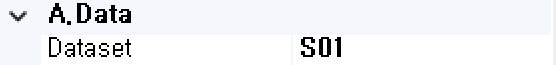  
<b class="font18"> ① Dataset </b>  
할당된 Dataset 명 표시합니다. 
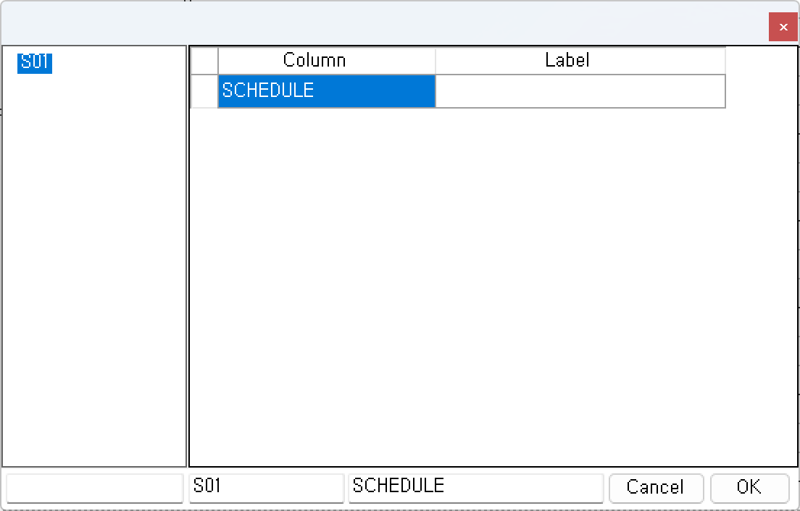  

<b class="font18"> (2) C.ControlElement </b>  
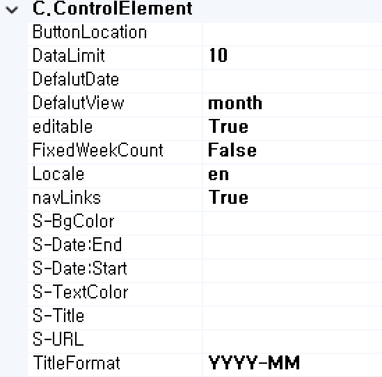  
<b style="font-size: 18px"> ① ButtonLocation </b>  
버튼 기능 및 위치를 설정합니다.  
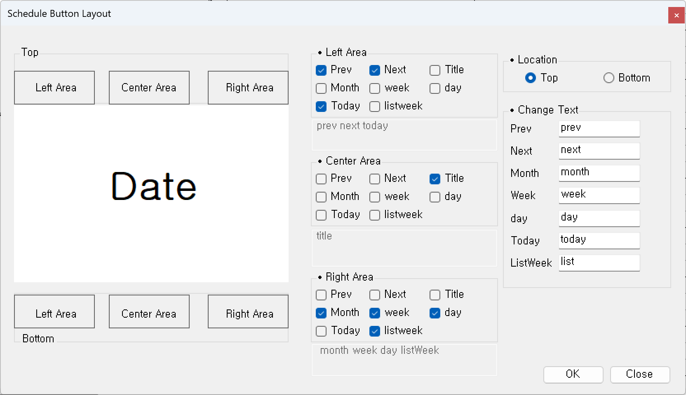  

- Top, Bottom  
Date 부분의 위치를 설정합니다.  
- Left, Center, Right Area  
왼쪽, 가운데, 오른쪽 영역에 대한 버튼을 체크박스로 클릭하여 해당 버튼들을 추가 및 제거합니다. 
- Location  
버튼을 상위에 둘 것인지 하위에 둘 것인지 선택합니다. 
- Change Text  
해당 컬럼을 원하는 텍스트로 변경이 가능합니다. 

<b style="font-size: 18px"> ② DataLimit </b>  
Day에 표시되는 데이터 제한을 설정합니다.  

<b style="font-size: 18px"> ③ DefalutDate </b>  
달력이 처음 로드될 때 표시되는 초기 날짜를 설정합니다. 

<b style="font-size: 18px"> ④ DefaultView </b>  
달력이 처음 로드될 때 보기를 설정합니다. 

- <b>month</b> 
월 단위로 보기를 설정합니다. 
- <b>basicWeek</b> 
주 단위로 보기를 설정합니다. 
- <b>basicDay</b> 
일 단위로 보기를 설정합니다. 
- <b>agendaWeek</b> 
시간 포함한 주 단위로 보기를 설정합니다. 
- <b>agendaDay</b> 
시간 포함한 일 단위로 보기를 설정합니다. 
- <b>listYear</b> 
리스트 형식의 해 단위로 보기를 설정합니다. 
- <b>listMonth</b> 
리스트 형식의 월 단위로 보기를 설정합니다. 
- <b>listWeek</b> 
리스트 형식의 주 단위로 보기를 설정합니다. 
- <b>listDay</b> 
리스트 형식의 일 단위로 보기를 설정합니다. 

<b style="font-size: 18px"> ⑤ editable </b>  
일정 수정을 드래그로 변경할 수 있는지에 대한 여부를 설정합니다. 

<b style="font-size: 18px"> ⑥ FixedWeekCount </b>  
true일 경우 월별보기에 표시되는 Week 수는 항상 6주입니다. false일 경우 월에 따라 Week 수가 변경됩니다. 

<b style="font-size: 18px"> ⑦ Locale </b>  
해당 컴포넌트의 언어를 설정합니다.  

<b style="font-size: 18px"> ⑧ navLinks </b>  
true일 경우 Week와 Day를 클릭할 수 있게 된다. 클릭 후 해당 일/주를 나타내는 화면으로 이동합니다. ]

<!-- Remark -->
::: tip <Badge type="tip" text="Remark" vertical="middle" /> <b> Schedule 사용 예 </b>
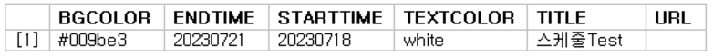   
<b>1. Dataset 설정 후 매핑</b>  
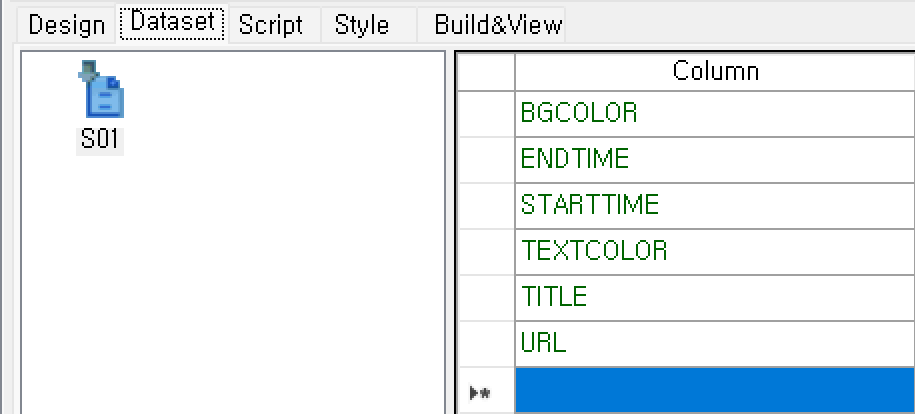
 ▶ 
 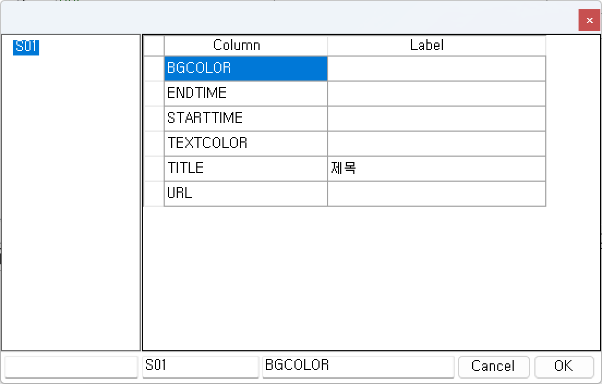  

<b>2. 우측 속성에 컬럼 설정</b>  
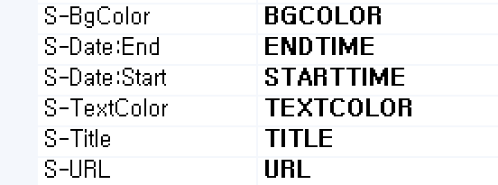   

<b>3. 서브미션 생성 후 확인</b>  
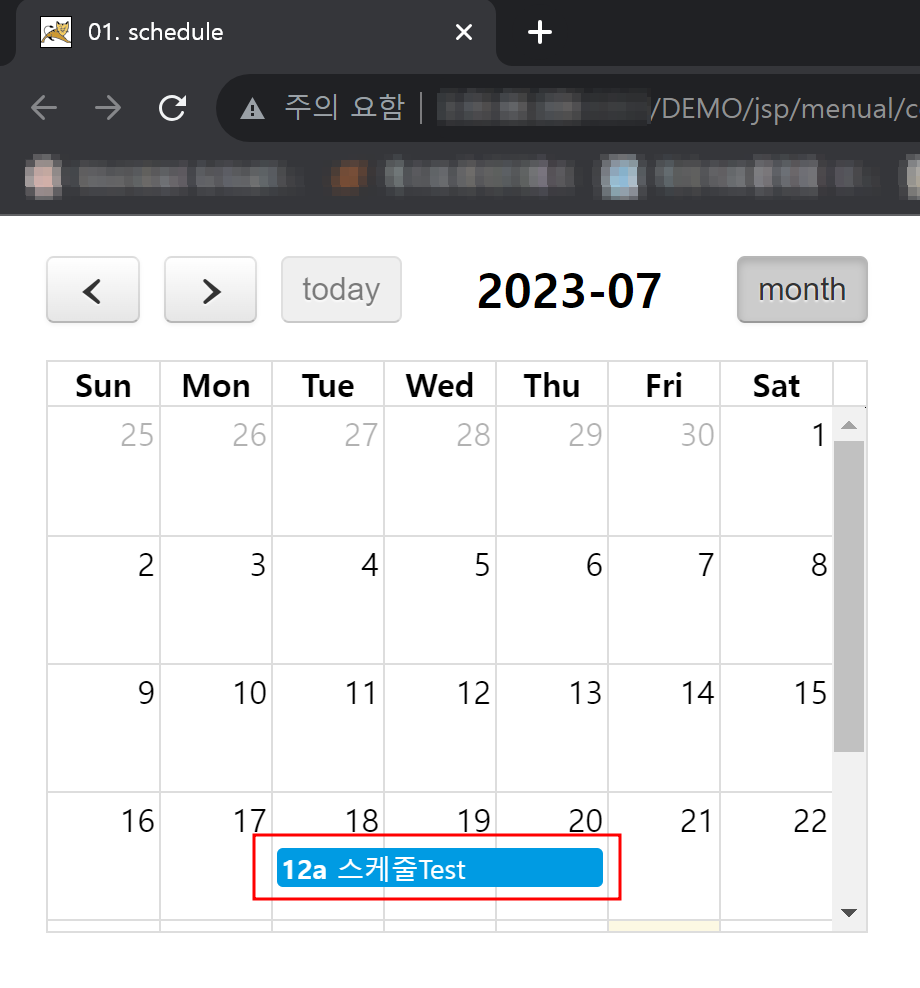   
:::
<!-- -->

<b style="font-size: 18px"> ⑨ S-BgColor </b>  
해당 컴포넌트의 일정에 대한 배경 색상을 설정할 컬럼을 선택합니다. 

<b style="font-size: 18px"> ⑩ S-Date:End </b>  
해당 컴포넌트의 일정에 대한 끝나는 시점을 설정할 컬럼을 선택합니다.  

<b style="font-size: 18px"> ⑪ S-Date:Start </b>  
해당 컴포넌트의 일정에 대한 시작 시점을 설정할 컬럼을 선택합니다.  

<b style="font-size: 18px"> ⑫ S-TextColor </b>  
해당 컴포넌트의 일정에 대한 텍스트 색상을 설정할 컬럼을 선택합니다.  

<b style="font-size: 18px"> ⑬ S-Title </b>  
해당 컴포넌트의 일정에 대한 내용을 설정할 컬럼을 선택합니다.  

<b style="font-size: 18px"> ⑭ S-Url </b>  
해당 컴포넌트의 일정에 대한 URL을 설정할 컬럼을 선택합니다.  

<b style="font-size: 18px"> ⑮ TitleFormat </b>  
Schedule 제목의 Format을 지정합니다.  

<b class="font20"> 3) 컴포넌트 이벤트 </b>  
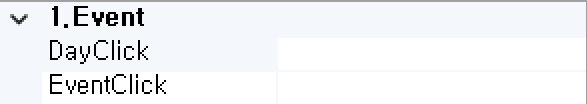   
<b class="font18"> (1) 1.Event </b>  
<b class="font18"> ① DayClick  </b>  
날짜 또는 시간을 클릭할 때 발생하는 이벤트입니다.  
<b class="font18"> ② EventClick  </b>  
이벤트를 클릭할 때 발생하는 이벤트입니다.  

