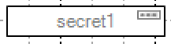
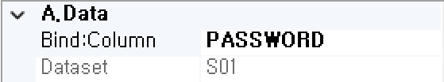
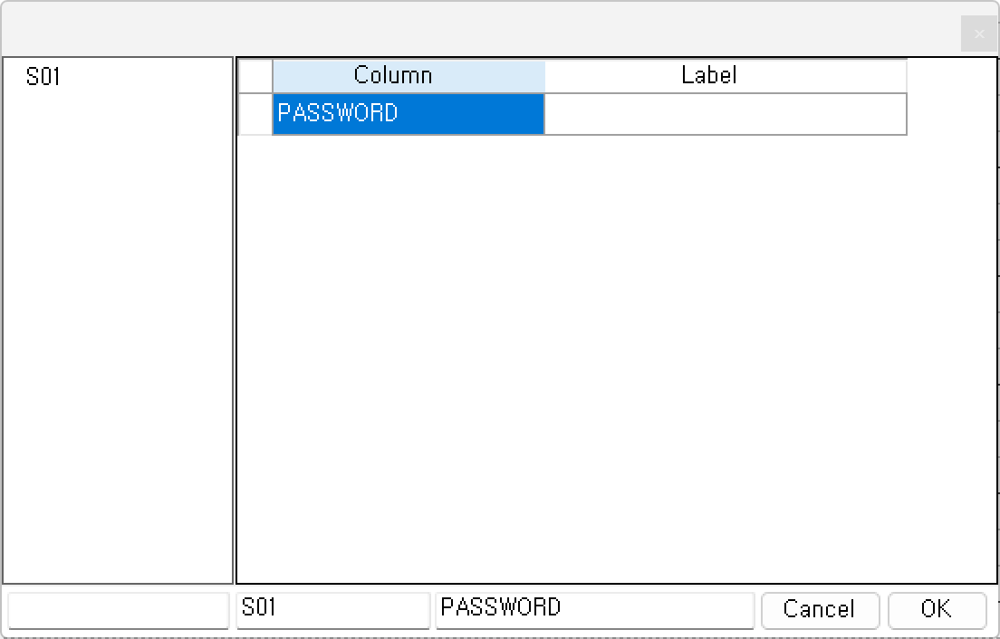

#  (Secret)
비밀번호 입력을 처리하는 컴포넌트입니다.

<b style="font-size: 20px"> 1) 컴포넌트 이미지 </b>  
도구상자에서 Secret 컴포넌트를 선택하여 화면작업 영역에 디자인합니다.  
  

<b style="font-size: 20px"> 2) 컴포넌트 속성 </b>  
화면작업 창에서 Secret 컴포넌트 선택 시 속성 창에 설정이 가능한 항목에 값을 입력합니다.  
<b style="font-size: 18px"> (1) A.Data </b>  
 

<b style="font-size: 18px"> ① Bind:Column </b>  
UI 화면작업 창의 Dataset 탭에서 등록한 Dataset Column을 할당하는 부분입니다.  
 

<b style="font-size: 18px"> ② Dataset </b>  
할당된 Dataset 명 표시합니다.  
<!-- Remark -->
<<<<<<< HEAD
::: details <Badge type="tip" text="Remark" vertical="middle" /> 
=======
::: tip <Badge type="tip" text="Remark" vertical="middle" /> 
>>>>>>> c7bdfee358fbef77e02c35739c51a0da2dd6c2aa
Dataset Bind 했을 경우 Dataset_Column으로 해당 컴포넌트 ID가 자동으로 변환됩니다.  
Ex) Dataset : S01     Column : PASSWORD  ⇒ 컴포넌트 ID : S01_PASSWORD  
:::
<!-- -->

<b style="font-size: 18px"> (2) B.CommonElement </b>  
  
<b style="font-size: 18px"> ① ID </b>  
해당 컴포넌트의 ID를 설정합니다.  

<b style="font-size: 18px"> ② Length </b>  
해당 컴포넌트의 길이를 설정합니다. 
<!-- Remark -->
<<<<<<< HEAD
::: details <Badge type="tip" text="Remark" vertical="middle" /> 
=======
::: tip <Badge type="tip" text="Remark" vertical="middle" /> 
>>>>>>> c7bdfee358fbef77e02c35739c51a0da2dd6c2aa
빌드를 했을 때 소스 상으로 size로 설정이 되어있지만 style 부분에 width도 같이 설정되어있어서 Length를 확인하려면 해당 컴포넌트 우측 속성에 styleOff을 true로 설정하면 해당 Length만큼 길이를 보여줍니다.
:::
<!-- -->

<b style="font-size: 18px"> ③ MaxLength </b>  
해당 컴포넌트의 최대 길이 제한을 설정합니다. 
Ex) 최대 길이가 12인 경우 12자리까지 입력 가능하다.

<b style="font-size: 18px"> ④ NavIndex </b>  
Index 값을 지정 후 Tab 키를 누르면 오름차순으로 이동하게 됩니다. 

<b style="font-size: 18px"> ⑤ ReadOnly </b>  
값이 True이면 포커스는 잡히지만 수정은 불가능합니다. 

<b style="font-size: 18px"> ⑥ Visible </b>  
해당 컴포넌트를 화면에 보여줄지에 대한 여부를 설정합니다.  

<b style="font-size: 18px"> (3) E.Validation </b>  
   
<b style="font-size: 18px"> ① Required-AlertMsg </b>  
해당 컴포넌트의 값을 입력하지 않았을 때 발생 되는 메시지 내용을 설정합니다. (submit(debug, requiredmsg)할 때 requiredmsg를 true로 설정합니다.)

<b style="font-size: 20px"> 3) 컴포넌트 이벤트 </b>  
   
<b style="font-size: 18px"> (1) 1.MouseEvent </b>  
<b style="font-size: 18px"> ① OnClick </b>  
마우스를 클릭할 때 발생하는 이벤트입니다.  
<b style="font-size: 18px"> ② OnMosueDown </b>  
마우스 버튼을 누를 때 발생하는 이벤트입니다.  
<b style="font-size: 18px"> ③ OnMosueMove </b>  
마우스를 움직일 때 발생하는 이벤트입니다.  
<b style="font-size: 18px"> ④ OnMosueOut </b>  
마우스가 요소를 벗어날 때 발생하는 이벤트입니다.  
<b style="font-size: 18px"> ⑤ OnMosueOver </b>  
마우스가 요소 안에 들어올 때 발생하는 이벤트입니다.  
<b style="font-size: 18px"> ⑥ OnMosueUp </b>  
마우스 버튼을 뗄 때 발생하는 이벤트입니다.  

<b style="font-size: 18px"> (2) 2.KeyEvent </b>  
<b style="font-size: 18px"> ① OnBlur </b>  
포커스를 잃었을 때 발생하는 이벤트입니다.  
<b style="font-size: 18px"> ② OnChange  </b>  
입력필드의 값이 바뀐 후 포커스를 잃었을 때 발생하는 이벤트입니다.  
<b style="font-size: 18px"> ③ OnFocus </b>  
포커스가 잡혔을 때 발생하는 이벤트입니다.  
<b style="font-size: 18px"> ④ OnKeyDown </b>  
키를 눌렀을 때 발생하는 이벤트입니다.  
<b style="font-size: 18px"> ⑤ OnKeypress </b>  
키를 누르고 있는 중 발생하는 이벤트입니다.  
<b style="font-size: 18px"> ⑥ OnKeyUp </b>  
키를 눌렀다가 뗄 때 발생하는 이벤트입니다.  
<b style="font-size: 18px"> ⑦ OnSelect </b>  
마우스로 입력된 텍스트를 드래그했을 때 발생하는 이벤트입니다.  
