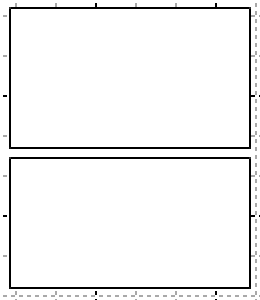
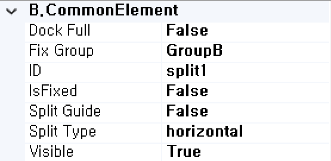
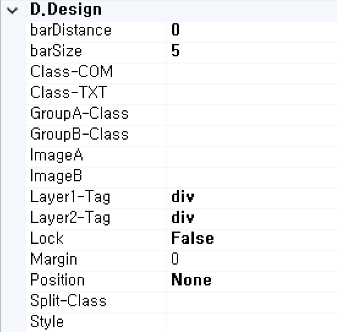
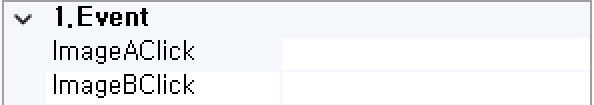

#  (SplitGroupBox)
컨테이너의 영역을 그룹으로 묶어서 표시하는 컴포넌트입니다. 

<b style="font-size: 20px"> 1) 컴포넌트 이미지 </b>  
도구상자에서 SplitGroupBox 컴포넌트를 선택하여 화면작업 영역에 디자인합니다.  
  

<b style="font-size: 20px"> 2) 컴포넌트 속성 </b>  
화면작업 창에서 SplitGroupBox 컴포넌트 선택 시 속성 창에 설정이 가능한 항목에 값을 입력합니다.  
<b style="font-size: 18px"> (1) B.CommonElement </b>  
  
<b style="font-size: 18px"> ① DockFull </b>  
Full로 설정했을 경우 해당 컴포넌트 부모 컴포넌트 크기의 맞춰서 설정됩니다. 

<b style="font-size: 18px"> ② Fix Group </b>  
창을 조절할 때 Fix Group이 none일 경우, 해당 컴포넌트 안에 화면들이 A, B가 조절이 되고 Group B인 경우는 B 부분만 조절이 된다. Group A인 경우는 A 부분만 조절이 됩니다.  

<b style="font-size: 18px"> ③ ID </b>  
해당 컴포넌트의 ID를 설정합니다.  

<b style="font-size: 18px"> ④ isFixed </b>  
해당 속성에 여부에 따라서 Dsign 탭에서는 Ctrl 키로 조절할 수 있고 화면 상에서는 마우스로 조절할 수 있습니다. 

<b style="font-size: 18px"> ⑤ Split Guid </b>  
True일 경우 해당 컴포넌트의 Guide 마지막 위치의 선 여부를 설정합니다. 

<b style="font-size: 18px"> ⑥ Split Type </b>  
해당 컴포넌트의 패널 방향을 세로 또는 가로로 설정합니다. 

<b style="font-size: 18px"> ⑦ Visible </b>  
해당 컴포넌트를 화면에 보여줄지에 대한 여부를 설정합니다.  

<b style="font-size: 18px"> (2) D.Design </b>  
  
<b style="font-size: 18px"> ① barDistance </b>  
해당 컴포넌트 top에서부터 거리를 설정합니다. 

<b style="font-size: 18px"> ② barSize </b>  
해당 컴포넌트의 그룹 사이의 사이즈를 설정합니다.  

<b style="font-size: 18px"> ③ Class-Com </b>  
Tool Box > User > View Common Config > Control-CSS에 해당 컴포넌트에서 지정한 Class 명을 설정합니다. 

<b style="font-size: 18px"> ④ Class-TXT </b>  
해당 컴포넌트의 Class 명을 지정합니다. 

<b style="font-size: 18px"> ⑤ GroupA-Class </b>  
해당 컴포넌트 상단에 있는 패널 부분에 Class 명을 지정합니다. 

<b style="font-size: 18px"> ⑥ GroupB-Class </b>  
해당 컴포넌트 하단에 있는 패널 부분에 Class 명을 지정합니다. 

<b style="font-size: 18px"> ⑦ Image(A~B) </b>  
해당 컴포넌트에 대한 이미지 경로를 설정합니다. Ex) /DEMO/img/test/up(down).png   

<b style="font-size: 18px"> ⑧ Layer(1~2)-Tag </b>  
해당 컴포넌트의 부모 태그를 설정합니다. 

<b style="font-size: 18px"> ⑨ Lock </b>  
해당 컴포넌트에 Lock을 설정하여 마우스로 해당 컴포넌트가 움직이지 못하게 고정합니다. 

<b style="font-size: 18px"> ⑩ Margin </b>  
해당 컴포넌트의 바깥쪽 공간 여백을 설정합니다.  

<b style="font-size: 18px"> ⑪ Position </b>  
해당 컴포넌트의 페이징의 총 개수에 대한 컬럼을 설정합니다.  
- Static : 위치를 임의로 설정해 줄 수 없기 때문에 차례대로 왼쪽에서 오른쪽, 위에서 아래로 쌓입니다.
- absolute : static 속성을 가지고 있지 않은 부모를 기준으로 움직입니다.
- relative : top, right, bottom, left 속성을 사용해 위치 조절이 가능합니다.
- Fixed : 스크롤과 상관없이 항상 특정 위치에 고정합니다.
- inherit : 부모 컴포넌트의 속성값을 상속받습니다.
<!-- Remark -->
::: tip <Badge type="tip" text="Remark" vertical="middle" /> 
position이 none일 경우 default 값이 relative로 처리됩니다.  
:::
<!-- -->

<b style="font-size: 18px"> ⑫ Split-Class </b>  
해당 컴포넌트 바에 대한 Class명을 입력.  

<b style="font-size: 18px"> ⑬ Style </b>  
해당 컴포넌트의 CSS, Style 사용합니다.  

<!-- Remark -->
::: tip <Badge type="tip" text="Remark" vertical="middle" /> 
- Color를 선택하는 팝업창을 사용하는 경우 색상을 클릭이 아니라 더블 클릭 후 OK 버튼을 클릭하여 색상을 지정한다.
- Class를 입력, StyleOff를 True 시 BackColor, BorderColor, Borderwidth, Font-Color 등 속성값이 적용되지 않는다.
- CSS 파일로 CSS를 사용하는 경우 Tool Box > User > View Common Config > Common File > CSS FILES에 등록 후 사
     용해야한다.
- Style에 값을 넣어서 사용하면 BackColor, BorderColor, Borderwidth, Font-Color 등 속성값이 적용되지 않는다.
- 우선순위 : 1순위 Style> 2순위 class> 3순위 속성
:::
<!-- -->

<b style="font-size: 18px"> 3) 컴포넌트 이벤트 </b>  
   
<b style="font-size: 18px"> (1) 1.Event </b>  
<b style="font-size: 18px"> ① ImageAClick </b>  
해당 컴포넌트 첫 번째 이미지를 클릭할 때 발생하는 이벤트트입니다.  
<b style="font-size: 18px"> ② ImageBClick </b>  
해당 컴포넌트 두 번째 이미지를 클릭할 때 발생하는 이벤트입니다.  