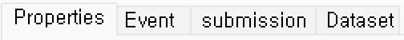

# 구성

## 1. 도구상자
저장 및 디자인에 필요한 Control 등 POWER MDD에서 사용되는 각종 기능들을 제공합니다.
<!-- -->

 

<b style="font-size: 20px"> 1\) &nbsp; (save) </b>  
디자인한 화면 내용을 저장 처리합니다.

<b style="font-size: 20px"> 2\) &nbsp; (ViewReload) </b>  
현재 저장이 되어 있는 화면 메뉴를 다시 로딩 처리합니다.

<b style="font-size: 20px"> 3\) &nbsp; (휴지통) </b>  
휴지통 기능으로 영구삭제 처리하지 않은 화면을 메뉴에서 복원이 가능합니다.

<b style="font-size: 20px"> 4\) &nbsp; (History) </b>  
이력을 확인하고 과거 작업 상태로 화면 Design을 Rollback 하여 확인할 수 있도록 지원한다.  

<b style="font-size: 20px"> 5\) &nbsp; (File Search) </b>  
View 메뉴에 있는 파일이나 Location을 검색하여 찾습니다.  

<b style="font-size: 20px"> 6\) &nbsp; (Copy/Select) </b>  
디자인 작업 중 유사한 화면을 복사, 편집 사용하고자 할 때 이용하면 편리하게 사용할 수 있는 기능입니다. 현재 디자인 화면의 정보를 복사합니다.

<b style="font-size: 20px"> 7\) &nbsp; (Node Move) </b>  
복사한 디자인 화면을 이동할 메뉴를 클릭하여 해당 메뉴로 이동합니다.

<b style="font-size: 20px"> 8\) &nbsp; (Layout Paste) </b>  
복사한 디자인 화면을 현재 오픈이 되어 있는 화면에 붙여넣기합니다.

 

<b style="font-size: 20px"> 9\) &nbsp; (Label) </b>  
텍스트 라벨을 표시하는 컴포넌트입니다.

<b style="font-size: 20px"> 10\) &nbsp; (TextBox) </b>  
텍스트 입력을 처리하는 컴포넌트입니다.

<b style="font-size: 20px"> 11\) &nbsp; (Secret) </b>  
비밀번호 입력을 처리하는 컴포넌트입니다.

<b style="font-size: 20px"> 12\) &nbsp; (button) </b>  
버튼 처리를 수행하는 컴포넌트입니다.

<b style="font-size: 20px"> 13\) &nbsp; (Calendar) </b>  
날짜 입력을 처리하는 컴포넌트입니다.

<b style="font-size: 20px"> 14\) &nbsp; (CheckBox) </b>  
체크박스 기능을 처리하는 컴포넌트입니다.

<b style="font-size: 20px"> 15\) &nbsp; (Radio) </b>  
라디오 버튼 기능을 처리하는 컴포넌트입니다.

<b style="font-size: 20px"> 16\) &nbsp; (TextArea) </b>  
많은 양의 텍스트 입력을 처리하는 컴포넌트입니다.

<b style="font-size: 20px"> 17\) &nbsp; (NumUpDown) </b>  
수치에 대한 증감 처리를 수행하는 컴포넌트입니다.

<b style="font-size: 20px"> 18\) &nbsp; (PictureBox) </b>  
그림 이미지를 표시하는 컴포넌트입니다.

<b style="font-size: 20px"> 19\) &nbsp; (FileButton) </b>  
파일 업로드 기능을 처리하는 컴포넌트입니다.

<b style="font-size: 20px"> 20\) &nbsp; (href) </b>  
Link 기능을 처리하는 컴포넌트입니다.

<b style="font-size: 20px"> 21\) &nbsp; (ComboBox) </b>  
콤보박스 기능을 처리하는 컴포넌트입니다. 

<b style="font-size: 20px"> 22\) &nbsp; (ListBox) </b>  
리스트박스 기능을 처리하는 컴포넌트입니다.

<b style="font-size: 20px"> 23\) &nbsp; (grid) </b>  
테이블 형태의 데이터 처리를 수행하는 컴포넌트입니다.

<b style="font-size: 20px"> 24\) &nbsp; (DataList) </b>  
검색창의 자동완성 기능을 처리하는 컴포넌트입니다.  
(검색용 텍스트 박스의 list 속성에 설정됩니다.)

<b style="font-size: 20px"> 25\) &nbsp; (groupbox) </b>  
여러 개의 Control을 그룹으로 묶어서 표시하는 컴포넌트입니다.

<b style="font-size: 20px"> 26\) &nbsp; (SplitGroupBox) </b>  
컨테이너의 영역을 그룹으로 묶어서 표시하는 컴포넌트입니다.

<b style="font-size: 20px"> 27\) &nbsp; (Tab) </b>  
탭 기능을 처리하는 컴포넌트입니다.

<b style="font-size: 20px"> 28\) &nbsp; (TableLayout) </b>  
테이블 형태로 Layout을 표시하는 컴포넌트입니다.

<b style="font-size: 20px"> 29\) &nbsp; (user/svg Control) </b>  
사용자 정의 기능을 처리하는 컴포넌트입니다.

<b style="font-size: 20px"> 30\) &nbsp; (IFrame) </b>  
IFrame 기능을 처리하는 컴포넌트입니다.

<b style="font-size: 20px"> 31\) &nbsp; (TreeView) </b>  
계층 구조를 가지는 데이터를 Tree 형태로 표시하는 컴포넌트입니다.

<b style="font-size: 20px"> 32\) &nbsp; (Progress) </b>  
진행 정도 나타내는 바 형태로 표시하는 컴포넌트입니다.

<b style="font-size: 20px"> 33\) &nbsp; (Component) </b>  
<b style="font-size: 18px"> (1) &nbsp; (schedule) </b>  
&nbsp; 달력 기반의 스케쥴 관리기능을 처리하는 컴포넌트입니다.  
<b style="font-size: 18px"> (2) &nbsp; (HtmlEdit) </b>  
&nbsp; 웹기반의 Html에디터 기능을 처리하는 컴포넌트입니다.  
<b style="font-size: 18px"> (3) &nbsp; (Chart) </b>  
&nbsp; 다양한 Chart 기능을 처리하는 컴포넌트입니다.  
<b style="font-size: 18px"> (4) &nbsp; (Dyn-Accordion) </b>  
&nbsp; 계층 구조를 가지는 데이터를 동적으로 표시하는 컴포넌트입니다.  

 

<b style="font-size: 20px"> 34\) &nbsp; (default Layout) </b>  
View Designer Layout 화면 전체를 볼 수 있습니다.

<b style="font-size: 20px"> 35\) &nbsp; (down close) </b>  
View Designer Layout 중 메시지 영역을 제외한 Layout 화면을 볼 수 있습니다.

<b style="font-size: 20px"> 36\) &nbsp; (left-down close) </b>  
View Designer Layout 화면 중 좌측에 화면 메뉴 구조 영역과 화면 메뉴 검색, 그리고 하단에 메시 
지 영역을 제외한 Layout 화면을 볼 수 있습니다.

<b style="font-size: 20px"> 37\) &nbsp; (All close) </b>  
View Designer Layout 화면 중 화면작업 영역만 Layout 화면을 볼 수 있습니다.

 

<b style="font-size: 20px"> 38\) &nbsp; (Up Align) </b>  
선택된 컴포넌트들을 위로 정렬합니다.

<b style="font-size: 20px"> 39\) &nbsp; (Down Align) </b>  
선택된 컴포넌트들을 아래로 정렬합니다.

<b style="font-size: 20px"> 40\) &nbsp; (Center Align) </b>  
선택된 컴포넌트들을 가운데로 정렬합니다.

<b style="font-size: 20px"> 41\) &nbsp; (Right Align) </b>  
선택된 컴포넌트들을 우측으로 정렬합니다.

<b style="font-size: 20px"> 42\) &nbsp; (Left Align) </b>  
선택된 컴포넌트들을 좌측으로 정렬합니다.

 

<b style="font-size: 20px"> 43\) &nbsp; (Equals Width) </b>  
선택된 컴포넌트들의 넓이를 변경합니다.

<b style="font-size: 20px"> 44\) &nbsp; (Equals Height) </b>  
선택된 컴포넌트들의 높이를 변경합니다.

<b style="font-size: 20px"> 45\) &nbsp; (H-Equal-Interval) </b>  
선택된 컴포넌트들의 세로 간격을 변경합니다.

<b style="font-size: 20px"> 46\) &nbsp; (V-Equal-Interval) </b>  
선택된 컴포넌트들의 가로 간격을 변경합니다.

## 2. 화면 메뉴 구조 영역 및 속성 영역
화면 메뉴 구조 영역은 업무 구조를 Tree View 형식으로 표현한 메뉴로 UI의 대상이 되는 화면의 메뉴 카테고리 영역입니다. 등록형식은 업무 메뉴와 메뉴를 구성하는 화면으로 분류됩니다.

<b style="font-size: 20px"> 1) 메뉴및 화면 추가/삭제 </b>  
 &emsp; &emsp;   
<b style="font-size: 18px"> (1) 메뉴(화면) 추가 </b>  
추가하고자 하는 업무 Node를 선택한 후 마우스 오른쪽 버튼을 클릭하면 Context Menu가 활성됩니다.  
활성 된 메뉴에서 메뉴 추가 선택하면 됩니다.  

::: tip <Badge type="tip" text="Remark" vertical="middle" /> 
메뉴 안에 메뉴를 추가하는 것은 가능하지만 화면이 있는 경우에는 메뉴 추가가 안됩니다.
:::

<b style="font-size: 18px"> (2) 삭제 </b>  
삭제하고자 하는 업무 Node를 선택한 후 삭제하면 됩니다.  

::: tip <Badge type="tip" text="Remark" vertical="middle" /> 
삭제 처리 시 삭제된 UI 화면은 &nbsp; (휴지통)으로 이동된다. 사용자 실수로 화면 삭제 시에는 휴지통으로 이동한 후 해당 화면을 복원 처리하면 됩니다.
:::

<b style="font-size: 18px"> (3) 영구삭제 </b>  
삭제 버튼과 똑같이 삭제하고자 하는 업무 서비스를 선택한 후 마우스 오른쪽 버튼을 클릭하면 Context Menu가 활성 됩니다. 활성 된 메뉴에서 영구삭제를 선택하면 됩니다.  

::: tip <Badge type="tip" text="Remark" vertical="middle" /> 
영구삭제 시에는 &nbsp; (휴지통)에서 복원 불가능합니다.
:::

<b style="font-size: 20px"> 2) 메뉴 및 화면 속성 설정 </b>  
 &emsp; &emsp;    
<b style="font-size: 18px"> (1) 기본 </b>  
- <b>명칭 </b>  
해당 화면의 이름을 입력합니다.  
- <b>업무구분명 </b>  
해당 화면의 업무에 대한 구분을 입력합니다.  
- <b>설명 </b>  
해당 화면에 대해 좀 더 상세히 내용을 기술합니다.  

<b style="font-size: 18px"> (2) 파일정보 </b>  
- <b>파일위치 </b>  
해당 화면이 저장될 파일 위치를 지정합니다.  
- <b>업무구분명 </b>  
해당 화면이 저장될 파일명을 지정합니다.  

<b style="font-size: 18px"> (3) 첨부내용 </b>  
- <b>CSSGROUP </b>  
Tool Box > User > View Common Config에 등록한 CSS를 사용하는 경우 사용할 GROUP명을 지정합니다.  
- <b>JSGROUP </b>  
Tool Box > User > View Common Config에 등록한 JS를 사용하는 경우 사용할 GROUP명을 지정합니다.  
- <b>ReadOnly </b>  
Tool Box > Users > User Manager의 ReadOnly 여부에 따라 UI 화면 접근이 됩니다.  
- <b>작업일시 </b>  
최근에 해당 UI 화면을 작업한 날짜 정보를 확인할 수 있습니다.  
- <b>작업자 </b>  
최근에 해당 UI 화면을 작업한 작업자 ID을 확인할 수 있습니다.  

## 3. 화면작업 영역
화면 메뉴에서 화면을 더블 클릭하게 되면 화면이 메인에 나오게 되고 Design, Dataset, Script, Style, Build&View 5개 탭을 볼 수 있습니다.  
 

<b style="font-size: 20px"> 1) Design </b>  
컴포넌트로 디자인하는 영역입니다.  
<b style="font-size: 18px"> (1) 컴포넌트 추가 </b>  
Design 영역에서 도구상자에 있는 컴포넌트를 추가하여 화면을 디자인할 수 있습니다.  

<b style="font-size: 18px"> (2) 화면 속성 </b>  
Design 영역에서 컴포넌트가 없는 빈 쪽을 클릭하면 우측에 공통 Design 속성을 확인할 수 있습니다.  
  
<b style="font-size: 18px"> ① D.Design </b>  
- <b>Change Class </b>  
해당 UI 화면에 디자인한 컴포넌트들의 Class 정보들을 확인할 수 있으며, 해당 컴포넌트의 Class를 추가, 등록, 삭제를 할 수 있습니다.  
 

::: tip <Badge type="tip" text="Remark" vertical="middle" /> 
-  
- 해당 컴포넌트에 ClassName을 최초로 등록한 Class명은 삭제가 되지 않습니다.
:::

- <b>Class </b>  
UI 화면의 Class명을 지정합니다.  
- <b>LocationOff </b>  
UI 화면에 디자인한 컴포넌트들의 위치 변경에 대한 여부를 설정합니다.  
- <b>Page Height(%) </b>  
UI 화면의 높이를 지정합니다.  
- <b>Page Width(%) </b>  
UI 화면의 너비를 지정합니다.  
- <b>Size </b>  
UI 화면의 사이즈를 지정합니다.  
- <b>SizeOff </b>  
UI 화면의 사이즈 변경에 대한 여부를 설정합니다.  
- <b>StyleOff </b>  
UI 화면에 디자인한 컴포넌트들의 CSS 변경에 대한 여부를 설정합니다. 

<b style="font-size: 18px"> ② D.Design </b>  
- <b>BaseLayer1∼5 </b>  
UI 화면에 div 태그를 하나 생성해서 Class명들을 지정합니다.  

<b style="font-size: 18px"> ③ X.Etc </b>  
- <b>Browser </b>  
UI 화면을 실행할 때 원하는 브라우저를 선택해서 실행이 가능합니다.  
- <b>Buid Type </b>  
UI 화면을 실행할 때 화면을 전체로 실행할지, 분할로 나눠서 실행할지 선택해서 실행합니다.  
- <b>Save Lock </b>  
마지막으로 작업한 개발자가 Lock을 YES로 했을 경우 다른 개발자는 Lock 걸려있는 해당 화면을 수정하지 못하게 막아놓습니다.  

::: tip <Badge type="tip" text="Remark" vertical="middle" /> 
YES로 설정한 개발자가 NO로 변경하지 않아도 Lock은 최대 하루가 지나는 경우 자동으로 NO로 변경이 됩니다.
:::

- <b>Script Location </b>  
UI 화면을 실행할 때 Script를 Head에 설정할지 Bottom에 설정할지 선택합니다.

<b style="font-size: 20px"> 2) Dataset </b>  
화면에서 사용되는 Dataset 설정(In – Out)하는 부분입니다.  
  
<b style="font-size: 18px"> (1) Dataset 목록 </b>  
- Model과 연결하기 전에 해당 화면에 있는 컴포넌트와 바인딩하는 형태로 사용됩니다.  
화면에 있는 컴포넌트는 화면에 보여주기 위한 형태이고 실제로 데이터를 가지고 있는 것은 Dataset입니다.  
- 마우스 오른쪽 버튼을 클릭하면 Dataset을 추가 또는 삭제할 수 있습니다.  
하나의 Dataset을 추가하고 우측 영역에서 컬럼들을 설정할 수 있고 등록한 Dataset은 Design에서 만든 컴포넌트에 Bind해서 사용할 수 있습니다.  
 

<b style="font-size: 18px"> (2) Dataset Column 목록 </b>  
생성한 데이터셋을 선택하여 우측 영역에 컬럼 부분을 더블 클릭하여 컬럼을 1개씩 등록하거나 Service Model 탭을 이용하여 다중으로 컬럼을 등록할 수 있습니다.

<b style="font-size: 18px"> (3) 데이터셋 지정 </b>  
Design 탭에 가서 컴포넌트를 생성 후 우측 속성 Bind:Column 속성 팝업창에서 Bind할 컬럼을 선택하면 해당 컴포넌트에 컬럼이 할당됩니다.  

<b style="font-size: 20px"> 3) Script </b>  
해당 화면에서 사용되는 javascript 내용을 작성하는 부분입니다.  
  
<b style="font-size: 18px"> (1) Script 팝업창 </b>  
<b style="font-size: 18px"> ① Common JS </b>  
해당 UI 화면에 연결이 되어 있는 JS를 보여줍니다.  
  

<b style="font-size: 18px"> ② Common CSS </b>  
해당 UI 화면에 연결이 되어 있는 CSS를 보여줍니다.  
  

<b style="font-size: 18px"> ③ Html Meta </b>  
해당 UI 화면에 연결이 되어 있는 Html Meta를 등록합니다.  
  

<b style="font-size: 18px"> ④ SCRIPT </b>  
디자인한 UI 화면 등을 동시에 볼 수 있도록 Script 영역을 팝업창으로 열어 작업할 수 있습니다.  
 

<b style="font-size: 18px"> (2) Script 작업 영역 </b>  
Script 작업 영역이 2개로 나눠져 있는데 하단에 있는 Script 영역은 $(document).ready 함수 영역입니다.  
$(document).ready 함수 영역은 화면이 onload일 경우에 많이 사용됩니다.  
 

<b style="font-size: 18px"> (3) 단축키 </b>  
Script 작업 영역에 자주 사용하는 Script을 블록처리해서 Alt 키를 누르면서 좌측에 있는 Key를 입력하면 목록에 등록이 되고 삭제하는 경우 똑같이 Alt키 + Key를 입력하면 삭제도 가능합니다.  
해당 목록을 더블 클릭하면 등록한 단축키를 사용할 수 있습니다.  
 

<b style="font-size: 18px"> (4) Hidden Control </b>  
해당 UI 화면에서 사용되는 CSS 내용을 작성하는 부분입니다.  
 

<b style="font-size: 20px"> 4) Style </b>  
해당 UI 화면에서 사용되는 CSS 내용을 작성하는 부분입니다.  

<b style="font-size: 20px"> 5) Build&View </b>  
해당 UI 화면에서 지정한 브라우저로 화면을 실행할 수 있습니다.  

::: tip <Badge type="tip" text="Remark" vertical="middle" /> <b> 브라우저 설정 </b>
해당 UI 화면작업 창에 빈 영역을 클릭해서 우측 속성에 브라우저를 변경합니다.  
  
:::
<!-- -->

## 4. 속성 영역
화면 메뉴에서 화면을 더블 클릭하게 되면 화면이 메인에 나오게 되고 Design, Dataset, Script, Style, Build&View 5개 탭을 볼 수 있습니다.  

<b style="font-size: 18px"> (1) Properties </b>  
화면에 대한 속성이나 각 컴포넌트에 대한 속성을 설정할 수 있습니다.  
  

<b style="font-size: 18px"> (2) Event </b>  
선택한 컴포넌트에 대한 이벤트 함수를 호출합니다.  
