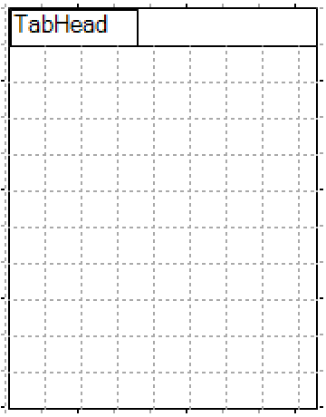
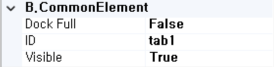
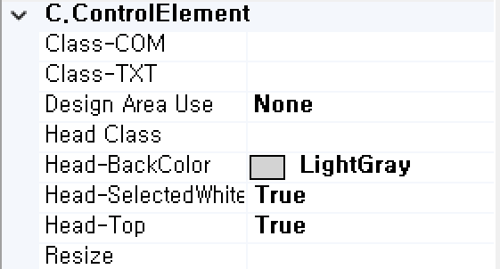
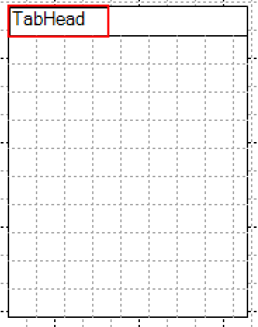
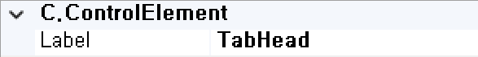
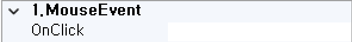
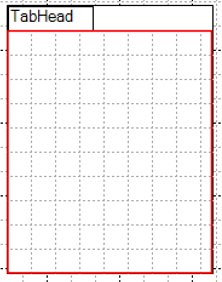
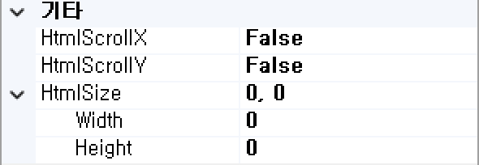
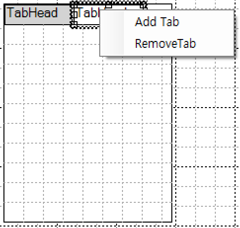

#  (Tab)
탭 기능을 처리하는 컴포넌트입니다. 

<b style="font-size: 20px"> 1) 컴포넌트 이미지 </b>  
도구상자에서 Tab 컴포넌트를 선택하여 화면작업 영역에 디자인합니다.  
  

<b style="font-size: 20px"> 2) 컴포넌트 속성 </b>  
화면작업 창에서 Tab 컴포넌트 선택 시 속성 창에 설정이 가능한 항목에 값을 입력합니다.  
<b style="font-size: 18px"> (1) B.CommonElement </b>  
  
<b style="font-size: 18px"> ① DockFull </b>  
Full로 설정했을 경우 해당 컴포넌트 부모 컴포넌트 크기의 맞춰서 설정됩니다. 

<b style="font-size: 18px"> ② ID </b>  
해당 컴포넌트의 ID를 설정합니다.  

<b style="font-size: 18px"> ③ Visible </b>  
해당 컴포넌트를 화면에 보여줄지에 대한 여부를 설정합니다.  

<b style="font-size: 18px"> (2) C.ControlElement </b>  
  
<b style="font-size: 18px"> ① Class-Com </b>  
Tool Box > User > View Common Config > Control-CSS에 해당 컴포넌트에서 지정한 Class 명을 설정합니다. 

<b style="font-size: 18px"> ② Class-TXT </b>  
해당 컴포넌트의 Class 명을 지정합니다. 

<b style="font-size: 18px"> ③ Class-Com </b>  
Tool Box > User > View Common Config > Control-CSS에 해당 컴포넌트에서 지정한 Class 명을 설정합니다. 

<b style="font-size: 18px"> ④ Design Area Use </b>  
해당 컴포넌트의 디자인 영역 사용을 설정합니다. 
<!-- Remark -->
::: tip <Badge type="tip" text="Remark" vertical="middle" /> <b> Scroll_XY </b>
- 해당 속성을 사용하려면 TabBody 영역의 속성 HtmlScrollX 또는 HtmlScrollY를 True로 설정해야합니다.
- 해당 컴포넌트 사이즈를 조절하면 TabBody 영역에 초록색 테두리가 생성되면서 초록색 테두리와 검정색 테두리 사이에는 스크롤바가 생성이 됩니다.
:::
<!-- -->
<b style="font-size: 18px"> ⑤ Head Class </b>  
해당 컴포넌트 Head에 대한 Class 명을 입력합니다. 

<b style="font-size: 18px"> ⑥ Head-BackColor </b>  
해당 컴포넌트 Head에 대한 Class 명을 입력합니다. 

<b style="font-size: 18px"> ⑦ Head-SelectedWhite </b>  
해당 속성 유무에 따라 Head 영역 위치가 설정니다.

<b style="font-size: 18px"> ⑧ Head-Top </b>  
해당 컴포넌트에서 li 태그에 대한 Class 명을 입력합니다. 

<b style="font-size: 18px"> 3) 컴포넌트 Head 영역 속성 </b>  
해당 컴포넌트에서 Tab Head를 선택 시 속성 창에 설정이 가능한 항목에 값을 입력합니다.  
   

<b style="font-size: 18px"> (1) C.ControlElement </b>  
  
<b style="font-size: 18px"> ① Label </b>  
화면에 보여주는 Tab Head 영역의 텍스트를 입력합니다.

<b style="font-size: 18px"> 4) 컴포넌트 Head 이벤트 </b>  
   
<b style="font-size: 18px"> (1) 1.MouseEvent </b>  
<b style="font-size: 18px"> ① OnClick </b>  
마우스를 클릭할 때 발생하는 이벤트입니다.  

<b style="font-size: 18px"> 5) 컴포넌트 Body 영역 속성 </b>  
해당 컴포넌트에서 Tab Body를 선택 시 속성 창에 설정이 가능한 항목에 값을 입력합니다.  
   

<b style="font-size: 18px"> (1) 기타 </b>  
  
<b style="font-size: 18px"> ① HtmlScrollX </b>  
X 축 스크롤바에 대한 생성 여부를 설정합니다. 

<b style="font-size: 18px"> ② HtmlScrollY </b>  
Y 축 스크롤바에 대한 생성 여부를 설정합니다.  

<b style="font-size: 18px"> ③ HtmlSize </b>  
해당 컴포넌트 Body 영역에 너비와 높이를 설정합니다. 

<b style="font-size: 18px"> 6) 컴포넌트 Head 영역 Context Menu </b>  
탭 Head 영역에서 마우스 오른쪽 클릭하면 2개의 Context Menu가 보입니다.  
   

<b style="font-size: 18px"> (1) 기타 </b>  
  
<b style="font-size: 18px"> ① Add Tab </b>  
해당 메뉴를 클릭하면 우측에 탭이 추가됩니다. 

<b style="font-size: 18px"> ② RemoveTab </b>  
삭제할 탭을 선택 후 해당 메뉴를 클릭하면 선택된 탭이 삭제됩다.  
<!-- Remark -->
::: tip <Badge type="tip" text="Remark" vertical="middle" />
탭이 2개 이상 있을 때 RemoveTab 메뉴가 생성됩니다.
:::
<!-- -->