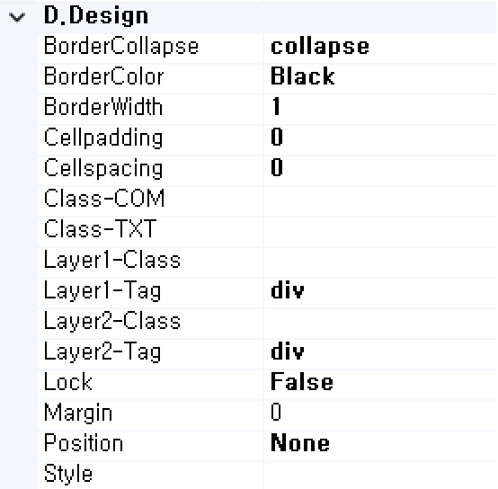

#  (TableLayout)
테이블 형태로 Layout을 표시하는 컴포넌트입니다. 

<b style="font-size: 20px"> 1) 컴포넌트 이미지 </b>  
도구상자에서 TableLayout 컴포넌트를 선택하여 화면작업 영역에 디자인합니다.  
  

<b style="font-size: 20px"> 2) 컴포넌트 속성 </b>  
화면작업 창에서 TableLayout 컴포넌트 선택 시 속성 창에 설정이 가능한 항목에 값을 입력합니다.  
<b class="font18"> (1) B.CommonElement </b>  
  
<b class="font18"> ① DockFull </b>  
Full로 설정했을 경우 해당 컴포넌트 부모 컴포넌트 크기의 맞춰서 설정됩니다. 

<b class="font18"> ② ID </b>  
해당 컴포넌트의 ID를 설정합니다.  

<b class="font18"> ③ Visible </b>  
해당 컴포넌트를 화면에 보여줄지에 대한 여부를 설정합니다.  

<b class="font18"> (2) C.ControlElement </b>  
  
<b class="font18"> ① ColumnSize </b>  
해당 컴포넌트의 Cloumn 개수를 설정합니다. 

<b class="font18"> ② EqualsHeight </b>  
해당 컴포넌트의 높이가 똑같도록 설정합니다. 

<b class="font18"> ③ EqualsWidth </b>  
해당 컴포넌트의 넓이가 똑같도록 설정합니다. 

<b class="font18"> ④ RowSize </b>  
해당 컴포넌트의 Row 개수를 설정합니다. 

<b class="font18"> ⑤ TableLayout </b>  
해당 컴포넌트의 Row, Column Cell 속성을 설정합니다. 
<!-- Remark -->
::: tip <Badge type="tip" text="Remark" vertical="middle" /> <b> TableLayout 팝업창 </b>
<b>1. Column Style </b>  
해당 컴포넌트에서 각 컬럼의 속성을 설정합니다.  
  

<b class="font18"> ① BgColor </b>  
해당 컴포넌트에서 컬럼의 배경색을 설정합니다. 

<b class="font18"> ② ClassName </b>  
Tool Box > User > View Common Config > Control-CSS에 해당 컴포넌트에서 지정한 Class 명을 설정합니다.

<b class="font18"> ③ Class-TxT </b>  
해당 컴포넌트에서 컬럼의 Class 명을 지정합니다. 

<b class="font18"> ④ ColumnIndex </b>  
해당 컴포넌트에서 컬럼의 Index 번호를 설정합니다. 

<b class="font18"> ⑤ DockFull </b>  
Full로 설정했을 경우 해당 컴포넌트 컬럼 크기의 맞춰서 설정됩니다. 

<b class="font18"> ⑥ HorizontalAlign </b>  
해당 컴포넌트 컬럼 안에 있는 컴포넌트를 수평으로 정렬합니다. 

<b class="font18"> ⑦ HorizontalAlignValue </b>  
해당 컴포넌트 컬럼 안에 있는 컴포넌트를 수평으로 정렬의 위치를 설정합니다.  

  - HorizontalAlign의 값이 Left 또는 Right로 설정되어야 합니다.

  
<b class="font18"> ⑧ Padding </b>  
해당 컴포넌트의 소수점을 설정 후 해당 자리수가 초과 입력 시 메시지가 발생합니다. 

<b class="font18"> ⑨ Position </b>  
해당 컴포넌트의 값을 입력하지 않았을 때 발생 되는 메시지 내용을 설정합니다. 
- Static : 위치를 임의로 설정해 줄 수 없기 때문에 차례대로 왼쪽에서 오른쪽, 위에서 아래로 쌓입니다.
- absolute : static 속성을 가지고 있지 않은 부모를 기준으로 움직입니다.
- relative : top, right, bottom, left 속성을 사용해 위치 조절이 가능합니다.
- Fixed : 스크롤과 상관없이 항상 특정 위치에 고정합니다.
- inherit : 부모 컴포넌트의 속성값을 상속받습니다.

<b class="font18"> ⑩ VerticalAlign </b>  
해당 컴포넌트의 문자열 형식을 설정합니다.  

<b class="font18"> ⑪ VerticalAlignValue </b>  
해당 컴포넌트의 페이징의 총 개수에 대한 컬럼을 설정합니다.  

<b class="font18"> ⑫ WidthApply </b>  
해당 컴포넌트의 Row 높이를 설정합니다.  

- HTableLayout에서 Layout Size로 수정은 가능합니다.

  
<b>2. Row Style</b>  
해당 컴포넌트에서 각 로우의 속성을 설정합니다.   
  

<b class="font18"> ① Cells </b>  
해당 컴포넌트에서 로우의 각 컬럼 속성을 설정합니다. 
  

<b class="font18"> ② CellsBorderColor </b>  
해당 컴 해당 컴포넌트에서 컬럼의 테두리 색상을 설정합니다. 

<b class="font18"> ③ CellsBorderStyle </b>  
해당 컴포넌트에서 컬럼의 테두리 종류를 설정합니다.

<b>CellsBorderColor, CellsBorderStyle </b>  
- BorderWidth default 값이 0이기 때문에 Color를 지정하더라도 BorderColor는 지정했지만  
&ensp; 화면상으로 확인이 불가능합니다.  
- 테두리 넓이를 지정해야 Build 후 해당 화면에 Border Color가 적용이 되었는지 확인할 수 있 
&ensp; 습니다.

  
<b class="font18"> ④ CellsBorderWidth </b>  
해당 컴포넌트에서 컬럼의 테두리 종류를 설정합니다. 

<b class="font18"> ⑤ ClassName </b>  
Tool Box > User > View Common Config > Control-CSS에 해당 컴포넌트에서 지정한 Class 명을 설정합니다.

<b class="font18"> ⑥ Class-TxT </b>  
해당 컴포넌트에서 컬럼의 Class 명을 지정합니다. 

<b class="font18"> ⑦ HeightApply </b>  
Style에서 높이 수정에 대한 여부를 설정합니다. >

- TableLayout에서 Layout Size로 수정은 가능불가능합니다.  

  
<b class="font18"> ⑧ LocationOff </b>  
모든 컴포넌트가 겹치지 않게 자동 정렬을 제거하여 가운데 정렬을 합니다.  

<b class="font18"> ⑨ Order Type </b>  

<b class="font18"> ⑩ Position </b>  
해당 컴포넌트 컬럼의 위치를 설정합니다. 
- Static : 위치를 임의로 설정해 줄 수 없기 때문에 차례대로 왼쪽에서 오른쪽, 위에서 아래로 쌓입니다.
- absolute : static 속성을 가지고 있지 않은 부모를 기준으로 움직입니다.
- relative : top, right, bottom, left 속성을 사용해 위치 조절이 가능합니다.
- Fixed : 스크롤과 상관없이 항상 특정 위치에 고정합니다.
- inherit : 부모 컴포넌트의 속성값을 상속받습니다.

<b>3. Layout Size</b>  
해당 컴포넌트에서 각 컬럼과 로우의 넓이와 높이 사이즈를 설정합니다.  
  

- Layout Size 변경시 해당 컴포넌트 우측 속성의 EqualsHeight 또는 EqualsWidth는 Fasle여야  
&ensp; 합니다.  

  
:::
<!-- -->

<b class="font18"> (3) D.Design </b>  
  
<b style="font-size: 18px"> ① BorderCollapse </b>  
테이블 cell 테두리의 겹침 속성을 설정합니다. 

<b style="font-size: 18px"> ② BorderColor </b>  
해당 컴포넌트의 ID를 설정합니다.  

<b style="font-size: 18px"> ③ BorderWidth </b>  
해당 컴포넌트의 테두리 색상을 설정합니다. 

<b style="font-size: 18px"> ④ Cellpadding </b>  
해당 컴포넌트의 테두리 넓이를 설정합니다. 

<b style="font-size: 18px"> ⑤ Cellspacing </b>  
셀 사이의 공간 크기를 설정합니다. 

<b style="font-size: 18px"> ⑥ Class-Com </b>  
Tool Box > User > View Common Config > Control-CSS에 해당 컴포넌트에서 지정한 Class 명을 설정합니다. 

<b style="font-size: 18px"> ⑦ Class-TXT </b>  
해당 컴포넌트의 Class 명을 지정합니다.  

<b style="font-size: 18px"> ⑧ Layer(1~2)-Class </b>  
Layer-Tag에서 지정한 부모 태그의 Class 명을 입력합니다. 

<b style="font-size: 18px"> ⑨ RLayer(1~2)-Tag </b>  
해당 컴포넌트의 부모 태그를 설정합니다. 
<!-- Remark -->
::: tip <Badge type="tip" text="Remark" vertical="middle" /> 
해당 컴포넌트의 부모 태그를 설정하기 위해서는 Layer(1~2)-Class에서 Class 명을 입력해야 해당 부모 태그가 생성됩니다. 
:::
<!-- -->
<b style="font-size: 18px"> ⑩ Lock </b>  
해당 컴포넌트에 Lock을 설정하여 마우스로 해당 컴포넌트가 움직이지 못하게 고정합니다.  

<b style="font-size: 18px"> ⑪ Margin </b>  
해당 컴포넌트의 바깥쪽 공간 여백을 설정합니다.  

<b style="font-size: 18px"> ⑫ Position </b>  
해당 컴포넌트의 위치를 설정합니다.  
- Static : 위치를 임의로 설정해 줄 수 없기 때문에 차례대로 왼쪽에서 오른쪽, 위에서 아래로 쌓입니다.
- absolute : static 속성을 가지고 있지 않은 부모를 기준으로 움직입니다.
- relative : top, right, bottom, left 속성을 사용해 위치 조절이 가능합니다.
- Fixed : 스크롤과 상관없이 항상 특정 위치에 고정합니다.
- inherit : 부모 컴포넌트의 속성값을 상속받습니다. 

<b style="font-size: 18px"> ⑬ Style </b>  
해당 컴포넌트의 보여지는 Row 개수를 설정합니다.  
Ex) border: 1px solid #bbb;border-radius: 4px; backgroud-color:white; ...  
<!-- Remark -->
::: tip <Badge type="tip" text="Remark" vertical="middle" /> 
- Color를 선택하는 팝업창을 사용하는 경우 색상을 클릭이 아니라 더블 클릭 후 OK 버튼을 클릭하여 색상을 지정합니다.
- Class를 입력, StyleOff를 True 시 BackColor, BorderColor, Borderwidth, Font-Color 등 속성값이 적용되지 않습니다.
- CSS 파일로 CSS를 사용하는 경우 Tool Box > User > View Common Config > Common File > CSS FILES에 등록 후 사용해야합니다.
- Style에 값을 넣어서 사용하면 BackColor, BorderColor, Borderwidth, Font-Color 등 속성값이 적용되지 않습니다.
- 우선순위 : 1순위 Style> 2순위 class> 3순위 속성
:::
<!-- -->

