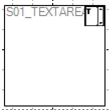
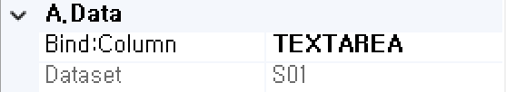
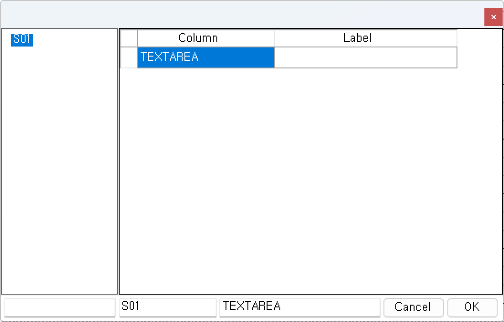
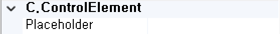
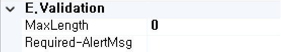

#  (TextArea)
많은 양의 텍스트 입력을 처리하는 컴포넌트입니다.

<b style="font-size: 20px"> 1) 컴포넌트 이미지 </b>  
도구상자에서 TextArea 컴포넌트를 선택하여 화면작업 영역에 디자인합니다.  
  

<b style="font-size: 20px"> 2) 컴포넌트 속성 </b>  
화면작업 창에서 TextArea 컴포넌트 선택 시 속성 창에 설정이 가능한 항목에 값을 입력합니다.  
<b style="font-size: 18px"> (1) A.Data </b>  
  
<b style="font-size: 18px"> ① Bind:Column </b>  
UI 화면작업 창의 Dataset 탭에서 등록한 Dataset Column을 할당하는 부분입니다.  
 

<b style="font-size: 18px"> ② Dataset </b>  
할당된 Dataset 명 표시합니다.  
<!-- Remark -->
<<<<<<< HEAD
::: details <Badge type="tip" text="Remark" vertical="middle" /> 
=======
::: tip <Badge type="tip" text="Remark" vertical="middle" /> 
>>>>>>> 511382b79aff54c321790ef1cc623e0fdb81902e
Dataset Bind 했을 경우 Dataset_Column으로 해당 컴포넌트 ID가 자동으로 변환됩니다.  
Ex) Dataset : S01     Column : TEXTAREA  ⇒ 컴포넌트 ID : S01_TEXTAREA 
:::
<!-- -->

<b style="font-size: 18px"> (2) B.CommonElement </b>  
  
<b style="font-size: 18px"> ① Disabled </b>  
값이 True이면 수정 불가능(서버 전송 불가능) False 경우 해당 속성 사용하지 않습니다. 

<b style="font-size: 18px"> ② DockFull </b>  
Full로 설정했을 경우 해당 컴포넌트 부모 컴포넌트 크기의 맞춰서 설정합니다.  

<b style="font-size: 18px"> ③ ID </b>  
해당 컴포넌트의 ID를 설정합니다. 

<b style="font-size: 18px"> ④ NavIndex </b>  
Index 값을 지정 후 Tab 키를 누르면 오름차순으로 이동하게 됩니다. 

<b style="font-size: 18px"> ⑤ ReadOnly </b>  
값이 True이면 포커스는 잡히지만 수정은 불가능합니다. 

<b style="font-size: 18px"> ⑥ Value </b>  
해당 컴포넌트의 들어가는 값을 설정합니다. 

<b style="font-size: 18px"> ⑦ Visible </b>  
해당 컴포넌트를 화면에 보여줄지에 대한 여부를 설정합니다.  

<b style="font-size: 18px"> (3) C.ControlElement </b>  
   
<b style="font-size: 18px"> ① Placeholder </b>  
해당 컴포넌트의 적절한 값을 입력할 수 있도록 도움말을 간단하게 입력한다. 포커스가 잡히고 값을 입력하면 해당 값은 사라집니다.

<b style="font-size: 18px"> (4) E.Validation </b>  
   
<b style="font-size: 18px"> ① MaxLength </b>  
해당 컴포넌트의 최대 길이 제한을 설정합니다.  
Ex) 최대 길이가 12인 경우 12자리까지 입력이 가능합니다. 

<b style="font-size: 18px"> ② Required-AlertMsg </b>  
해당 컴포넌트의 값을 입력하지 않았을 때 발생 되는 메시지 내용을 설정합니다.  
(submit(debug, requiredmsg)할 때 requiredmsg를 true로 설정합니다.)

<b style="font-size: 20px"> 3) 컴포넌트 이벤트 </b>  
   
<b style="font-size: 18px"> (1) 1.MouseEvent </b>  
<b style="font-size: 18px"> ① OnClick </b>  
마우스를 클릭할 때 발생하는 이벤트입니다.  
<b style="font-size: 18px"> ② OnMosueDown </b>  
마우스 버튼을 누를 때 발생하는 이벤트입니다.  
<b style="font-size: 18px"> ③ OnMosueMove </b>  
마우스를 움직일 때 발생하는 이벤트입니다.  
<b style="font-size: 18px"> ④ OnMosueOut </b>  
마우스가 요소를 벗어날 때 발생하는 이벤트입니다.  
<b style="font-size: 18px"> ⑤ OnMosueOver </b>  
마우스가 요소 안에 들어올 때 발생하는 이벤트입니다.  
<b style="font-size: 18px"> ⑥ OnMosueUp </b>  
마우스 버튼을 뗄 때 발생하는 이벤트입니다.  

<b style="font-size: 18px"> (2) 2.KeyEvent </b>  
<b style="font-size: 18px"> ① OnBlur </b>  
포커스를 잃었을 때 발생하는 이벤트입니다.  
<b style="font-size: 18px"> ② OnChange  </b>  
입력필드의 값이 바뀐 후 포커스를 잃었을 때 발생하는 이벤트입니다.  
<b style="font-size: 18px"> ③ OnFocus </b>  
포커스가 잡혔을 때 발생하는 이벤트입니다.  
<b style="font-size: 18px"> ④ OnKeyDown </b>  
키를 눌렀을 때 발생하는 이벤트입니다.  
<b style="font-size: 18px"> ⑤ OnKeypress </b>  
키를 누르고 있는 중 발생하는 이벤트입니다.  
<b style="font-size: 18px"> ⑥ OnKeyUp </b>  
키를 눌렀다가 뗄 때 발생하는 이벤트입니다.  
<b style="font-size: 18px"> ⑦ OnSelect </b>  
마우스로 입력된 텍스트를 드래그했을 때 발생하는 이벤트입니다.  