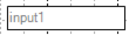
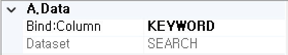
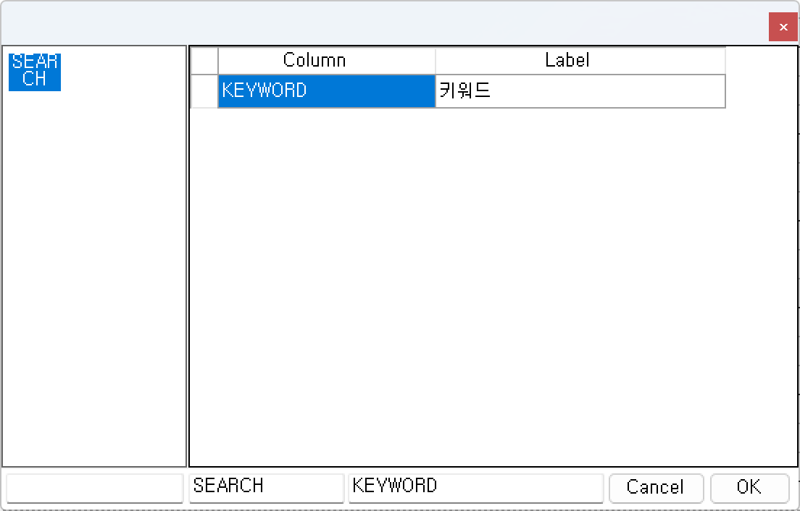
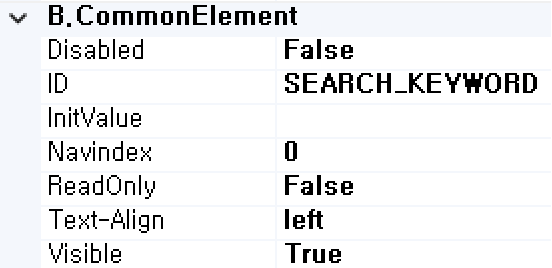
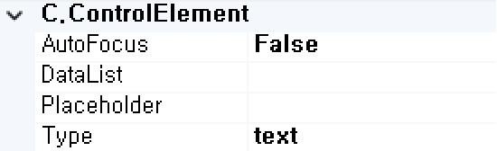
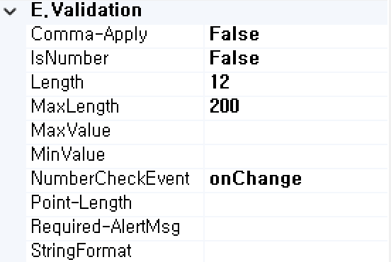

#  (TextBox)
텍스트 입력을 표시하는 컴포넌트입니다.

<b style="font-size: 20px"> 1) 컴포넌트 이미지 </b>  
도구상자에서 TextBox 컴포넌트를 선택하여 화면작업 영역에 디자인합니다.  
  

<b style="font-size: 20px"> 2) 컴포넌트 속성 </b>  
화면작업 창에서 TextBox 컴포넌트 선택 시 속성 창에 설정이 가능한 항목에 값을 입력합니다.  
<b style="font-size: 18px"> (1) A.Data </b>  
 

<b style="font-size: 18px"> ① Bind:Column </b>  
UI 화면작업 창의 Dataset 탭에서 등록한 Dataset Column을 할당하는 부분입니다.  
 

<b style="font-size: 18px"> ② Dataset </b>  
할당된 Dataset 명 표시합니다.  
<!-- Remark -->
::: details <Badge type="tip" text="Remark" vertical="middle" /> 
Dataset Bind 했을 경우 Dataset_Column으로 해당 컴포넌트 ID가 자동으로 변환됩니다.  
Ex) Dataset : SEARCH     Column : KEYWORD  ⇒ 컴포넌트 ID : SEARCH_KEYWORD 
:::
<!-- -->

<b style="font-size: 18px"> (2) B.CommonElement </b>  
  
<b style="font-size: 18px"> ① Disabled </b>  
값이 True이면 수정 불가능(서버 전송 불가능) False 경우 해당 속성 사용하지 않습니다. 

<b style="font-size: 18px"> ② ID </b>  
해당 컴포넌트의 ID를 설정합니다.  

<b style="font-size: 18px"> ③ InitValue </b>  
초기값 입력 or JSP 방식인 서브미션일 경우 해당 Column을 더블 클릭해서 입력이 가능합니다. 

<b style="font-size: 18px"> ④ NavIndex </b>  
Index 값을 지정 후 Tab 키를 누르면 오름차순으로 이동하게 됩니다. 

<b style="font-size: 18px"> ⑤ ReadOnly </b>  
값이 True이면 포커스는 잡히지만 수정은 불가능합니다. 

<b style="font-size: 18px"> ⑥ Text-Align </b>  
입력한 텍스트 정렬을 설정합니다. 

<b style="font-size: 18px"> ⑦ Visible </b>  
해당 컴포넌트를 화면에 보여줄지에 대한 여부를 설정합니다.  

<b style="font-size: 18px"> (3) C.ControlElement </b>  
   
<b style="font-size: 18px"> ① AutoFocus </b>  
Load시 해당 컴포넌트에 자동으로 포커스 지정됩니다. (단, 하나의 컴포넌트만 true가 가능합니다.)

<b style="font-size: 18px"> ② DataList </b>  
DataList의 ID 속성값을 지정하면 DataList 태그와 연결됩니다.

<b style="font-size: 18px"> ③ Placeholder </b>  
해당 컴포넌트의 적절한 값을 입력할 수 있도록 도움말을 간단하게 입력한다. 포커스가 잡히고 값을 입력하면 해당 값은 사라집니다.

<b style="font-size: 18px"> ④ Type </b>  
해당 컴포넌트의 Type을 설정합니다. 

<b style="font-size: 18px"> (4) E.Validation </b>  
   
<b style="font-size: 18px"> ① Comma-Apply </b>  
천 단위 콤마(,)를 설정합니다. 

<b style="font-size: 18px"> ② InNumber </b>  
숫자만 입력받는 필드인 경우는 True로 설정합니다. 숫자로 입력하지 않았을 때 메시지가 발생합니다.

<b style="font-size: 18px"> ③ Length </b>  
해당 컴포넌트의 길이를 설정합니다. 
<!-- Remark -->
::: details <Badge type="tip" text="Remark" vertical="middle" /> 
빌드를 했을 때 소스 상으로 size로 설정이 되어있지만 style 부분에 width도 같이 설정되어있어서 Length를 확인하려면 해당 컴포넌트 우측 속성에 styleOff을 true로 설정하면 해당 Length만큼 길이를 보여줍니다.
:::
<!-- -->
<b style="font-size: 18px"> ④ MaxLength </b>  
해당 컴포넌트의 최대 길이 제한을 설정합니다.  
Ex) 최대 길이가 12인 경우 12자리까지 입력이 가능합니다.

<b style="font-size: 18px"> ⑤ MaxValue </b>  
해당 컴포넌트의 최대값을 설정 후 해당 최대값을 벗어나면 메시지가 발생합니다. 

<b style="font-size: 18px"> ⑥ MinValue </b>  
해당 컴포넌트의 최소값을 설정 후 해당 최소값을 벗어나면 메시지가 발생합니다. 

<b style="font-size: 18px"> ⑦ NumberCheckEvent </b>  
숫자 체크에 대한 이벤트 중 onChange, Onkeyup 하나를 선택하여 설정합니다.  

<b style="font-size: 18px"> ⑧ Point-Lengtht </b>  
해당 컴포넌트의 소수점을 설정 후 해당 자리수가 초과 입력 시 메시지가 발생합니다. 

<b style="font-size: 18px"> ⑨ Required-AlertMsg </b>  
해당 컴포넌트의 값을 입력하지 않았을 때 발생 되는 메시지 내용을 설정합니다.  
(submit(debug, requiredmsg)할 때 requiredmsg를 true로 설정합니다.) 

<b style="font-size: 18px"> ⑩ StringFormat </b>  
해당 컴포넌트의 문자열 형식을 설정합니다. 
<!-- Remark -->
::: details <Badge type="tip" text="Remark" vertical="middle" /> <b> Comma-Apply, MaxLength, MaxVlalue 등 값을 숫자로 지정해야 하는 경우 </b>
InNumber를 True로 설정하지 않으면 “Available only when Number.(IsNumber:false -> true)”라고 메시지가 나온다.
:::
<!-- -->

<b style="font-size: 20px"> 3) 컴포넌트 이벤트 </b>  
   
<b style="font-size: 18px"> (1) 1.MouseEvent </b>  
<b style="font-size: 18px"> ① OnClick </b>  
마우스를 클릭할 때 발생하는 이벤트입니다.  
<b style="font-size: 18px"> ② OnMosueDown </b>  
마우스 버튼을 누를 때 발생하는 이벤트입니다.  
<b style="font-size: 18px"> ③ OnMosueMove </b>  
마우스를 움직일 때 발생하는 이벤트입니다.  
<b style="font-size: 18px"> ④ OnMosueOut </b>  
마우스가 요소를 벗어날 때 발생하는 이벤트입니다.  
<b style="font-size: 18px"> ⑤ OnMosueOver </b>  
마우스가 요소 안에 들어올 때 발생하는 이벤트입니다.  
<b style="font-size: 18px"> ⑥ OnMosueUp </b>  
마우스 버튼을 뗄 때 발생하는 이벤트입니다.  

<b style="font-size: 18px"> (2) 2.KeyEvent </b>  
<b style="font-size: 18px"> ① OnBlur </b>  
포커스를 잃었을 때 발생하는 이벤트입니다.  
<b style="font-size: 18px"> ② OnChange  </b>  
입력필드의 값이 바뀐 후 포커스를 잃었을 때 발생하는 이벤트입니다.  
<b style="font-size: 18px"> ③ OnFocus </b>  
포커스가 잡혔을 때 발생하는 이벤트입니다.  
<b style="font-size: 18px"> ④ OnKeyDown </b>  
키를 눌렀을 때 발생하는 이벤트입니다.  
<b style="font-size: 18px"> ⑤ OnKeypress </b>  
키를 누르고 있는 중 발생하는 이벤트입니다.  
<b style="font-size: 18px"> ⑥ OnKeyUp </b>  
키를 눌렀다가 뗄 때 발생하는 이벤트입니다.  
<b style="font-size: 18px"> ⑦ OnSelect </b>  
마우스로 입력된 텍스트를 드래그했을 때 발생하는 이벤트입니다.  