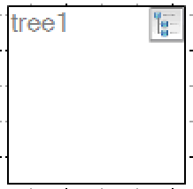
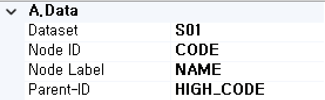
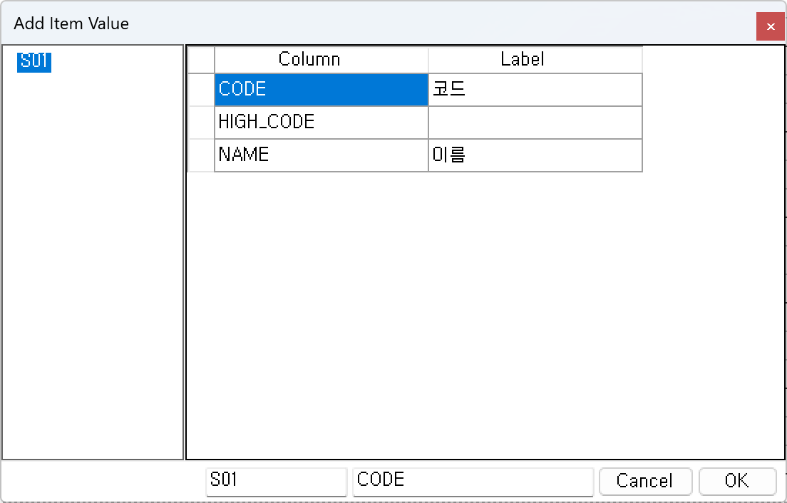
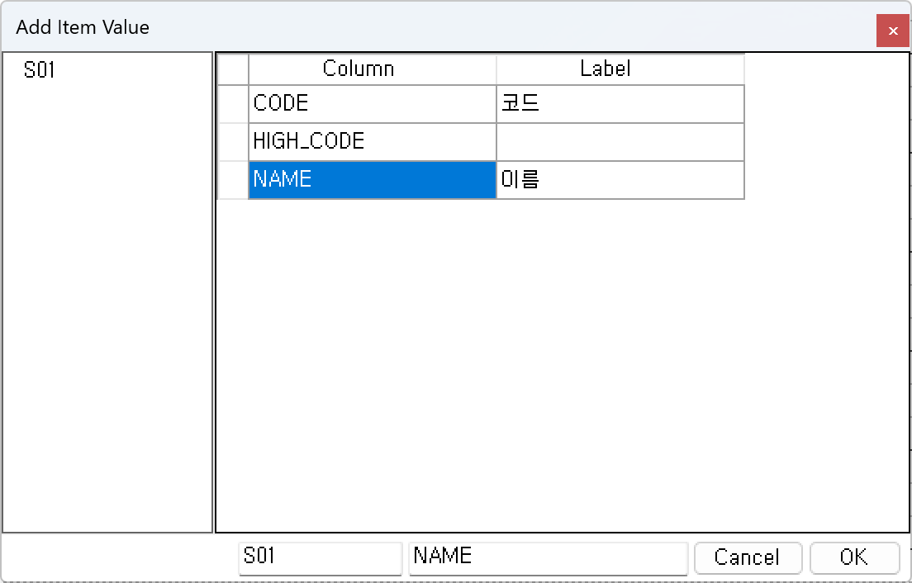
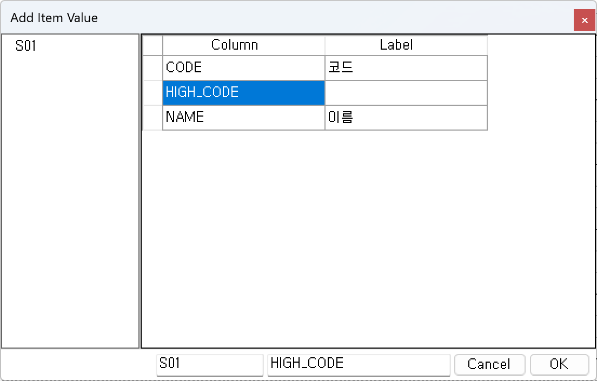
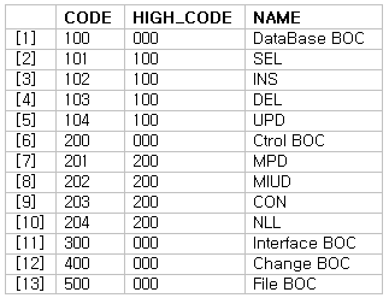
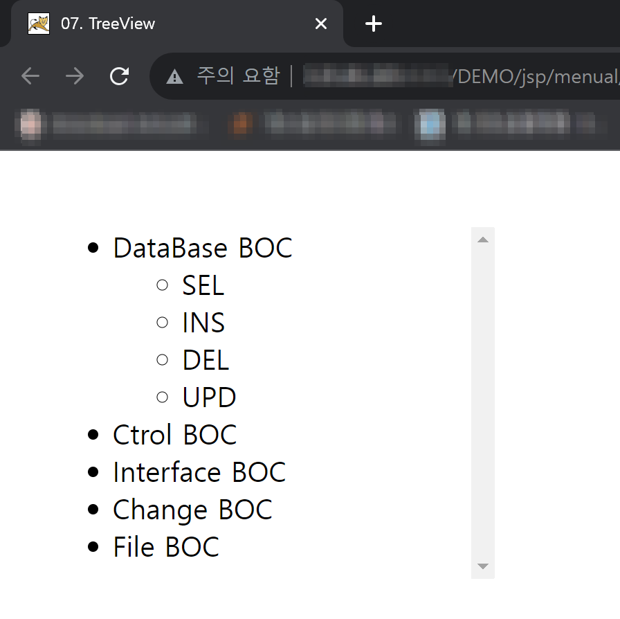
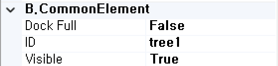
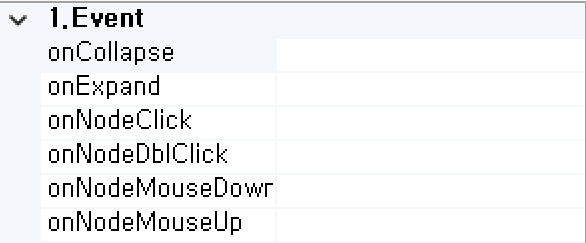

#  (TreeView)
사용자 정의 기능을 처리하는 컴포넌트입니다. 

<b class="font20"> 1) 컴포넌트 이미지 </b>  
도구상자에서 TreeView 컴포넌트를 선택하여 화면작업 영역에 디자인합니다.  
  

<b class="font20"> 2) 컴포넌트 속성 </b>  
화면작업 창에서 TreeView 컴포넌트 선택 시 속성 창에 설정이 가능한 항목에 값을 입력합니다.  
<b class="font18"> (1) A.Data </b>  
  
<b class="font18"> ① Dataset </b>  
할당된 Dataset 명 표시합니다. 

<b class="font18"> ② Node ID </b>  
UI 화면작업 창의 Dataset 탭에서 등록한 자식 노드 ID에 해당하는 Column을 할당하는 부분입니다. 
  

<b class="font18"> ③ Node Label </b>  
UI 화면작업 창의 Dataset 탭에서 등록한 자식 노드 명에 해당하는 Column을 할당하는 부분입니다.  
  
<b style="font-size: 18px"> ④ Parent-ID </b>  
UI 화면작업 창의 Dataset 탭에서 등록한 부모 노드 ID에 해당하는 Column을 할당하는 부분입니다. 
   
<!-- Remark -->
::: tip <Badge type="tip" text="Remark" vertical="middle" /> 
 
 ▶ 
  
 ▶ 
   
:::
<!-- -->
<b class="font18"> (2) B.CommonElement </b>  
  
<b class="font18"> ① DockFull </b>  
Full로 설정했을 경우 해당 컴포넌트 부모 컴포넌트 크기의 맞춰서 설정됩니다. 

<b class="font18"> ② ID </b>  
해당 컴포넌트의 ID를 설정합니다.  

<b class="font18"> ③ Visible </b>  
해당 컴포넌트를 화면에 보여줄지에 대한 여부를 설정합니다.  

<b class="font20"> 3) 컴포넌트 이벤트 </b>  
   
<b class="font18"> (1) 1.Event </b>  
<b class="font18"> ① OnCollapse  </b>  
Tree를 접을 때 발생하는 이벤트입니다.  
<b class="font18"> ② OnExpand  </b>  
Tree를 확장할 때 발생하는 이벤트입니다.  
<b class="font18"> ③ OnNodeClick  </b>  
노드를 클릭할 때 발생하는 이벤트입니다.  
<b class="font18"> ④ OnNodeDblClick  </b>  
노드를 더블 클릭할 때 발생하는 이벤트입니다.  
<b class="font18"> ⑤ OnNodeMouseDown  </b>  
마우스 버튼을 누를 때 발생하는 이벤트입니다.  
<b class="font18"> ⑥ OnNodeMouseUp  </b>  
마우스 버튼을 뗄 때 발생하는 이벤트입니다.  

