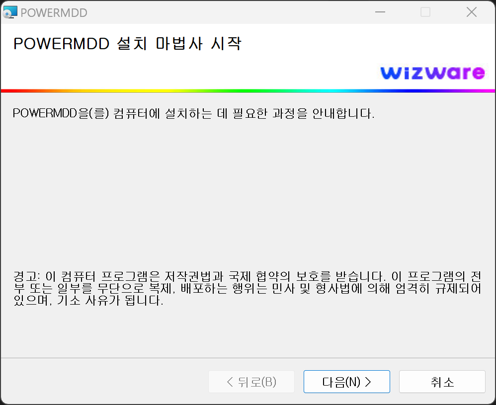
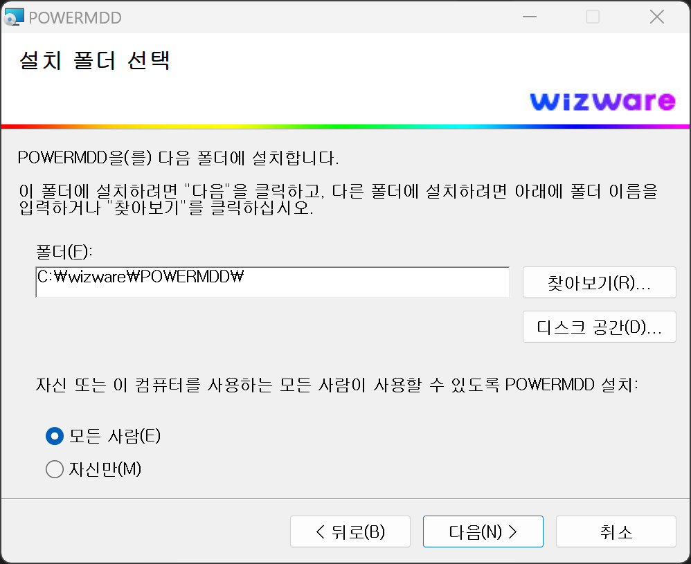
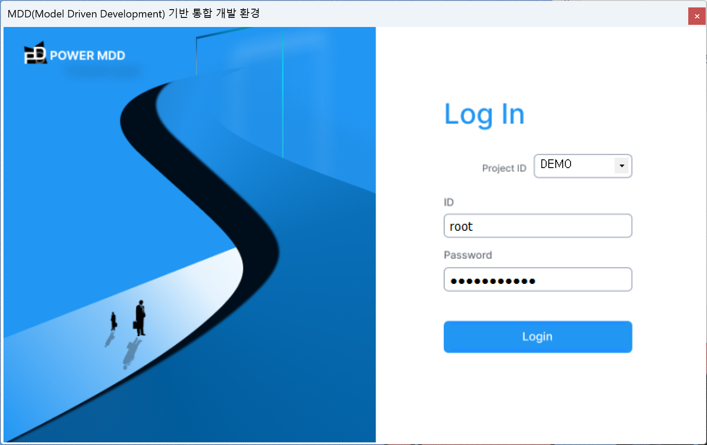

# 클라이언트 설치

## 1. POWER MDD-DX 설치
POWER MDD-DX Client Setup 파일을 다운로드하고 실행합니다. <br/>
(재설치 시에는 Windows의 프로그램 추가/삭제에서 삭제하신 후 설치하고 기존에 POWER MDD-DX가 실행되고 있으면 반드시 프로그램 종료 후 설치해야 합니다.)

<!-- Remark -->
::: tip <Badge type="tip" text="Remark" vertical="middle" /> 
- <b>PC 권장사양 </b> <br/>
CPU : Intel Pentium 4 이상 <br/>
메모리 : 1GB 이상 <br/>
디스크 : 500MB 이상 <br/>

- <b>설치 전 확인 사항 </b> <br/>
해당 Tool은 C# .Net 기반으로 구성되어 있다. Windows에 .net Framework이 설치가 있어야 합니다.
:::
<!-- -->

<span class="font20"> 1) Setup 실행 </span> <br/>


<span class="font20"> 2) Setup 실행 시 처음 화면 </span> <br/>


<span class="font20"> 3) POWER MDD을 설치할 경로 (권장 사항 : default 설정 사용) </span> <br/>


<span class="font20"> 4) Setup 실행할지 확인 요청 </span> <br/>


<span class="font20"> 5) Setup 실행 : PC 사양에 따라 다를 수 있으나 보통은 20~40초 이내 실행 완료됩니다. </span> <br/>


<span class="font20"> 6) Setup 완료 </span> <br/>


## 2. 설치 후 환경 설정 :  DXDBinit.xml
Default 설치 시 OS별로 약간의 차이가 있으나 "C:/ProgramFiles/wizware/POWERMDD/”, “C:/Program Files(x86)/wizware/POWERMDD/”아래 존재합니다. 아래 정보들을 확인하고 본인의 개발 환경에 맞게 변경 및 설정할 수 있습니다. <br/>
(대부분의 개발 경우 관리자가 설정해 주는 DXDBinit.xml 파일을 상기 디렉토리에 저장하면 됩니다.) <br/>

<b class="font20"> 1) &lt;LoginInfo&gt; </b> <br/>
사용자가 Login 시에 최초 Setting 되어야 하는 환경입니다.<br/>
```xml
<LoginInfo>
	<URL>http://www.processbuilder.co.kr</URL>
	<URL1></URL1>
	<RequestCharset>utf-8</RequestCharset>
	<ResponseCharset>utf-8</ResponseCharset>
	<Security>YES</Security>
</LoginInfo> 
```

<b class="font18"> (1) &lt;URL&gt;, &lt;URL1&gt; </b> <br/>
Login하면 최초 PowerMDD-DX의 body에 최초 Loading 되는 URL이다. Default 값으로는 www.processbuilder.co.kr로 제품 home page가 loading 됩니다.  <br/>
해당 URL을 이용하여 Project Community가 있다면 해당 Community URL로 변경하여 사용하면 편리합니다.

<b class="font18"> (2) &lt;RequestCharset&gt;, &lt;ResponseCharset&gt; </b> <br/>
POWER MDD-DX와 서버Side의 BMS와 통신 시에 사용되는 Charset으로 Request/ Response 시 사용하는 Charset입니다. <br/>
Default는 utf-8이며 별도의 다른 Charset 이용 시에는 POWER MDD-BMS의 Config도 동일하게 수정해줘야합니다. <br/>

<b class="font18"> (3) &lt;Security&gt; </b> <br/>
Command를 암호화할 것인지 처리하는 태그이다. Default는 YES이며 YES일 경우 암호화 처리가 됩니다.

<b class="font20"> 2) &lt;LOCAL&gt; </b> <br/>
다수의 사용자가 개발 시 주로 사용하는 기능입니다. <br/>
서버 Side의 WAS를 사용하여 개발 시에 사용자가 Build 하게 되면 Class 파일을 WAS Container에 배치하게 되고 WAS의 Context reloadable=true 시에 Container가 reload하게 됩니다. <br/>
```xml
<LOCAL>
	<DEFAULT>
		<CLASSON>NO</CLASSON>
        <CLASSPATH>C:/temp/classes</CLASSPATH>
        <XMLON>YES</XMLON>
        <XMLPATH>C:/temp/classes/sqlmap/sql</XMLPATH> 
        <SQLCTX>C:/temp/context-sqlMap.xml</SQLCTX>
        <SOURCEON>NO</SOURCEON> 
        <SOURCEPATH>D:/temp2/MYBA</SOURCEPATH> 
        <CONTEXTON>NO</CONTEXTON>
        <CONTEXT_ROOT>C:/Tomcat9/backup</CONTEXT_ROOT>  
        <ContextName>MybaApps</ContextName>
        <SERVER>localhost</SERVER> 
        <Port>8180</Port>
        <IMAGEPATH>C:/Tomcat9/webapps/MybaApps</IMAGEPATH> 
        <OPTIONA>NO</OPTIONA>
	</DEFAULT> 
</LOCAL>   
```

<!-- Remark -->
::: tip <Badge type="tip" text="Remark" vertical="middle" /> 
다수의 사용자가 동시에 계속 build 실행 시에 WAS에 상당한 부담을 줄 수가 있고 또 한 Build하는 동안 다른 개발자에게 영향을 줄 수 있게 됩니다. 이러한 현상을 회피하기 위해서 사용자 PC에 Tomcat WAS 환경을 구성하고 Test를 개발자 환경에서 실행할 수 있도록 해주는 기능입니다. 해당 기능은 일정 기간에 많은 Application을 개발할 때 사용하면 좋습니다. 개발이 완료되고 변화 관리 시에는 해당 기능을 Off 하는 것이 좋습니다.
:::
<!-- -->

<b class="font18"> (1) &lt;DEFAULT&gt;, &lt;SYSID&gt; </b> <br/>
&lt;SYSID&gt;는 별도로 해당 프로젝트명을 설정할 경우 &lt;SYSID&gt; 태그 안에 해당 프로젝트명을 넣어 설정하고 그 이외에는 &lt;DEFAULT&gt;로 설정됩니다.

<b class="font18"> (2) &lt;CLASSON&gt;, &lt;CLASSPATH&gt; </b> <br/>
default 값은 NO이다. 해당 기능을 활성화하려면 &lt;CLASSON&gt;의 값을 “YES”로 주면 됩니다. <br/>

<!-- Remark -->
::: tip <Badge type="tip" text="Remark" vertical="middle" /> 
해당 기능의 값을 “YES”로 두면 아래 CLASSPATH에 정의되어있는 Path아래 build한 Class파일 이 BMS로부터 전송받아 배치해줍니다. 보통은 PC에 설치되어 있는 WAS의 “…/Web-INF/classes” 두면 됩니다. <br/>
&lt;CLASSPATH&gt; class 파일을 download할 root 디렉토리를 설정해주면 됩니다.
:::
<!-- -->

<b class="font18"> (3) &lt;XMLOM&gt;, &lt;XMLPATH&gt;, &lt;SQLCTX&gt; </b> <br/>
default 값은 NO이다. 해당 기능을 활성화하려면 &lt;XMLON&gt;의 값을 “YES”로 주면 됩니다.

<!-- Remark -->
::: tip <Badge type="tip" text="Remark" vertical="middle" /> 
해당 기능의 값을 “YES”로 두면 아래 XMLPATH, SQLCTX에 정의되어있는 Path아래 build한 Xml 파일을 이 BMS로부터 전송받아 배치해줍니다. &lt;XMLPATH&gt; xml 소스 파일을 download할 root folder를 설정하면 됩니다.
:::
<!-- -->

<b class="font18"> (4) &lt;SOURCEON&gt;, &lt;SOURCEPATH&gt; </b> <br/>
default 값은 NO이다. 해당 기능을 활성화하려면 &lt;SOURCEON&gt;의 값을 “YES”로 주면 됩니다.

<!-- Remark -->
::: tip <Badge type="tip" text="Remark" vertical="middle" /> 
해당 기능의 값을 “YES”로 두면 아래 SOURCEPATH에 정의되어있는 Path아래 build한 Java 소스 파일이 BMS로부터 전송받아 배치해줍니다. &lt;SOURCEPATH&gt; java 소스 파일을 download할 root folder를 설정하면 된다.
:::
<!-- -->

<b class="font18"> (5) &lt;CONTEXTON&gt;, &lt;CONTEXT_ROOT&gt; </b> <br/>
default 값은 NO이다. 해당 기능을 활성화하려면 &lt;CONTEXTON&gt;의 값을 “YES”로 주면 됩니다.

<!-- Remark -->
::: tip <Badge type="tip" text="Remark" vertical="middle" /> 
View Designer에서 Build/Test에서 Test URL을 해당 정보를 이용해서 Local WAS URL로 호출하여 테스트합니다. <br/>
URL형식은 “http://localhost:port/ConTextName/테스트할layout파일” 형식으로 테스트가 가능합니다. <br/>
:::
<!-- -->

<b class="font18"> (6) &lt;ContextName&gt;, &lt;SERVER&gt;, &lt;Port&gt; </b> <br/>
default 값은 NO이다. 해당 기능을 활성화하려면 &lt;CONTEXTON&gt;의 값을 “YES”로 주면 됩니다.

<b class="font18"> (7) &lt;IMAGEPATH&gt; </b> <br/>
<!-- Remark -->
::: tip <Badge type="tip" text="Remark" vertical="middle" /> 
Service Model의 Tool-Box Menu에서 서비스 Model을 이미지 파일로 저장하는 기능이 존재합니다. <br/>
해당 기능 사용시 Service Model을 bmp 형식으로 해당 위치에 파일로 저장합니다. <br/>
:::
<!-- -->

<b class="font20"> 3) &lt;GLOBAL&gt; </b> <br/>
&lt;GLOBAL&gt; 아래의 &lt;USER_ID&gt;가 변수 명이 되고 &lt;LOGIN_JOJIK_CD&gt;가 Model Test 시 사용하는 임시 값으로 설정됩니다.<br/>
```xml
<GLOBAL>
	<DEFAULT>
		<USER_ID>950268<!--사용자ID --></USER_ID>  
		<USER_NM>홍길동<!--사용자이름 --></USER_NM>
		<CAST_TC>40<!--직위코드 --></CAST_TC>
		<CAST_NM>CAST40<!--직위명 --></CAST_NM>
		<POS_TC>46<!--직급코드 --></POS_TC>
		<POS_NM>POS46<!--직급명 --></POS_NM>
		<UP_DEPT_CD>3O00<!--상위부서코드(처실코드)--></UP_DEPT_CD>
		<UP_DEPT_NM>배관진단1부:상위<!--상위부서명(처실명)--></UP_DEPT_NM>
		<DEPT_CD>3O05<!--부서코드--></DEPT_CD>
		<DEPT_NM>배관진단1부<!--부서이름--></DEPT_NM>
		<BULC_TC>01<!--사업장코드--></BULC_TC>
		<BULC_NM>BULC01<!--사업장명--></BULC_NM>
		<EMPN>950268<!--사번--></EMPN>
		<AUTH_H>HRLV01<!--인사레벨--></AUTH_H>
		<AUTH_A>FNLV011<!--재무레벨--></AUTH_A>
		<AUTH_G>SALV01<!--안전레벨--></AUTH_G>
	</DEFAULT> 
</GLOBAL> 
```

<!-- Remark -->
::: tip <Badge type="tip" text="Remark" vertical="middle" /> 
Service Model에서 디자인 시에 필요로 하는 Data 중 업무 운영 시 사용되는 HttpSession 또는 쿠키에서 사용되는 공통 Global 변수를 사용하기 위해서 변수 이름과 개발 시 사용될 임시 값을 지정하는 곳입니다. <br/>
:::
<!-- -->

<span class="font20"> 4) &lt;INS&gt;, &lt;UPD&gt; </span> <br/>
Service Model의 INS BOC 또는 UPD BOC 사용할 때만 유효합니다.<br/>
```xml
<INS>
	<DEFAULT>
		<REG_DT TYPE="STRING" SQLVAL="TRUE">SYSDATE</REG_DT>
		<REG_USERID TYPE="OBJECT" >G.USER_ID</REG_USERID>
	</DEFAULT>
	<PMDD>
		<REG_DT TYPE="STRING" SQLVAL="TRUE">SYSDATE</REG_DT>
		<REG_USERID TYPE="OBJECT" >G.USER_ID</REG_USERID>
	</PMDD>
</INS>

<UPD>
	<DEFAULT>
		<UPD_DT TYPE="STRING" SQLVAL="TRUE">SYSDATE</UPD_DT>
		<UPD_USERID TYPE="OBJECT" >G.USER_ID</UPD_USERID>
	</DEFAULT>
	<PMDD>
		<UPD_DT TYPE="STRING" SQLVAL="TRUE">SYSDATE</UPD_DT>
		<UPD_USERID TYPE="OBJECT" >G.USER_ID</UPD_USERID>
	</PMDD>
</UPD>
```

<!-- Remark -->
::: tip <Badge type="tip" text="Remark" vertical="middle" /> 
데이터베이스에 데이터를 Insert 또는 Update 시 모든 table에 공통적으로 사용되는 컬럼이 존재할 때 정의하여 사용하면 편리함을 더해줍다. <br/>
공통 컬럼으로 많이 사용되는 데이터를 Insert 또는 Update 시 등록 일시, 등록자 또는 수정 일시, 수정자 컬럼을 INS BOC 또는 UPD BOC를 Drag-Drop 하면 자동으로 추가가 됩니다. <br/>
:::
<!-- -->

- 태그명이 해당 공통 컬럼명이 됩니다. 그리고 해당 컬럼의 값의 속성을 지정하면 됩니다. <br/> 
만일 SYSDATE와 같은 SQL 구분을 사용할 때는 SQLVAL속성을 True로 주면 됩니다. 아래 예시를 참조하면 됩니다. <br/>
<span class="spanEx"> Ex) 데이터베이스 구분사용 시 : &lt;REG_DT TYPE=”STRING” SQLVAL=”TRUE”&gt;SYSDATE&lt;/REG_DT&gt; </span> <br/>

- 업무의 Global 객체의 값을 사용할 때에는 Type을 OBJECT로 두고 아래의 예시와 같이 정의하면 됩니다. <br/>
<span class="spanEx"> Ex) Global 객체로부터 값 할당 시 : &lt;REG_USERID TYPE=”OBJECT”&gt;SYSDATE&lt;/REG_USERID&gt; </span> <br/>

<b class="font20"> 5) &lt;UxDesign&gt; </b> <br/>
특별한 사항이 아니면 기본 Default로 구성하면 됩니다.<br/>
```xml
<UxDesign>
	<uxTemp>./temp</uxTemp>
	<uxRoot>./Download</uxRoot>
	<StyleOff>NO</StyleOff>
</UxDesign>
```

<!-- Remark -->
::: tip <Badge type="tip" text="Remark" vertical="middle" /> 
View Designer에서 임시 작업 영역으로 사용할 Folder를 지정합니다. <br/>
:::
<!-- -->

<b class="font20"> 6) &lt;UxDesign&gt; </b> <br/>
```xml
<UxComponent>
	<ZTree>http://www.treejs.cn/v3/api.php</ZTree>
	<ChartJs>http://www.chartjs.org/docs/latest</ChartJs>
	<FullCalendar>https://fullcalendar.io</FullCalendar>
</UxComponent>
```

<!-- Remark -->
::: tip <Badge type="tip" text="Remark" vertical="middle" /> 
View Designer에서 사용되는 Component의 URL을 등록합니다. <br/>
Component 중에 Tree는 Ztree를 사용하고 있으며 Chart는 ChartJs을 사용하고 있습니다.
:::
<!-- -->

<b class="font20"> 7) &lt;LANGUAGE&gt; </b> <br/>
POWER MDD의 언어를 설정합니다.
```xml
<LANGUAGE selected="KOREAN"  admin="true">
	<LIST codeview="false">KOREAN</LIST>
	<LIST codeview="false">ENGLISH</LIST>
	<LIST codeview="false">JAPANESE</LIST>
	<LIST codeview="false">CHINESE</LIST>
</LANGUAGE>
```

<b class="font20"> 8) &lt;SYSTEM&gt; </b> <br/>
작업할 프로젝트의 System ID를 등록하여 사용합니다. <br/>
추가 시 “&lt;SYSID&gt;ADD_ID&lt;/SYSID&gt;“의 형식으로 추가해 주면 로그인시 프로젝트 선택 콤보에서 선택할 수 있도록 활성이 됩니다.<br/>
```xml
<SYSTEM>
	<SYSID>DEMO</SYSID>
	<SYSID>DTBED</SYSID>
	<SYSID>EDUSML</SYSID>
	<SYSID>NITS</SYSID>
</SYSTEM>
```

<!-- Remark -->
::: tip <Badge type="tip" text="Remark" vertical="middle" /> 
POWER MDD 재설치 시 사용한 시스템 ID도 초기화되기 때문에 다시 입력해야 합니다.
:::
<!-- -->

## 3. 접속 ID 요청 및 연결정보

<span class="font20"> 1) 사용자 PC에 DX가 정상적으로 Setup 완료 되었다면, 해당 사용자는 PowerMDD 서버 관리자에게 ID 요청 및 접속 Key를 발급받아야 합니다. </span> <br/>

<!-- Remark -->
::: tip <Badge type="tip" text="Remark" vertical="middle" /> 
관리자에게 요청하기 위해서는 해당 PC의 현재 사용 중인 Network Card의 Mac-Address를 확인 후 관리자에게 Mac-Address 등록 요청도 같이 해야 합니다. POWER MDD-BMS서버에 등록되지 않은 Mac-Address는 접속이 허용되지 않습니다.
:::
<!-- -->

<span class="font20"> 2) 클라우드 서버에 접속하기 위한 요청 프로세스 </span> <br/>

① 해당 작업자의 PC에서 현재 사용 중인 Network-Card의 Mac-Address 등록을 개발 서버 관리자에게 보냅니다.

② 접속하기 위한 ID/Password를 개발서버 관리자로부터 받습니다.  

③ 접속 보안 Key를 관리자로부터 받은 후 아래 절차에 따라서 적용한다. 접속 보안 Key는 파일로 구성되어 있습니다.  

<span class="font20"> 3) POWER MDD 실행화면이 나오지 않을 경우 </span> <br/>

① POWER MDD 프로그램에서 마우스 오른쪽 버튼을 클릭해서 속성을 클릭합니다.<br/>


② 속성 창 호환성 탭에 들어가서 관리자 권한으로 이 프로그램 실행 체크 후 확인 버튼을 클릭합니다. 
 

<span class="font20"> 4) POWER MDD 로그인 </span> <br/>
 

<!-- Remark -->
::: tip <Badge type="tip" text="Remark" vertical="middle" /> 
프로젝트가 1개 이상일 때 접속 프로젝트를 관리자로부터 확인 후 접속해야 합니다. 해당 ID는 프로젝트에 종속되어있는 ID입니다. <br/>
N개 이상의 프로젝트에서 작업을 해야 하는 경우 관리자로부터 프로젝트별로 ID 발급을 요청해야 합니다. <br/>
(프로젝트 ID에 해당 프로젝트 명이 없을 경우 DXDBinit.xml 파일 안에 &lt;SYSTEM&gt;에 프로젝트 명을 추가합니다.)  <br/>
:::
<!-- -->

<style type='text/css'>
  [class*="boxBorder"] { border: 1px solid #bbb; }
  [class*="font20"] { font-size: 18px }
  [class*="font18"] { font-size: 18px }
  [class="spanBtn"] { border: 1px solid #bbb;border-radius: 4px;padding: 3px;background:white; color:dimgrey; }
  [class="spanEx"] { color: #00a4ff; }
</style>